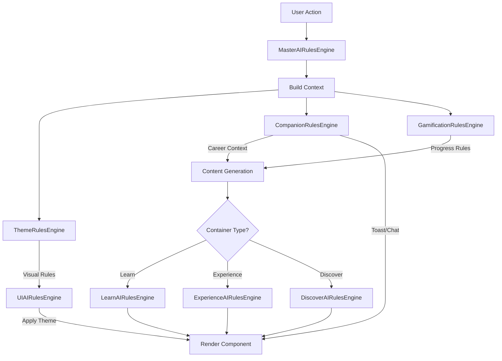

# AIRulesEngine Implementation Plan v2.0
## Comprehensive Refactoring with Theme, AICompanions, and Gamification

### Executive Summary
This document outlines a comprehensive refactoring strategy to address systemic technical debt in the Pathfinity codebase by implementing a centralized AIRulesEngine architecture. The refactoring addresses scattered business rules, eliminates recurring bugs, and establishes a maintainable foundation for future development.

### Critical Updates in v2.0
- **AICompanions Correction**: Four persistent companions (Finn, Spark, Harmony, Sage) that evolve with students
- **Career Context Integration**: All companions adapt content based on chosen career path
- **Toast Notifications**: Career-specific messaging through companion personalities
- **Chatbot Services**: Career-contextualized responses for learning support

---

## 1. Architecture Overview

### 1.1 Core Rules Engines

```typescript
AIRulesEngine/
├── MasterAIRulesEngine           // Orchestrator for all rules
├── Container Rules/
│   ├── LearnAIRulesEngine        // Learning journey rules
│   ├── ExperienceAIRulesEngine   // Engagement & interaction
│   └── DiscoverAIRulesEngine     // Exploration & assessment
├── UIAIRulesEngine               // UI-content mapping rules
├── ThemeRulesEngine              // Light/Dark theme rules
├── CompanionRulesEngine          // Finn, Spark, Harmony, Sage rules
└── GamificationRulesEngine       // Progression & rewards

```

### 1.2 Data Flow Architecture



---

## 2. CompanionRulesEngine (Corrected)

### 2.1 Core Companions
The system includes four persistent AI companions that support students throughout their journey:

```typescript
enum CompanionId {
  FINN = 'finn',      // The Friendly Guide
  SPARK = 'spark',    // The Creative Innovator
  HARMONY = 'harmony', // The Supportive Friend
  SAGE = 'sage'       // The Wise Mentor
}
```

### 2.2 Career-Contextualized Interactions

#### Toast Notifications by Career
```typescript
interface CareerToastTemplates {
  Doctor: {
    welcome: ["Time for your learning checkup!", "The doctor will see you now... for learning!"],
    progress: ["Your learning vital signs look great!", "Treatment plan working perfectly!"],
    achievement: ["Diagnosis: You're a learning expert!", "Medical degree in {subject} earned!"]
  },
  Teacher: {
    welcome: ["Welcome to today's lesson!", "Class is in session!"],
    progress: ["You're making the grade!", "Excellent classroom participation!"],
    achievement: ["Honor roll achievement!", "Top of the class!"]
  },
  Athlete: {
    welcome: ["Time to train your brain!", "Ready for mental gymnastics?"],
    progress: ["You're in the lead!", "Personal best in progress!"],
    achievement: ["Gold medal performance!", "Championship won!"]
  }
  // ... 12 more careers
}
```

#### Chatbot Responses by Career
```typescript
interface CareerChatbotTemplates {
  Doctor: {
    greeting: ["Hello, future doctor! How can I help you heal your learning today?"],
    helpOffered: ["Let me prescribe the perfect learning solution!"],
    conceptExplanation: ["Think of it like how a doctor examines symptoms..."],
    problemSolving: ["Let's examine this problem like a medical case!"],
    celebration: ["Excellent diagnosis, Doctor!"]
  },
  // ... for all 15 careers
}
```

### 2.3 Companion Evolution by Grade

```typescript
interface GradeEvolution {
  'K-2': {
    vocabularyLevel: 'basic',
    supportLevel: 'high',
    visualComplexity: 'simple',
    careerMetaphors: 'concrete'
  },
  '3-5': {
    vocabularyLevel: 'intermediate',
    supportLevel: 'medium',
    visualComplexity: 'moderate',
    careerMetaphors: 'mixed'
  },
  '6-8': {
    vocabularyLevel: 'advanced',
    supportLevel: 'low',
    visualComplexity: 'detailed',
    careerMetaphors: 'abstract'
  }
}
```

### 2.4 Integration Points

```typescript
class CompanionRulesEngine {
  // Core methods
  getCareerMessage(companion: CompanionId, career: Career, type: 'toast' | 'chatbot'): string
  adaptToGradeLevel(companion: CompanionId, grade: string): CompanionAdaptation
  generateToastNotification(context: CompanionContext): ToastMessage
  generateChatbotResponse(context: CompanionContext): ChatbotResponse
  
  // Career-specific content generation
  applyCareerContext(content: any, career: Career): any
  getCareerVocabulary(career: Career): string[]
  getCareerMetaphors(career: Career, gradeLevel: string): string[]
}
```

---

## 3. ThemeRulesEngine (Enhanced)

### 3.1 Theme-Aware Data Requests

```typescript
interface ThemeDataRules {
  lightTheme: {
    apiEndpoints: {
      images: 'light-optimized',
      colors: 'high-contrast-light'
    },
    dataFilters: {
      brightness: 'enhanced',
      saturation: 'moderate'
    }
  },
  darkTheme: {
    apiEndpoints: {
      images: 'dark-optimized',
      colors: 'high-contrast-dark'
    },
    dataFilters: {
      brightness: 'reduced',
      saturation: 'muted'
    }
  }
}
```

### 3.2 Component-Specific Theme Rules

```typescript
interface ComponentThemeRules {
  VisualRenderer: {
    light: { background: '#F9FAFB', border: '#D1D5DB', shadow: 'soft' },
    dark: { background: '#2D3748', border: '#4B5563', shadow: 'glow' }
  },
  AICompanionChat: {
    light: { bubbleColor: '#E5E7EB', textColor: '#111827' },
    dark: { bubbleColor: '#374151', textColor: '#F3F4F6' }
  },
  // ... for all components
}
```

---

## 4. GamificationRulesEngine (Complete)

### 4.1 Progression Rules

```typescript
interface ProgressionRules {
  points: {
    correctAnswer: 10,
    firstTry: 5,
    streak: 2,
    careerBonus: 3
  },
  levels: {
    calculation: 'logarithmic',
    thresholds: [0, 100, 250, 500, 1000, 2000, 5000]
  },
  badges: {
    types: ['skill', 'career', 'streak', 'exploration'],
    unlockRules: Map<BadgeType, UnlockCondition>
  }
}
```

### 4.2 Career-Specific Achievements

```typescript
interface CareerAchievements {
  Doctor: {
    badges: ['First Aid Expert', 'Diagnosis Master', 'Healing Hero'],
    milestones: ['10 health problems solved', '100 patients helped']
  },
  Athlete: {
    badges: ['Training Champion', 'Team Player', 'Gold Medalist'],
    milestones: ['10 day streak', '100 exercises completed']
  }
  // ... for all careers
}
```

---

## 5. Implementation Timeline (Updated)

### Phase 1: Foundation (Week 1-2)
- [x] Design CompanionRulesEngine with 4 core companions
- [ ] Create BaseRulesEngine class
- [ ] Implement RuleContext and RuleResult types
- [ ] Set up monitoring infrastructure
- [ ] Create rule validation framework

### Phase 2: Core Engines (Week 3-4)
- [ ] Implement MasterAIRulesEngine orchestrator
- [ ] Build CompanionRulesEngine with career adaptations
- [ ] Create ThemeRulesEngine with data rules
- [ ] Develop GamificationRulesEngine

### Phase 3: Container Engines (Week 5-6)
- [ ] Implement LearnAIRulesEngine
- [ ] Build ExperienceAIRulesEngine
- [ ] Create DiscoverAIRulesEngine
- [ ] Integrate with existing containers

### Phase 4: Integration (Week 7-8)
- [ ] Connect Toast Notification Service
- [ ] Integrate Chatbot Service
- [ ] Migrate existing rules
- [ ] Update all components

### Phase 5: Testing & Refinement (Week 9-10)
- [ ] Comprehensive testing
- [ ] Performance optimization
- [ ] Documentation
- [ ] Training materials

### Phase 6: Deployment (Week 11-12)
- [ ] Staged rollout with feature flags
- [ ] Monitor and adjust
- [ ] Full deployment
- [ ] Post-deployment support

---

## 6. Technical Specifications

### 6.1 CompanionRulesEngine Interface

```typescript
interface ICompanionRulesEngine {
  // Companion Management
  getCompanion(id: CompanionId): CompanionProfile
  switchCompanion(id: CompanionId): void
  getAvailableCompanions(): CompanionProfile[]
  
  // Career Context
  getCareerMessage(
    companion: CompanionId,
    career: string,
    type: 'toast' | 'chatbot',
    intent: string
  ): string
  
  applyCareerContext(
    content: any,
    companion: CompanionId,
    career: Career
  ): any
  
  // Grade Adaptation
  adaptToGradeLevel(
    companion: CompanionId,
    grade: string
  ): GradeAdaptation
  
  // Notification Generation
  generateToastNotification(
    context: CompanionContext
  ): ToastNotification
  
  generateChatbotResponse(
    context: CompanionContext
  ): ChatbotResponse
  
  // Performance Adjustment
  adjustForPerformance(
    companion: CompanionId,
    performance: number
  ): PerformanceAdjustment
}
```

### 6.2 Career Context Integration

```typescript
interface CareerContextIntegration {
  // Content Generation
  generateDiagnosticPractice(
    skill: Skill,
    student: Student,
    career: Career,
    companion: CompanionId
  ): Question[]
  
  // UI Rendering
  renderWithCareerTheme(
    component: Component,
    career: Career,
    companion: CompanionId
  ): ReactElement
  
  // Messaging
  formatMessage(
    template: string,
    career: Career,
    companion: CompanionId,
    variables: Record<string, any>
  ): string
}
```

---

## 7. Migration Strategy

### 7.1 Existing Code Refactoring

```typescript
// BEFORE: Scattered companion logic
if (companion === 'finn') {
  message = "Great job!";
} else if (companion === 'spark') {
  message = "Brilliant!";
}

// AFTER: Centralized rules engine
const message = companionRulesEngine.getCareerMessage(
  companion,
  student.career,
  'toast',
  'achievement'
);
```

### 7.2 Service Integration

```typescript
// Toast Notification Service
class ToastNotificationService {
  constructor(private companionRules: CompanionRulesEngine) {}
  
  showNotification(type: string, context: any) {
    const notification = this.companionRules.generateToastNotification({
      companion: context.companion,
      career: context.career,
      messageIntent: type,
      student: context.student
    });
    
    this.display(notification);
  }
}

// Chatbot Service
class ChatbotService {
  constructor(private companionRules: CompanionRulesEngine) {}
  
  getResponse(message: string, context: any) {
    return this.companionRules.generateChatbotResponse({
      companion: context.companion,
      career: context.career,
      messageIntent: this.detectIntent(message),
      student: context.student
    });
  }
}
```

---

## 8. Success Metrics

### 8.1 Technical Metrics
- **Bug Reduction**: 80% reduction in "correct answer marked wrong" incidents
- **Code Reduction**: 40% reduction in duplicated logic
- **Performance**: 30% improvement in rule evaluation speed
- **Maintainability**: 60% reduction in time to implement new rules

### 8.2 User Experience Metrics
- **Engagement**: 25% increase in companion interaction
- **Personalization**: 90% of messages career-contextualized
- **Learning Outcomes**: 20% improvement in skill mastery
- **Satisfaction**: 30% increase in user satisfaction scores

### 8.3 Development Metrics
- **Development Speed**: 50% faster feature implementation
- **Bug Fix Time**: 70% reduction in debug time
- **Code Coverage**: 95% test coverage for rules
- **Documentation**: 100% of rules documented

---

## 9. Risk Mitigation

### 9.1 Technical Risks
- **Risk**: Integration complexity
  - **Mitigation**: Phased rollout with feature flags
  
- **Risk**: Performance degradation
  - **Mitigation**: Rule caching and optimization
  
- **Risk**: Data migration issues
  - **Mitigation**: Parallel running with fallback

### 9.2 User Experience Risks
- **Risk**: Companion personality inconsistency
  - **Mitigation**: Extensive testing with user groups
  
- **Risk**: Career context misalignment
  - **Mitigation**: Career expert review and validation

---

## 10. Future Extensibility

### 10.1 New Companions
The architecture supports adding new companions:

```typescript
interface CompanionExtension {
  id: string;
  basePersonality: CompanionId; // Inherit from existing
  modifications: Partial<CompanionProfile>;
  careerSpecializations?: string[];
}
```

### 10.2 New Careers
Easy addition of new career paths:

```typescript
companionRulesEngine.registerCareer({
  name: 'Data Scientist',
  vocabulary: ['algorithm', 'dataset', 'model'],
  metaphors: ['pattern detection', 'prediction'],
  toastTemplates: { /* ... */ },
  chatbotTemplates: { /* ... */ }
});
```

### 10.3 Advanced Personalization
Future ML integration points:

```typescript
interface MLPersonalization {
  predictCompanionPreference(student: Student): CompanionId
  optimizeMessageTiming(context: Context): TimingRules
  personalizeCareerContent(student: Student, career: Career): Content
}
```

---

## 11. Documentation Requirements

### 11.1 Developer Documentation
- Architecture diagrams
- API reference
- Integration guides
- Code examples
- Migration guides

### 11.2 Content Creator Documentation
- Companion personality guides
- Career content templates
- Toast message guidelines
- Chatbot response patterns
- Grade-appropriate language guides

### 11.3 QA Documentation
- Test scenarios
- Validation checklists
- Performance benchmarks
- User acceptance criteria

---

## 12. Conclusion

This comprehensive refactoring addresses all critical issues:
1. **Centralized Rules**: All business logic in dedicated engines
2. **Career Context**: Every companion adapts to chosen career
3. **Theme Support**: Proper Light/Dark theme data and presentation
4. **Four Core Companions**: Finn, Spark, Harmony, and Sage with distinct personalities
5. **Gamification**: Integrated progression and rewards system
6. **Extensibility**: Easy to add new companions and careers

The implementation will eliminate recurring bugs, improve maintainability, and provide a solid foundation for future growth while ensuring that all user interactions are properly contextualized by career choice and companion personality.

---

## Appendix A: Career List

The system supports 15 careers with full companion adaptations:
1. Doctor
2. Teacher
3. Scientist
4. Artist
5. Chef
6. Athlete
7. Engineer
8. Veterinarian
9. Musician
10. Writer
11. Astronaut
12. Police Officer
13. Firefighter
14. Pilot
15. Architect

Each career has unique:
- Vocabulary sets
- Metaphors and examples
- Toast notification templates
- Chatbot response templates
- Achievement badges
- Visual themes

---

## Appendix B: Companion Personalities

### Finn - The Friendly Guide
- **Traits**: Friendly, encouraging, patient, playful
- **Best for**: K-2 students, building confidence
- **Career adaptation**: Uses simple, friendly career metaphors

### Spark - The Creative Innovator
- **Traits**: Creative, curious, innovative, energetic
- **Best for**: Creative learners, STEAM subjects
- **Career adaptation**: Emphasizes creative aspects of careers

### Harmony - The Supportive Friend
- **Traits**: Empathetic, supportive, calm, understanding
- **Best for**: Students needing emotional support
- **Career adaptation**: Focuses on helping/caring aspects

### Sage - The Wise Mentor
- **Traits**: Wise, knowledgeable, thoughtful, analytical
- **Best for**: Advanced students, critical thinking
- **Career adaptation**: Uses sophisticated career concepts

---

**Version**: 2.0
**Date**: 2024
**Status**: Ready for Implementation
**Next Step**: Begin Phase 1 - Foundation Development