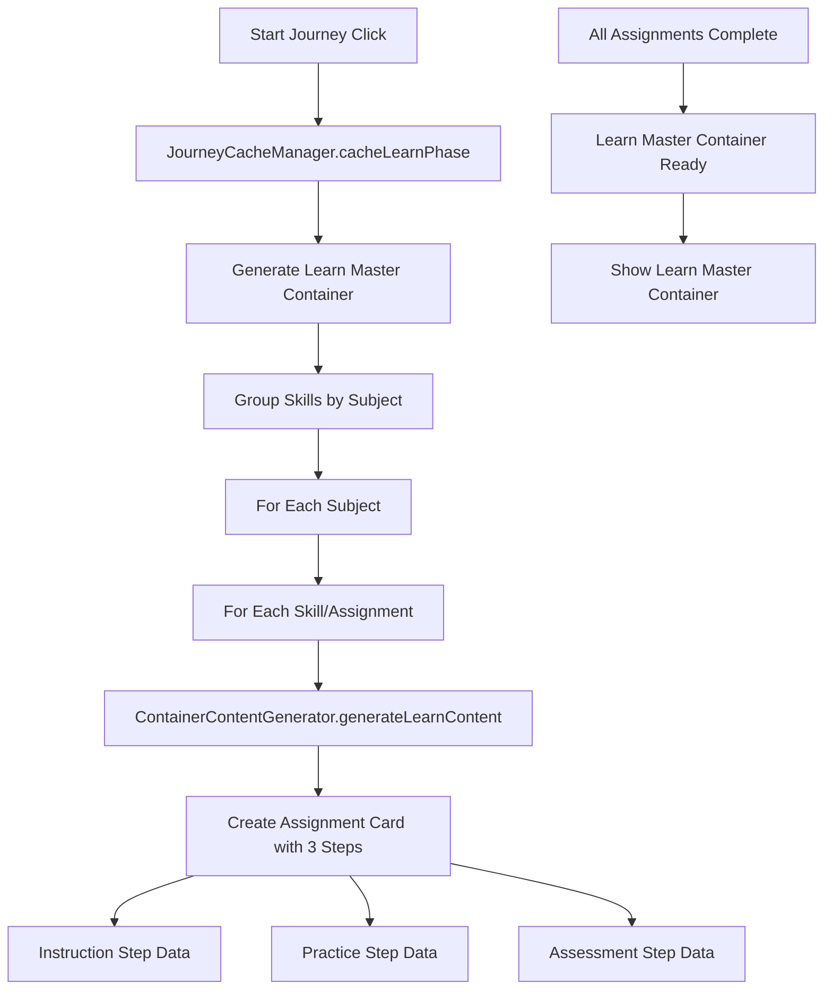
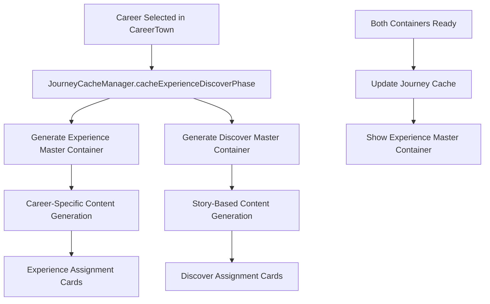

# Cache Flow Documentation

## Overview
The Pathfinity caching system uses a **two-phase strategy** to optimize performance and user experience. Content is generated upfront during natural transition points to eliminate loading delays during learning.

## Two-Phase Caching Strategy

### Phase 1: Learn Content Caching
**Triggered**: During "Start Your Journey" click  
**Duration**: 3-8 seconds  
**Screen**: Finn Personalization ("Finn is personalizing your learning adventure...")



### Phase 2: Experience/Discover Content Caching  
**Triggered**: After career selection in CareerTown  
**Duration**: 5-12 seconds  
**Screen**: Career Adventure Preparation ("Finn is preparing your [Career] adventure...")



## Caching Components

### JourneyCacheManager
**Location**: `/src/utils/JourneyCacheManager.ts`

#### Key Methods
- `cacheLearnPhase()` - Phase 1 caching
- `cacheExperienceDiscoverPhase()` - Phase 2 caching  
- `getLearnMasterContainer()` - Retrieve cached Learn content
- `getExperienceMasterContainer()` - Retrieve cached Experience content
- `getDiscoverMasterContainer()` - Retrieve cached Discover content

#### Cache Structure
```typescript
interface ComprehensiveJourneyCache {
  studentName: string;
  gradeLevel: string; 
  assignment: MultiSubjectAssignment;
  learnMasterContainer: MasterContainerData;
  experienceMasterContainer: MasterContainerData | null; // Phase 2
  discoverMasterContainer: MasterContainerData | null;   // Phase 2
  cacheTimestamp: Date;
  isFullyCached: boolean; // true after Phase 2 complete
}
```

### ContainerContentGenerator
**Location**: `/src/utils/ContainerContentGenerators.ts`

#### Content Generation Methods
- `generateLearnContent()` - Instruction-focused content
- `generateExperienceContent()` - Career application content  
- `generateDiscoverContent()` - Story-based content

#### Content Types
```typescript
// Learn Content - Traditional academic approach
interface LearnContent {
  instruction: {
    title: string;
    content: string; 
    concept: string;
    examples: Array<{question, answer, explanation}>;
    keyPoints: string[];
  };
  practice: {
    title: string;
    exercises: Array<{question, hint, expectedAnswer, feedback}>;
  };
  assessment: {
    question: string;
    options: string[];
    correctAnswer: string;
    explanation: string;
    feedback: {correct: string, incorrect: string};
  };
}

// Experience Content - Career application
interface ExperienceContent {
  instruction: {
    title: string;
    roleDescription: string;
    challenge: string; 
    context: string;
  };
  practice: {
    title: string;
    scenarios: Array<{situation, task, expectedOutcome}>;
  };
  assessment: {
    question: string;
    options: string[];
    correctAnswer: string;
    explanation: string;
  };
}

// Discover Content - Story-based
interface DiscoverContent {
  instruction: {
    title: string;
    setting: string;
    characters: string[];
    plot: string;
    skillConnection: string;
  };
  practice: {
    title: string; 
    storyEvents: Array<{event, choice, outcome, skillApplication}>;
  };
  assessment: {
    question: string;
    options: string[];
    correctAnswer: string;
    explanation: string;
  };
}
```

## Cache Orchestration

### ThreeContainerOrchestrator
**Location**: `/src/components/containers/ThreeContainerOrchestrator.tsx`

#### Cache Flow Management
```typescript
// Phase 1: Learn Caching
useEffect(() => {
  const cacheLearnPhase = async () => {
    const learnMasterContainer = await journeyCacheManager.cacheLearnPhase(
      assignment, studentName, gradeLevel, onProgress
    );
    setJourneyCache({
      learnMasterContainer,
      experienceMasterContainer: null,
      discoverMasterContainer: null, 
      isFullyCached: false
    });
  };
}, []);

// Phase 2: Experience/Discover Caching  
const handleCareerSelected = async (career, badge) => {
  const { experienceMasterContainer, discoverMasterContainer } = 
    await journeyCacheManager.cacheExperienceDiscoverPhase(
      assignment, studentName, gradeLevel, career, onProgress
    );
    
  setJourneyCache(prevCache => ({
    ...prevCache,
    experienceMasterContainer,
    discoverMasterContainer,
    isFullyCached: true
  }));
};
```

## Cache Performance

### Timing Breakdown
```
Phase 1 (Learn Caching):
├── API Calls: 3-9 calls (1 per skill/assignment)
├── Content Generation: 2-5 seconds
├── Cache Storage: <1 second
└── Total: 3-8 seconds

Phase 2 (Experience/Discover Caching):  
├── API Calls: 6-18 calls (2 containers × 3-9 skills each)
├── Content Generation: 4-10 seconds
├── Cache Storage: <1 second  
└── Total: 5-12 seconds
```

### Memory Usage
```
Typical Cache Size per Student:
├── Learn Master Container: ~50-150KB
├── Experience Master Container: ~75-200KB  
├── Discover Master Container: ~75-200KB
├── Metadata & Structure: ~10-25KB
└── Total per Journey: ~200-600KB
```

## Error Handling

### Cache Failure Scenarios

#### Phase 1 Failures
```typescript
// Learn caching fails
catch (error) {
  console.error('❌ Learn phase caching failed:', error);
  // Falls back to old LearnContainer
  setJourneyCache(null);
  setCurrentPhase('learn'); // Uses fallback container
}
```

#### Phase 2 Failures  
```typescript
// Experience/Discover caching fails
catch (error) {
  console.error('❌ Experience/Discover caching failed:', error);
  // Falls back to old containers
  setCurrentPhase('experience'); // Uses ExperienceContainer + DiscoverContainer
}
```

#### Partial Cache Success
- If some assignments cache successfully, uses cached content where available
- Missing assignments fall back to demo content or old container logic
- Graceful degradation ensures journey always completes

### Content Generation Fallbacks

#### API Failures
```typescript
// Individual skill content generation fails
catch (error) {
  console.error(`❌ Failed to generate content for ${skill.skillCode}:`, error);
  // Uses fallback demo content
  const fallbackContent = {
    instruction: { title: `Let's Learn ${skill.skillName}!`, ... },
    practice: { title: `Practice ${skill.skillName}`, ... },
    assessment: { question: `Which best describes ${skill.skillName}?`, ... }
  };
}
```

## Cache Optimization

### Performance Best Practices
1. **Parallel Generation**: Multiple skills cached simultaneously when possible
2. **Progress Reporting**: Real-time progress updates during caching  
3. **Memory Management**: Cache cleared after journey completion
4. **Compression**: JSON content stored efficiently in memory

### Future Enhancements
1. **Persistent Caching**: Store cache in localStorage for session recovery
2. **Preemptive Caching**: Cache popular journeys during low-traffic periods
3. **Incremental Updates**: Update cache entries rather than full regeneration
4. **Analytics Integration**: Track cache hit rates and performance metrics

## Debug & Monitoring

### Console Logging
```
🎯 Starting Learn phase caching...
📦 Caching Learn content... - 50%
✅ Learn phase cached!
🎭 Caching Experience/Discover content for career: engineer...
📦 Caching Experience content... - 25%
📦 Caching Discover content... - 75%  
✅ Experience/Discover phase cached!
```

### Cache Inspection
```typescript
// Check cache status
const cacheStats = journeyCacheManager.getCacheStats();
console.log('Cache Stats:', cacheStats);

// Verify specific containers
const learnContainer = journeyCacheManager.getLearnMasterContainer(
  studentName, gradeLevel, assignmentId
);
console.log('Learn Container Cached:', !!learnContainer);
```