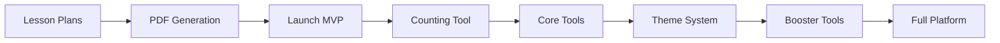

# Implementation Roadmap: Lesson Plans vs Tools

## The Recommendation: Start with LESSON PLANS First

### Why Lesson Plans First?

1. **Immediate Value Delivery**
   - Can generate PDFs right away for parents/teachers
   - Works with existing components (NarrativeLearnContainer, JIT Service)
   - Creates sellable product quickly (subscription tiers become real)

2. **Tools Can Be Simulated Initially**
   - Lesson plans can describe activities without interactive tools
   - "Practice worksheets" in PDF format as temporary solution
   - Gives you time to build tools properly

3. **Validates the Business Model**
   - Test if parents will pay for Basic vs Premium
   - See which boosters get most interest
   - Gather data on which careers are most popular

4. **Defines Tool Requirements**
   - Lesson plans will reveal exactly which tools are needed most
   - Real user feedback will prioritize tool development
   - Avoid building tools that won't be used

---

## Phase 1: Lesson Plan Infrastructure (Weeks 1-4)

### Week 1-2: Core Lesson Plan System
```typescript
// Priority 1: Get basic lesson generation working
1. StandardizedLessonPlan.ts ✅ (Already created)
2. LessonPlanGenerator service
3. Template selector based on subscription
4. PDF generator for offline use
```

**Deliverable**: Generate first lesson plan for Sam + Chef

### Week 2-3: Content Integration
```typescript
// Connect to existing services
1. Wire up MasterNarrativeGenerator
2. Connect JustInTimeContentService
3. Integrate with Spark AI Companion
4. Add career + skill mapping
```

**Deliverable**: Fully integrated lesson that flows through existing UI

### Week 3-4: Template Variations
```typescript
// Build out all 10 template types
1. BASIC_STANDARD ✅
2. BASIC_STANDARD_AI ✅
3. PREMIUM_STANDARD
4. PREMIUM_STANDARD_AI
5. PREMIUM_TRADE
6. PREMIUM_TRADE_AI
7. PREMIUM_CORPORATE
8. PREMIUM_CORPORATE_AI
9. PREMIUM_ENTREPRENEUR
10. PREMIUM_ENTREPRENEUR_AI
```

**Deliverable**: All subscription tiers have unique content

### MVP Launch Point 🚀
**What you can ship**:
- Daily lesson plans delivered to app
- PDF downloads for parents
- Spark guides learning (text-based initially)
- Clear value proposition for each tier

**Revenue Enabled**: YES - Parents can subscribe and see immediate value

---

## Phase 2: Generic Tools Library (Weeks 5-8)

### Week 5: First Tool - Counting Tool
```typescript
// Start with most universal tool
1. Build generic CountingTool component
2. Create theming system
3. Add Chef, Doctor, Teacher themes
4. Test with real lesson plans
```

**Why Counting First**: Used in every Math lesson K-5

### Week 6: Core Tools Suite
```typescript
// Build remaining essential tools
1. LetterTool (ELA)
2. ShapeTool (Science/Math)
3. SequencingTool (Logic)
4. ComparisonTool (Math)
5. CommunityTool (Social Studies)
```

**Integration**: Replace PDF worksheets with interactive tools

### Week 7: Theme Generation System
```typescript
// Automate content creation
1. Build CareerThemeGenerator
2. Pre-generate top 50 careers
3. Create AI generation for rare careers
4. Implement caching system
```

**Deliverable**: Tools work for any career

### Week 8: Spark Integration
```typescript
// Add AI guidance to tools
1. Spark provides hints
2. Spark celebrates success
3. Spark offers encouragement
4. Parent visibility dashboard
```

**Enhanced Value**: Tools become AI-powered learning companions

---

## Phase 3: Booster Tools (Weeks 9-12)

### Week 9-10: Trade/Skill Tools
```typescript
// Specialized for hands-on learning
1. MeasurementTool
2. AssemblySimulator
3. SafetyChecklistTool
4. TechniquePractice
```

### Week 10-11: Corporate Tools
```typescript
// Professional skill builders
1. EmailSimulator
2. SchedulingTool
3. SlideBuilder
4. DataEntryTool
```

### Week 11-12: Entrepreneur Tools
```typescript
// Innovation and business tools
1. IdeaGenerator
2. PriceCalculator
3. CustomerSimulator
4. PitchBuilder
```

---

## Development Approach

### Start Simple, Enhance Iteratively

#### Version 1.0 (MVP - Week 4)
```
Lesson Plans: ✅ Full system
Tools: ❌ Not built yet
Delivery: PDF worksheets + Spark narration
Value: Clear, but limited interactivity
```

#### Version 1.5 (Week 8)
```
Lesson Plans: ✅ Full system
Tools: ✅ 6 core tools
Delivery: Interactive app + PDF backup
Value: Engaging, interactive learning
```

#### Version 2.0 (Week 12)
```
Lesson Plans: ✅ Full system
Tools: ✅ 18 tools (core + boosters)
Delivery: Full interactive + AI guidance
Value: Premium experience justifies pricing
```

---

## Risk Mitigation

### If Lesson Plans Take Longer
- Ship with PDF-only initially
- Tools can be added as "coming soon"
- Still provides value to users

### If Tools Take Longer
- Continue with PDF worksheets
- Gradually replace PDFs with tools
- Users see continuous improvement

### If Both Take Longer
- Focus on one career (Chef) fully built
- Perfect the experience for one path
- Then scale to other careers

---

## Success Metrics

### Phase 1 Success (Lesson Plans)
- [ ] Generate 10 lesson plans daily
- [ ] 100 parents download PDFs
- [ ] 50% choose premium tier
- [ ] Spark successfully guides lessons

### Phase 2 Success (Core Tools)
- [ ] Tools used 1000+ times/day
- [ ] 80% completion rate
- [ ] Engagement time doubles
- [ ] Parent satisfaction increases

### Phase 3 Success (Booster Tools)
- [ ] 30% purchase boosters
- [ ] Trade booster → certification prep
- [ ] Corporate → interview success
- [ ] Entrepreneur → business plans created

---

## The Critical Path



**Start with Lesson Plans** because:
1. **Faster to Market** - 4 weeks vs 8 weeks
2. **Validates Concept** - Proves parents will pay
3. **Defines Requirements** - Shows what tools are needed
4. **Generates Revenue** - Can charge immediately
5. **Lower Risk** - Uses existing infrastructure

**Then Build Tools** because:
1. **Requirements Clear** - You know what's needed
2. **Users Waiting** - Built-in demand
3. **Iterative Enhancement** - Add value over time
4. **Premium Justification** - Tools justify higher pricing

---

## Recommended Next Steps

### This Week
1. ✅ Complete LessonPlanGenerator class
2. ✅ Generate first Chef lesson for Sam
3. ✅ Create PDF output
4. ✅ Test with 5 families

### Next Week
1. Build template selector
2. Add 10 careers
3. Connect to Spark
4. Launch private beta

### Week 3-4
1. All template types working
2. 50 careers supported
3. Public beta launch
4. Start charging subscriptions

### Week 5+
1. Begin tool development
2. Replace PDFs with interactive tools
3. Add booster-specific tools
4. Full platform launch

This approach gets you to revenue fastest while building toward the complete vision!