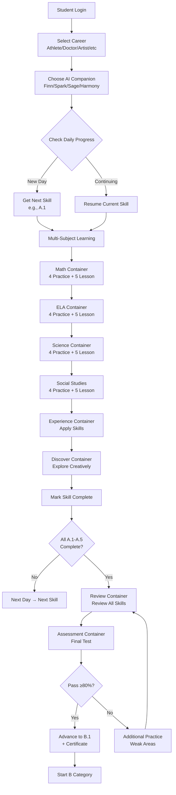
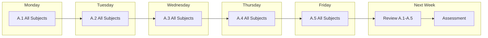
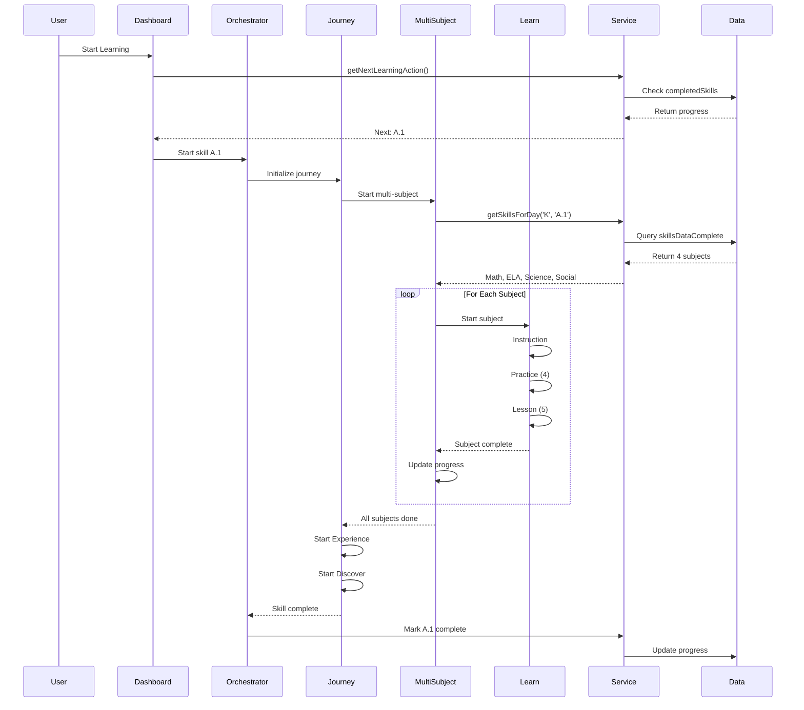
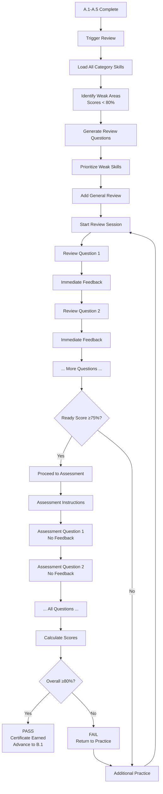
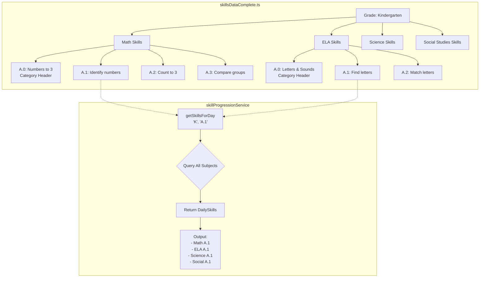
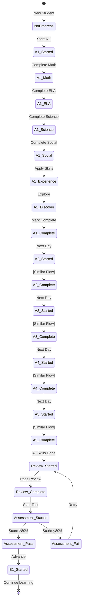
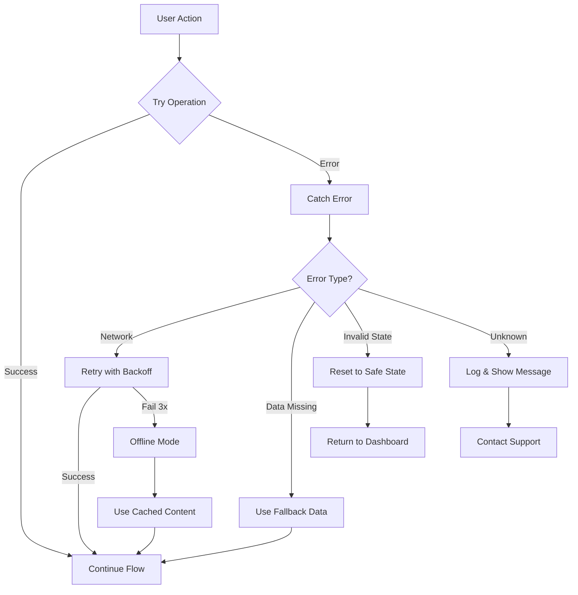
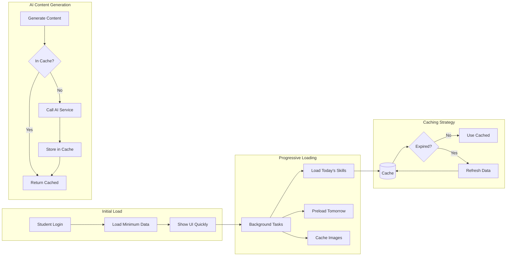

# Learning System Flow Diagrams

## Student Journey Overview



## Daily Skill Progression



## Single Skill Learning Flow (e.g., A.1)

```mermaid
graph TD
    Start[Start A.1] --> LoadSkills[Load Skills from<br/>skillsDataComplete.ts]
    
    LoadSkills --> GetSubjects[Get All Subjects<br/>Math, ELA, Science, Social]
    
    GetSubjects --> Math{Math Learning}
    Math --> MathInstruct[Instruction Phase<br/>Learn Concepts]
    MathInstruct --> MathPractice[Practice Phase<br/>4 Questions]
    MathPractice --> MathLesson[Lesson Phase<br/>5 Questions]
    MathLesson --> MathComplete[Math Complete ✓]
    
    MathComplete --> Transition1[Companion Message<br/>'Great job with Math!<br/>Ready for Reading?']
    
    Transition1 --> ELA{ELA Learning}
    ELA --> ELAFlow[... Same Flow ...]
    ELAFlow --> ELAComplete[ELA Complete ✓]
    
    ELAComplete --> Transition2[Companion Message<br/>'Excellent reading!<br/>Let's explore Science!']
    
    Transition2 --> Science{Science Learning}
    Science --> SciFlow[... Same Flow ...]
    SciFlow --> SciComplete[Science Complete ✓]
    
    SciComplete --> Transition3[Companion Message<br/>'Amazing science work!<br/>Time for Social Studies!']
    
    Transition3 --> Social{Social Studies}
    Social --> SocFlow[... Same Flow ...]
    SocFlow --> SocComplete[Social Complete ✓]
    
    SocComplete --> AllDone[All Subjects Complete<br/>for A.1]
    
    AllDone --> Experience[Experience Container]
    Experience --> Discover[Discover Container]
    Discover --> MarkComplete[A.1 Marked Complete]
```



## Component Communication Flow



## Review & Assessment Flow



## Data Structure Flow



## State Management Flow



## Error Handling Flow



## Performance Optimization Flow



---

## Key Decision Points

### When to Show Review?
```
IF all skills A.1-A.5 are complete
AND review not yet done
THEN show ReviewContainer
```

### When to Show Assessment?
```
IF all skills A.1-A.5 are complete
AND review is complete
AND assessment not yet done
THEN show AssessmentContainer
```

### When to Advance Category?
```
IF assessment score >= 80%
THEN advance to next category (B.1)
ELSE return to practice weak areas
```

### How to Determine Daily Skill?
```
1. Check completedSkills array
2. Find first incomplete skill in current category
3. If all complete, check for review/assessment
4. If category complete, advance to next
```

---

*These diagrams provide a visual understanding of the learning system's flow and architecture.*