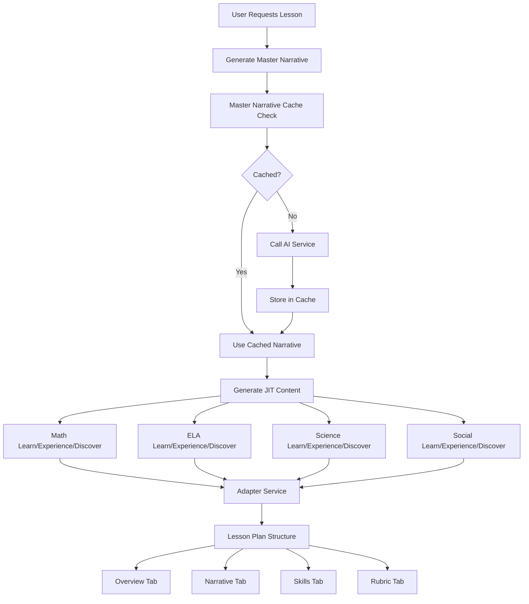

# Master Narrative Integration Plan
## Mapping AI Services to Lesson Plan/Rubric Tabs

### Current State Analysis

#### 1. MasterNarrativeGenerator Output Structure
```typescript
interface MasterNarrative {
  narrativeId: string;
  character: {
    name: string;              // Student name
    role: string;              // "Junior Doctor Helper"
    workplace: string;         // "CareerInc Medical Center"
    personality: string;       // Traits for the career
    equipment: string[];       // Career-specific tools
  };
  journeyArc: {
    checkIn: string;           // Lobby arrival
    learn: string;             // Virtual Academy
    experience: string;        // Virtual Workplace
    discover: string;          // Virtual Field Trip
  };
  cohesiveStory: {
    mission: string;           // Overall goal
    throughLine: string;       // Narrative thread
    // Career-specific focus areas
  };
  settingProgression: {
    learn: { location, context, narrative };
    experience: { location, context, narrative };
    discover: { location, context, narrative };
  };
  subjectContextsAligned: {
    math: { learn, experience, discover };
    ela: { learn, experience, discover };
    science: { learn, experience, discover };
    socialStudies: { learn, experience, discover };
  };
  subjectContextsAlignedFacts: {
    math: string[];      // Fun facts for loading screen
    ela: string[];
    science: string[];
    socialStudies: string[];
  };
}
```

#### 2. BasicLessonTemplate Expected Structure
```typescript
interface DemonstrativeLesson {
  narrative: {
    missionBriefing: string;
    act1: { subjects: SubjectActivity[] };
    act2: { subjects: SubjectActivity[] };
    act3: { subjects: SubjectActivity[] };
  };
  activities: ActivitySet;
  assessment: AssessmentPlan;
}
```

#### 3. JustInTimeContentService Output
```typescript
interface GeneratedContent {
  questions: Question[];
  instructions: string;
  careerContext: string;
  skillFocus: string;
  // For AI-generated content:
  aiSourceContent?: {
    greeting: string;
    concept: string;
    practice: Question[];
    assessment: Question;
  };
}
```

---

## Integration Requirements

### For Overview Tab
Needs to display:
1. **Lesson Metadata**
   - Student name, grade, date
   - Selected career & companion
   - Duration and skill objectives

2. **Daily Mission**
   - From `MasterNarrative.cohesiveStory.mission`
   - Career role from `MasterNarrative.character.role`

3. **Skills Coverage**
   - All 4 subjects with specific Common Core standards
   - Progress indicators

### For Narrative Tab
Needs to display:
1. **Three-Act Structure**
   - Act 1: Learn (Virtual Academy)
   - Act 2: Experience (Virtual Workplace)
   - Act 3: Discover (Virtual Field Trip)

2. **Subject Integration**
   - Math, ELA, Science, Social Studies contexts
   - Career-specific applications

3. **Exact AI Content**
   - Must match what JIT service returns
   - Questions, scenarios, assessments

---

## Implementation Plan

### Phase 1: Create Master Narrative Adapter
```typescript
class MasterNarrativeAdapter {
  /**
   * Transforms MasterNarrative + JIT content into Lesson Plan format
   */
  async adaptToLessonPlan(
    masterNarrative: MasterNarrative,
    jitContent: Map<string, GeneratedContent>,
    skills: SkillSet
  ): Promise<DemonstrativeLesson> {
    return {
      header: this.buildHeader(masterNarrative, skills),
      narrative: this.buildNarrative(masterNarrative, jitContent),
      activities: this.buildActivities(jitContent),
      assessment: this.buildAssessment(jitContent),
      rubric: this.buildRubric(skills)
    };
  }

  private buildNarrative(
    master: MasterNarrative,
    jitContent: Map<string, GeneratedContent>
  ): NarrativeStructure {
    return {
      missionBriefing: master.cohesiveStory.mission,

      act1: {
        title: "Learn - Virtual Academy",
        description: master.settingProgression.learn.narrative,
        subjects: [
          {
            subject: 'Math',
            narrative: master.subjectContextsAligned.math.learn,
            content: jitContent.get('learn-math')
          },
          // ... other subjects
        ]
      },

      act2: {
        title: "Experience - Virtual Workplace",
        description: master.settingProgression.experience.narrative,
        subjects: [
          {
            subject: 'Math',
            narrative: master.subjectContextsAligned.math.experience,
            content: jitContent.get('experience-math')
          },
          // ... other subjects
        ]
      },

      act3: {
        title: "Discover - Virtual Field Trip",
        description: master.settingProgression.discover.narrative,
        subjects: [
          {
            subject: 'Math',
            narrative: master.subjectContextsAligned.math.discover,
            content: jitContent.get('discover-math')
          },
          // ... other subjects
        ]
      }
    };
  }
}
```

### Phase 2: Update BasicLessonTemplate

1. **Remove Mock Data Generation**
   - Replace hardcoded narratives with MasterNarrative integration
   - Use actual JIT content instead of mock questions

2. **Add Service Integration**
   ```typescript
   class BasicLessonTemplateGenerator {
     constructor(
       private narrativeService: MasterNarrativeGenerator,
       private jitService: JustInTimeContentService,
       private adapter: MasterNarrativeAdapter
     ) {}

     async generateDemonstrativeLesson(input: BasicLessonInput) {
       // 1. Generate Master Narrative
       const narrative = await this.narrativeService.generateMasterNarrative({
         studentName: input.student.name,
         gradeLevel: input.student.grade.toString(),
         career: input.career || this.selectRandomCareer(),
         subjects: ['math', 'ela', 'science', 'socialStudies']
       });

       // 2. Generate JIT content for each container/subject
       const jitContent = await this.generateAllJITContent(narrative, input);

       // 3. Adapt to lesson plan format
       return this.adapter.adaptToLessonPlan(narrative, jitContent, input.skills);
     }
   }
   ```

### Phase 3: Ensure Exact Data Match

1. **Map JIT Questions to Display Format**
   ```typescript
   interface QuestionDisplay {
     question: string;      // From JIT
     options: string[];     // From JIT
     hint: string;         // From JIT
     visual?: string;      // From JIT if available
     careerContext: string; // From narrative
   }
   ```

2. **Preserve AI Content Structure**
   - Don't transform or summarize AI responses
   - Display exactly what AI generates
   - Include all metadata and context

### Phase 4: Update TestBasicLessonTemplate

1. **Add Loading States**
   - Show when generating Master Narrative
   - Show when generating JIT content
   - Progressive loading as content arrives

2. **Add Debug Mode**
   - Show raw AI responses
   - Compare mock vs real data
   - Verify data structures match

---

## Data Flow Architecture



---

## Key Integration Points

### 1. Overview Tab Content
```typescript
{
  // From MasterNarrative
  career: narrative.character.role,
  workplace: narrative.character.workplace,
  mission: narrative.cohesiveStory.mission,
  equipment: narrative.character.equipment,

  // From Skills Input
  objectives: {
    math: skills.math.skillName,
    ela: skills.ela.skillName,
    science: skills.science.skillName,
    social: skills.social.skillName
  }
}
```

### 2. Narrative Tab Content
```typescript
{
  // Act 1 - Learn
  learn: {
    setting: narrative.settingProgression.learn.location,
    context: narrative.settingProgression.learn.context,
    subjects: {
      math: {
        narrative: narrative.subjectContextsAligned.math.learn,
        activities: jitContent.get('learn-math').questions
      },
      // ... other subjects
    }
  },

  // Act 2 - Experience
  experience: {
    setting: narrative.settingProgression.experience.location,
    context: narrative.settingProgression.experience.context,
    subjects: {
      math: {
        narrative: narrative.subjectContextsAligned.math.experience,
        activities: jitContent.get('experience-math').questions
      },
      // ... other subjects
    }
  },

  // Act 3 - Discover
  discover: {
    setting: narrative.settingProgression.discover.location,
    context: narrative.settingProgression.discover.context,
    subjects: {
      math: {
        narrative: narrative.subjectContextsAligned.math.discover,
        activities: jitContent.get('discover-math').questions
      },
      // ... other subjects
    }
  }
}
```

---

## Success Criteria

1. **Data Accuracy**
   - Lesson plans show EXACT AI-generated content
   - No mock data in production mode
   - Questions match JIT service output

2. **Narrative Coherence**
   - Single career theme throughout
   - Consistent character/companion
   - Progressive story across acts

3. **Parent Visibility**
   - Clear skill objectives
   - Demonstrative examples
   - Quality guarantees

4. **Performance**
   - Master Narrative cached for reuse
   - JIT content generated on-demand
   - <3 second total generation time

---

## Next Steps

1. **Immediate Actions**
   - [ ] Create MasterNarrativeAdapter service
   - [ ] Update BasicLessonTemplate to use real services
   - [ ] Add loading states to TestBasicLessonTemplate
   - [ ] Test with actual AI responses

2. **Testing Strategy**
   - [ ] Compare mock vs real data structures
   - [ ] Verify all fields populated correctly
   - [ ] Test multiple careers and grades
   - [ ] Validate parent-facing content

3. **Documentation**
   - [ ] Update API documentation
   - [ ] Create data flow diagrams
   - [ ] Document caching strategy
   - [ ] Add troubleshooting guide

This integration ensures that the Lesson Plan system displays exactly what the AI services generate, maintaining narrative coherence and educational integrity.