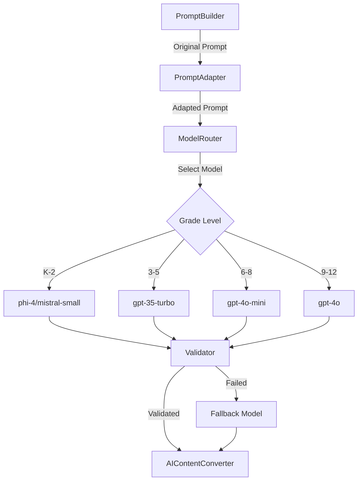

# Multi-Model AI System Implementation Guide

## 📋 Table of Contents
1. [Overview](#overview)
2. [Architecture](#architecture)
3. [Model Selection Strategy](#model-selection-strategy)
4. [Implementation Plan](#implementation-plan)
5. [Technical Components](#technical-components)
6. [Testing Strategy](#testing-strategy)
7. [Deployment Checklist](#deployment-checklist)
8. [Troubleshooting](#troubleshooting)

---

## 🎯 Overview

### Purpose
Transform our single-model OpenAI GPT-4o system into a multi-model architecture that:
- Reduces costs by 60-80% for K-5 content
- Maintains quality through intelligent validation
- Provides redundancy and failover capabilities
- Optimizes model selection based on content complexity

### Current State
- **Single Model**: GPT-4o for all content generation
- **Cost**: ~$0.03-0.05 per generation
- **No Validation**: Single pass generation
- **No Redundancy**: System fails if OpenAI is down

### Target State
- **Multi-Model**: Different models for different complexity levels
- **Cost**: $0.001-0.05 depending on grade/complexity
- **Validation Pipeline**: DeepSeek/Mistral validation layer
- **Full Redundancy**: Automatic fallback to alternative models

---

## 🏗️ Architecture

### Model Hierarchy

```
┌─────────────────────────────────────────────────┐
│                  USER REQUEST                    │
└─────────────────────┬───────────────────────────┘
                      ▼
┌─────────────────────────────────────────────────┐
│            MODEL ROUTER SERVICE                  │
│  Analyzes: Grade, Subject, Container, Complexity │
└─────────────────────┬───────────────────────────┘
                      ▼
        ┌─────────────┴─────────────┐
        ▼                           ▼
┌───────────────┐           ┌───────────────┐
│  K-2 Content  │           │  9-12 Content │
│   (Simple)    │           │   (Complex)   │
│               │           │               │
│   phi-4       │           │   gpt-4o      │
│   $0.0003/1K  │           │   $0.03/1K    │
└───────┬───────┘           └───────┬───────┘
        ▼                           ▼
┌─────────────────────────────────────────────────┐
│           VALIDATION LAYER                       │
│   DeepSeek-V3 / Mistral-Small                   │
│   Validates rules, fixes errors                  │
└─────────────────────┬───────────────────────────┘
                      ▼
┌─────────────────────────────────────────────────┐
│            CONTENT DELIVERY                      │
└─────────────────────────────────────────────────┘
```

### Component Relationships



---

## 📊 Model Selection Strategy

### Grade-Based Selection

| Grade | Primary Model | Validator | Fallback | Est. Cost |
|-------|--------------|-----------|----------|-----------|
| K-2   | phi-4        | mistral-small | gpt-35-turbo | $0.001 |
| 3-5   | mistral-small | gpt-35-turbo | gpt-4o-mini | $0.003 |
| 6-8   | gpt-4o-mini  | deepseek-v3 | gpt-4o | $0.010 |
| 9-12  | gpt-4o       | deepseek-v3 | gpt-4 | $0.030 |

### Container-Based Overrides

| Container | Override Rule | Reason |
|-----------|--------------|---------|
| EXPERIENCE | Always use gpt-4o | Complex narrative generation |
| DISCOVER | Always use gpt-4o | Creative exploration content |
| ASSESSMENT | Use same as LEARN | Consistency in evaluation |
| LEARN | Follow grade rules | Standard question generation |

### Subject-Based Adjustments

| Subject | Special Handling |
|---------|-----------------|
| MATH (K-2) | phi-4 excels at counting/basic math |
| ELA (7-12) | Needs gpt-4o for reading passages |
| SCIENCE | Complex topics may trigger upgrade |
| SOCIAL_STUDIES | Standard grade-based selection |

---

## 📅 Implementation Plan

### Phase 1: Foundation (Week 1)
**Goal**: Build core infrastructure without breaking existing system

#### Day 1-2: Model Infrastructure
- [ ] Create `/src/services/ai-models/` directory structure
- [ ] Implement `ModelCapabilities.ts` - Registry of model capabilities
- [ ] Implement `PromptAdapter.ts` - Adapts prompts for each model
- [ ] Create model configuration JSON files

#### Day 3-4: Prompt Templates
- [ ] Create simplified templates for phi-4
- [ ] Create validation templates for DeepSeek
- [ ] Create fallback templates
- [ ] Test prompt generation without API calls

#### Day 5: Routing Logic
- [ ] Implement `ModelRouter.ts` - Intelligent model selection
- [ ] Add grade-based routing rules
- [ ] Add container-based overrides
- [ ] Create fallback cascade logic

### Phase 2: Integration (Week 2)
**Goal**: Integrate with existing system in parallel

#### Day 6-7: Service Layer
- [ ] Create `MultiModelService.ts` - Main service orchestrator
- [ ] Add feature flag for multi-model mode
- [ ] Integrate with `AILearningJourneyService.ts`
- [ ] Maintain backward compatibility

#### Day 8-9: Validation Pipeline
- [ ] Implement `ValidationService.ts` using DeepSeek
- [ ] Add retry logic with fixes
- [ ] Create validation report structure
- [ ] Add validation metrics tracking

#### Day 10: Monitoring & Metrics
- [ ] Implement `ModelMetrics.ts` - Performance tracking
- [ ] Add cost calculation per request
- [ ] Create dashboard endpoints
- [ ] Add logging for debugging

### Phase 3: Testing (Week 3)
**Goal**: Comprehensive testing with real scenarios

#### Day 11-12: Unit Testing
- [ ] Test each model adapter
- [ ] Test routing logic
- [ ] Test fallback scenarios
- [ ] Test validation pipeline

#### Day 13-14: Integration Testing
- [ ] Test with Sam (K) - All subjects
- [ ] Test with Alex (1) - All subjects
- [ ] Test with Jordan (7) - All subjects
- [ ] Test with Taylor (10) - All subjects

#### Day 15: Performance Testing
- [ ] Load testing with concurrent requests
- [ ] Measure latency improvements
- [ ] Calculate cost savings
- [ ] Generate comparison reports

### Phase 4: Rollout (Week 4)
**Goal**: Progressive deployment with monitoring

#### Day 16-17: Staged Rollout
- [ ] Enable for 10% of K-2 traffic
- [ ] Monitor error rates and quality
- [ ] Expand to 50% if successful
- [ ] Full rollout for K-2

#### Day 18-19: Expand Coverage
- [ ] Enable for grades 3-5
- [ ] Enable for grades 6-8
- [ ] Keep 9-12 on GPT-4o initially

#### Day 20: Full Production
- [ ] Enable for all grades
- [ ] Remove feature flags
- [ ] Archive old single-model code
- [ ] Update documentation

---

## 🔧 Technical Components

### 1. PromptAdapter (`/src/services/ai-models/PromptAdapter.ts`)

**Purpose**: Adapts prompts based on model capabilities

**Key Methods**:
```typescript
buildPrompt(context: PromptContext, targetModel: string): string
simplifyRules(prompt: string, context: PromptContext): string
enforceJSONFormat(prompt: string, modelName: string): string
getRecommendedModel(context: PromptContext): string
```

**Critical Logic**:
- Simplifies complex rules for basic models
- Enforces JSON format for models that need it
- Adds model-specific instructions
- Truncates prompts to fit context windows

### 2. ModelRouter (`/src/services/ai-models/ModelRouter.ts`)

**Purpose**: Selects optimal model based on context

**Key Methods**:
```typescript
selectModel(context: PromptContext): ModelChoice
routeRequest(request: ContentRequest): ModelAssignment
handleFallback(error: Error, context: PromptContext): string
calculateCost(model: string, tokens: number): number
```

**Decision Tree**:
1. Check grade level
2. Check container type (override for EXPERIENCE/DISCOVER)
3. Check subject complexity
4. Check cost constraints
5. Return model assignment

### 3. MultiModelService (`/src/services/ai-models/MultiModelService.ts`)

**Purpose**: Main orchestrator for multi-model system

**Key Methods**:
```typescript
generateContent(context: PromptContext): Promise<Content>
validateContent(content: Content, model: string): Promise<ValidationResult>
retryWithFallback(context: PromptContext, error: Error): Promise<Content>
trackMetrics(model: string, latency: number, cost: number): void
```

**Flow**:
1. Route to appropriate model
2. Adapt prompt for model
3. Call model API
4. Validate response
5. Retry with fallback if needed
6. Track metrics
7. Return content

### 4. ValidationService (`/src/services/ai-models/ValidationService.ts`)

**Purpose**: Validates and fixes content using secondary models

**Key Methods**:
```typescript
validate(content: Content, rules: Rules): Promise<ValidationResult>
fix(content: Content, errors: ValidationError[]): Promise<Content>
checkRuleCompliance(content: Content): RuleCheck[]
suggestImprovements(content: Content): Suggestion[]
```

**Validation Checks**:
- Subject isolation (no contamination)
- Grade appropriateness
- Career context preservation
- Question count accuracy
- Format compliance
- Answer correctness

### 5. ModelMetrics (`/src/services/ai-models/ModelMetrics.ts`)

**Purpose**: Tracks performance and cost metrics

**Key Metrics**:
```typescript
interface ModelMetrics {
  model: string;
  totalRequests: number;
  successRate: number;
  averageLatency: number;
  p95Latency: number;
  totalCost: number;
  averageCost: number;
  errorRate: number;
  fallbackRate: number;
  validationPassRate: number;
}
```

---

## 🧪 Testing Strategy

### Test Personas

| Persona | Grade | Subjects | Expected Models | Test Focus |
|---------|-------|----------|-----------------|------------|
| Sam | K | All 4 | phi-4 primary | Simple content, counting |
| Alex | 1 | All 4 | phi-4 primary | Basic questions, letters |
| Jordan | 7 | All 4 | gpt-4o-mini | Reading passages, complex |
| Taylor | 10 | All 4 | gpt-4o | Advanced content, analysis |

### Test Scenarios

#### Scenario 1: Cost Optimization
```typescript
// Test that K-2 uses cheap models
assert(modelForGrade('K') === 'phi-4');
assert(costForGrade('K') < 0.002);
```

#### Scenario 2: Quality Maintenance
```typescript
// Test that quality remains high
const gpt4oQuality = await testWithModel('gpt-4o', context);
const phi4Quality = await testWithModel('phi-4', context);
assert(phi4Quality.score > 0.90 * gpt4oQuality.score);
```

#### Scenario 3: Fallback Cascade
```typescript
// Test fallback when primary fails
mockModelFailure('phi-4');
const result = await generateContent(context);
assert(result.modelUsed === 'mistral-small'); // Fallback triggered
```

#### Scenario 4: Validation Pipeline
```typescript
// Test that validation catches errors
const badContent = generateBadContent();
const validated = await validate(badContent);
assert(!validated.isValid);
assert(validated.errors.length > 0);
```

### Performance Benchmarks

| Metric | Target | Measurement Method |
|--------|--------|-------------------|
| K-2 Cost Reduction | >80% | Compare phi-4 vs gpt-4o costs |
| 3-8 Cost Reduction | >50% | Compare mixed vs gpt-4o costs |
| Average Latency | <3s | P50 response time |
| Validation Pass Rate | >90% | Successful first attempts |
| Error Rate | <2% | Failed generations |
| Quality Score | >95% | Rule compliance checks |

---

## ✅ Deployment Checklist

### Pre-Deployment
- [ ] All models deployed in Azure
- [ ] API keys configured in `.env`
- [ ] Model endpoints verified
- [ ] Feature flags configured
- [ ] Monitoring dashboard ready
- [ ] Rollback plan documented

### Deployment Steps
1. [ ] Deploy code with feature flag OFF
2. [ ] Enable for internal testing
3. [ ] Run smoke tests for all personas
4. [ ] Enable for 10% of K-2 traffic
5. [ ] Monitor metrics for 24 hours
6. [ ] Gradually increase traffic percentage
7. [ ] Full rollout after 1 week stable

### Post-Deployment
- [ ] Monitor cost reduction metrics
- [ ] Track quality scores
- [ ] Review error logs
- [ ] Optimize model selection rules
- [ ] Update documentation
- [ ] Train team on new system

---

## 🔧 Troubleshooting

### Common Issues

#### Issue: Model returns invalid JSON
**Solution**:
```typescript
// Add JSON enforcement in prompt
if (model === 'phi-4' || model === 'mistral-small') {
  prompt += '\n\nReturn ONLY valid JSON starting with { and ending with }';
}
```

#### Issue: Validation loop (keeps failing)
**Solution**:
```typescript
// Add max retry limit
const MAX_VALIDATION_RETRIES = 2;
if (retryCount >= MAX_VALIDATION_RETRIES) {
  return fallbackToGPT4o(context);
}
```

#### Issue: Cost higher than expected
**Check**:
1. Review model selection logs
2. Check if fallback is triggered too often
3. Verify grade detection is correct
4. Check for validation loops

#### Issue: Quality degradation
**Actions**:
1. Increase validation strictness
2. Upgrade model tier for that grade
3. Add more examples to prompt
4. Review and update rules

### Debug Commands

```typescript
// Enable debug logging
process.env.MULTI_MODEL_DEBUG = 'true';

// Force specific model
process.env.FORCE_MODEL = 'gpt-4o';

// Disable validation
process.env.SKIP_VALIDATION = 'true';

// Log all model decisions
ModelRouter.enableVerboseLogging();
```

---

## 📚 Appendix

### A. Model Comparison Matrix

| Model | Strengths | Weaknesses | Best For | Avoid For |
|-------|-----------|------------|----------|-----------|
| phi-4 | Structure, math, simple | Creativity | K-3 basic | Narratives |
| mistral-small | Balanced, cheap | Complex reasoning | Validation | Grade 9-12 |
| gpt-35-turbo | Reliable, fast | Not cutting-edge | Fallback | Primary for 9-12 |
| gpt-4o-mini | Quality, cost balance | Expensive for K-2 | Grades 6-8 | Simple counting |
| deepseek-v3 | Validation, analysis | Generation speed | Validation | Primary generation |
| gpt-4o | Everything | Cost | Grades 9-12, narratives | K-5 simple content |

### B. Cost Calculation Formula

```
Cost = (Input Tokens / 1000 * Input Price) + (Output Tokens / 1000 * Output Price)

Example for K-2 with phi-4:
Input: 500 tokens * $0.0001 = $0.05
Output: 300 tokens * $0.0002 = $0.06
Total: $0.00011 per request

Savings vs GPT-4o: 99.6%
```

### C. API Configuration Template

```env
# Model Endpoints
PHI4_ENDPOINT=https://YOUR-RESOURCE.openai.azure.com/
PHI4_API_KEY=your-key-here
PHI4_DEPLOYMENT_NAME=phi-4-deployment

MISTRAL_ENDPOINT=https://YOUR-RESOURCE.openai.azure.com/
MISTRAL_API_KEY=your-key-here
MISTRAL_DEPLOYMENT_NAME=mistral-small

DEEPSEEK_ENDPOINT=https://YOUR-RESOURCE.openai.azure.com/
DEEPSEEK_API_KEY=your-key-here
DEEPSEEK_DEPLOYMENT_NAME=deepseek-v3

# Feature Flags
ENABLE_MULTI_MODEL=true
MULTI_MODEL_PERCENTAGE=10
FORCE_MODEL=none
ENABLE_VALIDATION=true
VALIDATION_STRICTNESS=medium

# Monitoring
TRACK_COSTS=true
TRACK_LATENCY=true
LOG_MODEL_DECISIONS=true
```

---

## 📞 Support & Contact

### Team Contacts
- **Technical Lead**: [Your Name]
- **AI/ML Expert**: [Team Member]
- **DevOps**: [Team Member]

### Resources
- [Azure OpenAI Documentation](https://docs.microsoft.com/en-us/azure/cognitive-services/openai/)
- [Model Pricing Calculator](https://azure.microsoft.com/en-us/pricing/details/cognitive-services/openai-service/)
- [Internal Wiki](link-to-wiki)
- [Monitoring Dashboard](link-to-dashboard)

### Escalation Path
1. Check this documentation
2. Review troubleshooting section
3. Check system logs
4. Contact technical lead
5. Escalate to AI/ML expert if needed

---

*Last Updated: September 2024*
*Version: 1.0.0*
*Status: In Development*