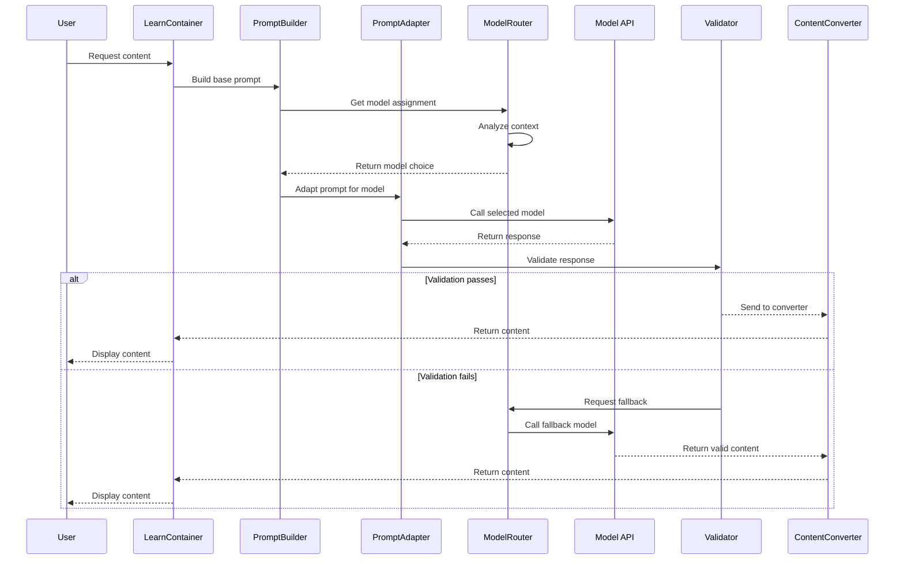

# Multi-Model System Technical Specification

## 1. System Architecture

### 1.1 Core Components

```
pathfinity-app/
├── src/
│   ├── services/
│   │   ├── ai-models/                    # NEW: Multi-model system
│   │   │   ├── PromptAdapter.ts         # Adapts prompts for each model
│   │   │   ├── ModelRouter.ts           # Routes requests to appropriate model
│   │   │   ├── ModelCapabilities.ts     # Registry of model capabilities
│   │   │   ├── MultiModelService.ts     # Main orchestrator
│   │   │   ├── ValidationService.ts     # Content validation with secondary models
│   │   │   ├── ModelMetrics.ts          # Performance and cost tracking
│   │   │   ├── FallbackHandler.ts       # Manages fallback cascade
│   │   │   ├── config/
│   │   │   │   ├── model-config.json    # Model configuration
│   │   │   │   └── routing-rules.json   # Routing decision rules
│   │   │   └── templates/
│   │   │       ├── phi4-templates.ts    # Phi-4 specific prompts
│   │   │       ├── mistral-templates.ts # Mistral specific prompts
│   │   │       └── deepseek-templates.ts# DeepSeek validation prompts
│   │   │
│   │   ├── ai-prompts/                  # EXISTING: Enhanced for multi-model
│   │   │   ├── PromptBuilder.ts         # Modified to use PromptAdapter
│   │   │   └── rules/                   # Existing rules (unchanged)
│   │   │
│   │   └── content/                     # EXISTING: Minimal changes
│   │       └── AIContentConverter.ts    # Modified to handle model metadata
```

### 1.2 Data Flow



---

## 2. Model Capabilities Registry

### 2.1 Capability Definition

```typescript
interface ModelCapability {
  model: string;
  provider: 'openai' | 'microsoft' | 'mistral' | 'deepseek';
  version: string;

  // Capabilities
  capabilities: {
    maxTokens: number;
    contextWindow: number;
    supportsJSON: boolean;
    supportsStreaming: boolean;
    supportsSystemPrompt: boolean;
    supportsFunctions: boolean;
  };

  // Performance characteristics
  performance: {
    averageLatency: number;  // milliseconds
    tokensPerSecond: number;
    reliability: number;      // 0-1 score
  };

  // Content strengths
  strengths: string[];
  weaknesses: string[];

  // Cost (per 1K tokens)
  pricing: {
    input: number;
    output: number;
  };

  // Context understanding
  understanding: {
    level: 'basic' | 'moderate' | 'high' | 'excellent';
    requiresExplicitJSON: boolean;
    requiresSimplification: boolean;
    maxComplexity: number;  // 1-10 scale
  };
}
```

### 2.2 Model Registry Implementation

```typescript
// ModelCapabilities.ts
export const MODEL_REGISTRY: Record<string, ModelCapability> = {
  'phi-4': {
    model: 'phi-4',
    provider: 'microsoft',
    version: '4.0',
    capabilities: {
      maxTokens: 4096,
      contextWindow: 16384,
      supportsJSON: true,
      supportsStreaming: true,
      supportsSystemPrompt: true,
      supportsFunctions: false
    },
    performance: {
      averageLatency: 800,
      tokensPerSecond: 150,
      reliability: 0.95
    },
    strengths: [
      'structured_output',
      'mathematical_reasoning',
      'simple_questions',
      'k-3_content'
    ],
    weaknesses: [
      'creative_writing',
      'complex_narratives',
      'nuanced_instructions'
    ],
    pricing: {
      input: 0.0001,
      output: 0.0002
    },
    understanding: {
      level: 'moderate',
      requiresExplicitJSON: true,
      requiresSimplification: true,
      maxComplexity: 5
    }
  },

  'gpt-4o': {
    model: 'gpt-4o',
    provider: 'openai',
    version: '2024-08',
    capabilities: {
      maxTokens: 128000,
      contextWindow: 128000,
      supportsJSON: true,
      supportsStreaming: true,
      supportsSystemPrompt: true,
      supportsFunctions: true
    },
    performance: {
      averageLatency: 2500,
      tokensPerSecond: 80,
      reliability: 0.99
    },
    strengths: [
      'everything',
      'complex_reasoning',
      'creative_content',
      'nuanced_understanding'
    ],
    weaknesses: [],
    pricing: {
      input: 0.015,
      output: 0.030
    },
    understanding: {
      level: 'excellent',
      requiresExplicitJSON: false,
      requiresSimplification: false,
      maxComplexity: 10
    }
  }
  // ... other models
};
```

---

## 3. Prompt Adaptation Engine

### 3.1 Adaptation Rules

```typescript
interface AdaptationRule {
  modelPattern: string | RegExp;
  transformations: {
    simplifyLanguage?: boolean;
    reduceComplexity?: boolean;
    addJSONEnforcement?: boolean;
    removeExamples?: boolean;
    truncateLength?: number;
    addStructureHints?: boolean;
    repeatKeyInstructions?: boolean;
  };
  injections: {
    prefix?: string;
    suffix?: string;
    criticalReminders?: string[];
  };
}
```

### 3.2 Simplification Algorithm

```typescript
class RuleSimplifier {
  simplify(rules: ComplexRules, targetLevel: number): SimpleRules {
    // Level 1-3: Ultra simple (K-2)
    if (targetLevel <= 3) {
      return {
        main: this.extractMainObjective(rules),
        requirements: this.getTop5Requirements(rules),
        format: 'JSON with question, type, answer',
        examples: this.getSimplestExample(rules)
      };
    }

    // Level 4-6: Moderate (3-5)
    if (targetLevel <= 6) {
      return {
        context: this.summarizeContext(rules),
        requirements: this.getTop10Requirements(rules),
        format: this.getFormatRequirements(rules),
        examples: this.get2Examples(rules),
        validation: this.getBasicValidation(rules)
      };
    }

    // Level 7-10: Full complexity
    return rules;
  }

  private extractMainObjective(rules: ComplexRules): string {
    // Extract the single most important instruction
    const objectives = [
      `Create ${rules.questionCount} questions`,
      `About ${rules.subject} for grade ${rules.grade}`,
      `Include ${rules.career} context`,
      `Return JSON format`
    ];
    return objectives.join('. ');
  }
}
```

---

## 4. Model Router Implementation

### 4.1 Routing Decision Tree

```typescript
class ModelRouter {
  private routingRules = {
    // Primary routing by grade
    gradeRouting: {
      'K': { primary: 'phi-4', validator: 'mistral-small', fallback: 'gpt-35-turbo' },
      '1': { primary: 'phi-4', validator: 'mistral-small', fallback: 'gpt-35-turbo' },
      '2': { primary: 'phi-4', validator: 'mistral-small', fallback: 'gpt-35-turbo' },
      '3': { primary: 'mistral-small', validator: 'gpt-35-turbo', fallback: 'gpt-4o-mini' },
      '4': { primary: 'mistral-small', validator: 'gpt-35-turbo', fallback: 'gpt-4o-mini' },
      '5': { primary: 'mistral-small', validator: 'gpt-35-turbo', fallback: 'gpt-4o-mini' },
      '6': { primary: 'gpt-4o-mini', validator: 'deepseek-v3', fallback: 'gpt-4o' },
      '7': { primary: 'gpt-4o-mini', validator: 'deepseek-v3', fallback: 'gpt-4o' },
      '8': { primary: 'gpt-4o-mini', validator: 'deepseek-v3', fallback: 'gpt-4o' },
      '9': { primary: 'gpt-4o', validator: 'deepseek-v3', fallback: 'gpt-4' },
      '10': { primary: 'gpt-4o', validator: 'deepseek-v3', fallback: 'gpt-4' },
      '11': { primary: 'gpt-4o', validator: 'deepseek-v3', fallback: 'gpt-4' },
      '12': { primary: 'gpt-4o', validator: 'deepseek-v3', fallback: 'gpt-4' }
    },

    // Container overrides
    containerOverrides: {
      'EXPERIENCE': { forceModel: 'gpt-4o', reason: 'complex_narrative' },
      'DISCOVER': { forceModel: 'gpt-4o', reason: 'creative_exploration' }
    },

    // Subject complexity adjustments
    subjectAdjustments: {
      'ELA': {
        'reading_passage': { minModel: 'gpt-4o-mini' },
        'creative_writing': { minModel: 'gpt-4o' }
      },
      'SCIENCE': {
        'hypothesis': { minModel: 'gpt-4o-mini' },
        'observation': { minModel: 'mistral-small' }
      }
    }
  };

  selectModel(context: RoutingContext): ModelChoice {
    // 1. Check for container overrides
    const containerOverride = this.routingRules.containerOverrides[context.container];
    if (containerOverride) {
      return {
        primary: containerOverride.forceModel,
        reason: containerOverride.reason,
        validator: 'deepseek-v3',
        fallback: 'gpt-4'
      };
    }

    // 2. Get base routing by grade
    const gradeRouting = this.routingRules.gradeRouting[context.grade];
    if (!gradeRouting) {
      throw new Error(`No routing rules for grade ${context.grade}`);
    }

    // 3. Check for subject adjustments
    const subjectRules = this.routingRules.subjectAdjustments[context.subject];
    if (subjectRules && context.skillType) {
      const adjustment = subjectRules[context.skillType];
      if (adjustment && adjustment.minModel) {
        // Upgrade if necessary
        return this.upgradeModel(gradeRouting, adjustment.minModel);
      }
    }

    // 4. Return grade-based routing
    return gradeRouting;
  }
}
```

---

## 5. Validation Service

### 5.1 Validation Pipeline

```typescript
class ValidationService {
  async validate(
    content: GeneratedContent,
    context: ValidationContext,
    model: string = 'deepseek-v3'
  ): Promise<ValidationResult> {
    // Step 1: Quick rule-based validation (no API call)
    const ruleValidation = this.validateRules(content, context);
    if (!ruleValidation.passed) {
      return {
        valid: false,
        errors: ruleValidation.errors,
        fixable: true,
        suggestedFixes: ruleValidation.suggestions
      };
    }

    // Step 2: AI-powered validation for semantic issues
    const validationPrompt = this.buildValidationPrompt(content, context);
    const validationResponse = await this.callValidator(model, validationPrompt);

    // Step 3: Parse validation response
    const validation = this.parseValidationResponse(validationResponse);

    // Step 4: Attempt fixes if needed
    if (!validation.valid && validation.fixable) {
      const fixed = await this.attemptFix(content, validation.errors, model);
      if (fixed.success) {
        return {
          valid: true,
          content: fixed.content,
          fixesApplied: fixed.fixes
        };
      }
    }

    return validation;
  }

  private validateRules(content: GeneratedContent, context: ValidationContext): RuleValidation {
    const errors: ValidationError[] = [];

    // Check question count
    if (content.questions.length !== context.expectedCount) {
      errors.push({
        type: 'count_mismatch',
        expected: context.expectedCount,
        actual: content.questions.length
      });
    }

    // Check subject isolation
    const subjectViolations = this.checkSubjectIsolation(content, context.subject);
    errors.push(...subjectViolations);

    // Check grade appropriateness
    const gradeIssues = this.checkGradeLevel(content, context.grade);
    errors.push(...gradeIssues);

    // Check career context
    if (!this.hasCareerContext(content, context.career)) {
      errors.push({
        type: 'missing_career_context',
        career: context.career
      });
    }

    return {
      passed: errors.length === 0,
      errors,
      suggestions: this.generateSuggestions(errors)
    };
  }
}
```

### 5.2 Validation Prompts

```typescript
const VALIDATION_TEMPLATES = {
  deepseek: `
    Analyze this educational content for compliance with requirements.

    CONTENT:
    {content}

    REQUIREMENTS:
    - Subject: {subject} only (no other subjects)
    - Grade: {grade} appropriate
    - Career: {career} context must be present
    - Count: Exactly {count} questions
    - Format: Valid JSON structure

    RESPOND WITH:
    {
      "valid": boolean,
      "errors": [
        {
          "type": "subject_contamination|missing_career|wrong_grade|...",
          "description": "What's wrong",
          "location": "Where in content",
          "severity": "critical|major|minor"
        }
      ],
      "fixes": {
        "suggested_changes": {},
        "can_auto_fix": boolean
      }
    }
  `,

  mistral: `
    Check if this content follows all rules:
    {content}

    Rules:
    1. Only {subject} content
    2. Grade {grade} level
    3. Includes {career}

    Return JSON: {"valid": true/false, "errors": [...]}
  `
};
```

---

## 6. Cost Tracking System

### 6.1 Cost Calculator

```typescript
class CostCalculator {
  private modelPricing = {
    'phi-4': { input: 0.0001, output: 0.0002 },
    'mistral-small': { input: 0.0002, output: 0.0003 },
    'gpt-35-turbo': { input: 0.001, output: 0.002 },
    'gpt-4o-mini': { input: 0.0025, output: 0.005 },
    'deepseek-v3': { input: 0.004, output: 0.008 },
    'gpt-4o': { input: 0.015, output: 0.030 },
    'gpt-4': { input: 0.030, output: 0.060 }
  };

  calculateCost(model: string, inputTokens: number, outputTokens: number): CostBreakdown {
    const pricing = this.modelPricing[model];
    if (!pricing) {
      throw new Error(`No pricing for model ${model}`);
    }

    const inputCost = (inputTokens / 1000) * pricing.input;
    const outputCost = (outputTokens / 1000) * pricing.output;
    const totalCost = inputCost + outputCost;

    // Calculate savings vs GPT-4o
    const gpt4oPricing = this.modelPricing['gpt-4o'];
    const gpt4oCost = (inputTokens / 1000) * gpt4oPricing.input +
                      (outputTokens / 1000) * gpt4oPricing.output;
    const savings = gpt4oCost - totalCost;
    const savingsPercent = (savings / gpt4oCost) * 100;

    return {
      model,
      inputTokens,
      outputTokens,
      inputCost,
      outputCost,
      totalCost,
      savings,
      savingsPercent,
      comparisonModel: 'gpt-4o',
      comparisonCost: gpt4oCost
    };
  }
}
```

### 6.2 Metrics Aggregation

```typescript
class MetricsAggregator {
  private metrics: Map<string, ModelMetrics> = new Map();

  recordRequest(
    model: string,
    latency: number,
    tokens: { input: number, output: number },
    success: boolean,
    validationPassed: boolean = true
  ): void {
    const current = this.metrics.get(model) || this.initMetrics(model);

    current.totalRequests++;
    current.totalLatency += latency;
    current.totalInputTokens += tokens.input;
    current.totalOutputTokens += tokens.output;

    if (success) current.successCount++;
    if (validationPassed) current.validationPassCount++;

    // Update rolling averages
    current.averageLatency = current.totalLatency / current.totalRequests;
    current.successRate = current.successCount / current.totalRequests;
    current.validationRate = current.validationPassCount / current.totalRequests;

    // Calculate cost
    const cost = new CostCalculator().calculateCost(
      model,
      tokens.input,
      tokens.output
    );
    current.totalCost += cost.totalCost;
    current.totalSavings += cost.savings;

    this.metrics.set(model, current);
  }

  getReport(timeRange?: { start: Date, end: Date }): MetricsReport {
    const report: MetricsReport = {
      timeRange,
      totalRequests: 0,
      totalCost: 0,
      totalSavings: 0,
      averageLatency: 0,
      modelBreakdown: []
    };

    for (const [model, metrics] of this.metrics.entries()) {
      report.totalRequests += metrics.totalRequests;
      report.totalCost += metrics.totalCost;
      report.totalSavings += metrics.totalSavings;

      report.modelBreakdown.push({
        model,
        requests: metrics.totalRequests,
        cost: metrics.totalCost,
        savings: metrics.totalSavings,
        averageLatency: metrics.averageLatency,
        successRate: metrics.successRate,
        validationRate: metrics.validationRate
      });
    }

    // Sort by request count
    report.modelBreakdown.sort((a, b) => b.requests - a.requests);

    return report;
  }
}
```

---

## 7. Testing Framework

### 7.1 Test Configuration

```typescript
interface TestConfiguration {
  personas: TestPersona[];
  scenarios: TestScenario[];
  metrics: MetricTarget[];
  comparisons: ComparisonTest[];
}

const TEST_CONFIG: TestConfiguration = {
  personas: [
    {
      name: 'Sam',
      grade: 'K',
      subjects: ['MATH', 'ELA', 'SCIENCE', 'SOCIAL_STUDIES'],
      expectedModels: {
        primary: 'phi-4',
        validator: 'mistral-small'
      }
    },
    // ... other personas
  ],

  scenarios: [
    {
      name: 'Cost Optimization Test',
      description: 'Verify K-2 uses cheap models',
      test: async (context) => {
        const result = await generateContent(context);
        assert(result.model === 'phi-4');
        assert(result.cost < 0.002);
      }
    },
    {
      name: 'Quality Maintenance Test',
      description: 'Ensure quality above 90%',
      test: async (context) => {
        const result = await generateContent(context);
        const quality = await assessQuality(result.content);
        assert(quality.score > 0.90);
      }
    }
  ],

  metrics: [
    { metric: 'cost_reduction', target: 0.60, critical: true },
    { metric: 'quality_score', target: 0.95, critical: true },
    { metric: 'latency_p50', target: 2000, critical: false },
    { metric: 'validation_rate', target: 0.90, critical: true }
  ]
};
```

### 7.2 A/B Testing Framework

```typescript
class ABTestRunner {
  async runComparison(
    testName: string,
    contextGenerator: () => PromptContext,
    iterations: number = 100
  ): Promise<ABTestResults> {
    const results: ABTestResults = {
      testName,
      iterations,
      timestamp: new Date(),
      control: { model: 'gpt-4o', results: [] },
      variant: { model: 'multi-model', results: [] }
    };

    for (let i = 0; i < iterations; i++) {
      const context = contextGenerator();

      // Control: GPT-4o only
      const controlStart = Date.now();
      const controlContent = await this.generateWithGPT4o(context);
      const controlLatency = Date.now() - controlStart;
      const controlCost = this.calculateGPT4oCost(controlContent);
      const controlQuality = await this.assessQuality(controlContent);

      results.control.results.push({
        latency: controlLatency,
        cost: controlCost,
        quality: controlQuality
      });

      // Variant: Multi-model
      const variantStart = Date.now();
      const variantContent = await this.generateWithMultiModel(context);
      const variantLatency = Date.now() - variantStart;
      const variantCost = variantContent.metadata.cost;
      const variantQuality = await this.assessQuality(variantContent);

      results.variant.results.push({
        latency: variantLatency,
        cost: variantCost,
        quality: variantQuality
      });
    }

    // Calculate statistics
    results.summary = this.calculateSummary(results);

    return results;
  }

  private calculateSummary(results: ABTestResults): TestSummary {
    const control = results.control.results;
    const variant = results.variant.results;

    return {
      costReduction: this.average(variant, 'cost') / this.average(control, 'cost'),
      latencyChange: this.average(variant, 'latency') / this.average(control, 'latency'),
      qualityChange: this.average(variant, 'quality') / this.average(control, 'quality'),
      recommendation: this.getRecommendation(control, variant)
    };
  }
}
```

---

## 8. Integration Points

### 8.1 Minimal Changes to Existing Code

```typescript
// AILearningJourneyService.ts - BEFORE
async generateContent(context: PromptContext): Promise<Content> {
  const prompt = this.promptBuilder.buildPrompt(context);
  const response = await this.openAI.complete(prompt);
  return this.converter.convert(response);
}

// AILearningJourneyService.ts - AFTER
async generateContent(context: PromptContext): Promise<Content> {
  // Feature flag for gradual rollout
  if (this.isMultiModelEnabled(context)) {
    return this.multiModelService.generateContent(context);
  }

  // Fallback to original implementation
  const prompt = this.promptBuilder.buildPrompt(context);
  const response = await this.openAI.complete(prompt);
  return this.converter.convert(response);
}

private isMultiModelEnabled(context: PromptContext): boolean {
  // Check feature flag
  if (!process.env.ENABLE_MULTI_MODEL) return false;

  // Check percentage rollout
  const rolloutPercent = parseInt(process.env.MULTI_MODEL_PERCENTAGE || '0');
  if (Math.random() * 100 > rolloutPercent) return false;

  // Check grade restrictions
  const enabledGrades = process.env.MULTI_MODEL_GRADES?.split(',') || [];
  if (enabledGrades.length && !enabledGrades.includes(context.grade)) return false;

  return true;
}
```

### 8.2 Environment Configuration

```env
# Feature Flags
ENABLE_MULTI_MODEL=true
MULTI_MODEL_PERCENTAGE=10
MULTI_MODEL_GRADES=K,1,2
MULTI_MODEL_DEBUG=true

# Model Configuration
PHI4_ENDPOINT=https://your-resource.openai.azure.com/
PHI4_API_KEY=xxx
PHI4_DEPLOYMENT=phi-4-deployment
PHI4_API_VERSION=2024-08-01-preview

MISTRAL_ENDPOINT=https://your-resource.openai.azure.com/
MISTRAL_API_KEY=xxx
MISTRAL_DEPLOYMENT=mistral-small
MISTRAL_API_VERSION=2024-08-01-preview

DEEPSEEK_ENDPOINT=https://your-resource.openai.azure.com/
DEEPSEEK_API_KEY=xxx
DEEPSEEK_DEPLOYMENT=deepseek-v3
DEEPSEEK_API_VERSION=2024-08-01-preview

# Monitoring
TRACK_MODEL_METRICS=true
METRICS_SAMPLE_RATE=100
LOG_MODEL_DECISIONS=true
ALERT_ON_FALLBACK=true

# Cost Limits
DAILY_COST_LIMIT=100.00
ALERT_COST_THRESHOLD=80.00
```

---

## 9. Monitoring & Observability

### 9.1 Logging Structure

```typescript
interface ModelDecisionLog {
  timestamp: Date;
  requestId: string;
  context: {
    grade: string;
    subject: string;
    container: string;
    skillType: string;
  };
  decision: {
    selectedModel: string;
    reason: string;
    alternativesConsidered: string[];
    routingPath: string[];
  };
  performance: {
    latency: number;
    tokens: { input: number; output: number };
    cost: number;
  };
  validation: {
    performed: boolean;
    validator: string;
    passed: boolean;
    errors: string[];
  };
  fallback: {
    triggered: boolean;
    reason?: string;
    fallbackModel?: string;
  };
}
```

### 9.2 Dashboard Metrics

```typescript
// Real-time dashboard endpoints
GET /api/metrics/models
  Response: {
    current: {
      requestsPerMinute: number;
      averageLatency: number;
      errorRate: number;
      costPerMinute: number;
    },
    breakdown: {
      [model: string]: {
        requests: number;
        latency: number;
        errors: number;
        cost: number;
      }
    }
  }

GET /api/metrics/savings
  Response: {
    today: {
      totalCost: number;
      comparisonCost: number;
      savings: number;
      savingsPercent: number;
    },
    byGrade: {
      [grade: string]: {
        requests: number;
        cost: number;
        savings: number;
      }
    }
  }

GET /api/metrics/quality
  Response: {
    validationRate: number;
    fallbackRate: number;
    errorRate: number;
    byModel: {
      [model: string]: {
        validationRate: number;
        qualityScore: number;
      }
    }
  }
```

---

## 10. Rollback Plan

### 10.1 Rollback Triggers
- Error rate > 5%
- Validation failure rate > 10%
- Cost exceeds budget by 20%
- Quality score < 90%
- User complaints > threshold

### 10.2 Rollback Steps
1. Set `ENABLE_MULTI_MODEL=false`
2. Clear model cache
3. Reset routing rules
4. Notify team
5. Analyze logs for root cause
6. Fix issues
7. Re-test with small percentage
8. Gradual re-rollout

---

*Document Version: 1.0.0*
*Last Updated: September 2024*
*Status: Ready for Implementation*