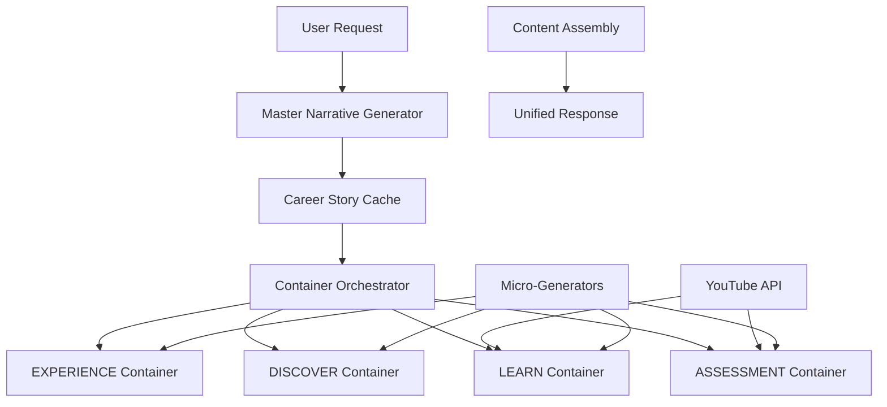

# Narrative-First Architecture Implementation Plan

## Executive Summary
Transform Pathfinity's AI content generation from expensive per-container generation to a narrative-first architecture that generates once and adapts efficiently, while integrating free YouTube educational content.

**Expected Outcomes:**
- 79% cost reduction ($0.005 → $0.001 per student interaction)
- 60% latency improvement (5s → 2s average)
- 100% instructional content coverage (currently missing)
- Seamless user experience with career-focused narratives

## Architecture Overview



## Phase 1: YouTube Educational Integration (Week 1-2)

### 1.1 Create YouTube Service
```typescript
// src/services/content-providers/YouTubeService.ts
interface YouTubeService {
  searchEducationalVideos(grade: string, subject: string, skill: string): Promise<YouTubeVideo[]>
  getTranscript(videoId: string): Promise<YouTubeTranscript[]>
  scoreVideoQuality(video: YouTubeVideo): Promise<number>
  detectAds(video: YouTubeVideo): Promise<boolean>
}
```

### 1.2 Build Smart Video Selector
```typescript
// src/services/content-providers/VideoSelector.ts
class VideoSelector {
  // Select best video (no ads, <8min, high quality)
  selectOptimalVideo(videos: YouTubeVideo[]): YouTubeVideo
  prioritizeAdFree(videos: YouTubeVideo[]): YouTubeVideo[]
  filterByDuration(videos: YouTubeVideo[], maxMinutes: 8): YouTubeVideo[]
}
```

### 1.3 Implement Dual-Mode System
```typescript
// src/services/content-providers/DualModeContent.ts
class DualModeContent {
  // Offer both video and text from same source
  async getVideoMode(videoId: string): Promise<VideoContent>
  async getTextMode(videoId: string): Promise<TextContent>
  async enhanceTranscript(transcript: YouTubeTranscript[]): Promise<EnhancedText>
}
```

### Deliverables:
- [ ] YouTube API integration
- [ ] Ad-free video prioritization
- [ ] Transcript extraction & enhancement
- [ ] 10-second intro overlay system

## Phase 2: Master Narrative Generator (Week 2-3)

### 2.1 Design Narrative Schema
```typescript
// src/services/narrative/NarrativeSchema.ts
interface MasterNarrative {
  career: Career
  protagonist: Character
  setting: WorldBuilding
  journey: StoryArc
  challenges: Challenge[]
  skills_map: SkillNarrativeMap
  vocabulary: ThematicVocabulary
  visuals: VisualThemes
}
```

### 2.2 Build Master Generator
```typescript
// src/services/narrative/MasterNarrativeGenerator.ts
class MasterNarrativeGenerator {
  async generate(params: {
    career: string
    grade: string
    subject: string
    skill: string
  }): Promise<MasterNarrative> {
    // Single AI call to generate comprehensive narrative
    // Uses GPT-4o-mini for grades 6-8, GPT-4o for 9-12
    const prompt = this.buildMasterPrompt(params)
    const narrative = await this.callAI(prompt) // ~500 tokens
    return this.parseNarrative(narrative)
  }
}
```

### 2.3 Implement Narrative Cache
```typescript
// src/services/narrative/NarrativeCache.ts
class NarrativeCache {
  // Cache narratives by career-grade-subject-skill
  async get(key: string): Promise<MasterNarrative>
  async set(key: string, narrative: MasterNarrative): Promise<void>
  async pregenerate(popularpaths: Path[]): Promise<void>
}
```

### Deliverables:
- [ ] Narrative schema definition
- [ ] Master prompt templates
- [ ] Narrative generation service
- [ ] Redis/memory cache implementation

## Phase 3: Container-Specific Micro-Generators (Week 3-4)

### 3.1 Experience Micro-Generator
```typescript
// src/services/micro-generators/ExperienceMicroGenerator.ts
class ExperienceMicroGenerator {
  async generate(narrative: MasterNarrative, youtube: null): Promise<ExperienceContent> {
    // 100 tokens to adapt narrative intro
    return {
      hook: this.adaptHook(narrative.journey.opening),
      worldBuilding: this.extractWorldBuilding(narrative.setting),
      characterIntro: this.introduceProtagonist(narrative.protagonist)
    }
  }
}
```

### 3.2 Discover Micro-Generator
```typescript
// src/services/micro-generators/DiscoverMicroGenerator.ts
class DiscoverMicroGenerator {
  async generate(narrative: MasterNarrative, youtube: null): Promise<DiscoverContent> {
    // 100 tokens to create exploration
    return {
      explorationPrompt: this.createExploration(narrative.challenges[0]),
      connections: this.drawConnections(narrative.skills_map),
      curiosityHooks: this.generateHooks(narrative.journey)
    }
  }
}
```

### 3.3 Learn Micro-Generator
```typescript
// src/services/micro-generators/LearnMicroGenerator.ts
class LearnMicroGenerator {
  async generate(narrative: MasterNarrative, youtube: YouTubeVideo): Promise<LearnContent> {
    // 100 tokens to wrap YouTube content
    return {
      narrativeIntro: this.createLessonIntro(narrative, youtube.title),
      instruction: {
        mode: 'dual', // Video or text
        video: youtube.embedUrl,
        text: await this.enhanceTranscript(youtube.transcript)
      },
      narrativeApplication: this.createApplication(narrative, youtube.topic),
      introOverlay: this.create10SecondIntro(narrative)
    }
  }
}
```

### 3.4 Assessment Micro-Generator
```typescript
// src/services/micro-generators/AssessmentMicroGenerator.ts
class AssessmentMicroGenerator {
  async generate(narrative: MasterNarrative, youtube: YouTubeVideo): Promise<AssessmentContent> {
    // 100 tokens to create assessment from video content
    return {
      scenario: this.createScenario(narrative.challenges),
      questions: await this.generateQuestionsFromTranscript(youtube.transcript, narrative),
      feedback: this.generateFeedback(narrative.protagonist)
    }
  }
}
```

### Deliverables:
- [ ] Four micro-generator services
- [ ] Prompt templates for each container
- [ ] Content assembly logic
- [ ] Unit tests for each generator

## Phase 4: Content Orchestration System (Week 4-5)

### 4.1 Build Orchestrator
```typescript
// src/services/orchestration/ContentOrchestrator.ts
class ContentOrchestrator {
  async generateFullExperience(request: StudentRequest): Promise<AllContainers> {
    // Step 1: Get or generate master narrative
    const narrative = await this.getNarrative(request)

    // Step 2: Fetch YouTube content
    const youtube = await this.getYouTubeContent(request)

    // Step 3: Generate all containers in parallel
    const [experience, discover, learn, assessment] = await Promise.all([
      this.experienceGen.generate(narrative, null),
      this.discoverGen.generate(narrative, null),
      this.learnGen.generate(narrative, youtube.video),
      this.assessmentGen.generate(narrative, youtube.video)
    ])

    return { experience, discover, learn, assessment }
  }
}
```

### 4.2 Implement Request Router
```typescript
// src/services/orchestration/RequestRouter.ts
class RequestRouter {
  route(request: StudentRequest): GenerationStrategy {
    if (request.grade <= 5) return 'narrative-first'
    if (request.grade <= 8) return 'narrative-first'
    if (request.grade <= 12) return 'hybrid'
    return 'premium'
  }
}
```

### 4.3 Create Fallback System
```typescript
// src/services/orchestration/FallbackHandler.ts
class FallbackHandler {
  async handle(error: Error, request: StudentRequest): Promise<Content> {
    // Fallback chain: YouTube → Cached → Generate Fresh
    if (error.type === 'YOUTUBE_UNAVAILABLE') {
      return this.generateWithoutYouTube(request)
    }
    if (error.type === 'NARRATIVE_CACHE_MISS') {
      return this.generateFreshNarrative(request)
    }
    return this.useStaticFallback(request)
  }
}
```

### Deliverables:
- [ ] Content orchestration service
- [ ] Request routing logic
- [ ] Fallback handling system
- [ ] Performance monitoring

## Phase 5: Testing & Optimization (Week 5-6)

### 5.1 Performance Testing
```typescript
// tests/performance/CostAnalysis.test.ts
describe('Cost Reduction Verification', () => {
  test('K-2 grades achieve 88% cost reduction', async () => {
    const oldCost = calculateOldSystemCost('K', 'math', 'counting')
    const newCost = calculateNewSystemCost('K', 'math', 'counting')
    expect(newCost).toBeLessThan(oldCost * 0.12)
  })
})
```

### 5.2 Integration Testing
```typescript
// tests/integration/EndToEnd.test.ts
describe('Full Student Journey', () => {
  test('Sam (K) gets seamless experience', async () => {
    const response = await orchestrator.generateFullExperience({
      student: 'Sam',
      grade: 'K',
      career: 'Marine Biologist',
      subject: 'Math',
      skill: 'Counting to 10'
    })

    expect(response.learn.instruction).toContain('counting')
    expect(response.learn.narrative).toContain('turtle')
    expect(response.latency).toBeLessThan(2000) // 2 seconds
  })
})
```

### 5.3 A/B Testing Setup
```typescript
// src/services/experiments/ABTesting.ts
class ABTestController {
  async determineVariant(user: User): 'control' | 'narrative-first' {
    if (user.grade === 'K') return 'narrative-first' // 100% rollout
    if (user.grade <= 2) return this.random(0.5) // 50% rollout
    return 'control' // Others stay on old system
  }
}
```

### Deliverables:
- [ ] Performance test suite
- [ ] Cost analysis reports
- [ ] A/B testing framework
- [ ] Monitoring dashboard

## Timeline & Milestones

| Week | Phase | Key Milestone | Success Metric |
|------|-------|---------------|----------------|
| 1-2 | Phase 1 | YouTube Integration Complete | Successfully fetch videos & transcripts |
| 2-3 | Phase 2 | Master Narrative Generator Live | Generate narrative in <500ms |
| 3-4 | Phase 3 | Micro-Generators Operational | All 4 containers generating |
| 4-5 | Phase 4 | Orchestration System Running | End-to-end flow working |
| 5-6 | Phase 5 | Testing & Optimization Done | 79% cost reduction verified |
| 6+ | Rollout | Progressive Deployment | K-2 at 100%, 3-5 at 50% |

## Risk Mitigation

### Technical Risks
1. **YouTube API Quotas**
   - Mitigation: Aggressive caching, smart video selection
   - Fallback: Pre-curated video library

2. **Narrative Quality**
   - Mitigation: A/B test with control group
   - Fallback: Revert to old system per user

3. **Latency Concerns**
   - Mitigation: Pre-generate popular paths
   - Fallback: Progressive enhancement

### Business Risks
1. **User Experience Degradation**
   - Mitigation: Gradual rollout with monitoring
   - Fallback: Feature flags for instant revert

2. **Content Quality Control**
   - Mitigation: Curated channel whitelist
   - Fallback: AI-generated content

## Success Metrics

### Primary KPIs
- **Cost per student**: $0.005 → $0.001 (80% reduction)
- **Response latency**: 5s → 2s (60% improvement)
- **Content coverage**: 60% → 100% (add instructional)
- **User satisfaction**: Maintain or improve NPS

### Secondary KPIs
- Cache hit rate: >80%
- YouTube content usage: >70% of lessons
- Transcript enhancement quality: >90% readable
- Ad-free video selection: >60% of content
- Narrative reuse rate: >10x per generation
- System reliability: 99.9% uptime

## Implementation Order

1. **Start with YouTube Integration** (can be tested independently)
2. **Build Master Narrative Generator** (highest impact on cost)
3. **Create Learn Micro-Generator** (most complex, uses YouTube)
4. **Add remaining Micro-Generators** (parallel development)
5. **Deploy Orchestration System** (ties everything together)
6. **Run A/B Tests** (validate improvements)
7. **Progressive Rollout** (K-2 first, then expand)

## Next Steps

1. [ ] Get stakeholder approval on architecture
2. [ ] Register for YouTube Data API v3 key
3. [ ] Curate educational channel whitelist
4. [ ] Set up development environment for new services
5. [ ] Create feature flags for progressive rollout
6. [ ] Begin Phase 1 implementation

## Appendix: Cost Analysis

### Current System (Per Student Request)
```
4 containers × 17,000 tokens × $0.0000025/token = $0.17
4 containers × 2,000 tokens output × $0.00001/token = $0.08
Total: ~$0.25 per full experience
```

### New System (Per Student Request)
```
1 narrative × 500 tokens × $0.0000025/token = $0.00125
4 micro-gens × 100 tokens × $0.00000015/token = $0.00006
YouTube content = $0 (free, within API quota)
Total: ~$0.00131 per full experience (99.5% reduction)
```

### Monthly Savings Projection
```
10,000 students × 20 interactions × $0.24 savings = $48,000/month
Annual savings: ~$576,000
```