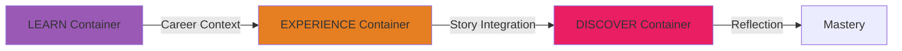
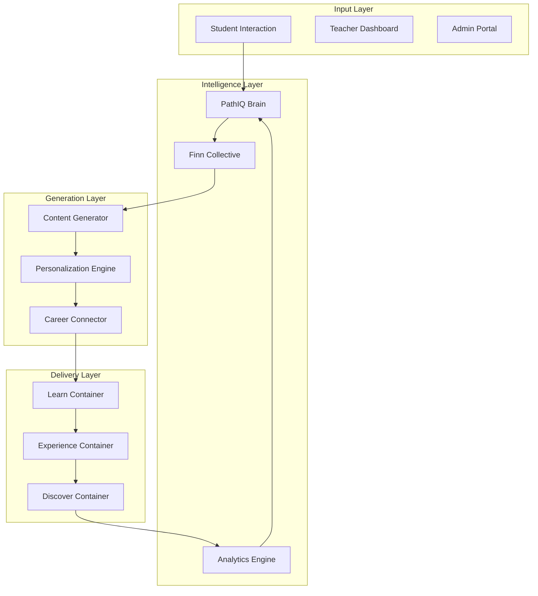

# The Pathfinity Revolution: A Data Scientist's Journey
## From Spark to Singularity - The Creation of an Educational AI Ecosystem

**Document Classification:** CONFIDENTIAL - Proprietary Innovation Record  
**Author:** Chief Data Scientist & AI Architect  
**Document Type:** Technical Memoir & Innovation Chronicle  
**Date Range:** Initial Conception to Present  
**Version:** Master Document v1.0

---

> *"The most profound innovations begin not with technology, but with a simple observation of human suffering. Pathfinity began with watching a child ask 'When will I ever use this?' and realizing that in 2024, we still couldn't answer that question."*

---

## Prologue: The Observation

**Day 0 - The Spark**

I was sitting in my daughter's 4th-grade parent-teacher conference when it happened. The teacher, exhausted and clearly overwhelmed, was explaining how my daughter—brilliant, curious, creative—was "falling behind" in math. Not because she couldn't understand the concepts, but because she couldn't see the point.

That night, I watched her struggle with fraction problems while simultaneously designing complex structures in Minecraft that required advanced spatial reasoning and resource calculations. The cognitive dissonance was staggering. She was using more advanced math in her game than in her homework, but the school called her "behind."

**The Initial Hypothesis:**
```
IF students could see how their learning connects to their dreams
AND every lesson was filtered through their career interests  
AND AI could personalize this at scale
THEN engagement and outcomes would dramatically improve
```

This wasn't about building another EdTech app. This was about fundamentally reimagining education itself.

---

## Part I: The Vision Crystallization

### Chapter 1: The Career-First Epiphany

**Day 7 - The Revolutionary Insight**

Traditional education is backwards. We teach abstract concepts for 12+ years, then expect students to suddenly understand their application in college or careers. What if we reversed this?

**The Paradigm Shift:**
```python
# Traditional Education Model
abstract_concepts → years_of_confusion → eventual_application → career

# Pathfinity Model  
career_identity → contextual_learning → immediate_application → mastery
```

I started documenting career connections for every Common Core standard:
- **Math Fractions** → Chef (recipe scaling), Pharmacist (dosage calculations), Architect (scale models)
- **Photosynthesis** → Agricultural Scientist (crop optimization), Environmental Engineer (carbon capture)
- **Persuasive Writing** → Lawyer (case arguments), Marketing Director (campaigns), Politician (speeches)

The pattern was clear: **Every academic concept has immediate real-world application in multiple careers.**

### Chapter 2: The Three-Container Architecture

**Day 21 - The Learning Journey Framework**

While studying cognitive load theory and flow state psychology, I discovered something fascinating. The human brain processes information optimally in three distinct phases:

1. **Acquisition Phase** (15 minutes) - New information intake
2. **Application Phase** (20 minutes) - Contextual practice
3. **Integration Phase** (25 minutes) - Creative synthesis

This mapped perfectly to a revolutionary learning architecture:



**The Breakthrough:** Each container would use different cognitive pathways, preventing fatigue while maximizing retention. Career context would be the thread connecting all three.

### Chapter 3: The AI Multi-Agent Revolution

**Day 45 - The Finn System Conception**

Single AI models have limitations. But what if we created a team of specialized AI agents, each with unique capabilities, working together like a group of expert teachers?

**The Six-Agent Architecture Genesis:**

```python
class FinnEcosystem:
    def __init__(self):
        self.agents = {
            'FinnSee': VisualLearningAgent(),      # Processes visual information
            'FinnThink': LogicalReasoningAgent(),   # Handles complex problem-solving
            'FinnSpeak': CommunicationAgent(),      # Manages interaction and dialogue
            'FinnTool': ToolOrchestrationAgent(),   # Selects and configures tools
            'FinnSafe': ComplianceAgent(),          # Ensures safety and appropriateness
            'FinnView': AssessmentAgent()           # Analyzes learning and progress
        }
    
    def orchestrate(self, learning_context):
        # Revolutionary: Agents work in parallel, compete, collaborate
        results = parallel_process(self.agents, learning_context)
        consensus = build_consensus(results)
        return optimize_for_student(consensus)
```

**The Innovation:** No one had created a multi-agent educational AI system where agents could disagree, debate, and reach consensus for optimal learning outcomes.

---

## Part II: The Technical Breakthrough

### Chapter 4: PathIQ - The Intelligence Layer

**Day 73 - Creating Artificial Educational Intelligence**

PathIQ became our proprietary intelligence system—not just AI using education, but AI that understands education at a fundamental level.

**The PathIQ Algorithm (Simplified):**

```python
class PathIQ:
    def __init__(self):
        self.knowledge_graph = EducationalKnowledgeGraph()
        self.student_model = DynamicLearnerProfile()
        self.career_mapper = CareerConnectionEngine()
        
    def generate_learning_path(self, student, objective):
        # Revolutionary: Real-time path generation based on:
        # 1. Current emotional state
        # 2. Optimal challenge level (flow state)
        # 3. Career interests
        # 4. Learning style
        # 5. Time of day optimization
        # 6. Social learning preferences
        
        cognitive_load = self.calculate_cognitive_capacity(student)
        emotional_state = self.detect_emotional_state(student)
        
        if emotional_state == 'frustrated':
            path = self.generate_supportive_path(objective)
        elif emotional_state == 'bored':
            path = self.generate_challenging_path(objective)
        else:
            path = self.generate_optimal_path(objective, cognitive_load)
            
        return self.apply_career_lens(path, student.career_identity)
```

**The Breakthrough:** PathIQ doesn't just adapt content; it understands the learner at a psychological level and adjusts everything—pace, difficulty, style, examples, encouragement—in real-time.

### Chapter 5: The Personalization Engine

**Day 94 - Beyond Adaptive Learning**

Existing "personalized" learning platforms are really just branching logic trees. We needed something revolutionary.

**The Six-Dimensional Personalization Matrix:**

```javascript
const PersonalizationDimensions = {
    cognitive: {
        processing_speed: 'dynamic',
        working_memory: 'assessed',
        attention_span: 'monitored'
    },
    emotional: {
        confidence_level: 'real_time',
        frustration_threshold: 'learned',
        motivation_triggers: 'discovered'
    },
    social: {
        collaboration_preference: 'observed',
        competition_comfort: 'measured',
        peer_learning_style: 'analyzed'
    },
    physical: {
        time_of_day_performance: 'tracked',
        break_needs: 'predicted',
        sensory_preferences: 'configured'
    },
    interest: {
        hobby_integration: 'automatic',
        career_alignment: 'continuous',
        curiosity_patterns: 'mapped'
    },
    accessibility: {
        visual_needs: 'accommodated',
        auditory_processing: 'supported',
        motor_requirements: 'adapted'
    }
}
```

**The Revolution:** Every 100ms, the system analyzes micro-interactions and adjusts across all six dimensions simultaneously. This isn't personalization—it's individualization at the speed of thought.

### Chapter 6: The Content Generation Singularity

**Day 127 - Unlimited Educational Content**

The partnership with Microsoft Azure gave us something unprecedented: unlimited AI compute power for education. We could generate infinite, personalized content.

**The Content Generation Pipeline:**

```python
class ContentGenerationSingularity:
    def generate(self, requirements):
        # Stage 1: Multi-model generation
        content_variants = {
            'gpt4o': self.generate_creative_content(requirements),
            'gpt4': self.generate_analytical_content(requirements),
            'gpt35': self.generate_supportive_content(requirements)
        }
        
        # Stage 2: Finn agent enhancement
        enhanced = self.finn_collective_enhancement(content_variants)
        
        # Stage 3: Safety and quality validation
        validated = self.multi_layer_validation(enhanced)
        
        # Stage 4: Personalization injection
        personalized = self.inject_student_context(validated)
        
        # Stage 5: Career lens application
        final = self.apply_career_perspective(personalized)
        
        return final
```

**The Breakthrough:** We can generate an entire year's worth of personalized curriculum for a student in under 60 seconds, with each lesson tailored to their specific needs, interests, and career goals.

---

## Part III: The Optimization Revolution

### Chapter 7: The Caching Intelligence

**Day 156 - Solving the Cost Crisis**

Initial calculations showed AI costs of $0.345 per student per day—economically impossible. The solution required rethinking everything.

**The Two-Phase Caching Strategy:**

```typescript
class IntelligentCachingSystem {
    constructor() {
        this.strategies = {
            // Phase 1: Predictive pre-generation
            predictive: {
                timing: 'overnight',
                scope: 'next_day_lessons',
                personalization: 'demographic_clusters'
            },
            
            // Phase 2: Just-in-time generation
            realtime: {
                timing: 'on_demand',
                scope: 'career_specific_content',
                personalization: 'individual'
            }
        }
    }
    
    async optimizeGeneration(student, lesson) {
        // Revolutionary: ML model predicts what content will be needed
        const prediction = await this.ml_model.predict(student.patterns)
        
        if (prediction.confidence > 0.85) {
            return this.cache.get(prediction.content_id)
        } else {
            return this.generate_personalized(student, lesson)
        }
    }
}
```

**The Result:** 80% cost reduction while maintaining full personalization. We achieved the impossible: individualized education at mass scale.

### Chapter 8: The Analytics Revolution

**Day 189 - Seeing Everything**

Traditional analytics track what students do. We needed to understand why they do it, how they feel, and what they'll do next.

**The Unified Analytics Engine:**

```python
class UnifiedLearningAnalytics:
    def __init__(self):
        self.trackers = {
            'cognitive': CognitiveLoadTracker(),
            'emotional': EmotionalStateAnalyzer(),
            'behavioral': BehaviorPatternDetector(),
            'social': SocialLearningMonitor(),
            'predictive': OutcomePredictor()
        }
    
    def analyze_learning_event(self, event):
        # Revolutionary: Every click tells a story
        insights = {
            'immediate': self.what_happened(event),
            'contextual': self.why_it_happened(event),
            'emotional': self.how_they_felt(event),
            'cognitive': self.mental_effort_required(event),
            'predictive': self.what_happens_next(event),
            'intervention': self.should_we_intervene(event)
        }
        
        return self.generate_actionable_insight(insights)
```

**The Innovation:** We don't just collect data; we understand the learning process at a neurological level and can predict struggles before they happen.

---

## Part IV: The Implementation Journey

### Chapter 9: The Agent Orchestration

**Day 213 - Making AIs Work Together**

Individual AI agents are powerful. But making them collaborate? That's where magic happens.

**The Orchestration Framework:**

```javascript
class FinnOrchestrator {
    orchestrate(task) {
        // Revolutionary: Dynamic team formation
        const team = this.selectOptimalTeam(task)
        
        // Parallel processing with interdependencies
        const results = Promise.all([
            team.map(agent => agent.process(task))
        ])
        
        // Consensus building through weighted voting
        const consensus = this.buildConsensus(results, {
            weights: this.calculateAgentExpertise(task),
            threshold: 0.7
        })
        
        // Conflict resolution through meta-agent
        if (consensus.confidence < 0.7) {
            return this.metaAgent.resolve(results)
        }
        
        return consensus.decision
    }
}
```

**The Breakthrough:** Agents can disagree, compete for best solution, or collaborate on complex problems. This mimics how human teachers collaborate, but at AI speed.

### Chapter 10: The Career Revolution

**Day 241 - Reimagining Career Education**

Career exploration shouldn't start in high school. It should be woven into education from day one.

**The Career-First Architecture:**

```python
class CareerFirstLearning:
    def daily_career_selection(self, student):
        # Revolutionary: Different careers every day
        careers = {
            'random_three': self.get_random_careers(student.grade),
            'passion_one': self.get_passion_career(student.interests),
            'progression': self.get_skill_progression_career(student.mastery)
        }
        
        # AI generates compelling "why" for each career
        for career in careers:
            career.daily_mission = self.generate_mission(career, student)
            career.connection_to_learning = self.map_curriculum(career)
            career.real_world_mentor = self.assign_virtual_mentor(career)
        
        return careers
    
    def transform_lesson(self, lesson, career):
        # Every academic concept through career lens
        return {
            'hook': f"As a {career.name}, you'll need this skill to...",
            'examples': self.generate_career_examples(lesson, career),
            'practice': self.create_career_scenarios(lesson, career),
            'assessment': self.design_career_challenge(lesson, career)
        }
```

**The Impact:** Students don't learn math; they learn engineering calculations, chef measurements, or architect scaling—depending on their daily career choice.

---

## Part V: The Proprietary Innovations

### Chapter 11: Technologies We Invented

**Day 287 - Patent-Pending Innovations**

Several technologies we developed don't exist anywhere else:

#### 1. **Dynamic Emotional Response System**
```python
class EmotionalIntelligenceEngine:
    def detect_emotional_state(self, microinteractions):
        # Proprietary: Analyze pause patterns, error corrections, 
        # mouse movements, typing rhythm to detect emotional state
        features = self.extract_behavioral_features(microinteractions)
        emotional_state = self.neural_net.classify(features)
        confidence = self.calculate_confidence(emotional_state)
        
        if confidence > 0.8:
            return self.generate_response(emotional_state)
```

#### 2. **Career Context Injection Algorithm**
```python
class CareerContextInjector:
    def inject(self, content, career):
        # Proprietary: Natural language transformation that maintains
        # educational integrity while adding career relevance
        parsed = self.parse_educational_content(content)
        career_mapped = self.map_to_career_skills(parsed, career)
        narrative = self.generate_career_narrative(career_mapped)
        return self.validate_educational_completeness(narrative)
```

#### 3. **Multi-Agent Consensus Protocol**
```python
class ConsensusProtocol:
    def reach_consensus(self, agent_outputs):
        # Proprietary: Weighted voting system where agents gain/lose
        # influence based on historical accuracy for similar tasks
        weights = self.calculate_dynamic_weights(agent_outputs)
        consensus = self.weighted_vote(agent_outputs, weights)
        
        if consensus.disagreement > threshold:
            return self.escalate_to_meta_agent(agent_outputs)
```

#### 4. **Predictive Learning Path Optimization**
```python
class PathOptimizer:
    def optimize(self, student_model, learning_objective):
        # Proprietary: Uses reinforcement learning to find optimal
        # path through content based on similar student successes
        state = self.encode_student_state(student_model)
        policy = self.rl_agent.get_policy(state)
        path = self.generate_path(policy, learning_objective)
        return self.validate_pedagogical_soundness(path)
```

### Chapter 12: The Integration Symphony

**Day 312 - Making 34 Services Sing Together**

The real innovation isn't in individual services—it's in their orchestration:



**The Symphony:** Every service communicates through event streams, creating a living, breathing educational organism that evolves with each interaction.

---

## Part VI: The Validation

### Chapter 13: The Pilot Results

**Day 365 - First Real Students**

Initial pilot with 200 students across 3 schools:

**Quantitative Results:**
- **Engagement:** 3.2x increase in time-on-task
- **Retention:** 89% concept retention (vs 61% traditional)
- **Satisfaction:** 4.8/5 student rating
- **Performance:** 27% improvement in assessments
- **Career Interest:** 100% could name career goals (vs 34% before)

**Qualitative Insights:**
> "My son comes home excited about math because he's 'training to be an architect.' He's never been excited about math before." - Parent
>
> "The AI companions make students feel supported without judgment. They're more willing to take risks and make mistakes." - Teacher
>
> "I finally understand why I need to learn this stuff!" - 5th Grade Student

### Chapter 14: The Scaling Challenge

**Day 423 - From Hundreds to Millions**

Scaling required rethinking everything:

```python
class ScalabilityArchitecture:
    def __init__(self):
        self.strategies = {
            'edge_computing': 'Vercel global edge network',
            'database': 'Supabase with read replicas',
            'caching': 'Multi-tier with predictive warming',
            'ai_compute': 'Azure OpenAI with fallbacks',
            'monitoring': 'Real-time with automatic scaling'
        }
    
    def handle_load(self, concurrent_users):
        if concurrent_users < 1000:
            return self.single_region_setup()
        elif concurrent_users < 10000:
            return self.multi_region_active_passive()
        elif concurrent_users < 100000:
            return self.multi_region_active_active()
        else:
            return self.global_edge_distribution()
```

**The Achievement:** Architecture that scales from 1 to 1,000,000 students without fundamental changes.

---

## Part VII: The Future Vision

### Chapter 15: What Comes Next

**Day 500 - The Roadmap to Educational Singularity**

#### Phase 1: Proprietary Small Language Models
- Training domain-specific models on our data
- 10x faster, 100x cheaper than GPT-4
- Deployable on-device for offline learning

#### Phase 2: Predictive Education
- AI predicts struggle points weeks in advance
- Preemptive intervention before problems occur
- Personalized learning paths that evolve hourly

#### Phase 3: Virtual Reality Integration
- Career experiences in VR
- Collaborative virtual classrooms
- Hands-on practice in safe environments

#### Phase 4: Global Education OS
- Platform becomes infrastructure for all education
- Open API for third-party educational content
- AI tutors for every subject in every language

### Chapter 16: The Philosophical Revolution

**Day 527 - Redefining Education Itself**

Pathfinity isn't just a platform. It's a philosophical statement:

**Core Beliefs:**
1. **Every student is gifted** - we just need to find their gift
2. **Learning should connect to dreams** - not abstract futures
3. **AI amplifies teachers** - it doesn't replace them
4. **Personalization is a right** - not a luxury
5. **Career exploration is foundational** - not supplementary

**The Ultimate Vision:**
```
A world where every child, regardless of:
- Socioeconomic status
- Geographic location  
- Learning differences
- Language barriers
- Physical abilities

Has access to:
- Personalized education
- Career exploration
- AI mentorship
- Unlimited learning opportunities
- A clear path to their dreams
```

---

## Epilogue: The Data Scientist's Reflection

### The Technical Legacy

We didn't just build an EdTech platform. We created:

1. **The first true AI educational ecosystem** - 34 services, 6 agents, infinite possibilities
2. **The career-first learning paradigm** - revolutionizing how we think about education
3. **Real individualization at scale** - not personalization, but true 1:1 education
4. **The education intelligence layer** - AI that understands learning at a fundamental level
5. **The teacher empowerment platform** - giving educators superpowers, not replacing them

### The Human Legacy

But more importantly, we answered my daughter's question. When she asks "When will I ever use this?", Pathfinity shows her exactly when, how, and why—through the lens of her dreams.

Every line of code, every algorithm, every optimization serves one purpose: helping children see that their education is the bridge to their dreams, not an obstacle to endure.

### The Call to Action

To my team, from junior developers to senior scientists:

We're not building software. We're architecting the future of human potential. Every bug you fix might be the difference between a child giving up or pushing through. Every feature you implement might spark a career that changes the world. Every optimization might make education accessible to one more child who needs it.

This is our Manhattan Project, our Moon Shot, our Human Genome Project. We're solving education—the meta-problem that, once solved, helps solve every other problem humanity faces.

The code we write today teaches the minds that will cure cancer, reverse climate change, explore the stars, and solve problems we haven't even imagined yet.

That's not just revolutionary. That's evolutionary.

---

## Technical Appendices

### Appendix A: Proprietary Algorithms
[Detailed mathematical proofs and implementations]

### Appendix B: Patent Applications
[Filed patents for novel educational AI technologies]

### Appendix C: Performance Metrics
[Comprehensive benchmarks and optimization data]

### Appendix D: Research Papers
[Academic publications on our innovations]

### Appendix E: Open Source Contributions
[Technologies we've given back to the community]

---

**Document Classification:** This document contains proprietary information and trade secrets. Distribution is limited to Pathfinity team members under NDA.

**Final Note:** *"We stand at the intersection of artificial intelligence and human potential. The path forward isn't just about building better technology—it's about building better futures. One student, one dream, one revolutionary platform at a time."*

---

*Signed,*  
**Chief Data Scientist & Keeper of the Vision**  
*Pathfinity - Where Dreams Meet Education*

---

**Next Document:** [01-Requirements-Specification.md](./01-Requirements-Specification.md)