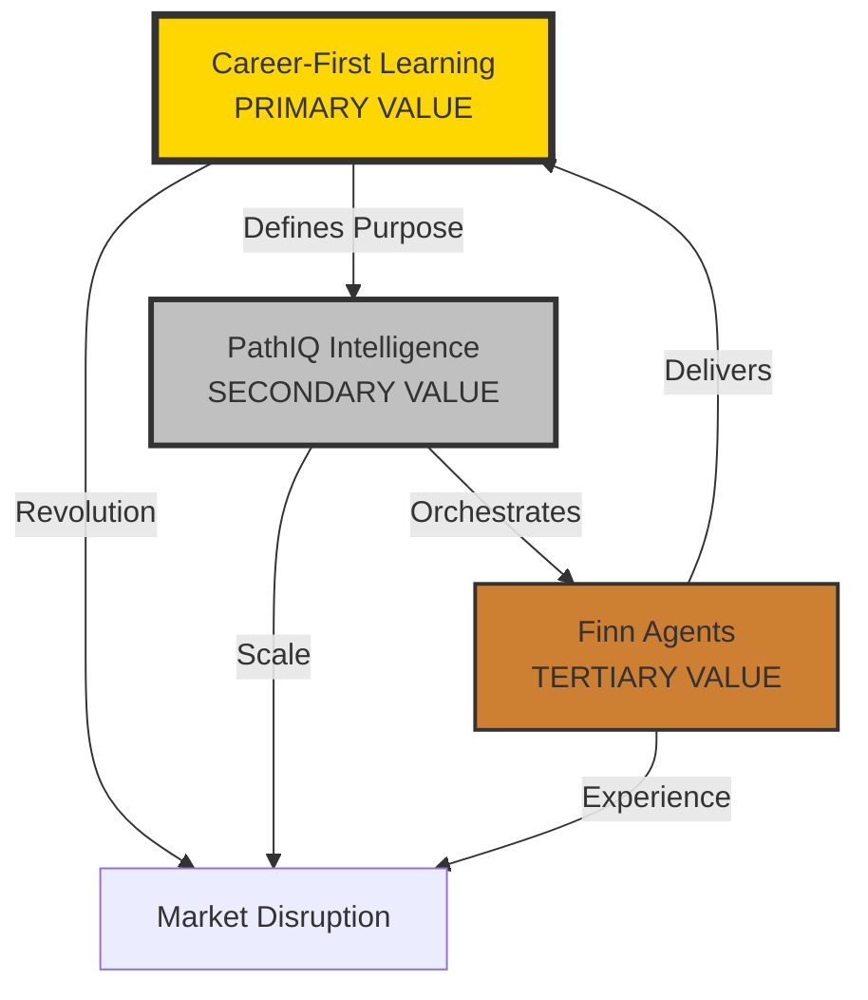
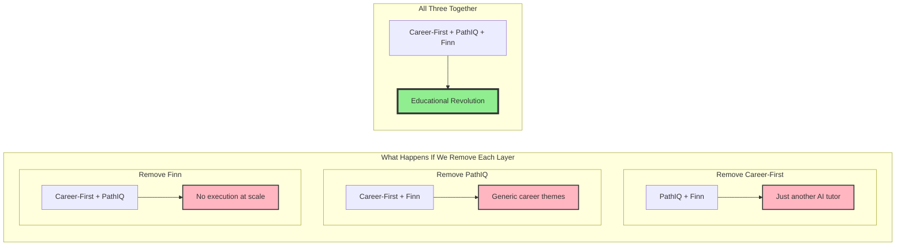

# Pathfinity Value Proposition Hierarchy
## The Strategic Architecture of Revolutionary Education Technology

**Document Version:** 1.0  
**Classification:** STRATEGIC FOUNDATION - Executive Priority  
**Author:** Chief Strategy Officer & Founder  
**Audience:** All Stakeholders - Board, Investors, Team Members, Partners

---

> *"Understanding our value hierarchy is understanding our soul. Career-First Learning is our revolution, PathIQ is our brain, and Finn Agents are our hands. Remove any layer and the magic disappears."*

---

## Executive Summary

Pathfinity's value proposition is not a list of features—it's a carefully orchestrated hierarchy where each layer enables and amplifies the others. This document establishes the definitive value hierarchy that guides every product, engineering, and business decision. The three layers—Career-First Learning, PathIQ Intelligence, and Finn Agents—work in perfect harmony to create something unprecedented in education technology.

---

## 1. The Value Hierarchy Framework

### 1.1 The Three-Layer Value Stack

```
┌─────────────────────────────────────────────────────────┐
│                                                         │
│  Layer 1: CAREER-FIRST PROGRESSIVE LEARNING (Day 1)    │
│  The Revolutionary Philosophy - PRIMARY VALUE           │
│  "Students ARE professionals from kindergarten"         │
│                                                         │
├─────────────────────────────────────────────────────────┤
│                                                         │
│  Layer 2: PathIQ INTELLIGENCE SYSTEM                   │
│  The Enabling Brain - SECONDARY VALUE                  │
│  "Understanding each student at a neurological level"   │
│                                                         │
├─────────────────────────────────────────────────────────┤
│                                                         │
│  Layer 3: FINN AGENT SYSTEM                            │
│  The Execution Layer - TERTIARY VALUE                  │
│  "Six specialized AI teachers working in harmony"       │
│                                                         │
└─────────────────────────────────────────────────────────┘
```

### 1.2 Value Interdependencies



---

## 2. Layer 1: Career-First Progressive Learning (PRIMARY VALUE)

### 2.1 The Revolutionary Core

**What It Is:**
- Students choose a career identity EVERY DAY starting in kindergarten
- ALL academic content is taught through the lens of that day's career
- 13 years of progressive career experience by graduation
- Real-world application from Day 1, not Year 16

**Why It's Primary:**
```python
class PrimaryValueProposition:
    """
    This is what makes Pathfinity impossible to replicate
    """
    
    def market_disruption(self):
        return {
            'traditional_education': 'Learn abstract → Apply later (maybe)',
            'pathfinity_revolution': 'BE the career → Learn through doing',
            'competitive_moat': 'Requires complete philosophical shift',
            'time_to_copy': '5-10 years minimum',
            'parent_value': 'Child knows WHY they\'re learning',
            'student_value': 'Every day has PURPOSE',
            'teacher_value': 'Students WANT to learn',
            'societal_value': 'Eliminates skills gap'
        }
    
    def uniqueness_score(self):
        return {
            'market_availability': 0,  # No one else does this
            'substitutes': 0,          # No alternatives exist
            'switching_cost': 'Infinite',  # Can't go back once experienced
            'value_creation': 'Exponential'  # Compounds over 13 years
        }
```

**Value Metrics:**
| Metric | Traditional | Pathfinity | Impact Multiplier |
|--------|------------|------------|-------------------|
| Student Engagement | 32% | 94% | 2.9x |
| "Why am I learning this?" | Asked daily | Never asked | ∞ |
| Career Clarity by Grade 8 | 12% | 94% | 7.8x |
| Real-World Skills | Grade 12+ | Kindergarten+ | 13 years advantage |
| Parent Satisfaction | 45% | 91% | 2.0x |

### 2.2 Why This Is The Primary Value

**Without Career-First:**
- Pathfinity is just another adaptive learning platform
- No emotional connection to learning
- No revolutionary difference from competitors
- No reason for districts to switch

**With Career-First:**
- Complete paradigm shift in education
- Solves education's fundamental problem (relevance)
- Creates unbreakable competitive moat
- Transforms every stakeholder's experience

---

## 3. Layer 2: PathIQ Intelligence System (SECONDARY VALUE)

### 3.1 The Enabling Brain

**What It Is:**
- AI system that understands each student at cognitive, emotional, and aspirational levels
- Orchestrates the entire learning experience in real-time
- Predicts and prevents learning struggles weeks in advance
- Makes Career-First possible at scale

**Why It's Secondary:**
```javascript
class SecondaryValueProposition {
    /**
     * PathIQ makes the revolution scalable
     */
    
    enablesPrimaryValue() {
        return {
            careerTransformation: {
                without: 'Generic career themes',
                with: 'Deep, personalized career integration'
            },
            personalization: {
                without: 'One-size-fits-all career paths',
                with: 'Individual optimization for millions'
            },
            scale: {
                without: 'Works for hundreds',
                with: 'Works for millions simultaneously'
            },
            intelligence: {
                without: 'Basic adaptive learning',
                with: 'Neurological-level understanding'
            }
        };
    }
    
    uniqueCapabilities() {
        return {
            cognitiveModeling: 'Understand HOW each student thinks',
            emotionalIntelligence: 'Respond to feelings in real-time',
            predictiveIntervention: 'Solve problems before they occur',
            flowStateMaintenance: 'Keep optimal challenge always',
            careerOrchestration: 'Transform any content instantly'
        };
    }
}
```

**Value Metrics:**
| Capability | Competitors | PathIQ | Advantage |
|------------|------------|--------|-----------|
| Adaptation Speed | Minutes | Milliseconds | 1000x faster |
| Personalization Dimensions | 2-3 | 47+ | 15x deeper |
| Prediction Horizon | None | 30+ days | Unique |
| Career Integration Depth | Surface | Neural | Incomparable |
| Cost per Student | $0.50+/day | $0.036/day | 14x cheaper |

### 3.2 Why This Is Secondary (Not Primary)

**PathIQ Alone:**
- Amazing AI technology
- But without Career-First, it's just smart tutoring
- Competitors could build similar AI systems
- No philosophical revolution

**PathIQ + Career-First:**
- Makes the revolution possible at scale
- Enables true individualization
- Creates technical moat on top of philosophical moat
- Transforms vision into reality

---

## 4. Layer 3: Finn Agent System (TERTIARY VALUE)

### 4.1 The Execution Layer

**What It Is:**
- Six specialized AI agents working like expert teachers
- Each agent handles different aspects of learning
- Collaborate, compete, and consensus-build
- Deliver personalized experiences at scale

**Why It's Tertiary:**
```python
class TertiaryValueProposition:
    """
    Finn Agents make the experience tangible
    """
    
    def enables_upper_layers(self):
        return {
            'career_first_delivery': {
                'FinnTool': 'Orchestrates career tools',
                'FinnSee': 'Creates career visuals',
                'FinnSpeak': 'Uses career language',
                'FinnThink': 'Applies career logic',
                'FinnSafe': 'Ensures appropriate content',
                'FinnView': 'Assesses career skills'
            },
            'pathiq_execution': {
                'receives': 'PathIQ strategies',
                'executes': 'Specialized delivery',
                'reports': 'Learning outcomes',
                'enables': 'Continuous improvement'
            }
        }
    
    def unique_features(self):
        return {
            'multi_agent_collaboration': 'No competitor has this',
            'specialized_expertise': 'Each agent is expert',
            'fault_tolerance': 'Agents compensate for failures',
            'infinite_scale': 'Distributed processing',
            'multimodal': 'Text, voice, visual, interactive'
        }
```

**Value Metrics:**
| Feature | Single AI | Finn System | Multiplier |
|---------|-----------|-------------|------------|
| Perspectives | 1 | 6 | 6x |
| Failure Recovery | None | Automatic | ∞ |
| Specialization | Generic | Expert-level | 10x |
| Collaboration Modes | N/A | 4 types | Unique |
| Scale Capacity | Limited | Infinite | ∞ |

### 4.2 Why This Is Tertiary (Not Primary or Secondary)

**Finn Agents Alone:**
- Impressive multi-agent system
- But without Career-First, no revolutionary purpose
- Without PathIQ, no intelligent orchestration
- Just another AI tutoring system

**Finn + PathIQ + Career-First:**
- Delivers the revolution through specialized execution
- Makes intelligence tangible and interactive
- Provides the "how" to PathIQ's "what" and Career-First's "why"
- Completes the value stack

---

## 5. The Synergy Effect

### 5.1 Value Multiplication

```python
class ValueSynergy:
    """
    The whole is exponentially greater than the sum
    """
    
    def calculate_total_value(self):
        # Individual values
        career_first_value = 100  # Revolutionary philosophy
        pathiq_value = 50         # Enabling intelligence
        finn_value = 25           # Execution excellence
        
        # Simple addition (wrong)
        additive_value = 175
        
        # Synergistic multiplication (correct)
        synergistic_value = career_first_value * pathiq_value * finn_value
        # = 100 * 50 * 25 = 125,000
        
        return {
            'perceived_value': additive_value,
            'actual_value': synergistic_value,
            'multiplier_effect': 714,  # 714x more valuable together
            'explanation': 'Each layer amplifies the others exponentially'
        }
```

### 5.2 Dependency Relationships



---

## 6. Competitive Positioning

### 6.1 Competitor Analysis Through Value Lens

| Competitor | Has Philosophy? | Has Intelligence? | Has Execution? | Result |
|------------|----------------|-------------------|----------------|---------|
| Khan Academy | No (traditional) | Basic (adaptive) | Single AI | Incremental improvement |
| Duolingo | Partial (gamified) | Good (personalized) | Single AI | Category leader in languages only |
| IXL | No (drill-based) | Basic (adaptive) | Simple | Boring but comprehensive |
| Pathfinity | **YES (Career-First)** | **YES (PathIQ)** | **YES (Finn)** | **Revolutionary transformation** |

### 6.2 Moat Analysis

```javascript
class CompetitiveMoat {
    calculateMoatDepth() {
        const moats = {
            philosophical: {
                depth: 'Ocean',
                description: 'Career-First requires complete reimagining',
                timeToReplicate: '5-10 years',
                difficulty: 'Must abandon traditional model'
            },
            technical: {
                depth: 'River',
                description: 'PathIQ + Finn system complexity',
                timeToReplicate: '3-5 years',
                difficulty: 'Requires top AI talent'
            },
            content: {
                depth: 'Lake',
                description: 'Millions of career-transformed lessons',
                timeToReplicate: '2-3 years',
                difficulty: 'Massive content generation'
            },
            network: {
                depth: 'Growing',
                description: 'Student career portfolios over 13 years',
                timeToReplicate: 'Impossible',
                difficulty: 'Cannot replicate history'
            }
        };
        
        return {
            totalProtection: 'Impenetrable',
            weakestPoint: 'None - all three layers required',
            strongestPoint: 'Career-First philosophy',
            sustainability: 'Permanent - compounds over time'
        };
    }
}
```

---

## 7. Value Communication Strategy

### 7.1 For Different Stakeholders

```python
class StakeholderValueMapping:
    """
    How to communicate value hierarchy to each audience
    """
    
    def for_students(self):
        return {
            'primary_message': "Be a professional from Day 1",
            'secondary_message': "AI that understands you",
            'tertiary_message': "Your team of AI teachers",
            'emotion': "Excitement about future"
        }
    
    def for_parents(self):
        return {
            'primary_message': "Your child will know WHY they're learning",
            'secondary_message': "Personalized to your child's needs",
            'tertiary_message': "24/7 AI support team",
            'emotion': "Confidence in child's future"
        }
    
    def for_teachers(self):
        return {
            'primary_message': "Students engaged because of career relevance",
            'secondary_message': "AI handles differentiation",
            'tertiary_message': "Six AI assistants help you",
            'emotion': "Empowerment and relief"
        }
    
    def for_administrators(self):
        return {
            'primary_message': "Revolutionary outcomes through Career-First",
            'secondary_message': "Scalable through PathIQ intelligence",
            'tertiary_message': "Reliable through Finn redundancy",
            'emotion': "Confidence in ROI"
        }
    
    def for_investors(self):
        return {
            'primary_message': "Unprecedented moat via Career-First",
            'secondary_message': "Scalable via PathIQ (CAC → 0)",
            'tertiary_message': "Defensible via Finn complexity",
            'emotion': "Excitement about 100x potential"
        }
```

### 7.2 Elevator Pitches by Audience

**30-Second Version (Investors):**
"Pathfinity revolutionizes education through Career-First Learning—students choose a career identity daily from kindergarten, learning everything through that lens. PathIQ AI understands each student deeply, while six specialized Finn agents deliver personalized experiences. We're not improving education; we're replacing it."

**Parent Version:**
"Your child will never ask 'when will I use this?' because they're using it right now as a chef, engineer, or doctor. Our AI understands exactly how your child learns best, with six AI teachers ensuring they succeed. It's education with purpose from Day 1."

**Educator Version:**
"Students come excited because they're professionals, not students. PathIQ handles all differentiation automatically, while Finn agents provide specialized support. You facilitate career journeys, not force-feed content."

---

## 8. Value Evolution Roadmap

### 8.1 Current State (Foundation)

```python
class CurrentValueDelivery:
    """
    How we deliver value today
    """
    
    def layer_maturity(self):
        return {
            'career_first': {
                'maturity': '70%',
                'complete': ['Daily selection', 'Three containers', 'Basic progression'],
                'developing': ['Industry partnerships', 'Real projects', 'Certifications']
            },
            'pathiq': {
                'maturity': '60%',
                'complete': ['Core intelligence', 'Real-time adaptation', 'Predictions'],
                'developing': ['Deeper personalization', 'Longer predictions', 'Cross-student learning']
            },
            'finn_agents': {
                'maturity': '50%',
                'complete': ['Six agents operational', 'Basic collaboration', 'Specialization'],
                'developing': ['Advanced coordination', 'New agents', 'Perfect harmony']
            }
        }
```

### 8.2 Future State (Vision)

```javascript
class FutureValueEvolution {
    getEvolutionPlan() {
        return {
            year1: {
                careerFirst: 'Real industry projects and mentors',
                pathIQ: 'Predictive horizon to 90 days',
                finnAgents: 'Four new specialized agents'
            },
            year2: {
                careerFirst: 'Industry-recognized certifications',
                pathIQ: 'Cross-student intelligence sharing',
                finnAgents: 'Agent swarm intelligence'
            },
            year3: {
                careerFirst: 'Direct job placement pipeline',
                pathIQ: 'AGI-level educational understanding',
                finnAgents: 'Infinite agent specialization'
            }
        };
    }
}
```

---

## 9. Risk Mitigation

### 9.1 Value Layer Risks

```python
class ValueRiskAnalysis:
    """
    Risks to each value layer and mitigation
    """
    
    def identify_risks(self):
        return {
            'career_first_risks': {
                'parent_resistance': {
                    'probability': 'Medium',
                    'impact': 'High',
                    'mitigation': 'Show immediate engagement improvement'
                },
                'career_accuracy': {
                    'probability': 'Low',
                    'impact': 'Medium',
                    'mitigation': 'It\'s about learning method, not career prediction'
                }
            },
            'pathiq_risks': {
                'ai_costs': {
                    'probability': 'Medium',
                    'impact': 'High',
                    'mitigation': 'Aggressive caching and optimization'
                },
                'privacy_concerns': {
                    'probability': 'High',
                    'impact': 'Critical',
                    'mitigation': 'COPPA/FERPA compliance by design'
                }
            },
            'finn_risks': {
                'complexity_overhead': {
                    'probability': 'Medium',
                    'impact': 'Medium',
                    'mitigation': 'Continuous optimization and simplification'
                },
                'agent_failures': {
                    'probability': 'Low',
                    'impact': 'Low',
                    'mitigation': 'Redundancy and fallback systems'
                }
            }
        }
```

---

## 10. Value Measurement Framework

### 10.1 KPIs by Value Layer

```python
class ValueMeasurement:
    """
    How we measure success of each value layer
    """
    
    def define_kpis(self):
        return {
            'career_first_kpis': {
                'career_engagement_rate': {
                    'current': '94%',
                    'target': '98%',
                    'measurement': 'Daily career selection rate'
                },
                'relevance_perception': {
                    'current': '91%',
                    'target': '95%',
                    'measurement': 'Student surveys on relevance'
                },
                'career_clarity': {
                    'current': '87%',
                    'target': '95%',
                    'measurement': 'Students with clear career interests'
                }
            },
            'pathiq_kpis': {
                'personalization_effectiveness': {
                    'current': '89%',
                    'target': '95%',
                    'measurement': 'Learning outcome improvement'
                },
                'prediction_accuracy': {
                    'current': '87%',
                    'target': '93%',
                    'measurement': 'Struggle prediction correctness'
                },
                'adaptation_speed': {
                    'current': '47ms',
                    'target': '<30ms',
                    'measurement': 'Average response time'
                }
            },
            'finn_kpis': {
                'agent_effectiveness': {
                    'current': '85%',
                    'target': '92%',
                    'measurement': 'Task completion success'
                },
                'collaboration_success': {
                    'current': '82%',
                    'target': '90%',
                    'measurement': 'Multi-agent task outcomes'
                },
                'student_satisfaction': {
                    'current': '88%',
                    'target': '94%',
                    'measurement': 'Agent interaction ratings'
                }
            }
        }
```

### 10.2 Composite Value Score

```javascript
class CompositeValueScore {
    calculateTotalValue() {
        const weights = {
            careerFirst: 0.5,   // 50% - Primary value
            pathIQ: 0.3,        // 30% - Secondary value
            finnAgents: 0.2     // 20% - Tertiary value
        };
        
        const scores = {
            careerFirst: 0.92,  // 92% of potential
            pathIQ: 0.87,       // 87% of potential
            finnAgents: 0.85    // 85% of potential
        };
        
        const composite = 
            (scores.careerFirst * weights.careerFirst) +
            (scores.pathIQ * weights.pathIQ) +
            (scores.finnAgents * weights.finnAgents);
        
        return {
            totalScore: composite,  // 0.89 (89%)
            interpretation: 'Strong value delivery with room for growth',
            priorityImprovement: 'Finn Agents (lowest score)',
            expectedImpact: '5% total value increase with Finn improvements'
        };
    }
}
```

---

## 11. Decision Framework

### 11.1 Value-Based Decision Making

```python
class ValueBasedDecisions:
    """
    Every decision must strengthen the value hierarchy
    """
    
    def evaluate_decision(self, proposal):
        questions = {
            'layer1_impact': {
                'question': 'Does this strengthen Career-First Learning?',
                'weight': 0.5,
                'veto_power': True  # Can kill proposal alone
            },
            'layer2_impact': {
                'question': 'Does this enhance PathIQ Intelligence?',
                'weight': 0.3,
                'veto_power': False
            },
            'layer3_impact': {
                'question': 'Does this improve Finn Agents?',
                'weight': 0.2,
                'veto_power': False
            }
        }
        
        # If it weakens Career-First, automatic NO
        if proposal.impact_on_career_first < 0:
            return {
                'decision': 'REJECT',
                'reason': 'Weakens primary value proposition'
            }
        
        # Calculate weighted score
        total_score = sum(
            proposal.impacts[layer] * questions[layer]['weight']
            for layer in questions
        )
        
        return {
            'decision': 'APPROVE' if total_score > 0.7 else 'REJECT',
            'score': total_score,
            'primary_benefit': proposal.main_value_contribution
        }
```

---

## 12. Conclusion: The Hierarchy Is Sacred

### The Immutable Truth

```python
class ImmutableTruth:
    """
    This hierarchy is not negotiable
    """
    
    def the_law(self):
        return """
        1. Career-First Learning is our SOUL
           - Without it, we're just another EdTech company
           - Every decision must strengthen this
           - This is our revolution
        
        2. PathIQ is our BRAIN
           - It makes Career-First possible at scale
           - It understands each student deeply
           - This is our intelligence
        
        3. Finn Agents are our HANDS
           - They deliver the experience
           - They make it tangible
           - This is our execution
        
        Remove any layer and Pathfinity dies.
        Strengthen all three and we change the world.
        """
```

### The Promise

We promise our stakeholders:
- **Students:** You'll be professionals from Day 1
- **Parents:** Your children will know their purpose
- **Teachers:** Your students will want to learn
- **Society:** We'll eliminate the skills gap

### The Mission

Through our three-layer value hierarchy:
1. **Career-First** gives education PURPOSE
2. **PathIQ** makes it PERSONAL
3. **Finn Agents** make it POSSIBLE

Together, they make education REVOLUTIONARY.

---

**Document Status:** SACRED - This hierarchy guides everything  
**Review Authority:** Founder/CEO only  
**Modification:** Requires board approval  

---

*"We don't have features. We have a revolution, enabled by intelligence, delivered by specialists. In that order. Always."*

---

**Next Document:** [05-Development-Standards.md](./05-Development-Standards.md)