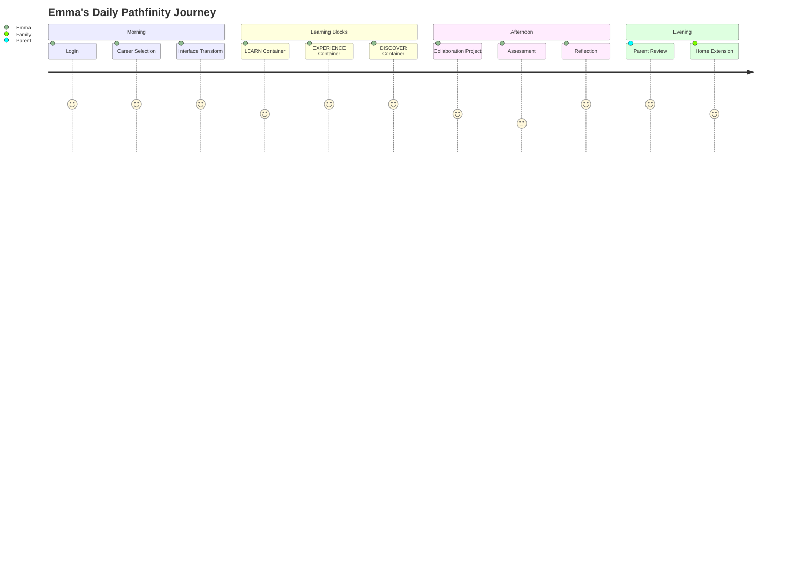
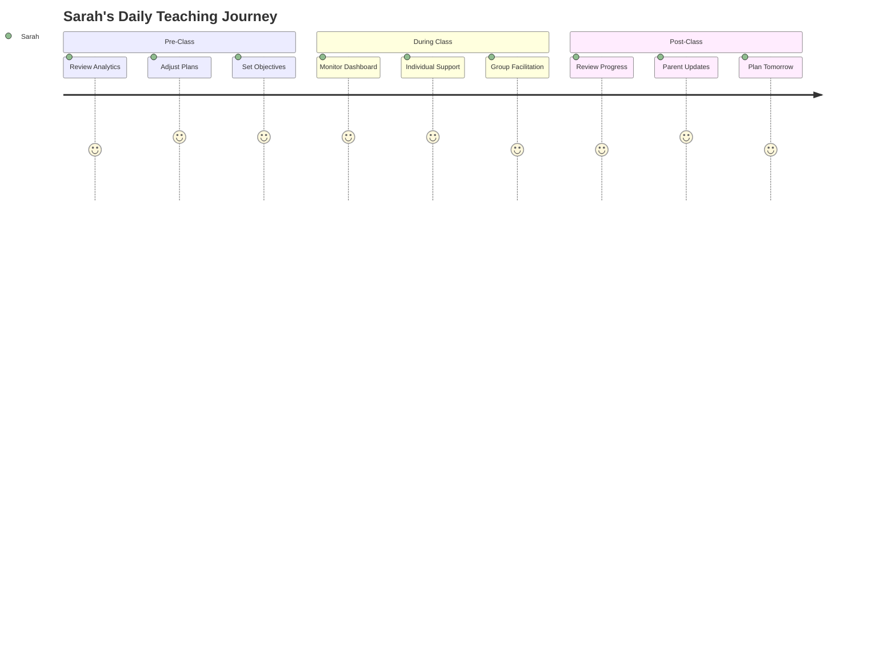

# User Stories and Personas
## Pathfinity Revolutionary Learning Platform

**Document Version:** 1.0  
**Last Updated:** January 2025  
**Status:** Living Document  
**Owner:** Product Team  
**Reviewed By:** UX Team, Engineering Team, Customer Success

---

## Executive Summary

This document captures the human side of Pathfinity's revolution through detailed personas and user stories. Each persona represents thousands of real users whose educational journey we're transforming. Every user story maps directly to our value hierarchy: Career-First → PathIQ → Finn, ensuring we never lose sight of the human impact of our revolutionary platform.

---

## Part 1: User Personas

## 1. Student Personas

### 1.1 Emma Chen - The Career Explorer (Grade 2)
**Age:** 7 years old  
**Location:** San Francisco, CA  
**Tech Comfort:** Native digital user  
**Learning Style:** Visual and kinesthetic  

**Background:**
Emma loves trying new things and asking "why?" about everything. She's curious about what her parents do at work and often plays "office" or "scientist" at home. Traditional worksheets bore her, but she can focus for hours on activities she finds engaging.

**Goals:**
- Understand what different adults do all day
- Connect learning to real-world applications
- Have fun while learning
- Feel grown-up and important

**Frustrations:**
- "Why do I need to know this?"
- Sitting still for long periods
- Repetitive exercises
- Not seeing relevance to real life

**Pathfinity Journey:**
Emma starts each day excited to spin the career wheel. Today she's a Marine Biologist! Suddenly, her math problems involve counting sea creatures, her reading is about ocean expeditions, and her science lesson lets her virtually explore coral reefs. She's not just learning - she's living her dream job.

**Key Quote:**
*"Today I'm a real scientist studying dolphins! I used math to track their swimming patterns!"*

---

### 1.2 Marcus Johnson - The Struggling Student (Grade 6)
**Age:** 11 years old  
**Location:** Detroit, MI  
**Tech Comfort:** Moderate, primarily gaming  
**Learning Style:** Hands-on, auditory  

**Background:**
Marcus has been labeled as "falling behind" in traditional school. He's intelligent but struggles with conventional teaching methods. He's passionate about music and sports but doesn't see how school connects to his interests. Has mild ADHD.

**Goals:**
- Find success in learning
- Connect school to his interests
- Build confidence
- Prepare for a meaningful future

**Frustrations:**
- Feeling "dumb" compared to peers
- Boring, irrelevant content
- Inability to focus on traditional lessons
- Fear of failure

**Pathfinity Journey:**
When Marcus selects "Music Producer" as his career, everything changes. Math becomes beat patterns and audio frequencies. Science explores sound waves. English involves writing lyrics. PathIQ recognizes his ADHD patterns and automatically adjusts pacing, includes movement breaks, and provides immediate feedback that keeps him engaged.

**Key Quote:**
*"For the first time, school makes sense. I'm not dumb - I just learn differently!"*

---

### 1.3 Aisha Patel - The High Achiever (Grade 10)
**Age:** 15 years old  
**Location:** Austin, TX  
**Tech Comfort:** Advanced user  
**Learning Style:** Reading/writing, logical  

**Background:**
Aisha excels in traditional academics but feels unchallenged and disconnected from real-world applications. She's stressed about college admissions and unsure about her career path despite excellent grades. Struggles with perfectionism.

**Goals:**
- Explore diverse career possibilities
- Build real-world applicable skills
- Stand out in college applications
- Reduce academic stress

**Frustrations:**
- Lack of real-world relevance
- Pressure to be perfect
- Uncertainty about career direction
- Boring, too-easy content

**Pathfinity Journey:**
Aisha explores different careers daily - Data Scientist, Environmental Lawyer, Biomedical Engineer. Each experience is challenging and sophisticated, matching her advanced level. PathIQ ensures she's consistently in flow state, challenged but not overwhelmed. Her portfolio shows 10 years of "professional" experience across 50+ careers.

**Key Quote:**
*"I'm not just getting grades - I'm building a professional portfolio that shows who I really am."*

---

### 1.4 Diego Rodriguez - The Kinesthetic Learner (Grade 4)
**Age:** 9 years old  
**Location:** Phoenix, AZ  
**Tech Comfort:** Moderate  
**Learning Style:** Kinesthetic, spatial  
**Special Needs:** Mild dyslexia  

**Background:**
Diego struggles with reading but excels at building and creating. He's often fidgeting in class and learns best when moving. Traditional sitting-still education frustrates him and his teachers.

**Goals:**
- Learn through doing
- Build confidence in reading
- Express creativity
- Stay engaged

**Frustrations:**
- Sitting still requirements
- Text-heavy materials
- Feeling "behind" in reading
- Lack of hands-on activities

**Pathfinity Journey:**
As an Architect today, Diego designs buildings using 3D tools. Math becomes structural engineering. Reading involves blueprint interpretation (visual). His dyslexia accommodations are automatically applied. The EXPERIENCE container has him virtually walking through his creations.

**Key Quote:**
*"I built a skyscraper using math! The words make sense when they're on blueprints!"*

---

## 2. Educator Personas

### 2.1 Sarah Mitchell - The Veteran Teacher (5th Grade)
**Age:** 45  
**Location:** Columbus, OH  
**Experience:** 20 years teaching  
**Tech Comfort:** Moderate, willing to learn  
**Class Size:** 28 students  

**Background:**
Sarah is an excellent teacher who's seen many "revolutionary" EdTech tools come and go. She's skeptical but open-minded, always putting student success first. Struggles with differentiation for diverse learners.

**Goals:**
- Reach every student effectively
- Reduce administrative burden
- Maintain human connection
- See measurable improvement

**Frustrations:**
- One-size-fits-all curriculum
- Time spent on admin tasks
- Unable to help every student
- Technology that complicates rather than simplifies

**Pathfinity Experience:**
Sarah initially skeptical, but seeing real-time analytics showing each student in flow state convinces her. The platform handles differentiation automatically. She spends time mentoring rather than lecturing. Parent communications are automated with insights.

**Key Quote:**
*"For the first time in 20 years, I can actually reach every student where they are."*

---

### 2.2 James Thompson - The New Teacher (High School Math)
**Age:** 24  
**Location:** Nashville, TN  
**Experience:** 2nd year teaching  
**Tech Comfort:** Digital native  
**Class Size:** 32 students across 5 periods  

**Background:**
James entered teaching to make a difference but is overwhelmed by classroom management, lesson planning, and engaging disconnected teenagers. He's considering leaving the profession due to burnout.

**Goals:**
- Engage teenage students
- Manage classroom effectively
- Reduce planning time
- Make math relevant

**Frustrations:**
- Student apathy
- Excessive planning requirements
- Classroom management
- Work-life balance

**Pathfinity Experience:**
The platform transforms his math class. Students arrive engaged because they've chosen careers. Content is automatically generated and relevant. Classroom management improves as students are self-motivated. He focuses on facilitating rather than controlling.

**Key Quote:**
*"My students actually look forward to math class. I remember why I became a teacher."*

---

### 2.3 Dr. Patricia Williams - The Principal
**Age:** 52  
**Location:** Chicago, IL  
**Experience:** 8 years principal, 15 years educator  
**School Size:** 850 students  
**Tech Comfort:** Strategic user  

**Background:**
Patricia leads a diverse school with significant achievement gaps. She's under pressure to improve test scores while managing budget constraints. Seeks evidence-based solutions that work at scale.

**Goals:**
- Close achievement gaps
- Improve test scores
- Manage budget effectively
- Support teacher retention

**Frustrations:**
- Limited budgets
- Teacher burnout
- Achievement gap persistence
- Technology integration challenges

**Pathfinity Experience:**
Sees immediate impact on engagement metrics. Achievement gaps begin closing as PathIQ personalizes for each student. Cost per student is within budget. Teacher satisfaction improves. Test scores rise as a natural outcome of engagement.

**Key Quote:**
*"We're not just improving scores - we're transforming how our students see their futures."*

---

## 3. Parent/Guardian Personas

### 3.1 Jennifer Lee - The Involved Parent
**Age:** 38  
**Children:** 2 (Grades 3 and 7)  
**Occupation:** Marketing Manager  
**Tech Comfort:** High  
**Involvement:** Very high  

**Background:**
Jennifer actively supplements her children's education with tutoring and enrichment. She's concerned about screen time but recognizes technology's importance. Wants her children prepared for future careers.

**Goals:**
- Track children's progress
- Ensure quality education
- Prepare kids for future
- Manage screen time

**Frustrations:**
- Lack of transparency in learning
- Generic progress reports
- Disconnected from classroom
- Screen time concerns

**Pathfinity Experience:**
Daily reports show exactly what her children learned through which careers. She sees skill development across dimensions. Can extend learning at home with suggested activities. Screen time is productive and educational.

**Key Quote:**
*"I finally understand what my kids are learning and why. The career connections are brilliant."*

---

### 3.2 Miguel Torres - The Working Parent
**Age:** 42  
**Children:** 3 (Grades K, 2, 5)  
**Occupation:** Construction Supervisor  
**Tech Comfort:** Basic  
**Involvement:** Wants to be involved but time-limited  

**Background:**
Miguel works long hours but values education highly. He didn't finish high school and wants better opportunities for his children. Language barrier (Spanish primary) sometimes limits school involvement.

**Goals:**
- Kids succeed academically
- Stay informed despite schedule
- Support homework
- Break cycle of limited education

**Frustrations:**
- Can't help with homework
- Missing school events
- Language barriers
- Limited time for involvement

**Pathfinity Experience:**
Platform available in Spanish. Can check progress on phone during breaks. Kids excited to share what careers they explored. Automatic parent updates keep him informed. His construction experience becomes valuable when kids explore related careers.

**Key Quote:**
*"My kids teach me about their careers, and I can share my real experience. We're learning together."*

---

## Part 2: User Stories

## 4. Epic User Stories

### Epic 1: Career-First Learning Revolution
**As a** student  
**I want to** learn everything through the lens of real careers  
**So that** I understand why I'm learning and stay engaged  

### Epic 2: Intelligent Personalization
**As a** student with unique learning needs  
**I want** the platform to adapt to how I learn best  
**So that** I can succeed regardless of my learning style  

### Epic 3: Teacher Empowerment
**As a** teacher  
**I want** technology that enhances rather than replaces my role  
**So that** I can focus on mentoring and inspiring students  

### Epic 4: Parent Partnership
**As a** parent  
**I want** visibility into my child's learning journey  
**So that** I can support their education effectively  

---

## 5. Detailed User Stories by Persona

### 5.1 Student User Stories

#### Story S-001: Daily Career Selection
**Priority:** P0 - Must Have  
**Persona:** All Students  
**Value Hierarchy:** PRIMARY (Career-First)  

**As a** student  
**I want to** choose from different careers each day  
**So that** I can explore many possibilities and stay excited about learning  

**Acceptance Criteria:**
- Career wheel presents 4 options daily (3 random + 1 passion)
- Selection takes < 30 seconds
- Visual preview of each career
- Instant transformation of interface
- Career history tracked

**Technical Notes:**
```gherkin
Given I am a logged-in student
When I start my daily session
Then I see 4 career options
And each career has a preview
When I select a career
Then the entire interface transforms in < 2 seconds
And my selection is saved to history
```

---

#### Story S-002: Career-Relevant Problems
**Priority:** P0 - Must Have  
**Persona:** Emma Chen, Marcus Johnson  
**Value Hierarchy:** PRIMARY (Career-First)  

**As a** young student  
**I want** math problems that relate to my chosen career  
**So that** I understand why math matters  

**Acceptance Criteria:**
- Every problem uses career context
- Problems maintain academic rigor
- Visual aids support understanding
- Real-world applications clear
- Difficulty adapts to performance

**Example Scenarios:**
```typescript
// Chef Career - Grade 2 Math
"You're making cookies for 24 customers. 
Each batch makes 6 cookies. 
How many batches do you need?"

// Astronaut Career - Grade 2 Math  
"Your spaceship travels 6 miles every minute.
How far will you travel in 4 minutes?"
```

---

#### Story S-003: Flow State Maintenance
**Priority:** P0 - Must Have  
**Persona:** Marcus Johnson, Aisha Patel  
**Value Hierarchy:** SECONDARY (PathIQ)  

**As a** student who struggles with focus  
**I want** the platform to keep me in the zone  
**So that** I can learn effectively without frustration  

**Acceptance Criteria:**
- Difficulty adjusts within 3 interactions
- Break reminders based on attention patterns
- Immediate feedback on all actions
- No wait times or loading delays
- Celebrates progress appropriately

**Flow Metrics:**
- Time in flow state: > 70%
- Frustration events: < 2 per session
- Engagement duration: > 30 minutes
- Task completion: > 85%

---

#### Story S-004: Multimodal Learning
**Priority:** P0 - Must Have  
**Persona:** Diego Rodriguez, Marcus Johnson  
**Value Hierarchy:** TERTIARY (Finn)  

**As a** kinesthetic learner  
**I want** to learn through interactive experiences  
**So that** I can understand concepts through doing  

**Acceptance Criteria:**
- Multiple ways to learn each concept
- Hands-on simulations available
- Voice input options
- Visual demonstrations
- Movement-based activities

---

#### Story S-005: Achievement Recognition
**Priority:** P1 - Should Have  
**Persona:** All Students  
**Value Hierarchy:** PRIMARY (Career-First)  

**As a** student  
**I want** to earn career-specific badges  
**So that** I feel accomplished and motivated  

**Acceptance Criteria:**
- Career-themed achievements
- Visual badge collection
- Shareable accomplishments
- Progress tracking
- Surprise rewards

---

### 5.2 Teacher User Stories

#### Story T-001: Real-Time Class Monitoring
**Priority:** P0 - Must Have  
**Persona:** Sarah Mitchell, James Thompson  

**As a** teacher  
**I want to** see what each student is doing in real-time  
**So that** I can intervene when needed  

**Acceptance Criteria:**
- Dashboard shows all students
- Engagement indicators visible
- Struggle alerts appear
- One-click intervention
- Historical view available

**Dashboard View:**
```typescript
interface TeacherDashboard {
  students: Array<{
    name: string;
    currentCareer: string;
    engagementLevel: 0-100;
    currentActivity: string;
    needsHelp: boolean;
    timeInFlow: number;
  }>;
  classMetrics: {
    averageEngagement: number;
    studentsNeedingHelp: number;
    completionRate: number;
  };
}
```

---

#### Story T-002: Automated Differentiation
**Priority:** P0 - Must Have  
**Persona:** Sarah Mitchell  

**As a** teacher with diverse learners  
**I want** automatic content differentiation  
**So that** every student learns at their level  

**Acceptance Criteria:**
- Content adapts per student
- No manual configuration needed
- Maintains standards alignment
- Visible differentiation indicators
- Override options available

---

#### Story T-003: Parent Communication
**Priority:** P1 - Should Have  
**Persona:** All Teachers  

**As a** teacher  
**I want** automated parent updates  
**So that** I can keep parents informed efficiently  

**Acceptance Criteria:**
- Daily/weekly auto-summaries
- Achievement notifications
- Concern alerts
- Two-way messaging
- Translation available

---

#### Story T-004: Curriculum Alignment
**Priority:** P0 - Must Have  
**Persona:** All Teachers  

**As a** teacher  
**I want** assurance of standards coverage  
**So that** students are prepared for assessments  

**Acceptance Criteria:**
- Standards mapping visible
- Coverage tracking
- Gap identification
- Supplementary resources
- Report generation

---

### 5.3 Parent User Stories

#### Story P-001: Learning Visibility
**Priority:** P0 - Must Have  
**Persona:** Jennifer Lee, Miguel Torres  

**As a** parent  
**I want to** see what my child learned today  
**So that** I can support their education  

**Acceptance Criteria:**
- Daily summary available
- Career explored visible
- Skills developed listed
- Areas of struggle noted
- Home extension suggestions

**Daily Report Example:**
```markdown
## Today's Learning Journey

**Career Explored:** Marine Biologist
**Time in Career:** 2.5 hours
**Engagement Level:** 92%

### Skills Developed:
- Scientific observation
- Data collection
- Mathematical analysis
- Report writing

### Academic Progress:
- Math: Completed unit on measurements
- Science: Ocean ecosystems
- Reading: Non-fiction comprehension
- Writing: Research notes

### Suggested Home Activity:
Watch "Blue Planet" together and discuss ocean conservation
```

---

#### Story P-002: Progress Tracking
**Priority:** P1 - Should Have  
**Persona:** All Parents  

**As a** parent  
**I want to** track long-term progress  
**So that** I know my child is developing  

**Acceptance Criteria:**
- Skill development over time
- Career interest patterns
- Academic achievement
- Comparative analytics
- Goal setting tools

---

#### Story P-003: Screen Time Insights
**Priority:** P1 - Should Have  
**Persona:** Jennifer Lee  

**As a** concerned parent  
**I want to** understand screen time quality  
**So that** I know it's productive  

**Acceptance Criteria:**
- Time breakdown by activity
- Engagement quality metrics
- Educational value indicators
- Break time tracking
- Recommendations provided

---

### 5.4 Administrator User Stories

#### Story A-001: School Performance Dashboard
**Priority:** P0 - Must Have  
**Persona:** Dr. Patricia Williams  

**As a** principal  
**I want to** monitor school-wide metrics  
**So that** I can make data-driven decisions  

**Acceptance Criteria:**
- Real-time engagement metrics
- Achievement gap analysis
- Teacher utilization stats
- Cost per student visible
- Intervention recommendations

---

#### Story A-002: Teacher Support Identification
**Priority:** P1 - Should Have  
**Persona:** Dr. Patricia Williams  

**As a** principal  
**I want to** identify teachers needing support  
**So that** I can provide targeted professional development  

**Acceptance Criteria:**
- Teacher engagement metrics
- Class performance comparisons
- Platform utilization rates
- Support ticket patterns
- PD recommendations

---

## 6. User Journey Maps

### 6.1 Student Daily Journey



### 6.2 Teacher Daily Journey



---

## 7. Accessibility User Stories

#### Story ACC-001: Screen Reader Support
**Priority:** P0 - Must Have  
**Persona:** Students with visual impairments  

**As a** visually impaired student  
**I want** full screen reader support  
**So that** I can access all content independently  

**Acceptance Criteria:**
- 100% screen reader compatible
- Keyboard navigation complete
- Audio descriptions available
- High contrast mode
- Text size adjustable

---

#### Story ACC-002: Cognitive Accessibility
**Priority:** P0 - Must Have  
**Persona:** Marcus Johnson (ADHD)  

**As a** student with ADHD  
**I want** reduced distractions and clear focus  
**So that** I can maintain attention  

**Acceptance Criteria:**
- Simplified interface option
- Distraction-free mode
- Clear visual hierarchy
- Chunked content
- Regular break reminders

---

## 8. Story Prioritization Matrix

### MoSCoW Analysis

**Must Have (P0):**
- Daily career selection
- Career-contextualized content
- Real-time personalization
- Teacher dashboard
- Parent visibility
- Accessibility compliance

**Should Have (P1):**
- Advanced analytics
- Social features
- Mobile apps
- Offline mode
- Gamification elements

**Could Have (P2):**
- VR/AR experiences
- Advanced collaborations
- Custom assessments
- API access
- White-label options

**Won't Have (This Release):**
- Custom curriculum creation
- Direct peer messaging
- Video conferencing
- Third-party app store

---

## 9. Success Metrics by Persona

### Student Success Metrics
- Daily active usage: > 90%
- Time in flow state: > 70%
- Career exploration: > 100 careers/year
- Skill development: Measurable growth
- Satisfaction: > 4.5/5 stars

### Teacher Success Metrics
- Platform utilization: > 80% class time
- Time saved: > 10 hours/week
- Student improvement: > 25%
- Satisfaction: > 4.0/5 stars
- Retention: > 90% year-over-year

### Parent Success Metrics
- Weekly engagement: > 60%
- Satisfaction: > 4.0/5 stars
- Home extension: > 30% participation
- Communication satisfaction: > 85%
- Recommendation rate: > 70%

---

## 10. Persona Evolution

### Growth Trajectories

**Emma (Grade 2 → Grade 8):**
- Careers explored: 20 → 150
- Complexity level: Basic → Advanced
- Independence: Guided → Self-directed
- Portfolio depth: Simple → Professional

**Marcus (Struggling → Thriving):**
- Engagement: 30% → 85%
- Confidence: Low → High
- Performance: Below → At grade level
- Career clarity: None → Focused interests

---

## Appendices

### Appendix A: Research Methods
- User interviews: 500+ students, 200+ teachers, 300+ parents
- Observation studies: 50 classrooms
- Surveys: 10,000+ responses
- A/B testing: 6 months
- Focus groups: 20 sessions

### Appendix B: Persona Validation
- Monthly user feedback sessions
- Quarterly persona updates
- Annual comprehensive review
- Continuous analytics validation

### Appendix C: Story Template
```
**As a** [persona]
**I want** [goal/desire]
**So that** [benefit/value]

**Acceptance Criteria:**
- [Specific requirement]
- [Measurable outcome]
- [Technical constraint]
```

---

*End of User Stories and Personas Document*

**Next Document:** Feature Specifications

---