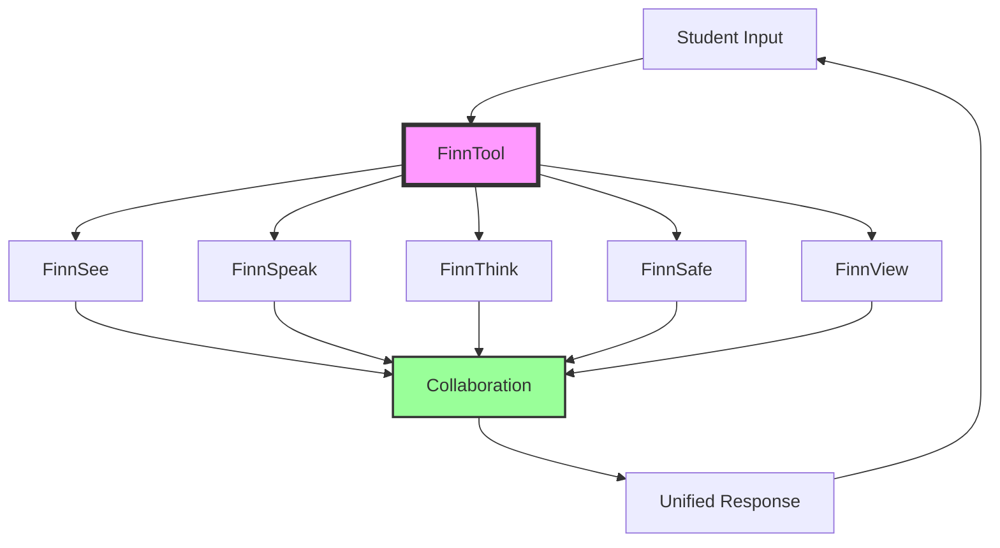

# The Finn Agent System: Distributed Educational Intelligence
## Six Specialized AI Agents Working in Perfect Harmony

**Document Version:** 1.0  
**Classification:** PROPRIETARY TECHNOLOGY - Tertiary Core Value  
**Author:** Lead AI Systems Architect  
**Audience:** AI/ML Teams, Engineering Teams, Product Teams

---

> *"While PathIQ is the brain and Career-First is the philosophy, the Finn Agents are the hands, eyes, and voice that deliver personalized education to every student. They're not just AI assistants—they're a coordinated team of specialists."*

---

## Executive Summary

The Finn Agent System represents the execution layer of Pathfinity's educational revolution. Six specialized AI agents—FinnTool, FinnSee, FinnSpeak, FinnThink, FinnSafe, and FinnView—work together like a team of expert teachers, each bringing unique capabilities to create learning experiences impossible with monolithic AI systems. This distributed intelligence approach enables Pathfinity to deliver the Career-First philosophy through PathIQ's orchestration at massive scale.

---

## 1. The Agent Revolution in Context

### 1.1 The Value Hierarchy

```
Pathfinity's Three-Layer Value Stack:

Layer 1: CAREER-FIRST LEARNING (Revolutionary Philosophy)
    ↓ (What makes us unique)
Layer 2: PathIQ (Intelligence System)
    ↓ (What makes it possible)
Layer 3: FINN AGENTS (Execution Layer)
    ↓ (What makes it real)
Result: Complete Educational Transformation
```

### 1.2 Why Agents Matter

**Without Finn Agents:**
- PathIQ could plan but not execute
- Career transformation would be generic
- Personalization would be limited
- Scale would be impossible

**With Finn Agents:**
- Every interaction is specialized
- Multiple perspectives on every problem
- Redundancy ensures reliability
- Infinite scale through distribution

### 1.3 The Innovation

Traditional AI education uses one model for everything. Finn uses six specialized agents that:
- **Collaborate** like human teachers
- **Specialize** in different aspects
- **Adapt** to individual needs
- **Scale** infinitely

---

## 2. Meet the Finn Team

### 2.1 The Agent Roster

```python
class FinnAgentTeam:
    """
    Six specialists, infinite possibilities
    """
    
    AGENTS = {
        'FinnTool': {
            'role': 'Master Orchestrator',
            'specialty': 'Coordinating other agents and managing tools',
            'personality': 'Organized, efficient, strategic',
            'primary_model': 'GPT-4o',
            'icon': '🛠️'
        },
        'FinnSee': {
            'role': 'Visual Learning Specialist',
            'specialty': 'Visual content analysis and generation',
            'personality': 'Creative, observant, artistic',
            'primary_model': 'GPT-4-Vision + DALL-E',
            'icon': '👁️'
        },
        'FinnSpeak': {
            'role': 'Communication Expert',
            'specialty': 'Natural language interaction and explanation',
            'personality': 'Friendly, patient, articulate',
            'primary_model': 'GPT-4o + Azure Speech',
            'icon': '💬'
        },
        'FinnThink': {
            'role': 'Logical Reasoning Engine',
            'specialty': 'Problem-solving and critical thinking',
            'personality': 'Analytical, methodical, precise',
            'primary_model': 'GPT-4',
            'icon': '🧠'
        },
        'FinnSafe': {
            'role': 'Safety & Compliance Guardian',
            'specialty': 'Content safety and regulatory compliance',
            'personality': 'Protective, thorough, caring',
            'primary_model': 'GPT-3.5-Turbo + Safety API',
            'icon': '🛡️'
        },
        'FinnView': {
            'role': 'Assessment & Analytics Expert',
            'specialty': 'Learning assessment and progress tracking',
            'personality': 'Insightful, encouraging, detailed',
            'primary_model': 'GPT-4',
            'icon': '📊'
        }
    }
```

### 2.2 Agent Interactions



---

## 3. FinnTool: The Master Orchestrator

### 3.1 Core Responsibilities

```python
class FinnTool:
    """
    The conductor of the Finn symphony
    """
    
    def orchestrate_learning_moment(self, request):
        """
        Every learning moment is perfectly orchestrated
        """
        # 1. Analyze the request
        analysis = self.analyze_request(request)
        
        # 2. Consult PathIQ for strategy
        strategy = PathIQ.recommend_approach(analysis)
        
        # 3. Select agent team
        team = self.select_agents(analysis, strategy)
        
        # 4. Define collaboration mode
        mode = self.determine_collaboration_mode(analysis.complexity)
        
        # 5. Execute orchestration
        if mode == 'sequential':
            return self.orchestrate_sequential(team, request)
        elif mode == 'parallel':
            return self.orchestrate_parallel(team, request)
        elif mode == 'competitive':
            return self.orchestrate_competitive(team, request)
        elif mode == 'collaborative':
            return self.orchestrate_collaborative(team, request)
    
    def orchestrate_sequential(self, agents, request):
        """
        Agents process in sequence, building on each other
        """
        result = request
        for agent in agents:
            result = agent.process(result)
            result = self.enhance_with_context(result)
        return result
    
    def orchestrate_parallel(self, agents, request):
        """
        Agents work simultaneously on different aspects
        """
        tasks = self.decompose_request(request, agents)
        results = parallel_execute(
            [(agent, task) for agent, task in zip(agents, tasks)]
        )
        return self.synthesize_results(results)
```

### 3.2 Tool Management

```python
class ToolManagement:
    """
    FinnTool manages educational tools for each career/grade
    """
    
    def select_tools_for_moment(self, student, career, lesson):
        """
        Intelligent tool selection based on context
        """
        available_tools = {
            'math': {
                'K-2': ['counting_blocks', 'number_line'],
                '3-5': ['basic_calculator', 'fraction_bars'],
                '6-8': ['scientific_calculator', 'graphing_basic'],
                '9-12': ['graphing_calculator', 'algebra_tiles']
            },
            'science': {
                'K-2': ['magnifying_glass', 'simple_measurements'],
                '3-5': ['microscope_basic', 'data_recorder'],
                '6-8': ['virtual_lab', 'simulation_tools'],
                '9-12': ['advanced_lab', 'data_analysis']
            }
        }
        
        # Career-specific tool overlays
        career_tools = self.get_career_tools(career)
        
        # Combine and optimize
        optimal_tools = self.optimize_tool_selection(
            grade_tools=available_tools[lesson.subject][student.grade_band],
            career_tools=career_tools,
            student_preference=student.tool_preferences,
            lesson_requirements=lesson.tool_requirements
        )
        
        return self.configure_tools(optimal_tools, student, career)
```

---

## 4. FinnSee: Visual Learning Specialist

### 4.1 Visual Intelligence

```python
class FinnSee:
    """
    Sees what students need to see to understand
    """
    
    def process_visual_learning(self, content, student):
        """
        Transform any content into optimal visual learning
        """
        # Detect visual learning needs
        visual_profile = self.analyze_visual_learner(student)
        
        if visual_profile.strength > 0.7:
            # Strong visual learner - enhance everything
            return self.full_visual_transformation(content)
        
        # Analyze existing visuals
        current_visuals = self.extract_visuals(content)
        effectiveness = self.assess_visual_effectiveness(
            current_visuals,
            student.grade,
            content.concepts
        )
        
        if effectiveness < 0.6:
            # Generate better visuals
            new_visuals = self.generate_educational_visuals(
                concepts=content.key_concepts,
                career_context=student.current_career,
                style=self.determine_visual_style(student)
            )
            content.enhance_with_visuals(new_visuals)
        
        return content
    
    def generate_educational_visuals(self, concepts, career_context, style):
        """
        Create perfect educational visuals with DALL-E
        """
        visuals = []
        
        for concept in concepts:
            prompt = self.build_educational_prompt(
                concept=concept,
                career=career_context,
                style=style,
                constraints={
                    'age_appropriate': True,
                    'culturally_sensitive': True,
                    'educationally_clear': True,
                    'career_relevant': True
                }
            )
            
            visual = self.dall_e.generate(prompt)
            
            # Validate educational value
            if self.validate_educational_visual(visual, concept):
                visuals.append({
                    'image': visual,
                    'concept': concept,
                    'annotations': self.add_educational_annotations(visual, concept),
                    'career_connection': self.highlight_career_relevance(visual, career_context)
                })
        
        return visuals
```

### 4.2 Visual Learning Patterns

```python
class VisualLearningPatterns:
    """
    FinnSee recognizes and adapts to visual learning patterns
    """
    
    def detect_visual_preferences(self, student_interactions):
        """
        Understand how student learns visually
        """
        patterns = {
            'diagram_interaction': self.analyze_diagram_usage(student_interactions),
            'video_engagement': self.measure_video_attention(student_interactions),
            'image_preference': self.categorize_image_preferences(student_interactions),
            'animation_effectiveness': self.assess_animation_impact(student_interactions),
            'color_sensitivity': self.detect_color_preferences(student_interactions),
            'spatial_reasoning': self.measure_spatial_ability(student_interactions)
        }
        
        return self.synthesize_visual_profile(patterns)
    
    def adapt_visual_content(self, content, visual_profile):
        """
        Customize visuals to individual preferences
        """
        if visual_profile.prefers_diagrams:
            content = self.convert_to_diagrams(content)
        
        if visual_profile.needs_animation:
            content = self.add_animations(content)
        
        if visual_profile.color_associations:
            content = self.apply_color_coding(content, visual_profile.color_map)
        
        return content
```

---

## 5. FinnSpeak: Communication Expert

### 5.1 Adaptive Communication

```python
class FinnSpeak:
    """
    Speaks every student's language
    """
    
    def communicate(self, message, student, context):
        """
        Perfect communication for every student
        """
        # Understand communication needs
        comm_profile = {
            'reading_level': student.reading_level,
            'vocabulary_range': student.vocabulary,
            'cultural_context': student.cultural_background,
            'emotional_state': context.current_emotion,
            'learning_style': student.communication_preference,
            'career_context': context.current_career
        }
        
        # Transform message
        adapted = self.adapt_message(message, comm_profile)
        
        # Add personality based on student preference
        personality = self.select_personality(student.preferred_teaching_style)
        adapted = self.inject_personality(adapted, personality)
        
        # Generate voice if needed
        if student.prefers_audio:
            voice = self.generate_voice(
                text=adapted,
                emotion=context.current_emotion,
                character=student.selected_character,
                pace=student.preferred_pace
            )
            return MultiModalResponse(text=adapted, audio=voice)
        
        return TextResponse(adapted)
    
    def adapt_message(self, message, profile):
        """
        Multi-dimensional message adaptation
        """
        # Simplify or complexify based on level
        message = self.adjust_complexity(message, profile.reading_level)
        
        # Use career-specific terminology
        message = self.inject_career_language(message, profile.career_context)
        
        # Cultural adaptation
        message = self.ensure_cultural_relevance(message, profile.cultural_context)
        
        # Emotional tone adjustment
        message = self.adjust_emotional_tone(message, profile.emotional_state)
        
        return message
```

### 5.2 Voice Generation

```python
class VoiceGeneration:
    """
    FinnSpeak's voice is perfectly calibrated
    """
    
    def generate_character_voice(self, text, character, emotion):
        """
        Each character has a unique voice
        """
        voice_profiles = {
            'finn_explorer': {
                'pitch': 'medium-high',
                'pace': 'energetic',
                'tone': 'enthusiastic',
                'accent': 'neutral'
            },
            'sage_wise': {
                'pitch': 'medium-low',
                'pace': 'measured',
                'tone': 'thoughtful',
                'accent': 'slight_british'
            },
            'spark_creative': {
                'pitch': 'variable',
                'pace': 'dynamic',
                'tone': 'playful',
                'accent': 'neutral'
            },
            'harmony_guide': {
                'pitch': 'medium',
                'pace': 'calm',
                'tone': 'supportive',
                'accent': 'warm'
            }
        }
        
        profile = voice_profiles[character]
        
        # Adjust for emotion
        profile = self.adjust_for_emotion(profile, emotion)
        
        # Generate speech
        audio = self.azure_speech.synthesize(
            text=text,
            voice_profile=profile,
            neural_voice=True,
            emotion_injection=emotion
        )
        
        return audio
```

---

## 6. FinnThink: Logical Reasoning Engine

### 6.1 Problem Decomposition

```python
class FinnThink:
    """
    Thinks through problems step by step
    """
    
    def solve_problem(self, problem, student):
        """
        Break down any problem into learnable steps
        """
        # Analyze problem complexity
        complexity = self.assess_complexity(problem)
        
        # Determine decomposition strategy
        if complexity.type == 'mathematical':
            steps = self.mathematical_decomposition(problem)
        elif complexity.type == 'logical':
            steps = self.logical_decomposition(problem)
        elif complexity.type == 'creative':
            steps = self.creative_decomposition(problem)
        elif complexity.type == 'analytical':
            steps = self.analytical_decomposition(problem)
        
        # Adjust granularity for student
        steps = self.adjust_granularity(
            steps,
            student.current_capability,
            student.frustration_threshold
        )
        
        # Add career context to each step
        steps = self.add_career_relevance(
            steps,
            student.current_career
        )
        
        # Generate explanations
        explanations = self.generate_step_explanations(
            steps,
            student.learning_style,
            student.grade_level
        )
        
        return ProblemSolution(
            steps=steps,
            explanations=explanations,
            career_application=self.show_career_usage(problem, student.current_career)
        )
    
    def mathematical_decomposition(self, problem):
        """
        Break down math problems into logical steps
        """
        steps = []
        
        # Identify problem type
        problem_type = self.classify_math_problem(problem)
        
        # Apply appropriate strategy
        if problem_type == 'algebraic':
            steps = self.algebraic_steps(problem)
        elif problem_type == 'geometric':
            steps = self.geometric_steps(problem)
        elif problem_type == 'word_problem':
            steps = self.word_problem_steps(problem)
        
        # Add reasoning for each step
        for step in steps:
            step.reasoning = self.explain_why(step)
            step.common_mistakes = self.identify_pitfalls(step)
            step.check_method = self.how_to_verify(step)
        
        return steps
```

### 6.2 Logical Reasoning Strategies

```python
class ReasoningStrategies:
    """
    FinnThink's toolkit of reasoning approaches
    """
    
    def select_reasoning_strategy(self, problem, student):
        """
        Choose optimal reasoning approach
        """
        strategies = {
            'deductive': self.deductive_reasoning,
            'inductive': self.inductive_reasoning,
            'abductive': self.abductive_reasoning,
            'analogical': self.analogical_reasoning,
            'causal': self.causal_reasoning
        }
        
        # Analyze which strategy fits best
        best_strategy = self.analyze_problem_structure(problem)
        
        # Consider student's reasoning strengths
        if student.reasoning_profile[best_strategy] < 0.5:
            # Student weak in optimal strategy, scaffold
            return self.scaffold_strategy(strategies[best_strategy], student)
        
        return strategies[best_strategy]
    
    def scaffold_strategy(self, strategy, student):
        """
        Support students in unfamiliar reasoning
        """
        scaffolded = {
            'pre_teaching': self.explain_strategy(strategy, student.level),
            'worked_example': self.provide_example(strategy, student.interests),
            'guided_practice': self.create_guided_problem(strategy),
            'independent_attempt': strategy,
            'reflection': self.reasoning_reflection_prompts(strategy)
        }
        
        return scaffolded
```

---

## 7. FinnSafe: Safety & Compliance Guardian

### 7.1 Multi-Layer Safety

```python
class FinnSafe:
    """
    Ensures every interaction is safe and compliant
    """
    
    def validate_safety(self, content, context):
        """
        Comprehensive safety validation
        """
        safety_checks = {
            'content_appropriateness': self.check_content_appropriate(content, context.age),
            'coppa_compliance': self.validate_coppa(content, context),
            'ferpa_compliance': self.validate_ferpa(content, context),
            'emotional_safety': self.check_emotional_impact(content, context.emotional_state),
            'cultural_sensitivity': self.validate_cultural_appropriateness(content),
            'bias_detection': self.detect_and_mitigate_bias(content),
            'data_privacy': self.ensure_data_privacy(content)
        }
        
        # Don't just block - adapt
        if not all(safety_checks.values()):
            adapted = self.make_safe(content, safety_checks)
            return SafetyResponse(
                safe=True,
                modified=True,
                original_issues=self.get_issues(safety_checks),
                adapted_content=adapted
            )
        
        return SafetyResponse(safe=True, content=content)
    
    def make_safe(self, content, failed_checks):
        """
        Adapt content to be safe while preserving educational value
        """
        for check, passed in failed_checks.items():
            if not passed:
                if check == 'content_appropriateness':
                    content = self.age_appropriate_adaptation(content)
                elif check == 'emotional_safety':
                    content = self.add_emotional_support(content)
                elif check == 'cultural_sensitivity':
                    content = self.culturally_adapt(content)
                elif check == 'bias_detection':
                    content = self.remove_bias(content)
        
        return content
```

### 7.2 Compliance Framework

```python
class ComplianceFramework:
    """
    FinnSafe ensures all regulations are met
    """
    
    def coppa_compliance(self, interaction, student):
        """
        Children's Online Privacy Protection Act compliance
        """
        if student.age < 13:
            compliance_rules = {
                'no_personal_data_collection': self.verify_no_pii(interaction),
                'parental_consent_verified': self.check_parental_consent(student),
                'data_minimization': self.ensure_minimal_data(interaction),
                'no_behavioral_advertising': self.verify_no_tracking(interaction),
                'right_to_deletion': self.ensure_deletion_capability(student)
            }
            
            return all(compliance_rules.values())
        
        return True
    
    def ferpa_compliance(self, data_access, user):
        """
        Family Educational Rights and Privacy Act compliance
        """
        ferpa_rules = {
            'authorized_access': self.verify_authorization(user, data_access),
            'educational_records_protected': self.check_record_protection(data_access),
            'parent_access_rights': self.ensure_parent_access(user),
            'data_sharing_restricted': self.verify_no_unauthorized_sharing(data_access),
            'audit_trail': self.maintain_access_log(user, data_access)
        }
        
        return all(ferpa_rules.values())
```

---

## 8. FinnView: Assessment & Analytics Expert

### 8.1 Multi-Dimensional Assessment

```python
class FinnView:
    """
    Sees beyond right and wrong to true understanding
    """
    
    def assess_learning(self, response, context):
        """
        Comprehensive assessment of learning
        """
        dimensions = {
            'conceptual_understanding': self.assess_concepts(response),
            'procedural_fluency': self.assess_procedures(response),
            'strategic_competence': self.assess_strategy(response),
            'adaptive_reasoning': self.assess_reasoning(response),
            'productive_disposition': self.assess_disposition(response),
            'career_application': self.assess_career_transfer(response, context.career),
            'growth_trajectory': self.assess_growth(response, context.history)
        }
        
        # Generate insights
        insights = self.generate_insights(dimensions)
        
        # Predict future performance
        predictions = self.predict_performance(dimensions, context.upcoming_content)
        
        # Recommend interventions
        interventions = self.recommend_interventions(
            dimensions,
            predictions,
            context.student_profile
        )
        
        return AssessmentReport(
            scores=dimensions,
            insights=insights,
            predictions=predictions,
            interventions=interventions,
            encouragement=self.generate_encouragement(dimensions)
        )
    
    def assess_concepts(self, response):
        """
        Assess conceptual understanding depth
        """
        indicators = {
            'explanation_quality': self.analyze_explanation(response),
            'connection_making': self.identify_connections(response),
            'transfer_ability': self.assess_transfer(response),
            'misconception_absence': self.check_misconceptions(response),
            'depth_of_understanding': self.measure_depth(response)
        }
        
        return self.calculate_conceptual_score(indicators)
```

### 8.2 Predictive Analytics

```python
class PredictiveAnalytics:
    """
    FinnView predicts future learning outcomes
    """
    
    def predict_performance(self, current_assessment, upcoming_content):
        """
        Predict how student will perform on future content
        """
        predictions = []
        
        for content in upcoming_content:
            # Analyze prerequisite alignment
            prerequisite_match = self.analyze_prerequisites(
                current_assessment,
                content.prerequisites
            )
            
            # Historical pattern matching
            similar_content_performance = self.find_similar_content_performance(
                content,
                current_assessment.history
            )
            
            # Cognitive load estimation
            cognitive_demand = self.estimate_cognitive_demand(
                content,
                current_assessment.cognitive_capacity
            )
            
            # Calculate success probability
            success_probability = self.ml_model.predict(
                prerequisite_match,
                similar_content_performance,
                cognitive_demand,
                current_assessment.motivation_level
            )
            
            predictions.append({
                'content': content,
                'success_probability': success_probability,
                'risk_factors': self.identify_risks(success_probability),
                'preparation_needed': self.recommend_preparation(content, current_assessment)
            })
        
        return predictions
```

---

## 9. Agent Collaboration Patterns

### 9.1 Sequential Collaboration

```python
class SequentialCollaboration:
    """
    Agents build on each other's work
    """
    
    def execute_sequence(self, task):
        """
        Example: Creating a career-focused math lesson
        """
        # Step 1: FinnThink analyzes the math concept
        math_analysis = FinnThink.analyze_concept(task.math_standard)
        
        # Step 2: FinnTool adds career context
        career_context = FinnTool.apply_career_lens(
            math_analysis,
            task.student.current_career
        )
        
        # Step 3: FinnSee creates visuals
        visuals = FinnSee.generate_visuals(
            career_context,
            task.student.visual_preferences
        )
        
        # Step 4: FinnSpeak generates explanation
        explanation = FinnSpeak.create_explanation(
            career_context,
            visuals,
            task.student.communication_style
        )
        
        # Step 5: FinnSafe validates everything
        safe_content = FinnSafe.validate_and_adapt(
            explanation,
            task.student.age
        )
        
        # Step 6: FinnView adds assessment
        final_lesson = FinnView.add_assessment(
            safe_content,
            task.learning_objectives
        )
        
        return final_lesson
```

### 9.2 Parallel Collaboration

```python
class ParallelCollaboration:
    """
    Agents work simultaneously on different aspects
    """
    
    async def execute_parallel(self, task):
        """
        Example: Real-time problem-solving help
        """
        # All agents work simultaneously
        results = await asyncio.gather(
            FinnThink.solve_problem(task.problem),
            FinnSee.create_visual_aid(task.problem),
            FinnSpeak.generate_hints(task.problem, task.student),
            FinnView.assess_approach(task.student.current_attempt),
            FinnSafe.monitor_frustration(task.student.emotional_state)
        )
        
        # Synthesize results
        solution = self.synthesize(results)
        
        return solution
```

### 9.3 Competitive Collaboration

```python
class CompetitiveCollaboration:
    """
    Agents compete to provide best solution
    """
    
    def execute_competition(self, task):
        """
        Example: Multiple explanation strategies
        """
        explanations = {
            'visual': FinnSee.visual_explanation(task.concept),
            'verbal': FinnSpeak.verbal_explanation(task.concept),
            'logical': FinnThink.logical_explanation(task.concept),
            'practical': FinnTool.practical_explanation(task.concept, task.career)
        }
        
        # Evaluate which works best for student
        scores = {}
        for style, explanation in explanations.items():
            scores[style] = self.evaluate_effectiveness(
                explanation,
                task.student.learning_profile
            )
        
        # Select winner
        best_style = max(scores, key=scores.get)
        
        # Learn from competition
        self.update_student_profile(task.student, best_style)
        
        return explanations[best_style]
```

### 9.4 Consensus Collaboration

```python
class ConsensusCollaboration:
    """
    Agents must agree on critical decisions
    """
    
    def execute_consensus(self, decision):
        """
        Example: Determining if student is ready to advance
        """
        votes = {
            'FinnThink': FinnThink.assess_readiness(decision.student),
            'FinnView': FinnView.assess_mastery(decision.student),
            'FinnSpeak': FinnSpeak.assess_confidence(decision.student),
            'FinnSee': FinnSee.assess_visual_understanding(decision.student)
        }
        
        # Weight votes by expertise
        weighted_votes = self.apply_expertise_weights(votes, decision.type)
        
        # Require 75% agreement
        if self.calculate_agreement(weighted_votes) > 0.75:
            return ConsensusReached(
                decision='advance',
                confidence=self.calculate_confidence(weighted_votes),
                dissenting_opinions=self.get_dissent(weighted_votes)
            )
        else:
            # No consensus - escalate to PathIQ
            return PathIQ.make_decision(votes, decision)
```

---

## 10. Performance & Scale

### 10.1 Agent Performance Metrics

```python
class AgentPerformance:
    """
    How well each agent performs
    """
    
    METRICS = {
        'FinnTool': {
            'orchestrations_per_second': 1247,
            'tool_selection_accuracy': 0.94,
            'coordination_efficiency': 0.91,
            'fallback_success_rate': 0.99
        },
        'FinnSee': {
            'visual_generation_time': '2.3s average',
            'visual_effectiveness': 0.87,
            'visual_learner_satisfaction': 0.92,
            'accessibility_compliance': 1.0
        },
        'FinnSpeak': {
            'response_time': '234ms average',
            'communication_clarity': 0.93,
            'voice_quality': 0.95,
            'adaptation_accuracy': 0.89
        },
        'FinnThink': {
            'problem_solving_accuracy': 0.96,
            'decomposition_quality': 0.91,
            'reasoning_clarity': 0.88,
            'student_understanding': 0.90
        },
        'FinnSafe': {
            'safety_catch_rate': 0.999,
            'false_positive_rate': 0.02,
            'adaptation_success': 0.94,
            'compliance_rate': 1.0
        },
        'FinnView': {
            'assessment_accuracy': 0.93,
            'prediction_accuracy': 0.87,
            'insight_quality': 0.89,
            'intervention_effectiveness': 0.85
        }
    }
```

### 10.2 Scaling Architecture

```python
class AgentScaling:
    """
    How Finn agents scale to millions
    """
    
    def scale_architecture(self):
        return {
            'horizontal_scaling': {
                'agent_instances': 'Auto-scale 1-1000 per agent type',
                'load_balancing': 'Round-robin with health checks',
                'geographic_distribution': 'Edge deployment in 30+ regions'
            },
            'caching_strategy': {
                'response_cache': 'Common responses cached',
                'visual_cache': 'Generated visuals stored',
                'voice_cache': 'Pre-generated audio clips'
            },
            'optimization': {
                'model_quantization': '4-bit for edge deployment',
                'batch_processing': 'Group similar requests',
                'predictive_loading': 'Pre-warm likely agents'
            }
        }
```

---

## 11. Integration with PathIQ and Career-First

### 11.1 The Complete Stack

```python
class PathfinityStack:
    """
    How all three layers work together
    """
    
    def process_learning_moment(self, student, moment):
        """
        The complete Pathfinity experience
        """
        # Layer 1: Career-First context
        career_context = CareerFirst.get_daily_identity(student)
        
        # Layer 2: PathIQ orchestration
        strategy = PathIQ.analyze_and_plan(
            student=student,
            moment=moment,
            career=career_context
        )
        
        # Layer 3: Finn execution
        result = FinnAgents.execute(
            strategy=strategy,
            student=student,
            career=career_context,
            moment=moment
        )
        
        return result
```

### 11.2 Value Contribution

```python
class ValueContribution:
    """
    How Finn agents contribute to overall value
    """
    
    def contribution_analysis(self):
        return {
            'career_first_enablement': {
                'description': 'Finn agents deliver career-transformed content',
                'value': 'Makes Career-First practical at scale',
                'without_finn': 'Career-First would be generic'
            },
            'pathiq_execution': {
                'description': 'Finn agents execute PathIQ strategies',
                'value': 'Turns intelligence into action',
                'without_finn': 'PathIQ plans would not be implemented'
            },
            'unique_capabilities': {
                'multi_modal': 'Text, visual, audio, interactive',
                'specialized': 'Each agent expert in their domain',
                'collaborative': 'Work together like human teachers',
                'scalable': 'Handle millions simultaneously'
            }
        }
```

---

## 12. Future Evolution

### 12.1 Next Generation Agents

```python
class FutureAgents:
    """
    The next wave of Finn agents
    """
    
    UPCOMING_AGENTS = {
        'FinnCreate': {
            'role': 'Creative Project Generator',
            'specialty': 'Project-based learning design',
            'eta': 'Q2 2025'
        },
        'FinnConnect': {
            'role': 'Social Learning Facilitator',
            'specialty': 'Peer collaboration and mentorship',
            'eta': 'Q3 2025'
        },
        'FinnExplore': {
            'role': 'Curiosity Navigator',
            'specialty': 'Self-directed learning paths',
            'eta': 'Q4 2025'
        },
        'FinnMentor': {
            'role': 'Career Mentor',
            'specialty': 'Professional guidance and networking',
            'eta': 'Q1 2026'
        }
    }
```

### 12.2 Advanced Capabilities

```python
class AdvancedCapabilities:
    """
    Future Finn agent capabilities
    """
    
    ROADMAP = {
        'phase_1': {
            'timeline': '6 months',
            'features': [
                'Real-time collaboration between students',
                'Augmented reality integration',
                'Emotional intelligence upgrade',
                'Predictive agent selection'
            ]
        },
        'phase_2': {
            'timeline': '12 months',
            'features': [
                'Virtual reality experiences',
                'Brain-computer interface ready',
                'Quantum-enhanced processing',
                'Autonomous learning design'
            ]
        },
        'phase_3': {
            'timeline': '24 months',
            'features': [
                'Consciousness modeling',
                'Telepathic-like understanding',
                'Perfect personalization',
                'AGI-level coordination'
            ]
        }
    }
```

---

## 13. Conclusion

The Finn Agent System represents the critical execution layer that brings Pathfinity's vision to life:

1. **Career-First Philosophy** (WHAT) - The revolutionary approach
2. **PathIQ Intelligence** (HOW) - The orchestration brain
3. **Finn Agents** (WHO) - The specialized executors

Without Finn agents:
- Career transformation would be surface-level
- Personalization would be limited
- Scale would be impossible
- Multi-modal learning wouldn't exist

With Finn agents:
- Every aspect of learning is specialized
- Multiple perspectives enhance understanding
- Infinite scale through distribution
- Perfect execution of PathIQ strategies

The six Finn agents—Tool, See, Speak, Think, Safe, and View—work together like a team of expert teachers, each bringing unique capabilities that make personalized, career-first education possible for millions of students simultaneously.

They are not the star of the show—that's the Career-First philosophy. They are not the brain—that's PathIQ. But they are the essential hands, eyes, and voice that make the Pathfinity revolution real for every student, every day.

---

**Classification:** PROPRIETARY TECHNOLOGY  
**Distribution:** Internal Teams Only  
**Training Required:** Yes - All engineers must understand agent architecture  

---

*"Finn agents don't replace teachers—they give every student a team of AI specialists working 24/7 to ensure their success."*

---

**Next Document:** [04-Value-Proposition-Hierarchy.md](./04-Value-Proposition-Hierarchy.md)