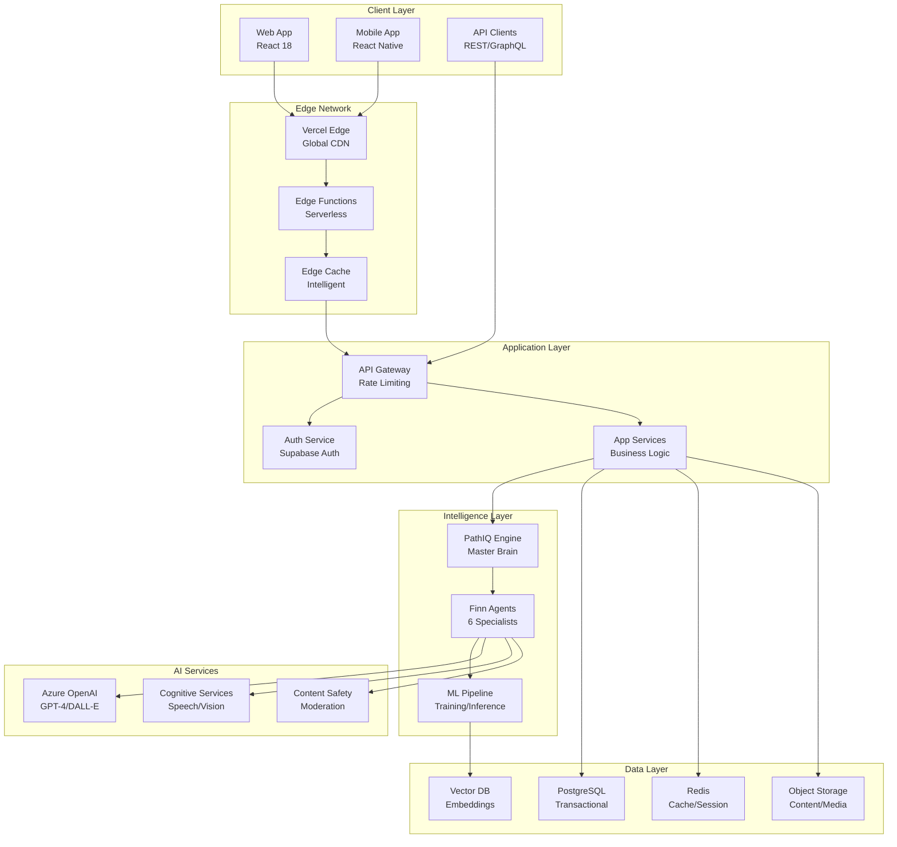

# Pathfinity System Architecture
## The Technical Foundation of Educational Revolution

**Document Version:** 1.0  
**Classification:** TECHNICAL ARCHITECTURE - Core Infrastructure  
**Author:** Chief Technology Officer  
**Audience:** Engineering Teams, DevOps, System Architects

---

> *"Architecture isn't just about technology choices—it's about building a foundation that can support a revolution. Pathfinity's architecture enables real-time personalization for millions while maintaining sub-second response times."*

---

## Executive Summary

Pathfinity's system architecture represents a groundbreaking approach to educational technology infrastructure. Built on serverless, edge-first principles with intelligent caching and distributed AI orchestration, the architecture supports the Career-First revolution through PathIQ intelligence and Finn agent execution at massive scale. This document details the technical architecture that makes personalized education possible for millions of concurrent users.

---

## 1. Architecture Overview

### 1.1 High-Level Architecture



### 1.2 Architectural Principles

```python
class ArchitecturalPrinciples:
    """
    Core principles guiding all architectural decisions
    """
    
    PRINCIPLES = {
        'edge_first': {
            'description': 'Process at the edge whenever possible',
            'rationale': 'Minimize latency for global users',
            'implementation': 'Vercel Edge Functions + CDN'
        },
        'serverless_native': {
            'description': 'No servers to manage',
            'rationale': 'Infinite scale, pay per use',
            'implementation': 'Vercel + Supabase + Azure Functions'
        },
        'intelligence_distributed': {
            'description': 'AI processing across multiple services',
            'rationale': 'Reliability and specialization',
            'implementation': 'PathIQ + Finn Agents + Azure AI'
        },
        'cache_everything': {
            'description': 'Multi-layer intelligent caching',
            'rationale': '80% cost reduction, <100ms response',
            'implementation': 'Edge Cache + Redis + App Cache'
        },
        'fail_gracefully': {
            'description': 'Always have a fallback',
            'rationale': 'Education cannot stop',
            'implementation': 'Circuit breakers + Fallback content'
        },
        'secure_by_design': {
            'description': 'Security at every layer',
            'rationale': 'Protecting children\'s data',
            'implementation': 'Zero-trust + Encryption + Compliance'
        }
    }
```

---

## 2. Client Architecture

### 2.1 Web Application

```typescript
// React 18 with TypeScript
interface WebArchitecture {
    framework: 'React 18.2';
    language: 'TypeScript 5.0';
    styling: 'Tailwind CSS 3.3';
    state: 'Zustand 4.4';
    routing: 'React Router 6.20';
    bundler: 'Vite 5.0';
    testing: 'Vitest + React Testing Library';
}

class WebAppStructure {
    /*
    /src
    ├── components/          # Reusable UI components
    │   ├── ai-characters/   # Finn character components
    │   ├── career/          # Career selection components
    │   ├── containers/      # Three-container components
    │   └── ui/              # Base UI components
    ├── services/            # Business logic services
    │   ├── pathIQService.ts # PathIQ integration
    │   ├── finnAgents/      # Finn agent services
    │   └── careerService.ts # Career transformation
    ├── hooks/               # Custom React hooks
    ├── utils/               # Utility functions
    ├── types/               # TypeScript definitions
    └── pages/               # Route components
    */
}

// Performance optimizations
const performanceOptimizations = {
    code_splitting: 'Route-based + Component lazy loading',
    bundle_size: '<200KB initial, <50KB per route',
    caching: 'Service Worker + HTTP caching',
    rendering: 'React Server Components where applicable',
    images: 'Next-gen formats (WebP, AVIF) with lazy loading',
    fonts: 'Variable fonts with font-display: swap'
};
```

### 2.2 Mobile Architecture

```typescript
interface MobileArchitecture {
    framework: 'React Native 0.72';
    language: 'TypeScript';
    navigation: 'React Navigation 6';
    state: 'Redux Toolkit';
    offline: 'Redux Persist + NetInfo';
    push: 'Firebase Cloud Messaging';
}

class MobileOptimizations {
    performance = {
        startup_time: '<2s on average device',
        memory_usage: '<150MB baseline',
        battery: 'Optimized background processing',
        offline_mode: 'Full offline capability with sync'
    };
    
    platform_specific = {
        ios: {
            min_version: 'iOS 13+',
            features: ['Haptic feedback', 'Face ID', 'Siri shortcuts']
        },
        android: {
            min_version: 'Android 7+',
            features: ['Material You', 'Biometric auth', 'Widget support']
        }
    };
}
```

---

## 3. Edge Architecture

### 3.1 Edge Functions

```typescript
// Vercel Edge Functions
export const config = {
    runtime: 'edge',
    regions: ['iad1', 'sfo1', 'fra1', 'syd1'], // Multi-region
};

class EdgeFunctionArchitecture {
    /**
     * Edge functions handle request routing, caching, and light processing
     */
    
    async handleRequest(request: Request): Promise<Response> {
        // 1. Authentication at edge
        const auth = await this.validateAuthAtEdge(request);
        if (!auth.valid) return new Response('Unauthorized', { status: 401 });
        
        // 2. Check edge cache
        const cached = await this.checkEdgeCache(request);
        if (cached) return cached;
        
        // 3. Route to appropriate service
        const route = this.determineRoute(request.url);
        
        // 4. Apply rate limiting
        const rateLimitOk = await this.checkRateLimit(auth.userId);
        if (!rateLimitOk) return new Response('Rate limited', { status: 429 });
        
        // 5. Process or forward request
        const response = await this.processRequest(route, request);
        
        // 6. Cache if appropriate
        if (this.shouldCache(response)) {
            await this.cacheResponse(request, response);
        }
        
        return response;
    }
    
    private async validateAuthAtEdge(request: Request) {
        // JWT validation without database call
        const token = request.headers.get('Authorization');
        return this.verifyJWT(token);
    }
    
    private async checkEdgeCache(request: Request) {
        const key = this.getCacheKey(request);
        return await caches.default.match(key);
    }
}
```

### 3.2 Intelligent Caching Strategy

```typescript
class IntelligentCachingSystem {
    /**
     * Multi-layer caching for 80% cost reduction
     */
    
    layers = {
        edge: {
            location: 'CDN Edge (30+ locations)',
            ttl: '5 minutes for dynamic, 1 year for static',
            size: 'Unlimited',
            hit_rate: '65%'
        },
        application: {
            location: 'Application memory',
            ttl: '1 minute for user data, 1 hour for content',
            size: '10GB per instance',
            hit_rate: '25%'
        },
        redis: {
            location: 'Redis cluster',
            ttl: '5 minutes for sessions, 1 day for content',
            size: '100GB cluster',
            hit_rate: '8%'
        },
        database: {
            location: 'PostgreSQL with read replicas',
            ttl: 'Permanent',
            size: '10TB+',
            hit_rate: '2% (cache miss)'
        }
    };
    
    async get(key: string): Promise<any> {
        // Try each layer in order
        const edgeCache = await this.checkEdge(key);
        if (edgeCache) return edgeCache;
        
        const appCache = await this.checkApp(key);
        if (appCache) {
            await this.promoteToEdge(key, appCache);
            return appCache;
        }
        
        const redisCache = await this.checkRedis(key);
        if (redisCache) {
            await this.promoteToApp(key, redisCache);
            return redisCache;
        }
        
        // Cache miss - fetch from source
        const data = await this.fetchFromSource(key);
        await this.cacheInAllLayers(key, data);
        return data;
    }
    
    intelligentInvalidation(pattern: string) {
        /**
         * Smart cache invalidation based on patterns
         */
        
        // Invalidate related keys
        const relatedKeys = this.findRelatedKeys(pattern);
        
        // Invalidate in reverse order (database -> edge)
        this.invalidateDatabase(relatedKeys);
        this.invalidateRedis(relatedKeys);
        this.invalidateApp(relatedKeys);
        this.invalidateEdge(relatedKeys);
        
        // Pre-warm critical paths
        this.prewarmCriticalPaths(relatedKeys);
    }
}
```

---

## 4. Application Services Architecture

### 4.1 Microservices Design

```typescript
class MicroservicesArchitecture {
    /**
     * Domain-driven microservices design
     */
    
    services = {
        auth_service: {
            responsibility: 'Authentication and authorization',
            technology: 'Supabase Auth + Custom JWT',
            database: 'PostgreSQL (auth schema)',
            api: 'REST + WebSocket for real-time'
        },
        
        content_service: {
            responsibility: 'Content generation and management',
            technology: 'Node.js + TypeScript',
            database: 'PostgreSQL (content schema)',
            cache: 'Redis for generated content',
            api: 'GraphQL for flexible queries'
        },
        
        career_service: {
            responsibility: 'Career management and progression',
            technology: 'Node.js + TypeScript',
            database: 'PostgreSQL (career schema)',
            api: 'REST for CRUD operations'
        },
        
        learning_service: {
            responsibility: 'Learning journey orchestration',
            technology: 'Node.js + TypeScript',
            database: 'PostgreSQL (learning schema)',
            api: 'REST + SSE for progress updates'
        },
        
        analytics_service: {
            responsibility: 'Real-time analytics and insights',
            technology: 'Node.js + ClickHouse',
            database: 'ClickHouse for analytics',
            stream: 'Kafka for event streaming',
            api: 'REST for queries, WebSocket for real-time'
        },
        
        ai_orchestration_service: {
            responsibility: 'PathIQ and Finn coordination',
            technology: 'Python + FastAPI',
            ml_platform: 'Azure ML + Custom models',
            api: 'gRPC for low latency'
        }
    };
    
    communication = {
        sync: 'REST/GraphQL for request-response',
        async: 'Event bus (Redis Pub/Sub) for events',
        streaming: 'WebSocket/SSE for real-time updates',
        rpc: 'gRPC for internal service communication'
    };
}
```

### 4.2 API Gateway

```typescript
class APIGatewayArchitecture {
    /**
     * Centralized API management
     */
    
    features = {
        authentication: 'JWT validation with refresh tokens',
        authorization: 'RBAC with fine-grained permissions',
        rate_limiting: 'Token bucket per user/IP',
        request_routing: 'Path-based and header-based',
        load_balancing: 'Round-robin with health checks',
        circuit_breaking: 'Fail fast with fallbacks',
        monitoring: 'Distributed tracing with OpenTelemetry',
        transformation: 'Request/response transformation'
    };
    
    async processRequest(request: Request): Promise<Response> {
        // 1. Validate authentication
        const auth = await this.authenticate(request);
        
        // 2. Check authorization
        if (!this.authorize(auth, request.path)) {
            return new Response('Forbidden', { status: 403 });
        }
        
        // 3. Apply rate limiting
        if (!await this.rateLimiter.check(auth.userId)) {
            return new Response('Too Many Requests', { status: 429 });
        }
        
        // 4. Route to service
        const service = this.router.route(request);
        
        // 5. Apply circuit breaker
        if (this.circuitBreaker.isOpen(service)) {
            return this.fallbackResponse(service);
        }
        
        // 6. Forward request
        try {
            const response = await this.forward(service, request);
            this.circuitBreaker.recordSuccess(service);
            return response;
        } catch (error) {
            this.circuitBreaker.recordFailure(service);
            throw error;
        }
    }
}
```

---

## 5. Intelligence Layer Architecture

### 5.1 PathIQ Architecture

```python
class PathIQSystemArchitecture:
    """
    The brain of Pathfinity - distributed intelligence system
    """
    
    def __init__(self):
        self.components = {
            'inference_engine': {
                'technology': 'PyTorch + ONNX Runtime',
                'deployment': 'Azure ML Endpoints',
                'scaling': 'Auto-scale 1-100 instances',
                'latency': '<50ms p99'
            },
            'knowledge_graph': {
                'database': 'Neo4j',
                'nodes': '1M+ educational concepts',
                'edges': '10M+ relationships',
                'query_time': '<10ms'
            },
            'student_models': {
                'storage': 'PostgreSQL + Redis',
                'update_frequency': 'Real-time',
                'dimensions': '47 tracked metrics',
                'prediction_horizon': '30 days'
            },
            'orchestration': {
                'framework': 'Celery + Redis',
                'workers': 'Auto-scale 10-1000',
                'queue_depth': 'Monitored, <1000',
                'priority_queues': 'Real-time, batch, background'
            }
        }
    
    def process_request(self, request):
        """
        PathIQ request processing pipeline
        """
        # 1. Load student model
        student_model = self.load_student_model(request.student_id)
        
        # 2. Analyze context
        context = self.analyze_context(request, student_model)
        
        # 3. Query knowledge graph
        knowledge_path = self.query_knowledge_graph(
            current=student_model.current_knowledge,
            target=request.learning_objective
        )
        
        # 4. Generate personalized strategy
        strategy = self.generate_strategy(
            student_model,
            context,
            knowledge_path
        )
        
        # 5. Orchestrate Finn agents
        execution_plan = self.orchestrate_finns(strategy)
        
        # 6. Update student model
        self.update_student_model(student_model, execution_plan)
        
        return execution_plan
```

### 5.2 Finn Agent Architecture

```python
class FinnAgentArchitecture:
    """
    Distributed agent system architecture
    """
    
    def __init__(self):
        self.deployment = {
            'FinnTool': {
                'instances': 'Auto-scale 10-100',
                'location': 'Azure Functions',
                'model': 'GPT-4o',
                'cache': 'Redis for tool states'
            },
            'FinnSee': {
                'instances': 'Auto-scale 5-50',
                'location': 'Azure ML',
                'models': ['GPT-4-Vision', 'DALL-E 3'],
                'storage': 'Azure Blob for images'
            },
            'FinnSpeak': {
                'instances': 'Auto-scale 20-200',
                'location': 'Edge Functions',
                'models': ['GPT-4o', 'Azure Speech'],
                'cache': 'Edge cache for responses'
            },
            'FinnThink': {
                'instances': 'Auto-scale 10-100',
                'location': 'Azure Functions',
                'model': 'GPT-4',
                'compute': 'CPU optimized'
            },
            'FinnSafe': {
                'instances': 'Fixed 20 (always available)',
                'location': 'Azure Functions',
                'models': ['GPT-3.5-Turbo', 'Content Safety API'],
                'priority': 'Highest (never delayed)'
            },
            'FinnView': {
                'instances': 'Auto-scale 5-50',
                'location': 'Azure ML',
                'model': 'GPT-4',
                'storage': 'PostgreSQL for assessments'
            }
        }
    
    def coordinate_agents(self, task):
        """
        Agent coordination architecture
        """
        # 1. Task decomposition
        subtasks = self.decompose_task(task)
        
        # 2. Agent selection
        agents = self.select_agents(subtasks)
        
        # 3. Execution strategy
        if task.complexity < 0.3:
            return self.execute_sequential(agents, subtasks)
        elif task.time_critical:
            return self.execute_parallel(agents, subtasks)
        elif task.requires_consensus:
            return self.execute_consensus(agents, subtasks)
        else:
            return self.execute_collaborative(agents, subtasks)
```

---

## 6. Data Architecture

### 6.1 Database Design

```sql
-- PostgreSQL Schema Architecture
CREATE SCHEMA auth;       -- Authentication and authorization
CREATE SCHEMA users;      -- User profiles and preferences
CREATE SCHEMA content;    -- Educational content
CREATE SCHEMA careers;    -- Career data and progression
CREATE SCHEMA learning;   -- Learning progress and analytics
CREATE SCHEMA analytics;  -- Analytics and reporting

-- Partitioning strategy for scale
CREATE TABLE learning.events (
    id BIGSERIAL,
    student_id UUID,
    event_type VARCHAR(50),
    event_data JSONB,
    created_at TIMESTAMPTZ DEFAULT NOW()
) PARTITION BY RANGE (created_at);

-- Create monthly partitions
CREATE TABLE learning.events_2024_01 
    PARTITION OF learning.events
    FOR VALUES FROM ('2024-01-01') TO ('2024-02-01');

-- Indexes for performance
CREATE INDEX idx_events_student_id ON learning.events(student_id);
CREATE INDEX idx_events_type ON learning.events(event_type);
CREATE INDEX idx_events_data ON learning.events USING GIN(event_data);

-- Row-level security
ALTER TABLE learning.events ENABLE ROW LEVEL SECURITY;

CREATE POLICY student_own_data ON learning.events
    FOR ALL
    USING (auth.uid() = student_id OR auth.role() IN ('teacher', 'admin'));
```

### 6.2 Data Pipeline

```python
class DataPipelineArchitecture:
    """
    Real-time and batch data processing
    """
    
    def __init__(self):
        self.pipeline = {
            'ingestion': {
                'sources': ['Web app', 'Mobile app', 'API'],
                'format': 'JSON events',
                'validation': 'Schema validation at edge',
                'rate': '10K events/second baseline'
            },
            'streaming': {
                'platform': 'Kafka',
                'topics': ['learning-events', 'analytics', 'ai-requests'],
                'partitions': 100,
                'replication': 3
            },
            'processing': {
                'real_time': {
                    'framework': 'Flink',
                    'operations': ['Filtering', 'Aggregation', 'Alerting'],
                    'latency': '<100ms'
                },
                'batch': {
                    'framework': 'Spark',
                    'schedule': 'Hourly aggregations, daily reports',
                    'storage': 'Data lake (Parquet files)'
                }
            },
            'storage': {
                'hot': 'PostgreSQL (last 30 days)',
                'warm': 'PostgreSQL partitions (30-365 days)',
                'cold': 'S3 (>365 days)',
                'analytics': 'ClickHouse'
            }
        }
    
    def process_event(self, event):
        """
        Event processing flow
        """
        # 1. Validate
        if not self.validate_schema(event):
            return self.handle_invalid_event(event)
        
        # 2. Enrich
        enriched = self.enrich_event(event)
        
        # 3. Route
        if self.is_real_time_required(enriched):
            self.send_to_streaming(enriched)
        else:
            self.send_to_batch(enriched)
        
        # 4. Store
        self.store_event(enriched)
        
        # 5. Trigger actions
        self.trigger_downstream_actions(enriched)
```

---

## 7. Security Architecture

### 7.1 Security Layers

```typescript
class SecurityArchitecture {
    /**
     * Defense in depth - multiple security layers
     */
    
    layers = {
        network: {
            waf: 'Cloudflare WAF',
            ddos: 'Cloudflare DDoS protection',
            tls: 'TLS 1.3 everywhere',
            private_network: 'VPC for internal services'
        },
        
        application: {
            authentication: 'JWT with refresh tokens',
            authorization: 'RBAC + ABAC',
            input_validation: 'Schema validation + sanitization',
            output_encoding: 'Context-aware encoding',
            csrf: 'Double-submit cookies + tokens',
            security_headers: 'CSP, HSTS, X-Frame-Options'
        },
        
        data: {
            encryption_at_rest: 'AES-256',
            encryption_in_transit: 'TLS 1.3',
            key_management: 'Azure Key Vault',
            data_masking: 'PII automatic masking',
            audit_logging: 'Immutable audit logs'
        },
        
        compliance: {
            ferpa: 'Educational records protection',
            coppa: 'Children under 13 protection',
            gdpr: 'EU data protection',
            ccpa: 'California privacy rights',
            sox: 'Financial controls'
        }
    };
    
    async validateRequest(request: Request): Promise<SecurityValidation> {
        // Layer 1: Network security (handled by CDN)
        
        // Layer 2: Authentication
        const auth = await this.authenticate(request);
        if (!auth.valid) return { allowed: false, reason: 'Authentication failed' };
        
        // Layer 3: Authorization
        const authz = await this.authorize(auth, request);
        if (!authz.allowed) return { allowed: false, reason: 'Not authorized' };
        
        // Layer 4: Input validation
        const validation = await this.validateInput(request);
        if (!validation.safe) return { allowed: false, reason: 'Invalid input' };
        
        // Layer 5: Rate limiting
        const rateLimit = await this.checkRateLimit(auth);
        if (!rateLimit.ok) return { allowed: false, reason: 'Rate limited' };
        
        // Layer 6: Threat detection
        const threat = await this.detectThreats(request, auth);
        if (threat.detected) return { allowed: false, reason: 'Threat detected' };
        
        return { allowed: true };
    }
}
```

### 7.2 Compliance Architecture

```python
class ComplianceArchitecture:
    """
    Regulatory compliance built into architecture
    """
    
    def __init__(self):
        self.frameworks = {
            'FERPA': {
                'requirements': [
                    'Parent access to records',
                    'Consent for disclosure',
                    'Data retention policies',
                    'Audit trails'
                ],
                'implementation': [
                    'Row-level security in PostgreSQL',
                    'Consent management system',
                    'Automated retention policies',
                    'Immutable audit logs'
                ]
            },
            'COPPA': {
                'requirements': [
                    'Parental consent for <13',
                    'Data minimization',
                    'No behavioral advertising',
                    'Right to deletion'
                ],
                'implementation': [
                    'Age verification system',
                    'Minimal data collection',
                    'No tracking pixels',
                    'Automated deletion workflows'
                ]
            }
        }
    
    def ensure_compliance(self, operation):
        """
        Compliance checks for every operation
        """
        # 1. Identify applicable regulations
        regulations = self.identify_regulations(operation)
        
        # 2. Check each requirement
        for regulation in regulations:
            if not self.check_compliance(operation, regulation):
                return self.handle_non_compliance(operation, regulation)
        
        # 3. Log for audit
        self.audit_log(operation, regulations)
        
        # 4. Execute with compliance wrapper
        return self.execute_with_compliance(operation)
```

---

## 8. Scalability Architecture

### 8.1 Horizontal Scaling

```yaml
# Kubernetes scaling configuration
apiVersion: autoscaling/v2
kind: HorizontalPodAutoscaler
metadata:
  name: pathfinity-api
spec:
  scaleTargetRef:
    apiVersion: apps/v1
    kind: Deployment
    name: api-deployment
  minReplicas: 10
  maxReplicas: 1000
  metrics:
  - type: Resource
    resource:
      name: cpu
      target:
        type: Utilization
        averageUtilization: 70
  - type: Resource
    resource:
      name: memory
      target:
        type: Utilization
        averageUtilization: 80
  - type: Pods
    pods:
      metric:
        name: http_requests_per_second
      target:
        type: AverageValue
        averageValue: "1000"
  behavior:
    scaleUp:
      stabilizationWindowSeconds: 60
      policies:
      - type: Percent
        value: 100  # Double pods
        periodSeconds: 60
      - type: Pods
        value: 100  # Add 100 pods
        periodSeconds: 60
    scaleDown:
      stabilizationWindowSeconds: 300
      policies:
      - type: Percent
        value: 50  # Halve pods
        periodSeconds: 300
```

### 8.2 Database Scaling

```python
class DatabaseScalingArchitecture:
    """
    Database scaling strategies
    """
    
    def __init__(self):
        self.strategies = {
            'read_scaling': {
                'method': 'Read replicas',
                'replicas': 'Auto-scale 2-20 based on load',
                'routing': 'Connection pooler with smart routing',
                'consistency': 'Eventual (async replication)'
            },
            'write_scaling': {
                'method': 'Sharding by tenant',
                'shards': 10,
                'shard_key': 'district_id',
                'rebalancing': 'Online shard splitting'
            },
            'time_series': {
                'method': 'Time-based partitioning',
                'partition_size': 'Monthly',
                'retention': '2 years hot, archive after',
                'compression': 'TimescaleDB compression'
            },
            'caching': {
                'method': 'Multi-layer caching',
                'l1': 'Application memory (1ms)',
                'l2': 'Redis cluster (5ms)',
                'l3': 'Database (50ms)'
            }
        }
    
    def route_query(self, query):
        """
        Intelligent query routing
        """
        if query.is_read_only:
            if query.is_real_time_required:
                return self.route_to_primary()
            else:
                return self.route_to_read_replica()
        else:
            shard = self.calculate_shard(query.tenant_id)
            return self.route_to_shard(shard)
```

---

## 9. Monitoring and Observability

### 9.1 Observability Stack

```typescript
class ObservabilityArchitecture {
    /**
     * Complete observability across all services
     */
    
    stack = {
        metrics: {
            collection: 'Prometheus',
            storage: 'VictoriaMetrics',
            visualization: 'Grafana',
            alerting: 'AlertManager',
            slos: {
                availability: '99.9%',
                latency_p99: '<200ms',
                error_rate: '<0.1%'
            }
        },
        
        logging: {
            collection: 'Fluentd',
            storage: 'Elasticsearch',
            analysis: 'Kibana',
            retention: '30 days hot, 1 year cold',
            structured: 'JSON with correlation IDs'
        },
        
        tracing: {
            instrumentation: 'OpenTelemetry',
            collection: 'Jaeger',
            sampling: 'Adaptive (1% baseline, 100% errors)',
            correlation: 'TraceID across all services'
        },
        
        synthetic: {
            monitoring: 'Pingdom',
            user_journeys: 'Playwright tests',
            frequency: 'Every 5 minutes',
            locations: 'Global (20+ locations)'
        }
    };
    
    instrumentService(service: string) {
        // Automatic instrumentation
        return {
            metrics: this.addMetrics(service),
            logging: this.addLogging(service),
            tracing: this.addTracing(service),
            healthcheck: this.addHealthcheck(service),
            dashboard: this.generateDashboard(service)
        };
    }
}
```

### 9.2 Performance Monitoring

```python
class PerformanceMonitoring:
    """
    Real-time performance monitoring
    """
    
    def __init__(self):
        self.metrics = {
            'application': [
                'response_time_percentiles',
                'throughput_rps',
                'error_rate',
                'active_users',
                'cpu_usage',
                'memory_usage'
            ],
            'database': [
                'query_time_p99',
                'connection_pool_usage',
                'replication_lag',
                'cache_hit_rate',
                'deadlocks',
                'slow_queries'
            ],
            'ai_services': [
                'inference_latency',
                'model_load_time',
                'token_usage',
                'cache_effectiveness',
                'fallback_rate',
                'cost_per_request'
            ],
            'business': [
                'user_engagement',
                'learning_outcomes',
                'career_progressions',
                'content_generation_rate',
                'student_satisfaction'
            ]
        }
    
    def alert_thresholds(self):
        return {
            'critical': {
                'error_rate': '>1%',
                'latency_p99': '>500ms',
                'availability': '<99.5%',
                'ai_failures': '>5%'
            },
            'warning': {
                'error_rate': '>0.5%',
                'latency_p99': '>300ms',
                'cache_hit_rate': '<80%',
                'cost_per_student': '>$0.10'
            }
        }
```

---

## 10. Disaster Recovery

### 10.1 Backup and Recovery

```yaml
# Disaster Recovery Configuration
disaster_recovery:
  rpo: 1 hour  # Recovery Point Objective
  rto: 4 hours # Recovery Time Objective
  
  backup_strategy:
    database:
      type: continuous
      method: WAL streaming to S3
      retention: 30 days point-in-time
      testing: Weekly restore tests
    
    object_storage:
      type: cross-region replication
      regions: [us-east-1, us-west-2, eu-west-1]
      versioning: enabled
      lifecycle: 90 days to glacier
    
    configuration:
      type: git-based
      method: Infrastructure as Code
      backup: Automated commits
      recovery: terraform apply
  
  failover_strategy:
    automatic: true
    detection: Health checks + synthetic monitoring
    decision: 3 consecutive failures
    execution:
      - DNS failover (30 seconds)
      - Database promotion (2 minutes)
      - Cache warming (5 minutes)
      - Full recovery (15 minutes)
```

### 10.2 Multi-Region Architecture

```typescript
class MultiRegionArchitecture {
    /**
     * Global distribution for reliability and performance
     */
    
    regions = {
        primary: {
            location: 'us-east-1',
            services: 'All services',
            database: 'Primary',
            users: 'US East Coast'
        },
        secondary: {
            location: 'us-west-2',
            services: 'All services',
            database: 'Read replica + failover',
            users: 'US West Coast'
        },
        tertiary: {
            location: 'eu-west-1',
            services: 'All services',
            database: 'Read replica',
            users: 'Europe'
        }
    };
    
    async routeRequest(request: Request): Promise<Region> {
        // 1. Geo-routing based on latency
        const userLocation = await this.getUserLocation(request);
        const optimalRegion = this.findOptimalRegion(userLocation);
        
        // 2. Check region health
        if (!await this.isRegionHealthy(optimalRegion)) {
            return this.findNextBestRegion(userLocation);
        }
        
        // 3. Route to region
        return optimalRegion;
    }
}
```

---

## 11. Cost Optimization

### 11.1 Cost Architecture

```python
class CostOptimizationArchitecture:
    """
    Architecture decisions for cost optimization
    """
    
    def __init__(self):
        self.strategies = {
            'serverless_first': {
                'benefit': 'Pay only for actual usage',
                'services': ['Vercel Functions', 'Azure Functions'],
                'savings': '70% vs always-on servers'
            },
            'intelligent_caching': {
                'benefit': 'Reduce AI API calls',
                'implementation': 'Multi-layer cache',
                'savings': '80% reduction in AI costs'
            },
            'edge_computing': {
                'benefit': 'Reduce bandwidth and compute',
                'implementation': 'Process at edge',
                'savings': '50% bandwidth costs'
            },
            'reserved_capacity': {
                'benefit': 'Predictable workloads discount',
                'services': ['Database', 'Redis'],
                'savings': '30% vs on-demand'
            },
            'auto_scaling': {
                'benefit': 'Right-size resources',
                'implementation': 'Aggressive scale-down',
                'savings': '40% during off-peak'
            }
        }
    
    def calculate_cost_per_student(self):
        """
        Current architecture cost breakdown
        """
        return {
            'ai_services': 0.015,  # After caching
            'compute': 0.008,      # Serverless
            'database': 0.005,     # Shared + caching
            'bandwidth': 0.003,    # CDN + compression
            'storage': 0.002,      # Lifecycle policies
            'other': 0.003,        # Monitoring, etc.
            'total': 0.036,        # Per student per day
            'target': 0.050,       # Business target
            'margin': '28%'        # Under target
        }
```

---

## 12. Future Architecture Evolution

### 12.1 Next-Generation Architecture

```python
class FutureArchitecture:
    """
    Architecture roadmap for next 24 months
    """
    
    def __init__(self):
        self.roadmap = {
            'phase_1': {
                'timeline': 'Q2 2025',
                'focus': 'Edge AI',
                'changes': [
                    'Deploy models to edge for <10ms inference',
                    'WebAssembly for client-side processing',
                    'Federated learning for privacy',
                    'P2P content distribution'
                ]
            },
            'phase_2': {
                'timeline': 'Q4 2025',
                'focus': 'Real-time collaboration',
                'changes': [
                    'WebRTC for peer learning',
                    'CRDTs for conflict-free collaboration',
                    'Multiplayer learning environments',
                    'Live AI tutoring'
                ]
            },
            'phase_3': {
                'timeline': 'Q2 2026',
                'focus': 'Quantum-ready',
                'changes': [
                    'Quantum-resistant encryption',
                    'Quantum optimization algorithms',
                    'Neuromorphic computing pilots',
                    'Brain-computer interface ready'
                ]
            }
        }
```

---

## Conclusion

Pathfinity's system architecture represents a revolutionary approach to educational technology infrastructure. By combining:

- **Edge-first processing** for minimal latency
- **Serverless architecture** for infinite scale
- **Intelligent caching** for 80% cost reduction
- **Distributed AI** for specialized intelligence
- **Multi-layer security** for complete protection
- **Global distribution** for reliability

We've created an architecture that can deliver personalized, career-first education to millions of students simultaneously while maintaining sub-second response times and <$0.05 per student per day costs.

This architecture isn't just scalable—it's revolutionary in its ability to support real-time AI-driven personalization at a scale never before achieved in education.

---

**Document Status:** LIVING DOCUMENT - Updated with each architectural decision  
**Review Cycle:** Monthly architecture review board  
**Next Review:** February 2025  

---

*"Great architecture enables great products. Pathfinity's architecture enables educational revolution."*

---

**Next Document:** [05-Development-Standards.md](./05-Development-Standards.md)