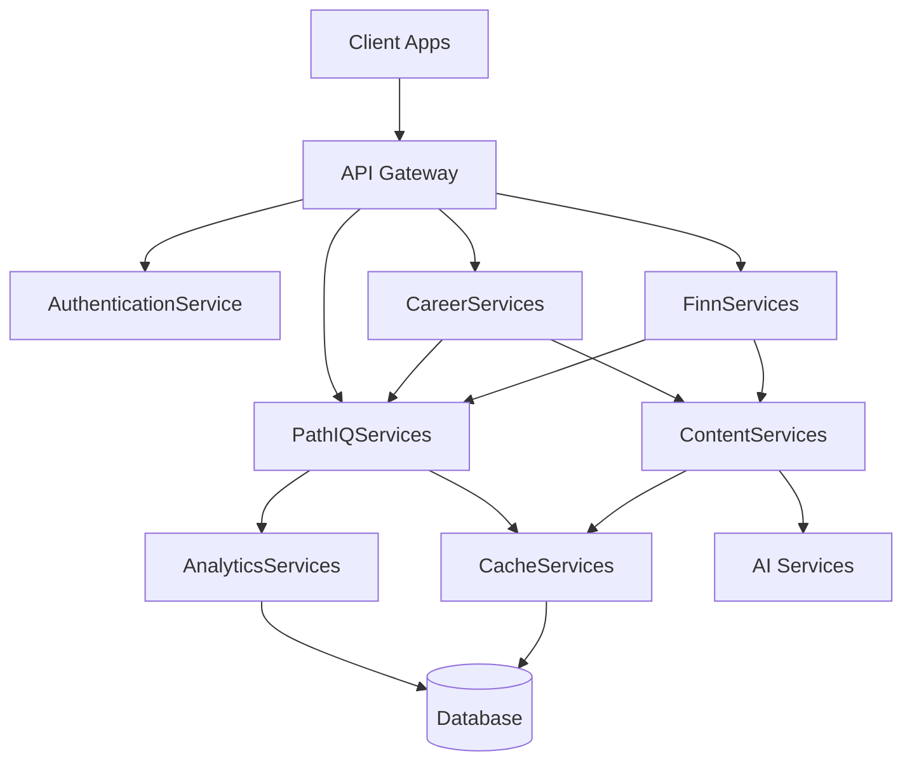

# Service Catalog Documentation
## Pathfinity Revolutionary Learning Platform

**Document Version:** 1.0  
**Last Updated:** January 2025  
**Status:** Living Documentation  
**Owner:** Backend Architecture Team  
**Reviewed By:** DevOps Director, CTO, Service Owners

---

## Executive Summary

This document catalogs Pathfinity's 34+ revolutionary services that power our Career-First learning platform. Each service is meticulously designed to support our value hierarchy (Career-First → PathIQ → Finn) while maintaining the scale, performance, and cost efficiency needed to serve millions of students at <$0.05 per day. These services represent the engine room of our educational revolution.

---

## 1. Service Architecture Overview

### 1.1 Service Taxonomy

```yaml
Service Categories:
  Core Services:           # Foundation services
    - AuthenticationService
    - AuthorizationService
    - UserManagementService
    - SessionService
    
  Career Services:         # PRIMARY VALUE
    - CareerSelectionService
    - CareerTransformationService
    - CareerProgressionService
    - CareerContentService
    
  PathIQ Services:        # SECONDARY VALUE
    - PathIQAnalysisService
    - PersonalizationService
    - PredictiveInterventionService
    - FlowStateService
    
  Finn Agent Services:    # TERTIARY VALUE
    - FinnOrchestratorService
    - FinnSeeService
    - FinnSpeakService
    - FinnThinkService
    - FinnSafeService
    - FinnViewService
    
  Content Services:
    - ContentGenerationService
    - ContentTransformationService
    - ContentCacheService
    - MediaProcessingService
    
  Analytics Services:
    - UnifiedAnalyticsService
    - RealTimeMetricsService
    - PredictiveAnalyticsService
    - ReportingService
    
  Infrastructure Services:
    - CacheManagementService
    - QueueService
    - NotificationService
    - FileStorageService
```

### 1.2 Service Communication Patterns

```typescript
// Service mesh architecture
interface ServiceMesh {
  protocol: 'HTTP/2' | 'gRPC' | 'WebSocket';
  discovery: 'Consul' | 'Kubernetes';
  loadBalancing: 'RoundRobin' | 'LeastConnection' | 'Weighted';
  circuitBreaker: CircuitBreakerConfig;
  retry: RetryConfig;
  timeout: TimeoutConfig;
}

// Inter-service communication
const serviceCommunication = {
  synchronous: {
    REST: 'For client-facing APIs',
    gRPC: 'For internal service communication',
    GraphQL: 'For flexible data fetching',
  },
  asynchronous: {
    EventBus: 'For event-driven architecture',
    MessageQueue: 'For task processing',
    PubSub: 'For real-time updates',
  },
};
```

---

## 2. Core Services

### 2.1 AuthenticationService

**Purpose:** Secure multi-tenant authentication  
**Criticality:** P0 - Mission Critical  
**SLA:** 99.99% uptime, <100ms response

```typescript
interface AuthenticationService {
  // Service configuration
  config: {
    providers: ['Auth0', 'Google', 'Microsoft', 'Clever'];
    mfa: {
      enabled: true;
      methods: ['TOTP', 'SMS', 'Email', 'Passkey'];
    };
    sessionDuration: {
      student: 4 * 60 * 60 * 1000; // 4 hours
      teacher: 8 * 60 * 60 * 1000; // 8 hours
      parent: 1 * 60 * 60 * 1000;  // 1 hour
    };
  };

  // Core methods
  authenticate(credentials: Credentials): Promise<AuthResult>;
  validateToken(token: string): Promise<TokenValidation>;
  refreshToken(refreshToken: string): Promise<TokenPair>;
  logout(sessionId: string): Promise<void>;
  
  // SSO methods
  initiateSAML(providerId: string): Promise<SAMLRequest>;
  handleSAMLResponse(response: SAMLResponse): Promise<AuthResult>;
  
  // MFA methods
  enrollMFA(userId: string, method: MFAMethod): Promise<MFAEnrollment>;
  verifyMFA(userId: string, code: string): Promise<MFAVerification>;
}

// Implementation details
class AuthenticationServiceImpl implements AuthenticationService {
  private readonly tokenService: TokenService;
  private readonly userStore: UserStore;
  private readonly auditLog: AuditLogger;
  
  async authenticate(credentials: Credentials): Promise<AuthResult> {
    // Validate credentials
    const user = await this.validateCredentials(credentials);
    
    // Check MFA requirement
    if (user.mfaEnabled) {
      return { requiresMFA: true, challengeId: await this.createMFAChallenge(user) };
    }
    
    // Generate tokens
    const tokens = await this.tokenService.generateTokenPair(user);
    
    // Audit log
    await this.auditLog.log('authentication', {
      userId: user.id,
      method: credentials.type,
      success: true,
    });
    
    return { success: true, tokens, user };
  }
}
```

### 2.2 AuthorizationService

**Purpose:** Fine-grained access control  
**Criticality:** P0 - Mission Critical  
**SLA:** 99.99% uptime, <50ms response

```typescript
interface AuthorizationService {
  // Role-based access control
  checkPermission(
    userId: string,
    resource: string,
    action: string
  ): Promise<boolean>;
  
  // Attribute-based access control
  evaluatePolicy(
    subject: Subject,
    resource: Resource,
    action: Action,
    context: Context
  ): Promise<PolicyDecision>;
  
  // Role management
  assignRole(userId: string, role: Role): Promise<void>;
  removeRole(userId: string, role: Role): Promise<void>;
  getUserRoles(userId: string): Promise<Role[]>;
  
  // Permission caching
  cachePermissions(userId: string, permissions: Permission[]): Promise<void>;
  invalidateCache(userId: string): Promise<void>;
}

// Permission matrix
const PERMISSION_MATRIX = {
  student: {
    career: ['select', 'view_own', 'complete_activities'],
    content: ['view', 'interact', 'submit'],
    profile: ['view_own', 'edit_own'],
  },
  teacher: {
    career: ['view_all', 'suggest', 'override'],
    content: ['view', 'create', 'edit', 'assign'],
    students: ['view', 'message', 'assess'],
  },
  parent: {
    career: ['view_child', 'suggest'],
    content: ['view_child'],
    profile: ['view_child', 'message_teacher'],
  },
  admin: {
    '*': ['*'], // Full access
  },
};
```

### 2.3 SessionService

**Purpose:** Distributed session management  
**Criticality:** P0 - Mission Critical  
**SLA:** 99.9% uptime, <100ms response

```typescript
interface SessionService {
  // Session lifecycle
  createSession(userId: string, metadata: SessionMetadata): Promise<Session>;
  getSession(sessionId: string): Promise<Session | null>;
  updateSession(sessionId: string, updates: Partial<Session>): Promise<void>;
  endSession(sessionId: string): Promise<void>;
  
  // Session queries
  getActiveSessions(userId: string): Promise<Session[]>;
  getSessionsBySchool(schoolId: string): Promise<Session[]>;
  getConcurrentUsers(): Promise<number>;
  
  // Session persistence
  saveSessionState(sessionId: string, state: SessionState): Promise<void>;
  restoreSessionState(sessionId: string): Promise<SessionState>;
}

// Session structure
interface Session {
  id: string;
  userId: string;
  startTime: Date;
  lastActivity: Date;
  career?: Career;
  container?: ContainerType;
  pathIQMetrics?: PathIQSessionMetrics;
  finnAgents?: FinnAgentActivity[];
  metadata: {
    ip: string;
    userAgent: string;
    school: string;
    grade: number;
  };
}
```

---

## 3. Career Services (PRIMARY VALUE)

### 3.1 CareerSelectionService

**Purpose:** Daily career selection engine  
**Criticality:** P0 - Mission Critical  
**Value Hierarchy:** PRIMARY  
**SLA:** 99.9% uptime, <500ms response

```typescript
interface CareerSelectionService {
  // Career pool generation
  generateDailyPool(
    studentId: string,
    date: Date
  ): Promise<CareerPool>;
  
  // Career selection
  selectCareer(
    studentId: string,
    careerId: string,
    reason?: SelectionReason
  ): Promise<CareerSession>;
  
  // Career recommendations
  getPassionCareer(studentId: string): Promise<Career>;
  predictLikelyCareers(studentId: string): Promise<Career[]>;
  
  // Career history
  getCareerHistory(studentId: string): Promise<CareerHistory>;
  getCareerStats(studentId: string, careerId: string): Promise<CareerStats>;
}

// Implementation with intelligent selection
class CareerSelectionServiceImpl implements CareerSelectionService {
  private readonly careerRepo: CareerRepository;
  private readonly studentProfile: StudentProfileService;
  private readonly pathIQ: PathIQAnalysisService;
  private readonly cache: CacheService;
  
  async generateDailyPool(studentId: string, date: Date): Promise<CareerPool> {
    // Get student profile
    const profile = await this.studentProfile.getProfile(studentId);
    
    // Get grade-appropriate careers
    const eligibleCareers = await this.careerRepo.getByGradeLevel(profile.gradeLevel);
    
    // Filter out recently selected
    const recentHistory = await this.getRecentHistory(studentId, 5);
    const available = eligibleCareers.filter(c => 
      !recentHistory.some(h => h.careerId === c.id)
    );
    
    // Generate 3 random careers
    const randomCareers = this.selectRandom(available, 3);
    
    // Get 1 passion career based on interests
    const passionCareer = await this.calculatePassionCareer(profile, available);
    
    // Cache the pool
    await this.cache.set(
      `career-pool:${studentId}:${date.toISOString()}`,
      { randomCareers, passionCareer },
      { ttl: 86400 }
    );
    
    return {
      date,
      randomCareers,
      passionCareer,
      totalAvailable: available.length,
    };
  }
  
  private async calculatePassionCareer(
    profile: StudentProfile,
    careers: Career[]
  ): Promise<Career> {
    // Use PathIQ to analyze interests
    const interests = await this.pathIQ.analyzeInterests(profile);
    
    // Score each career against interests
    const scoredCareers = careers.map(career => ({
      career,
      score: this.calculateInterestAlignment(career, interests),
    }));
    
    // Return highest scoring career
    scoredCareers.sort((a, b) => b.score - a.score);
    return scoredCareers[0].career;
  }
}
```

### 3.2 CareerTransformationService

**Purpose:** Transform all content through career lens  
**Criticality:** P0 - Mission Critical  
**Value Hierarchy:** PRIMARY  
**SLA:** 99.9% uptime, <1s response

```typescript
interface CareerTransformationService {
  // Content transformation
  transformContent(
    content: AcademicContent,
    career: Career,
    studentProfile: StudentProfile
  ): Promise<TransformedContent>;
  
  // Problem generation
  generateCareerProblems(
    concept: AcademicConcept,
    career: Career,
    count: number,
    difficulty: DifficultyLevel
  ): Promise<Problem[]>;
  
  // Narrative creation
  createCareerNarrative(
    lesson: Lesson,
    career: Career,
    episodeNumber: number
  ): Promise<Narrative>;
  
  // Simulation design
  designCareerSimulation(
    skills: Skill[],
    career: Career,
    duration: number
  ): Promise<Simulation>;
}

// Advanced transformation engine
class CareerTransformationServiceImpl implements CareerTransformationService {
  private readonly aiService: AIService;
  private readonly contentRepo: ContentRepository;
  private readonly careerContext: CareerContextService;
  
  async transformContent(
    content: AcademicContent,
    career: Career,
    studentProfile: StudentProfile
  ): Promise<TransformedContent> {
    // Get career context
    const context = await this.careerContext.getContext(career);
    
    // Create transformation prompt
    const prompt = this.buildTransformationPrompt(content, career, context);
    
    // Use AI to transform
    const transformed = await this.aiService.transform(prompt, {
      model: 'gpt-4',
      temperature: 0.7,
      maxTokens: 2000,
    });
    
    // Validate transformation maintains academic rigor
    const validation = await this.validateTransformation(content, transformed);
    if (!validation.valid) {
      // Fallback to template-based transformation
      return this.templateTransform(content, career);
    }
    
    // Cache transformed content
    await this.cacheTransformation(content.id, career.id, transformed);
    
    return transformed;
  }
  
  async generateCareerProblems(
    concept: AcademicConcept,
    career: Career,
    count: number,
    difficulty: DifficultyLevel
  ): Promise<Problem[]> {
    const problems: Problem[] = [];
    
    for (let i = 0; i < count; i++) {
      const problem = await this.createSingleProblem(concept, career, difficulty);
      
      // Ensure uniqueness
      if (!problems.some(p => this.areSimilar(p, problem))) {
        problems.push(problem);
      } else {
        i--; // Retry
      }
    }
    
    return problems;
  }
  
  private async createSingleProblem(
    concept: AcademicConcept,
    career: Career,
    difficulty: DifficultyLevel
  ): Promise<Problem> {
    // Career-specific problem templates
    const template = this.selectTemplate(concept.subject, career.category);
    
    // Generate problem with career context
    const problem = await this.aiService.generateProblem({
      template,
      concept,
      career,
      difficulty,
      constraints: {
        realWorld: true,
        engaging: true,
        ageAppropriate: true,
      },
    });
    
    return {
      id: generateId(),
      question: problem.question,
      answer: problem.answer,
      explanation: problem.explanation,
      hints: problem.hints,
      careerContext: problem.context,
      difficulty,
    };
  }
}
```

### 3.3 CareerProgressionService

**Purpose:** Track and manage career progression  
**Criticality:** P1 - High  
**Value Hierarchy:** PRIMARY  
**SLA:** 99.5% uptime, <500ms response

```typescript
interface CareerProgressionService {
  // Progression tracking
  trackCareerTime(studentId: string, careerId: string, minutes: number): Promise<void>;
  calculateMastery(studentId: string, careerId: string): Promise<MasteryLevel>;
  getCareerPortfolio(studentId: string): Promise<CareerPortfolio>;
  
  // Skill development
  recordSkillDevelopment(
    studentId: string,
    careerId: string,
    skills: SkillProgress[]
  ): Promise<void>;
  
  getSkillMap(studentId: string): Promise<SkillMap>;
  
  // Career recommendations
  recommendNextCareer(studentId: string): Promise<Career[]>;
  identifyCareerPathways(studentId: string): Promise<CareerPathway[]>;
}

// Career mastery calculation
class CareerProgressionServiceImpl implements CareerProgressionService {
  async calculateMastery(studentId: string, careerId: string): Promise<MasteryLevel> {
    const history = await this.getCareerHistory(studentId, careerId);
    
    const factors = {
      timeSpent: history.totalMinutes / 60, // hours
      sessionsCompleted: history.sessions.length,
      skillsAcquired: history.skills.length,
      projectsCompleted: history.projects.length,
      assessmentScores: history.averageScore,
      peerCollaborations: history.collaborations,
    };
    
    // Weighted mastery calculation
    const mastery = 
      factors.timeSpent * 0.15 +
      factors.sessionsCompleted * 0.20 +
      factors.skillsAcquired * 0.25 +
      factors.projectsCompleted * 0.20 +
      factors.assessmentScores * 0.15 +
      factors.peerCollaborations * 0.05;
    
    return {
      level: Math.floor(mastery / 10),
      progress: mastery % 10,
      nextMilestone: this.getNextMilestone(mastery),
      achievements: await this.getAchievements(studentId, careerId),
    };
  }
}
```

---

## 4. PathIQ Intelligence Services (SECONDARY VALUE)

### 4.1 PathIQAnalysisService

**Purpose:** Real-time cognitive and emotional analysis  
**Criticality:** P0 - Mission Critical  
**Value Hierarchy:** SECONDARY  
**SLA:** 99.9% uptime, <200ms response

```typescript
interface PathIQAnalysisService {
  // Real-time analysis
  analyzeCognitiveState(
    studentId: string,
    interactions: Interaction[]
  ): Promise<CognitiveState>;
  
  analyzeEmotionalState(
    studentId: string,
    signals: EmotionalSignal[]
  ): Promise<EmotionalState>;
  
  analyzeFlowState(
    studentId: string,
    metrics: PerformanceMetrics
  ): Promise<FlowState>;
  
  // Personalization analysis
  analyze47Dimensions(studentId: string): Promise<PersonalizationProfile>;
  updateDimension(
    studentId: string,
    dimension: string,
    value: number
  ): Promise<void>;
  
  // Predictive analysis
  predictLearningTrajectory(
    studentId: string,
    timeframe: number
  ): Promise<Trajectory>;
  
  identifyInterventionNeeds(
    studentId: string
  ): Promise<Intervention[]>;
}

// PathIQ implementation with ML models
class PathIQAnalysisServiceImpl implements PathIQAnalysisService {
  private readonly mlModels: MLModelService;
  private readonly dataProcessor: DataProcessingService;
  private readonly cache: CacheService;
  
  async analyzeFlowState(
    studentId: string,
    metrics: PerformanceMetrics
  ): Promise<FlowState> {
    // Process real-time metrics
    const processed = await this.dataProcessor.processMetrics(metrics);
    
    // Apply flow state model
    const flowPrediction = await this.mlModels.predict('flow-state-model', {
      challenge: processed.challengeLevel,
      skill: processed.skillLevel,
      engagement: processed.engagementScore,
      frustration: processed.frustrationIndex,
      boredom: processed.boredomIndex,
    });
    
    // Calculate flow percentage
    const flowPercentage = this.calculateFlowPercentage(flowPrediction);
    
    // Determine adjustments needed
    const adjustments = this.calculateAdjustments(flowPercentage, processed);
    
    // Cache state for trend analysis
    await this.cacheFlowState(studentId, flowPercentage, adjustments);
    
    return {
      percentage: flowPercentage,
      state: this.categorizeFlowState(flowPercentage),
      adjustments,
      confidence: flowPrediction.confidence,
      timestamp: new Date(),
    };
  }
  
  async analyze47Dimensions(studentId: string): Promise<PersonalizationProfile> {
    const dimensions = [
      'learning_pace',
      'abstraction_preference',
      'visual_learning',
      'auditory_learning',
      'kinesthetic_learning',
      'social_learning',
      'attention_span',
      'cognitive_load_capacity',
      'motivation_type',
      'challenge_preference',
      // ... 37 more dimensions
    ];
    
    const profile: PersonalizationProfile = {};
    
    for (const dimension of dimensions) {
      const value = await this.analyzeDimension(studentId, dimension);
      profile[dimension] = value;
    }
    
    return profile;
  }
  
  private async analyzeDimension(
    studentId: string,
    dimension: string
  ): Promise<number> {
    // Get historical data
    const history = await this.getStudentHistory(studentId);
    
    // Apply dimension-specific model
    const model = await this.mlModels.getModel(`dimension-${dimension}`);
    const prediction = await model.predict(history);
    
    return prediction.value;
  }
}
```

### 4.2 PredictiveInterventionService

**Purpose:** 30-day predictive intervention system  
**Criticality:** P0 - Mission Critical  
**Value Hierarchy:** SECONDARY  
**SLA:** 99.5% uptime, <1s response

```typescript
interface PredictiveInterventionService {
  // Prediction generation
  predictChallenges(
    studentId: string,
    timeframeDays: number
  ): Promise<PredictedChallenge[]>;
  
  predictEngagementDrop(
    studentId: string
  ): Promise<EngagementPrediction>;
  
  predictSkillGaps(
    studentId: string,
    upcomingContent: Content[]
  ): Promise<SkillGap[]>;
  
  // Intervention planning
  generateInterventionPlan(
    studentId: string,
    predictions: Prediction[]
  ): Promise<InterventionPlan>;
  
  scheduleProactiveSupport(
    studentId: string,
    intervention: Intervention
  ): Promise<void>;
  
  // Effectiveness tracking
  trackInterventionSuccess(
    interventionId: string,
    outcome: InterventionOutcome
  ): Promise<void>;
}

// Predictive modeling implementation
class PredictiveInterventionServiceImpl implements PredictiveInterventionService {
  private readonly timeSeriesModel: TimeSeriesModel;
  private readonly patternRecognition: PatternRecognitionService;
  private readonly interventionEngine: InterventionEngine;
  
  async predictChallenges(
    studentId: string,
    timeframeDays: number
  ): Promise<PredictedChallenge[]> {
    // Get student learning pattern
    const pattern = await this.patternRecognition.analyzeLearningPattern(studentId);
    
    // Get upcoming curriculum
    const curriculum = await this.getCurriculum(studentId, timeframeDays);
    
    // Apply predictive model
    const predictions = await this.timeSeriesModel.predict({
      historicalPattern: pattern,
      upcomingContent: curriculum,
      studentProfile: await this.getStudentProfile(studentId),
      timeframe: timeframeDays,
    });
    
    // Filter high-risk challenges
    const challenges = predictions
      .filter(p => p.riskScore > 0.7)
      .map(p => ({
        date: p.date,
        content: p.content,
        riskScore: p.riskScore,
        riskFactors: p.factors,
        recommendedIntervention: this.selectIntervention(p),
      }));
    
    return challenges;
  }
  
  async generateInterventionPlan(
    studentId: string,
    predictions: Prediction[]
  ): Promise<InterventionPlan> {
    const interventions: PlannedIntervention[] = [];
    
    for (const prediction of predictions) {
      const intervention = await this.interventionEngine.design({
        studentId,
        challenge: prediction.challenge,
        timing: this.calculateOptimalTiming(prediction),
        type: this.selectInterventionType(prediction),
        intensity: this.calculateIntensity(prediction.riskScore),
      });
      
      interventions.push(intervention);
    }
    
    // Optimize intervention schedule
    const optimizedSchedule = this.optimizeSchedule(interventions);
    
    return {
      studentId,
      interventions: optimizedSchedule,
      startDate: new Date(),
      endDate: this.addDays(new Date(), 30),
      estimatedImpact: this.estimateImpact(optimizedSchedule),
    };
  }
}
```

### 4.3 FlowStateService

**Purpose:** Maintain optimal learning flow state  
**Criticality:** P0 - Mission Critical  
**Value Hierarchy:** SECONDARY  
**SLA:** 99.9% uptime, <100ms response

```typescript
interface FlowStateService {
  // Flow monitoring
  monitorFlowState(studentId: string): Promise<FlowMonitor>;
  getCurrentFlowState(studentId: string): Promise<FlowState>;
  getFlowHistory(studentId: string, period: TimePeriod): Promise<FlowHistory>;
  
  // Flow optimization
  optimizeDifficulty(
    studentId: string,
    currentPerformance: Performance
  ): Promise<DifficultyAdjustment>;
  
  suggestBreak(studentId: string): Promise<BreakSuggestion>;
  maintainEngagement(studentId: string): Promise<EngagementStrategy>;
  
  // Flow analytics
  calculateFlowMetrics(studentId: string): Promise<FlowMetrics>;
  compareToTarget(studentId: string): Promise<FlowComparison>;
}

// Flow state optimization engine
class FlowStateServiceImpl implements FlowStateService {
  private readonly TARGET_FLOW_PERCENTAGE = 0.75; // 75% time in flow
  
  async optimizeDifficulty(
    studentId: string,
    currentPerformance: Performance
  ): Promise<DifficultyAdjustment> {
    const flowState = await this.getCurrentFlowState(studentId);
    
    // Csikszentmihalyi's flow model
    const challengeSkillRatio = currentPerformance.challenge / currentPerformance.skill;
    
    if (challengeSkillRatio > 1.3) {
      // Too challenging - reduce difficulty
      return {
        action: 'decrease',
        magnitude: this.calculateDecrease(challengeSkillRatio),
        reason: 'anxiety_prevention',
      };
    } else if (challengeSkillRatio < 0.7) {
      // Too easy - increase difficulty
      return {
        action: 'increase',
        magnitude: this.calculateIncrease(challengeSkillRatio),
        reason: 'boredom_prevention',
      };
    } else if (flowState.percentage < this.TARGET_FLOW_PERCENTAGE) {
      // Fine-tune for optimal flow
      return this.fineTuneDifficulty(flowState, currentPerformance);
    }
    
    return { action: 'maintain', reason: 'optimal_flow' };
  }
  
  private fineTuneDifficulty(
    flowState: FlowState,
    performance: Performance
  ): DifficultyAdjustment {
    // Micro-adjustments to maintain flow
    const adjustment = (this.TARGET_FLOW_PERCENTAGE - flowState.percentage) * 0.1;
    
    return {
      action: adjustment > 0 ? 'increase' : 'decrease',
      magnitude: Math.abs(adjustment),
      reason: 'flow_optimization',
    };
  }
}
```

---

## 5. Finn Agent Services (TERTIARY VALUE)

### 5.1 FinnOrchestratorService

**Purpose:** Multi-agent orchestration and coordination  
**Criticality:** P0 - Mission Critical  
**Value Hierarchy:** TERTIARY  
**SLA:** 99.5% uptime, <300ms response

```typescript
interface FinnOrchestratorService {
  // Agent orchestration
  orchestrateAgents(
    task: LearningTask,
    availableAgents: FinnAgent[]
  ): Promise<OrchestrationPlan>;
  
  executeOrchestration(plan: OrchestrationPlan): Promise<OrchestrationResult>;
  
  // Collaboration modes
  executeSequential(agents: FinnAgent[], task: Task): Promise<Result>;
  executeParallel(agents: FinnAgent[], task: Task): Promise<Result[]>;
  executeCompetitive(agents: FinnAgent[], task: Task): Promise<BestResult>;
  executeConsensus(agents: FinnAgent[], task: Task): Promise<ConsensusResult>;
  
  // Agent management
  monitorAgentHealth(agentId: string): Promise<HealthStatus>;
  balanceAgentLoad(agents: FinnAgent[]): Promise<LoadDistribution>;
}

// Intelligent orchestration implementation
class FinnOrchestratorServiceImpl implements FinnOrchestratorService {
  private readonly agentRegistry: AgentRegistry;
  private readonly taskAnalyzer: TaskAnalyzer;
  private readonly loadBalancer: LoadBalancer;
  
  async orchestrateAgents(
    task: LearningTask,
    availableAgents: FinnAgent[]
  ): Promise<OrchestrationPlan> {
    // Analyze task requirements
    const requirements = await this.taskAnalyzer.analyze(task);
    
    // Select optimal agents
    const selectedAgents = this.selectAgents(requirements, availableAgents);
    
    // Determine collaboration mode
    const mode = this.determineCollaborationMode(task, selectedAgents);
    
    // Create execution plan
    const plan: OrchestrationPlan = {
      taskId: task.id,
      agents: selectedAgents,
      mode,
      sequence: mode === 'sequential' ? this.planSequence(selectedAgents, task) : undefined,
      parallelGroups: mode === 'parallel' ? this.planParallel(selectedAgents, task) : undefined,
      timeout: this.calculateTimeout(task),
      fallbackPlan: this.createFallbackPlan(task),
    };
    
    return plan;
  }
  
  async executeParallel(agents: FinnAgent[], task: Task): Promise<Result[]> {
    const promises = agents.map(agent => 
      this.executeAgentTask(agent, task).catch(error => ({
        agent: agent.id,
        error,
        fallback: true,
      }))
    );
    
    const results = await Promise.allSettled(promises);
    
    return results.map(result => 
      result.status === 'fulfilled' ? result.value : result.reason
    );
  }
  
  private determineCollaborationMode(
    task: LearningTask,
    agents: FinnAgent[]
  ): CollaborationMode {
    if (task.requiresConsensus) return 'consensus';
    if (task.allowsParallelization) return 'parallel';
    if (task.requiresOptimization) return 'competitive';
    return 'sequential';
  }
}
```

### 5.2 FinnSeeService

**Purpose:** Visual learning and content generation  
**Criticality:** P1 - High  
**Value Hierarchy:** TERTIARY  
**SLA:** 99% uptime, <2s response

```typescript
interface FinnSeeService {
  // Visual content generation
  generateVisualization(
    content: Content,
    style: VisualizationStyle
  ): Promise<Visualization>;
  
  createDiagram(
    concept: Concept,
    type: DiagramType
  ): Promise<Diagram>;
  
  generateAnimation(
    process: Process,
    duration: number
  ): Promise<Animation>;
  
  // AR/VR experiences
  createARExperience(
    career: Career,
    scenario: Scenario
  ): Promise<ARExperience>;
  
  create3DModel(
    object: Object3D,
    interactive: boolean
  ): Promise<Model3D>;
  
  // Visual analysis
  analyzeVisualPreference(studentId: string): Promise<VisualPreference>;
  optimizeVisualComplexity(
    content: VisualContent,
    studentLevel: number
  ): Promise<VisualContent>;
}
```

### 5.3 FinnSpeakService

**Purpose:** Natural language communication  
**Criticality:** P1 - High  
**Value Hierarchy:** TERTIARY  
**SLA:** 99% uptime, <500ms response

```typescript
interface FinnSpeakService {
  // Text-to-speech
  synthesizeSpeech(
    text: string,
    voice: VoiceProfile,
    emotion?: Emotion
  ): Promise<AudioStream>;
  
  // Speech-to-text
  transcribeSpeech(
    audio: AudioStream,
    language: string
  ): Promise<Transcript>;
  
  // Natural language generation
  generateExplanation(
    concept: Concept,
    studentLevel: number,
    style: ExplanationStyle
  ): Promise<string>;
  
  createDialogue(
    character: Character,
    context: Context
  ): Promise<Dialogue>;
  
  // Communication optimization
  adaptLanguageComplexity(
    text: string,
    targetLevel: number
  ): Promise<string>;
  
  translateContent(
    content: string,
    targetLanguage: string
  ): Promise<string>;
}
```

---

## 6. Content Services

### 6.1 ContentGenerationService

**Purpose:** AI-powered content creation  
**Criticality:** P0 - Mission Critical  
**SLA:** 99% uptime, <3s response

```typescript
interface ContentGenerationService {
  // Content creation
  generateLesson(
    standard: EducationalStandard,
    career: Career,
    duration: number
  ): Promise<Lesson>;
  
  generateAssessment(
    objectives: LearningObjective[],
    questionCount: number,
    difficulty: DifficultyLevel
  ): Promise<Assessment>;
  
  generateProject(
    skills: Skill[],
    career: Career,
    collaborative: boolean
  ): Promise<Project>;
  
  // Adaptive generation
  personalizeContent(
    content: Content,
    studentProfile: StudentProfile
  ): Promise<PersonalizedContent>;
  
  adjustComplexity(
    content: Content,
    targetLevel: number
  ): Promise<Content>;
  
  // Quality assurance
  validateContent(content: Content): Promise<ValidationResult>;
  ensureStandardsAlignment(
    content: Content,
    standards: Standard[]
  ): Promise<AlignmentReport>;
}

// AI-powered generation implementation
class ContentGenerationServiceImpl implements ContentGenerationService {
  private readonly aiService: AIService;
  private readonly templateEngine: TemplateEngine;
  private readonly qualityChecker: QualityChecker;
  
  async generateLesson(
    standard: EducationalStandard,
    career: Career,
    duration: number
  ): Promise<Lesson> {
    // Create generation prompt
    const prompt = this.buildLessonPrompt(standard, career, duration);
    
    // Generate with GPT-4
    const generated = await this.aiService.generate(prompt, {
      model: 'gpt-4',
      temperature: 0.8,
      maxTokens: 4000,
    });
    
    // Parse and structure
    const lesson = this.parseLesson(generated);
    
    // Ensure quality
    const quality = await this.qualityChecker.check(lesson);
    if (quality.score < 0.8) {
      // Regenerate or use template
      return this.templateEngine.generateLesson(standard, career, duration);
    }
    
    // Add three-container structure
    lesson.containers = {
      learn: await this.generateLearnContent(lesson, career),
      experience: await this.generateExperienceContent(lesson, career),
      discover: await this.generateDiscoverContent(lesson, career),
    };
    
    return lesson;
  }
  
  private async generateLearnContent(
    lesson: Lesson,
    career: Career
  ): Promise<LearnContent> {
    return {
      duration: 20,
      objectives: lesson.objectives,
      instruction: await this.transformInstruction(lesson.content, career),
      practice: await this.generatePracticeProblems(lesson.objectives, career),
      assessment: await this.generateFormativeAssessment(lesson.objectives),
    };
  }
}
```

### 6.2 ContentCacheService

**Purpose:** Multi-tier content caching  
**Criticality:** P0 - Mission Critical  
**SLA:** 99.9% uptime, <50ms response

```typescript
interface ContentCacheService {
  // Cache operations
  get<T>(key: string): Promise<T | null>;
  set<T>(key: string, value: T, options?: CacheOptions): Promise<void>;
  invalidate(pattern: string): Promise<void>;
  
  // Predictive caching
  preloadContent(studentId: string, predictions: Prediction[]): Promise<void>;
  warmCache(schoolId: string, date: Date): Promise<void>;
  
  // Cache analytics
  getHitRate(timeframe: TimeFrame): Promise<number>;
  getCacheSavings(timeframe: TimeFrame): Promise<CostSavings>;
  
  // Journey caching (proprietary)
  cacheJourney(
    studentId: string,
    journey: LearningJourney
  ): Promise<void>;
  
  getCachedJourney(studentId: string): Promise<LearningJourney | null>;
}

// Multi-tier cache implementation
class ContentCacheServiceImpl implements ContentCacheService {
  private readonly edgeCache: EdgeCache;      // L1: CDN edge
  private readonly redisCache: RedisCache;    // L2: Application
  private readonly dbCache: DatabaseCache;    // L3: Database
  private readonly journeyCache: JourneyCache; // L4: Predictive
  
  async get<T>(key: string): Promise<T | null> {
    // Try L1: Edge cache
    let value = await this.edgeCache.get<T>(key);
    if (value) {
      this.metrics.recordHit('edge');
      return value;
    }
    
    // Try L2: Redis cache
    value = await this.redisCache.get<T>(key);
    if (value) {
      this.metrics.recordHit('redis');
      // Promote to edge
      await this.edgeCache.set(key, value, { ttl: 3600 });
      return value;
    }
    
    // Try L3: Database cache
    value = await this.dbCache.get<T>(key);
    if (value) {
      this.metrics.recordHit('database');
      // Promote to higher tiers
      await this.redisCache.set(key, value, { ttl: 900 });
      await this.edgeCache.set(key, value, { ttl: 3600 });
      return value;
    }
    
    // Try L4: Journey cache (predictive)
    value = await this.journeyCache.predict<T>(key);
    if (value) {
      this.metrics.recordHit('journey');
      // Populate all tiers
      await this.populateAllTiers(key, value);
      return value;
    }
    
    this.metrics.recordMiss();
    return null;
  }
  
  async preloadContent(studentId: string, predictions: Prediction[]): Promise<void> {
    // Predictive content generation
    for (const prediction of predictions) {
      const content = await this.generatePredictedContent(studentId, prediction);
      
      // Cache with appropriate TTL
      const ttl = this.calculateTTL(prediction.probability, prediction.timeframe);
      await this.set(
        `predicted:${studentId}:${prediction.contentId}`,
        content,
        { ttl }
      );
    }
  }
}
```

---

## 7. Analytics Services

### 7.1 UnifiedAnalyticsService

**Purpose:** Comprehensive learning analytics  
**Criticality:** P1 - High  
**SLA:** 99% uptime, <1s response

```typescript
interface UnifiedAnalyticsService {
  // Real-time analytics
  trackEvent(event: AnalyticsEvent): Promise<void>;
  getRealtimeMetrics(scope: AnalyticsScope): Promise<RealtimeMetrics>;
  
  // Student analytics
  getStudentAnalytics(studentId: string): Promise<StudentAnalytics>;
  getProgressReport(studentId: string, period: Period): Promise<ProgressReport>;
  
  // Class analytics
  getClassAnalytics(classId: string): Promise<ClassAnalytics>;
  compareStudents(classId: string): Promise<Comparison>;
  
  // School analytics
  getSchoolDashboard(schoolId: string): Promise<SchoolDashboard>;
  getAchievementGaps(schoolId: string): Promise<AchievementGapAnalysis>;
  
  // Predictive analytics
  forecastOutcomes(studentId: string): Promise<OutcomeForecast>;
  identifyAtRiskStudents(classId: string): Promise<Student[]>;
}

// Comprehensive analytics implementation
class UnifiedAnalyticsServiceImpl implements UnifiedAnalyticsService {
  private readonly eventProcessor: EventProcessor;
  private readonly aggregator: DataAggregator;
  private readonly predictor: PredictiveEngine;
  
  async getStudentAnalytics(studentId: string): Promise<StudentAnalytics> {
    // Gather data from multiple sources
    const [
      engagement,
      performance,
      careerExploration,
      skillDevelopment,
      flowMetrics,
      socialInteraction,
    ] = await Promise.all([
      this.getEngagementMetrics(studentId),
      this.getPerformanceMetrics(studentId),
      this.getCareerMetrics(studentId),
      this.getSkillMetrics(studentId),
      this.getFlowMetrics(studentId),
      this.getSocialMetrics(studentId),
    ]);
    
    // Calculate composite scores
    const analytics: StudentAnalytics = {
      studentId,
      timestamp: new Date(),
      engagement: {
        daily: engagement.dailyAverage,
        weekly: engagement.weeklyTrend,
        monthly: engagement.monthlyPattern,
        score: engagement.compositeScore,
      },
      performance: {
        academic: performance.academicScore,
        improvement: performance.improvementRate,
        strengths: performance.topSkills,
        opportunities: performance.growthAreas,
      },
      careerExploration: {
        careersExplored: careerExploration.count,
        topInterests: careerExploration.topCareers,
        masteryLevels: careerExploration.mastery,
        careerReadiness: careerExploration.readinessScore,
      },
      skills: {
        acquired: skillDevelopment.acquiredSkills,
        inProgress: skillDevelopment.developingSkills,
        recommended: skillDevelopment.recommendedNext,
        crossCareer: skillDevelopment.transferableSkills,
      },
      flowState: {
        averageTime: flowMetrics.averageFlowTime,
        peakTimes: flowMetrics.optimalLearningTimes,
        triggers: flowMetrics.flowTriggers,
        barriers: flowMetrics.flowBarriers,
      },
      predictions: {
        nextWeekForecast: await this.predictor.forecastWeek(studentId),
        interventionNeeds: await this.predictor.identifyNeeds(studentId),
        recommendedActions: await this.predictor.recommendActions(studentId),
      },
    };
    
    return analytics;
  }
}
```

---

## 8. Infrastructure Services

### 8.1 CacheManagementService

**Purpose:** Orchestrate multi-tier caching strategy  
**Criticality:** P0 - Mission Critical  
**SLA:** 99.99% uptime, <10ms response

```typescript
interface CacheManagementService {
  // Cache coordination
  coordinateCaches(caches: CacheLayer[]): Promise<void>;
  optimizeCacheDistribution(content: Content[]): Promise<Distribution>;
  
  // Cost optimization (80% reduction target)
  calculateCostSavings(): Promise<CostAnalysis>;
  optimizeForCost(budget: Budget): Promise<OptimizationPlan>;
  
  // Invalidation
  cascadeInvalidation(key: string): Promise<void>;
  smartInvalidation(pattern: string): Promise<void>;
}
```

### 8.2 QueueService

**Purpose:** Asynchronous task processing  
**Criticality:** P1 - High  
**SLA:** 99.9% uptime

```typescript
interface QueueService {
  // Queue operations
  enqueue<T>(queue: string, task: T, priority?: Priority): Promise<void>;
  dequeue<T>(queue: string): Promise<T | null>;
  
  // Batch processing
  enqueueBatch<T>(queue: string, tasks: T[]): Promise<void>;
  processBatch<T>(queue: string, processor: BatchProcessor<T>): Promise<void>;
  
  // Dead letter queue
  handleFailedTask<T>(task: T, error: Error): Promise<void>;
  retryFailedTasks(queue: string): Promise<void>;
}
```

---

## 9. Service Integration Patterns

### 9.1 Service Mesh Configuration

```yaml
service_mesh:
  discovery:
    type: consul
    health_check_interval: 10s
    deregister_critical_after: 1m
    
  load_balancing:
    algorithm: weighted_round_robin
    health_weight: 0.5
    latency_weight: 0.3
    cpu_weight: 0.2
    
  circuit_breaker:
    error_threshold: 50%
    timeout: 30s
    half_open_requests: 1
    reset_timeout: 60s
    
  retry:
    max_attempts: 3
    backoff: exponential
    base_delay: 100ms
    max_delay: 10s
    
  timeout:
    connect: 5s
    request: 30s
    idle: 120s
```

### 9.2 Service Dependencies



---

## 10. Service Monitoring

### 10.1 Key Metrics

```typescript
interface ServiceMetrics {
  // Performance metrics
  latency: {
    p50: number;
    p95: number;
    p99: number;
  };
  
  // Reliability metrics
  uptime: number;
  errorRate: number;
  
  // Business metrics
  requestsPerSecond: number;
  costPerRequest: number;
  
  // Custom metrics
  careerSelectionsPerMinute: number;
  flowStatePercentage: number;
  cacheHitRate: number;
}
```

### 10.2 Health Checks

```typescript
interface HealthCheck {
  endpoint: '/health';
  checks: {
    database: 'SELECT 1';
    cache: 'PING';
    dependencies: ServiceDependency[];
  };
  response: {
    status: 'healthy' | 'degraded' | 'unhealthy';
    version: string;
    uptime: number;
    checks: CheckResult[];
  };
}
```

---

## Service Level Agreements

### Critical Services (P0)
- Uptime: 99.9% minimum
- Response time: <500ms p95
- Error rate: <0.1%
- Recovery time: <5 minutes

### High Priority Services (P1)
- Uptime: 99.5% minimum
- Response time: <1s p95
- Error rate: <1%
- Recovery time: <15 minutes

### Standard Services (P2)
- Uptime: 99% minimum
- Response time: <2s p95
- Error rate: <2%
- Recovery time: <1 hour

---

## Appendices

### Appendix A: Service Registry

Complete list of all 34+ services with endpoints, documentation, and owners.

### Appendix B: API Specifications

OpenAPI/Swagger specifications for all service APIs.

### Appendix C: Deployment Configurations

Kubernetes manifests, Terraform configs, and CI/CD pipelines.

---

*End of Service Catalog Documentation*

**Next Document:** API Documentation

---