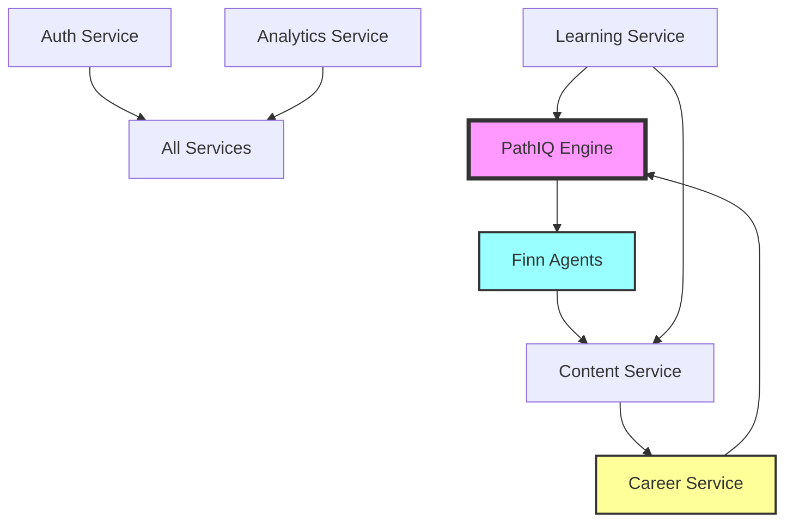
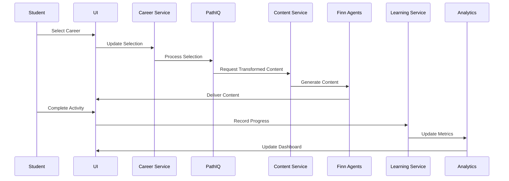

# Integration Testing Matrix
## System-Wide Integration Verification Framework

**Document Version:** 1.0  
**Last Updated:** January 2025  
**Status:** Integration Testing Framework  
**Owner:** Integration Test Lead  
**Purpose:** Ensure all system components work together seamlessly

---

## Executive Summary

This matrix defines comprehensive integration testing requirements for all Pathfinity system components. It ensures that Career-First Learning, PathIQ Intelligence, and Finn Agents work together harmoniously to deliver the designed user experience.

---

## 1. Service-to-Service Integration Testing

### 1.1 Core Service Integration Map

### 1.2 Integration Test Cases

#### PathIQ ↔ Finn Agents Integration

| Test Case | Description | Expected Result | Status | Notes |
|-----------|-------------|-----------------|--------|-------|
| PIQ-FINN-001 | PathIQ requests FinnTool orchestration | FinnTool receives request and coordinates agents | ⬜ Not Tested ⬜ Pass ⬜ Fail | |
| PIQ-FINN-002 | PathIQ sends personalization data to Finn | All agents receive relevant personalization context | ⬜ Not Tested ⬜ Pass ⬜ Fail | |
| PIQ-FINN-003 | Finn agents report back to PathIQ | PathIQ updates student model based on agent feedback | ⬜ Not Tested ⬜ Pass ⬜ Fail | |
| PIQ-FINN-004 | PathIQ flow state adjustment via Finn | Agents adapt content difficulty in real-time | ⬜ Not Tested ⬜ Pass ⬜ Fail | |
| PIQ-FINN-005 | Predictive intervention coordination | PathIQ triggers proactive Finn agent support | ⬜ Not Tested ⬜ Pass ⬜ Fail | |

#### Career Service ↔ Content Service Integration

| Test Case | Description | Expected Result | Status | Notes |
|-----------|-------------|-----------------|--------|-------|
| CAR-CON-001 | Career selection triggers content transformation | Content adapts to selected career context | ⬜ Not Tested ⬜ Pass ⬜ Fail | |
| CAR-CON-002 | Career skill mapping to curriculum | Content aligns with career skill requirements | ⬜ Not Tested ⬜ Pass ⬜ Fail | |
| CAR-CON-003 | Industry examples injection | Content includes career-specific examples | ⬜ Not Tested ⬜ Pass ⬜ Fail | |
| CAR-CON-004 | Professional tool selection | Appropriate tools activated for career/grade | ⬜ Not Tested ⬜ Pass ⬜ Fail | |
| CAR-CON-005 | Career progression updates content | Content difficulty adjusts to career mastery | ⬜ Not Tested ⬜ Pass ⬜ Fail | |

#### Learning Service ↔ Analytics Service Integration

| Test Case | Description | Expected Result | Status | Notes |
|-----------|-------------|-----------------|--------|-------|
| LRN-ANL-001 | Real-time progress tracking | Analytics receives and processes learning events | ⬜ Not Tested ⬜ Pass ⬜ Fail | |
| LRN-ANL-002 | Session data aggregation | Analytics correctly aggregates session metrics | ⬜ Not Tested ⬜ Pass ⬜ Fail | |
| LRN-ANL-003 | Achievement trigger | Analytics triggers achievements based on progress | ⬜ Not Tested ⬜ Pass ⬜ Fail | |
| LRN-ANL-004 | Intervention alerts | Analytics identifies and alerts on struggling students | ⬜ Not Tested ⬜ Pass ⬜ Fail | |
| LRN-ANL-005 | Report generation | Analytics generates accurate progress reports | ⬜ Not Tested ⬜ Pass ⬜ Fail | |

---

## 2. AI Services Integration Testing

### 2.1 Azure OpenAI Integration

| Test Case | Description | Input | Expected Output | Status | Notes |
|-----------|-------------|-------|-----------------|--------|-------|
| AI-GPT-001 | FinnSpeak text generation | Student question | Appropriate response at reading level | ⬜ Not Tested ⬜ Pass ⬜ Fail | |
| AI-GPT-002 | FinnThink problem solving | Math problem | Step-by-step solution | ⬜ Not Tested ⬜ Pass ⬜ Fail | |
| AI-GPT-003 | Content generation | Topic + career context | Career-contextualized content | ⬜ Not Tested ⬜ Pass ⬜ Fail | |
| AI-GPT-004 | Assessment creation | Learning objective | Dynamic assessment questions | ⬜ Not Tested ⬜ Pass ⬜ Fail | |
| AI-GPT-005 | Hint generation | Student struggle point | Progressive hints | ⬜ Not Tested ⬜ Pass ⬜ Fail | |

### 2.2 DALL-E Integration

| Test Case | Description | Input | Expected Output | Status | Notes |
|-----------|-------------|-------|-----------------|--------|-------|
| AI-IMG-001 | Educational diagram generation | Concept description | Clear educational visual | ⬜ Not Tested ⬜ Pass ⬜ Fail | |
| AI-IMG-002 | Career-specific imagery | Career + concept | Relevant career visual | ⬜ Not Tested ⬜ Pass ⬜ Fail | |
| AI-IMG-003 | Age-appropriate filtering | Image request + grade | Safe, appropriate image | ⬜ Not Tested ⬜ Pass ⬜ Fail | |
| AI-IMG-004 | Visual style adaptation | Student preference | Matching visual style | ⬜ Not Tested ⬜ Pass ⬜ Fail | |
| AI-IMG-005 | Batch image generation | Multiple concepts | Consistent image set | ⬜ Not Tested ⬜ Pass ⬜ Fail | |

### 2.3 Azure Speech Services Integration

| Test Case | Description | Input | Expected Output | Status | Notes |
|-----------|-------------|-------|-----------------|--------|-------|
| AI-SPH-001 | Text-to-speech generation | Text + character | Natural character voice | ⬜ Not Tested ⬜ Pass ⬜ Fail | |
| AI-SPH-002 | Speech-to-text processing | Student audio | Accurate transcription | ⬜ Not Tested ⬜ Pass ⬜ Fail | |
| AI-SPH-003 | Emotion-aware speech | Text + emotion | Emotionally appropriate voice | ⬜ Not Tested ⬜ Pass ⬜ Fail | |
| AI-SPH-004 | Multi-language support | Text + language | Correct language output | ⬜ Not Tested ⬜ Pass ⬜ Fail | |
| AI-SPH-005 | Speech rate adjustment | Text + student preference | Adjusted speech pace | ⬜ Not Tested ⬜ Pass ⬜ Fail | |

---

## 3. Database Integration Testing

### 3.1 PostgreSQL Operations

| Test Case | Description | Operation | Expected Result | Status | Notes |
|-----------|-------------|-----------|-----------------|--------|-------|
| DB-PG-001 | User data CRUD | Create/Read/Update/Delete | All operations successful | ⬜ Not Tested ⬜ Pass ⬜ Fail | |
| DB-PG-002 | Transaction integrity | Multi-table update | ACID compliance maintained | ⬜ Not Tested ⬜ Pass ⬜ Fail | |
| DB-PG-003 | Connection pooling | Concurrent connections | Efficient connection management | ⬜ Not Tested ⬜ Pass ⬜ Fail | |
| DB-PG-004 | Query performance | Complex joins | <100ms response time | ⬜ Not Tested ⬜ Pass ⬜ Fail | |
| DB-PG-005 | Backup/restore | Full backup cycle | Data integrity preserved | ⬜ Not Tested ⬜ Pass ⬜ Fail | |

### 3.2 Redis Cache Integration

| Test Case | Description | Operation | Expected Result | Status | Notes |
|-----------|-------------|-----------|-----------------|--------|-------|
| DB-RD-001 | Session management | Store/retrieve session | Session data maintained | ⬜ Not Tested ⬜ Pass ⬜ Fail | |
| DB-RD-002 | Cache invalidation | Update trigger | Cache properly invalidated | ⬜ Not Tested ⬜ Pass ⬜ Fail | |
| DB-RD-003 | TTL management | Expiration handling | Automatic cleanup works | ⬜ Not Tested ⬜ Pass ⬜ Fail | |
| DB-RD-004 | Pub/Sub messaging | Event broadcasting | All subscribers receive events | ⬜ Not Tested ⬜ Pass ⬜ Fail | |
| DB-RD-005 | Cache hit ratio | Normal operation | >60% cache hit rate | ⬜ Not Tested ⬜ Pass ⬜ Fail | |

### 3.3 Vector Database Integration

| Test Case | Description | Operation | Expected Result | Status | Notes |
|-----------|-------------|-----------|-----------------|--------|-------|
| DB-VEC-001 | Embedding storage | Store learning embeddings | Successful storage | ⬜ Not Tested ⬜ Pass ⬜ Fail | |
| DB-VEC-002 | Similarity search | Find similar content | Relevant results returned | ⬜ Not Tested ⬜ Pass ⬜ Fail | |
| DB-VEC-003 | Career matching | Match student to careers | Appropriate career suggestions | ⬜ Not Tested ⬜ Pass ⬜ Fail | |
| DB-VEC-004 | Content recommendation | Suggest next content | Personalized recommendations | ⬜ Not Tested ⬜ Pass ⬜ Fail | |
| DB-VEC-005 | Performance at scale | 1M+ vectors | <50ms query time | ⬜ Not Tested ⬜ Pass ⬜ Fail | |

---

## 4. Real-Time Communication Integration

### 4.1 WebSocket Connections

| Test Case | Description | Scenario | Expected Behavior | Status | Notes |
|-----------|-------------|----------|-------------------|--------|-------|
| RT-WS-001 | Connection establishment | Client connects | Successful handshake | ⬜ Not Tested ⬜ Pass ⬜ Fail | |
| RT-WS-002 | Real-time progress updates | Learning event | Instant UI update | ⬜ Not Tested ⬜ Pass ⬜ Fail | |
| RT-WS-003 | Collaborative features | Multi-user interaction | All users see updates | ⬜ Not Tested ⬜ Pass ⬜ Fail | |
| RT-WS-004 | Connection recovery | Network interruption | Automatic reconnection | ⬜ Not Tested ⬜ Pass ⬜ Fail | |
| RT-WS-005 | Message ordering | Rapid messages | Correct sequence maintained | ⬜ Not Tested ⬜ Pass ⬜ Fail | |

### 4.2 Server-Sent Events (SSE)

| Test Case | Description | Scenario | Expected Behavior | Status | Notes |
|-----------|-------------|----------|-------------------|--------|-------|
| RT-SSE-001 | Event stream setup | Client subscribes | Stream established | ⬜ Not Tested ⬜ Pass ⬜ Fail | |
| RT-SSE-002 | Progress notifications | Achievement earned | Client receives notification | ⬜ Not Tested ⬜ Pass ⬜ Fail | |
| RT-SSE-003 | Analytics updates | Metrics change | Dashboard updates | ⬜ Not Tested ⬜ Pass ⬜ Fail | |
| RT-SSE-004 | Connection persistence | Long session | Connection maintained | ⬜ Not Tested ⬜ Pass ⬜ Fail | |
| RT-SSE-005 | Event filtering | Selective subscription | Only relevant events received | ⬜ Not Tested ⬜ Pass ⬜ Fail | |

---

## 5. Third-Party Integration Testing

### 5.1 LMS Integration

| Test Case | Description | LMS Platform | Expected Result | Status | Notes |
|-----------|-------------|--------------|-----------------|--------|-------|
| 3P-LMS-001 | Canvas grade sync | Canvas | Grades synchronized | ⬜ Not Tested ⬜ Pass ⬜ Fail | |
| 3P-LMS-002 | Google Classroom roster | Google Classroom | Students imported | ⬜ Not Tested ⬜ Pass ⬜ Fail | |
| 3P-LMS-003 | Assignment creation | Schoology | Assignments appear in LMS | ⬜ Not Tested ⬜ Pass ⬜ Fail | |
| 3P-LMS-004 | SSO authentication | All platforms | Seamless login | ⬜ Not Tested ⬜ Pass ⬜ Fail | |
| 3P-LMS-005 | Gradebook export | All platforms | Complete grade export | ⬜ Not Tested ⬜ Pass ⬜ Fail | |

### 5.2 SIS Integration

| Test Case | Description | SIS Platform | Expected Result | Status | Notes |
|-----------|-------------|--------------|-----------------|--------|-------|
| 3P-SIS-001 | PowerSchool sync | PowerSchool | Student data synchronized | ⬜ Not Tested ⬜ Pass ⬜ Fail | |
| 3P-SIS-002 | Infinite Campus roster | Infinite Campus | Class rosters imported | ⬜ Not Tested ⬜ Pass ⬜ Fail | |
| 3P-SIS-003 | Attendance sync | All platforms | Attendance recorded | ⬜ Not Tested ⬜ Pass ⬜ Fail | |
| 3P-SIS-004 | Grade passback | All platforms | Grades updated in SIS | ⬜ Not Tested ⬜ Pass ⬜ Fail | |
| 3P-SIS-005 | Schedule import | All platforms | Class schedules imported | ⬜ Not Tested ⬜ Pass ⬜ Fail | |

### 5.3 Payment Integration

| Test Case | Description | Payment Method | Expected Result | Status | Notes |
|-----------|-------------|----------------|-----------------|--------|-------|
| 3P-PAY-001 | Stripe subscription | Credit card | Subscription activated | ⬜ Not Tested ⬜ Pass ⬜ Fail | |
| 3P-PAY-002 | PayPal payment | PayPal | Payment processed | ⬜ Not Tested ⬜ Pass ⬜ Fail | |
| 3P-PAY-003 | Invoice generation | Purchase order | Invoice created | ⬜ Not Tested ⬜ Pass ⬜ Fail | |
| 3P-PAY-004 | Refund processing | All methods | Refund completed | ⬜ Not Tested ⬜ Pass ⬜ Fail | |
| 3P-PAY-005 | Subscription management | All methods | Upgrade/downgrade works | ⬜ Not Tested ⬜ Pass ⬜ Fail | |

---

## 6. Cross-Platform Integration Testing

### 6.1 Web ↔ Mobile Synchronization

| Test Case | Description | Action | Expected Result | Status | Notes |
|-----------|-------------|--------|-----------------|--------|-------|
| XP-SYNC-001 | Progress sync | Complete lesson on web | Mobile shows progress | ⬜ Not Tested ⬜ Pass ⬜ Fail | |
| XP-SYNC-002 | Settings sync | Change settings on mobile | Web reflects changes | ⬜ Not Tested ⬜ Pass ⬜ Fail | |
| XP-SYNC-003 | Offline sync | Work offline on mobile | Syncs when online | ⬜ Not Tested ⬜ Pass ⬜ Fail | |
| XP-SYNC-004 | Achievement sync | Earn badge on web | Appears on mobile | ⬜ Not Tested ⬜ Pass ⬜ Fail | |
| XP-SYNC-005 | Career selection sync | Choose career on mobile | Web shows same career | ⬜ Not Tested ⬜ Pass ⬜ Fail | |

### 6.2 Browser Compatibility

| Test Case | Browser | Version | Expected Result | Status | Notes |
|-----------|---------|---------|-----------------|--------|-------|
| XP-BRW-001 | Chrome | Latest | Full functionality | ⬜ Not Tested ⬜ Pass ⬜ Fail | |
| XP-BRW-002 | Safari | Latest | Full functionality | ⬜ Not Tested ⬜ Pass ⬜ Fail | |
| XP-BRW-003 | Firefox | Latest | Full functionality | ⬜ Not Tested ⬜ Pass ⬜ Fail | |
| XP-BRW-004 | Edge | Latest | Full functionality | ⬜ Not Tested ⬜ Pass ⬜ Fail | |
| XP-BRW-005 | Mobile browsers | iOS/Android | Responsive design works | ⬜ Not Tested ⬜ Pass ⬜ Fail | |

---

## 7. Data Flow Integration Testing

### 7.1 Student Learning Flow

| Test Case | Description | Data Flow Path | Expected Result | Status | Notes |
|-----------|-------------|----------------|-----------------|--------|-------|
| DF-STU-001 | Career selection flow | UI → Career → PathIQ → Content | Content transforms correctly | ⬜ Not Tested ⬜ Pass ⬜ Fail | |
| DF-STU-002 | Learning progress flow | UI → Learning → Analytics | Progress tracked accurately | ⬜ Not Tested ⬜ Pass ⬜ Fail | |
| DF-STU-003 | Achievement flow | Learning → Analytics → UI | Achievements trigger correctly | ⬜ Not Tested ⬜ Pass ⬜ Fail | |
| DF-STU-004 | Assessment flow | UI → Assessment → PathIQ → Analytics | Results processed correctly | ⬜ Not Tested ⬜ Pass ⬜ Fail | |
| DF-STU-005 | Intervention flow | Analytics → PathIQ → Finn → UI | Interventions trigger appropriately | ⬜ Not Tested ⬜ Pass ⬜ Fail | |

### 7.2 Teacher Monitoring Flow

| Test Case | Description | Data Flow Path | Expected Result | Status | Notes |
|-----------|-------------|----------------|-----------------|--------|-------|
| DF-TCH-001 | Class overview flow | Analytics → UI | Real-time class status | ⬜ Not Tested ⬜ Pass ⬜ Fail | |
| DF-TCH-002 | Individual student flow | Analytics → Learning → UI | Detailed student view | ⬜ Not Tested ⬜ Pass ⬜ Fail | |
| DF-TCH-003 | Intervention alert flow | Analytics → Notification → UI | Timely alerts delivered | ⬜ Not Tested ⬜ Pass ⬜ Fail | |
| DF-TCH-004 | Report generation flow | Analytics → Report Service → UI | Accurate reports generated | ⬜ Not Tested ⬜ Pass ⬜ Fail | |
| DF-TCH-005 | Parent communication flow | UI → Messaging → Parent Portal | Messages delivered | ⬜ Not Tested ⬜ Pass ⬜ Fail | |

---

## 8. Performance Integration Testing

### 8.1 Load Testing Scenarios

| Test Case | Description | Load | Expected Performance | Status | Notes |
|-----------|-------------|------|---------------------|--------|-------|
| PERF-LD-001 | Single user journey | 1 user | <100ms response | ⬜ Not Tested ⬜ Pass ⬜ Fail | |
| PERF-LD-002 | Class simulation | 30 users | <200ms response | ⬜ Not Tested ⬜ Pass ⬜ Fail | |
| PERF-LD-003 | School simulation | 500 users | <500ms response | ⬜ Not Tested ⬜ Pass ⬜ Fail | |
| PERF-LD-004 | District simulation | 10,000 users | <1s response | ⬜ Not Tested ⬜ Pass ⬜ Fail | |
| PERF-LD-005 | Peak load | 100,000 users | System remains stable | ⬜ Not Tested ⬜ Pass ⬜ Fail | |

### 8.2 Stress Testing Scenarios

| Test Case | Description | Stress Condition | Expected Behavior | Status | Notes |
|-----------|-------------|------------------|-------------------|--------|-------|
| PERF-ST-001 | Database overload | 10x normal queries | Graceful degradation | ⬜ Not Tested ⬜ Pass ⬜ Fail | |
| PERF-ST-002 | AI service timeout | GPT-4 unavailable | Fallback to cache/alternatives | ⬜ Not Tested ⬜ Pass ⬜ Fail | |
| PERF-ST-003 | Network latency | 500ms added latency | Acceptable performance | ⬜ Not Tested ⬜ Pass ⬜ Fail | |
| PERF-ST-004 | Memory exhaustion | 90% memory used | No crashes, proper cleanup | ⬜ Not Tested ⬜ Pass ⬜ Fail | |
| PERF-ST-005 | Concurrent updates | 1000 simultaneous writes | Data integrity maintained | ⬜ Not Tested ⬜ Pass ⬜ Fail | |

---

## 9. Security Integration Testing

### 9.1 Authentication Flow

| Test Case | Description | Security Test | Expected Result | Status | Notes |
|-----------|-------------|---------------|-----------------|--------|-------|
| SEC-AUTH-001 | JWT token validation | Invalid token | Access denied | ⬜ Not Tested ⬜ Pass ⬜ Fail | |
| SEC-AUTH-002 | Session timeout | Expired session | Re-authentication required | ⬜ Not Tested ⬜ Pass ⬜ Fail | |
| SEC-AUTH-003 | Multi-factor auth | MFA challenge | Successful verification | ⬜ Not Tested ⬜ Pass ⬜ Fail | |
| SEC-AUTH-004 | SSO integration | External IdP | Seamless authentication | ⬜ Not Tested ⬜ Pass ⬜ Fail | |
| SEC-AUTH-005 | Role-based access | Unauthorized access | Permission denied | ⬜ Not Tested ⬜ Pass ⬜ Fail | |

### 9.2 Data Protection

| Test Case | Description | Security Test | Expected Result | Status | Notes |
|-----------|-------------|---------------|-----------------|--------|-------|
| SEC-DATA-001 | Encryption in transit | Network sniffing | Data encrypted | ⬜ Not Tested ⬜ Pass ⬜ Fail | |
| SEC-DATA-002 | Encryption at rest | Database access | Data encrypted | ⬜ Not Tested ⬜ Pass ⬜ Fail | |
| SEC-DATA-003 | PII protection | Data export | PII masked/removed | ⬜ Not Tested ⬜ Pass ⬜ Fail | |
| SEC-DATA-004 | COPPA compliance | Under-13 user | Appropriate restrictions | ⬜ Not Tested ⬜ Pass ⬜ Fail | |
| SEC-DATA-005 | Data sanitization | Malicious input | Input sanitized | ⬜ Not Tested ⬜ Pass ⬜ Fail | |

---

## 10. Failure Recovery Integration Testing

### 10.1 Service Failure Scenarios

| Test Case | Description | Failure Type | Expected Recovery | Status | Notes |
|-----------|-------------|--------------|-------------------|--------|-------|
| FAIL-SVC-001 | PathIQ service down | Service crash | Fallback to cached personalization | ⬜ Not Tested ⬜ Pass ⬜ Fail | |
| FAIL-SVC-002 | Finn agent failure | Agent unresponsive | Other agents compensate | ⬜ Not Tested ⬜ Pass ⬜ Fail | |
| FAIL-SVC-003 | Database connection lost | Connection timeout | Retry with exponential backoff | ⬜ Not Tested ⬜ Pass ⬜ Fail | |
| FAIL-SVC-004 | Cache service failure | Redis down | Direct database queries | ⬜ Not Tested ⬜ Pass ⬜ Fail | |
| FAIL-SVC-005 | Analytics service down | Service unavailable | Queue events for later processing | ⬜ Not Tested ⬜ Pass ⬜ Fail | |

### 10.2 Network Failure Scenarios

| Test Case | Description | Failure Type | Expected Recovery | Status | Notes |
|-----------|-------------|--------------|-------------------|--------|-------|
| FAIL-NET-001 | Internet disconnection | Complete offline | Offline mode activation | ⬜ Not Tested ⬜ Pass ⬜ Fail | |
| FAIL-NET-002 | Intermittent connection | Packet loss | Retry mechanisms work | ⬜ Not Tested ⬜ Pass ⬜ Fail | |
| FAIL-NET-003 | CDN failure | CDN unavailable | Fallback to origin | ⬜ Not Tested ⬜ Pass ⬜ Fail | |
| FAIL-NET-004 | DNS failure | DNS resolution fails | Cached DNS or IP fallback | ⬜ Not Tested ⬜ Pass ⬜ Fail | |
| FAIL-NET-005 | Regional outage | Region unavailable | Traffic rerouting | ⬜ Not Tested ⬜ Pass ⬜ Fail | |

---

## 11. End-to-End Integration Scenarios

### 11.1 Complete Student Journey

| Step | Action | Systems Involved | Expected Result | Status |
|------|--------|------------------|-----------------|--------|
| 1 | Student login | Auth → UI | Successful authentication | ⬜ Not Tested ⬜ Pass ⬜ Fail |
| 2 | Career selection | UI → Career → PathIQ | Career context established | ⬜ Not Tested ⬜ Pass ⬜ Fail |
| 3 | Content delivery | PathIQ → Content → Finn → UI | Personalized content displayed | ⬜ Not Tested ⬜ Pass ⬜ Fail |
| 4 | Learning activity | UI → Learning → PathIQ | Progress tracked | ⬜ Not Tested ⬜ Pass ⬜ Fail |
| 5 | Assessment | UI → Assessment → Analytics | Results processed | ⬜ Not Tested ⬜ Pass ⬜ Fail |
| 6 | Achievement earned | Analytics → UI | Badge displayed | ⬜ Not Tested ⬜ Pass ⬜ Fail |
| 7 | Parent notification | Analytics → Notification → Parent | Parent informed | ⬜ Not Tested ⬜ Pass ⬜ Fail |
| 8 | Progress report | Analytics → Report → UI | Report generated | ⬜ Not Tested ⬜ Pass ⬜ Fail |

### 11.2 Complete Teacher Journey

| Step | Action | Systems Involved | Expected Result | Status |
|------|--------|------------------|-----------------|--------|
| 1 | Teacher login | Auth → UI | Dashboard loaded | ⬜ Not Tested ⬜ Pass ⬜ Fail |
| 2 | View class | UI → Analytics | Class overview displayed | ⬜ Not Tested ⬜ Pass ⬜ Fail |
| 3 | Identify struggling student | Analytics → UI | Alert shown | ⬜ Not Tested ⬜ Pass ⬜ Fail |
| 4 | View student details | UI → Learning → Analytics | Complete profile shown | ⬜ Not Tested ⬜ Pass ⬜ Fail |
| 5 | Assign intervention | UI → PathIQ → Content | Intervention created | ⬜ Not Tested ⬜ Pass ⬜ Fail |
| 6 | Message parent | UI → Messaging → Parent | Message sent | ⬜ Not Tested ⬜ Pass ⬜ Fail |
| 7 | Generate report | UI → Analytics → Report | Report created | ⬜ Not Tested ⬜ Pass ⬜ Fail |
| 8 | Export grades | UI → LMS Integration | Grades exported | ⬜ Not Tested ⬜ Pass ⬜ Fail |

---

## 12. Integration Testing Summary

### Test Coverage by Category

| Category | Total Tests | Passed | Failed | Not Tested | Coverage % |
|----------|------------|--------|--------|------------|------------|
| Service Integration | 15 | 0 | 0 | 15 | 0% |
| AI Services | 15 | 0 | 0 | 15 | 0% |
| Database | 15 | 0 | 0 | 15 | 0% |
| Real-time Communication | 10 | 0 | 0 | 10 | 0% |
| Third-party | 15 | 0 | 0 | 15 | 0% |
| Cross-platform | 10 | 0 | 0 | 10 | 0% |
| Data Flow | 10 | 0 | 0 | 10 | 0% |
| Performance | 10 | 0 | 0 | 10 | 0% |
| Security | 10 | 0 | 0 | 10 | 0% |
| Failure Recovery | 10 | 0 | 0 | 10 | 0% |
| End-to-End | 16 | 0 | 0 | 16 | 0% |
| **TOTAL** | **136** | **0** | **0** | **136** | **0%** |

### Critical Integration Issues

1. ________________________________
2. ________________________________
3. ________________________________

### Integration Risk Assessment

⬜ **HIGH RISK** - Major integration failures  
⬜ **MEDIUM RISK** - Some integration issues  
⬜ **LOW RISK** - Minor issues only  
⬜ **READY** - All integrations working  

---

## Appendix A: Integration Testing Tools

### Recommended Tools
- **API Testing**: Postman, Newman
- **Load Testing**: K6, JMeter
- **E2E Testing**: Cypress, Playwright
- **Monitoring**: DataDog, New Relic
- **Mocking**: WireMock, MockServer

### Test Environment Requirements
- Staging environment matching production
- Test data sets for all scenarios
- Service virtualization for third-parties
- Network simulation tools
- Security testing tools

---

## Appendix B: Integration Test Execution Plan

### Phase 1: Service Integration (Week 1-2)
- Core service connectivity
- Database integration
- Cache layer testing

### Phase 2: AI Integration (Week 3-4)
- Azure OpenAI integration
- DALL-E integration
- Speech services

### Phase 3: Third-party Integration (Week 5-6)
- LMS platforms
- SIS platforms
- Payment processing

### Phase 4: Performance & Security (Week 7-8)
- Load testing
- Security testing
- Failure recovery

### Phase 5: End-to-End (Week 9-10)
- Complete user journeys
- Cross-platform testing
- Final validation

---

*End of Integration Testing Matrix*

**Next Document:** UI Behavior Validation Framework

---