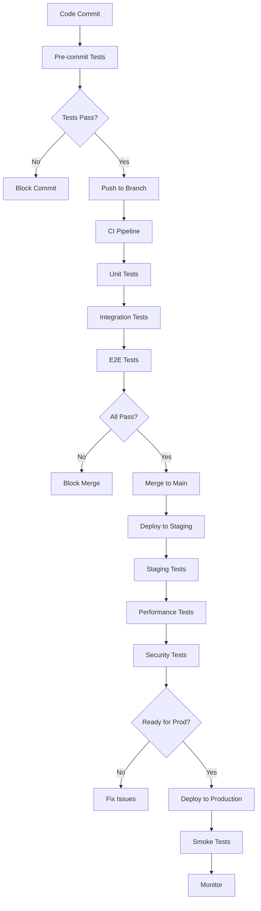

# Comprehensive Testing Strategy
## Pathfinity Revolutionary Learning Platform

**Document Version:** 1.0  
**Last Updated:** January 2025  
**Status:** Active Strategy  
**Owner:** QA Team Lead  
**Reviewed By:** DevOps Director, CTO, Development Teams

---

## Executive Summary

This document defines Pathfinity's comprehensive testing strategy to ensure our revolutionary platform delivers flawless Career-First education to millions of students. Our testing philosophy mirrors our value hierarchy (Career-First → PathIQ → Finn), with special emphasis on validating the student experience, AI intelligence, and multi-agent collaboration. Every test ensures we maintain <$0.05 per student per day while delivering exceptional quality.

---

## 1. Testing Philosophy and Principles

### 1.1 Core Testing Principles

```yaml
Testing Principles:
  1. Career-First Validation:
     - Every feature tested through career lens
     - Student experience is paramount
     - Real-world relevance verified
     
  2. Intelligence Verification:
     - PathIQ algorithms validated
     - Flow state maintenance tested
     - Personalization accuracy confirmed
     
  3. Agent Collaboration Testing:
     - Multi-agent interactions verified
     - Fallback mechanisms tested
     - Performance under load validated
     
  4. Cost-Conscious Quality:
     - Performance within budget constraints
     - Efficient test execution
     - Smart test prioritization
     
  5. Continuous Validation:
     - Shift-left testing approach
     - Automated regression prevention
     - Real-time quality metrics
```

### 1.2 Testing Pyramid

```
         /\
        /  \  E2E Tests (10%)
       /    \  - Critical user journeys
      /      \  - Career selection flows
     /--------\  Integration Tests (20%)
    /          \  - Service interactions
   /            \  - API contracts
  /              \  Component Tests (30%)
 /                \  - UI components
/                  \  - Service logic
/------------------\  Unit Tests (40%)
                      - Functions
                      - Algorithms
                      - Utilities
```

---

## 2. Test Levels and Strategies

### 2.1 Unit Testing

**Purpose:** Validate individual functions and components  
**Coverage Target:** >80% code coverage  
**Execution:** On every commit

```typescript
// Unit Test Strategy
interface UnitTestStrategy {
  scope: 'function' | 'class' | 'module';
  isolation: 'complete'; // All dependencies mocked
  speed: '<10ms per test';
  coverage: {
    statements: 80;
    branches: 75;
    functions: 80;
    lines: 80;
  };
}

// Example: Career Transformation Unit Test
describe('CareerTransformationService', () => {
  let service: CareerTransformationService;
  let mockAIService: jest.Mocked<AIService>;
  
  beforeEach(() => {
    mockAIService = createMockAIService();
    service = new CareerTransformationService(mockAIService);
  });
  
  describe('transformMathProblem', () => {
    it('should transform addition problem for Software Engineer career', async () => {
      // Arrange
      const problem: MathProblem = {
        type: 'addition',
        numbers: [5, 3],
        answer: 8,
      };
      const career: Career = {
        id: 'software-engineer',
        name: 'Software Engineer',
      };
      
      // Act
      const transformed = await service.transformMathProblem(problem, career);
      
      // Assert
      expect(transformed.context).toContain('code');
      expect(transformed.context).toContain('variables');
      expect(transformed.problem).toEqual(
        'You have 5 variables and add 3 more. How many variables total?'
      );
      expect(transformed.answer).toBe(8);
    });
    
    it('should maintain mathematical accuracy after transformation', async () => {
      // Test that transformation doesn't change the math
      const testCases = generateTestCases(100);
      
      for (const testCase of testCases) {
        const transformed = await service.transformMathProblem(
          testCase.problem,
          testCase.career
        );
        expect(transformed.answer).toBe(testCase.problem.answer);
      }
    });
  });
});

// PathIQ Algorithm Unit Tests
describe('FlowStateCalculator', () => {
  describe('calculateFlowPercentage', () => {
    it('should return 100% flow when challenge equals skill', () => {
      const metrics: PerformanceMetrics = {
        challenge: 5,
        skill: 5,
        engagement: 0.9,
        frustration: 0.1,
      };
      
      const flowPercentage = calculateFlowPercentage(metrics);
      expect(flowPercentage).toBeGreaterThan(0.9);
    });
    
    it('should detect anxiety when challenge >> skill', () => {
      const metrics: PerformanceMetrics = {
        challenge: 9,
        skill: 3,
        engagement: 0.4,
        frustration: 0.8,
      };
      
      const state = determineFlowState(metrics);
      expect(state).toBe('anxiety');
      expect(calculateFlowPercentage(metrics)).toBeLessThan(0.3);
    });
    
    it('should detect boredom when skill >> challenge', () => {
      const metrics: PerformanceMetrics = {
        challenge: 2,
        skill: 8,
        engagement: 0.3,
        frustration: 0.1,
      };
      
      const state = determineFlowState(metrics);
      expect(state).toBe('boredom');
      expect(calculateFlowPercentage(metrics)).toBeLessThan(0.3);
    });
  });
});
```

### 2.2 Component Testing

**Purpose:** Test React components in isolation  
**Coverage Target:** All components tested  
**Tools:** React Testing Library, Jest

```typescript
// Component Test Strategy
describe('CareerSelector Component', () => {
  it('should render 4 career options', () => {
    const careers = mockCareers(4);
    const { getAllByRole } = render(
      <CareerSelector 
        availableCareers={careers}
        onSelect={jest.fn()}
      />
    );
    
    const options = getAllByRole('button', { name: /Select .* career/ });
    expect(options).toHaveLength(4);
  });
  
  it('should highlight passion career', () => {
    const careers = mockCareers(4);
    careers[2].isPassion = true;
    
    const { getByTestId } = render(
      <CareerSelector 
        availableCareers={careers}
        onSelect={jest.fn()}
      />
    );
    
    const passionOption = getByTestId('career-option-2');
    expect(passionOption).toHaveClass('passion-highlight');
  });
  
  it('should call onSelect when career is chosen', async () => {
    const onSelect = jest.fn();
    const careers = mockCareers(4);
    
    const { getByText } = render(
      <CareerSelector 
        availableCareers={careers}
        onSelect={onSelect}
      />
    );
    
    await userEvent.click(getByText(careers[0].name));
    expect(onSelect).toHaveBeenCalledWith(careers[0]);
  });
  
  it('should be keyboard accessible', async () => {
    const onSelect = jest.fn();
    const careers = mockCareers(4);
    
    const { container } = render(
      <CareerSelector 
        availableCareers={careers}
        onSelect={onSelect}
      />
    );
    
    // Tab to first option
    await userEvent.tab();
    expect(document.activeElement).toHaveAttribute('role', 'button');
    
    // Select with Enter
    await userEvent.keyboard('{Enter}');
    expect(onSelect).toHaveBeenCalledWith(careers[0]);
  });
});

// Three-Container Component Tests
describe('ThreeContainerOrchestrator', () => {
  it('should transition between containers in correct order', async () => {
    const { getByTestId, rerender } = render(
      <ThreeContainerOrchestrator 
        currentContainer="LEARN"
        student={mockStudent()}
        career={mockCareer()}
      />
    );
    
    expect(getByTestId('learn-container')).toBeInTheDocument();
    
    // Complete LEARN container
    await userEvent.click(getByTestId('complete-container'));
    
    rerender(
      <ThreeContainerOrchestrator 
        currentContainer="EXPERIENCE"
        student={mockStudent()}
        career={mockCareer()}
      />
    );
    
    expect(getByTestId('experience-container')).toBeInTheDocument();
  });
});
```

### 2.3 Integration Testing

**Purpose:** Test service interactions and data flow  
**Coverage Target:** All critical paths  
**Execution:** Before merge to main

```typescript
// Integration Test Example
describe('Career Selection Flow Integration', () => {
  let app: INestApplication;
  let authService: AuthenticationService;
  let careerService: CareerSelectionService;
  let pathIQService: PathIQAnalysisService;
  
  beforeAll(async () => {
    const moduleRef = await Test.createTestingModule({
      imports: [AppModule],
    }).compile();
    
    app = moduleRef.createNestApplication();
    await app.init();
    
    authService = app.get(AuthenticationService);
    careerService = app.get(CareerSelectionService);
    pathIQService = app.get(PathIQAnalysisService);
  });
  
  it('should complete full career selection with PathIQ personalization', async () => {
    // Step 1: Authenticate student
    const auth = await authService.authenticate({
      username: 'test.student',
      password: 'test123',
    });
    expect(auth.token).toBeDefined();
    
    // Step 2: Get personalized career pool
    const studentProfile = await pathIQService.getProfile(auth.user.id);
    const careerPool = await careerService.generateDailyPool(
      auth.user.id,
      new Date()
    );
    
    expect(careerPool.randomCareers).toHaveLength(3);
    expect(careerPool.passionCareer).toBeDefined();
    
    // Verify passion career matches interests
    expect(careerPool.passionCareer.category).toEqual(
      studentProfile.topInterest
    );
    
    // Step 3: Select career
    const selected = await careerService.selectCareer(
      auth.user.id,
      careerPool.passionCareer.id
    );
    
    expect(selected.session).toBeDefined();
    expect(selected.session.career).toEqual(careerPool.passionCareer);
    
    // Step 4: Verify PathIQ tracking started
    const flowState = await pathIQService.getCurrentFlowState(auth.user.id);
    expect(flowState).toBeDefined();
    expect(flowState.monitoring).toBe(true);
  });
  
  it('should handle Finn agent collaboration', async () => {
    // Test multi-agent interaction
    const task: LearningTask = {
      type: 'visual_explanation',
      content: mockContent(),
      studentId: 'test-student',
    };
    
    // Orchestrator coordinates agents
    const plan = await finnOrchestrator.createPlan(task);
    expect(plan.agents).toContain('FinnSee');
    expect(plan.agents).toContain('FinnSpeak');
    
    // Execute collaboration
    const result = await finnOrchestrator.execute(plan);
    expect(result.visualization).toBeDefined();
    expect(result.narration).toBeDefined();
    expect(result.success).toBe(true);
  });
});

// Database Integration Tests
describe('Database Integration', () => {
  it('should handle concurrent career selections', async () => {
    const promises = [];
    
    // Simulate 100 concurrent selections
    for (let i = 0; i < 100; i++) {
      promises.push(
        careerService.selectCareer(`student-${i}`, 'career-1')
      );
    }
    
    const results = await Promise.allSettled(promises);
    const successful = results.filter(r => r.status === 'fulfilled');
    
    expect(successful.length).toBeGreaterThan(95); // Allow <5% failure
  });
});
```

### 2.4 End-to-End Testing

**Purpose:** Validate complete user journeys  
**Coverage Target:** Critical paths only  
**Execution:** Before release

```typescript
// E2E Test Scenarios
describe('Student Daily Journey E2E', () => {
  beforeEach(async () => {
    await page.goto('https://app.pathfinity.com');
    await loginAsStudent('emma.chen@school.edu', 'password123');
  });
  
  it('should complete full daily learning journey', async () => {
    // Career Selection
    await page.waitForSelector('[data-testid="career-wheel"]');
    await page.click('[data-testid="career-option-0"]');
    
    // Verify career transformation
    await expect(page).toHaveText('Welcome, Marine Biologist Emma!');
    await expect(page).toHaveCSS('--career-primary-color', '#006994');
    
    // LEARN Container
    await page.waitForSelector('[data-testid="learn-container"]');
    await expect(page).toHaveText(/Today's ocean exploration/);
    
    // Complete math problems with career context
    await page.fill('[data-testid="answer-1"]', '15'); // Fish counting
    await page.fill('[data-testid="answer-2"]', '8');  // Depth calculation
    await page.click('[data-testid="submit-answers"]');
    
    // Transition to EXPERIENCE
    await page.waitForSelector('[data-testid="experience-container"]');
    await expect(page).toHaveText(/Virtual Reef Exploration/);
    
    // Interactive simulation
    await page.click('[data-testid="dive-simulator"]');
    await page.dragAndDrop(
      '[data-testid="research-tool"]',
      '[data-testid="coral-sample"]'
    );
    
    // Complete experience
    await page.click('[data-testid="complete-experience"]');
    
    // DISCOVER Container
    await page.waitForSelector('[data-testid="discover-container"]');
    await expect(page).toHaveText(/Episode 5: The Hidden Reef/);
    
    // Story choices
    await page.click('[data-testid="story-choice-investigate"]');
    
    // Session completion
    await page.waitForSelector('[data-testid="session-complete"]');
    await expect(page).toHaveText(/Great job, Marine Biologist!/);
    
    // Verify PathIQ metrics
    const flowMetric = await page.textContent('[data-testid="flow-percentage"]');
    expect(parseInt(flowMetric)).toBeGreaterThan(70);
  });
  
  it('should handle network interruption gracefully', async () => {
    // Start career selection
    await page.click('[data-testid="career-option-0"]');
    
    // Simulate network interruption
    await page.setOfflineMode(true);
    
    // Verify offline indicator
    await expect(page).toHaveText(/Working offline/);
    
    // Continue with cached content
    await page.click('[data-testid="continue-offline"]');
    await expect(page).toHaveSelector('[data-testid="cached-content"]');
    
    // Restore connection
    await page.setOfflineMode(false);
    
    // Verify sync
    await expect(page).toHaveText(/Synced successfully/);
  });
});

// Teacher Dashboard E2E
describe('Teacher Monitoring E2E', () => {
  it('should show real-time class activity', async () => {
    await loginAsTeacher();
    await page.goto('/dashboard');
    
    // Verify all students visible
    const studentCards = await page.$$('[data-testid^="student-card-"]');
    expect(studentCards.length).toBe(28);
    
    // Check real-time updates
    await page.waitForSelector('[data-testid="student-card-1"][data-status="active"]');
    
    // Intervention capability
    await page.click('[data-testid="student-card-5"][data-needs-help="true"]');
    await page.click('[data-testid="send-encouragement"]');
    
    await expect(page).toHaveText(/Encouragement sent to Marcus/);
  });
});
```

### 2.5 Performance Testing

**Purpose:** Validate system performance under load  
**Target:** Support 100,000 concurrent users  
**Tools:** K6, LoadRunner

```javascript
// K6 Performance Test Script
import http from 'k6/http';
import { check, sleep } from 'k6';
import { Rate } from 'k6/metrics';

const errorRate = new Rate('errors');

export const options = {
  stages: [
    { duration: '5m', target: 1000 },   // Ramp up
    { duration: '10m', target: 10000 },  // Sustained load
    { duration: '5m', target: 50000 },   // Peak load
    { duration: '10m', target: 100000 }, // Stress test
    { duration: '5m', target: 0 },       // Ramp down
  ],
  thresholds: {
    http_req_duration: ['p(95)<2000'], // 95% of requests under 2s
    errors: ['rate<0.01'],              // Error rate under 1%
  },
};

export default function () {
  // Simulate career selection
  const careerResponse = http.post(
    'https://api.pathfinity.com/v1/careers/select',
    JSON.stringify({
      studentId: `student-${__VU}`,
      careerId: `career-${Math.floor(Math.random() * 240)}`,
    }),
    {
      headers: { 'Content-Type': 'application/json' },
      tags: { name: 'CareerSelection' },
    }
  );
  
  check(careerResponse, {
    'career selected': (r) => r.status === 200,
    'response time OK': (r) => r.timings.duration < 2000,
  });
  
  errorRate.add(careerResponse.status !== 200);
  
  // Simulate content generation
  if (careerResponse.status === 200) {
    const contentResponse = http.get(
      `https://api.pathfinity.com/v1/content/generate?sessionId=${careerResponse.json('sessionId')}`,
      {
        tags: { name: 'ContentGeneration' },
      }
    );
    
    check(contentResponse, {
      'content generated': (r) => r.status === 200,
      'generation time OK': (r) => r.timings.duration < 3000,
    });
  }
  
  sleep(1);
}

// Spike Test
export function spikeTest() {
  const responses = http.batch([
    ['GET', 'https://api.pathfinity.com/v1/health'],
    ['POST', 'https://api.pathfinity.com/v1/careers/pool'],
    ['GET', 'https://api.pathfinity.com/v1/pathiq/flow'],
  ]);
  
  responses.forEach(response => {
    check(response, {
      'status is 200': (r) => r.status === 200,
    });
  });
}
```

---

## 3. Test Types and Coverage

### 3.1 Functional Testing

```yaml
Functional Test Coverage:
  Career-First Features:
    - Daily career selection: 100%
    - Career transformation: 100%
    - Three-container flow: 100%
    - Career progression: 95%
    
  PathIQ Intelligence:
    - Flow state calculation: 100%
    - Personalization engine: 95%
    - Predictive intervention: 90%
    - 47-dimension analysis: 85%
    
  Finn Agent System:
    - Agent orchestration: 95%
    - Individual agents: 90%
    - Collaboration modes: 85%
    - Fallback mechanisms: 100%
    
  Core Platform:
    - Authentication: 100%
    - Authorization: 100%
    - Content generation: 95%
    - Analytics: 90%
```

### 3.2 Non-Functional Testing

```typescript
// Security Testing
describe('Security Tests', () => {
  it('should prevent SQL injection', async () => {
    const maliciousInput = "'; DROP TABLE users; --";
    const response = await request(app)
      .post('/api/login')
      .send({ username: maliciousInput, password: 'test' });
    
    expect(response.status).toBe(400);
    expect(response.body.error).toContain('Invalid input');
    
    // Verify database intact
    const users = await db.query('SELECT COUNT(*) FROM users');
    expect(users.count).toBeGreaterThan(0);
  });
  
  it('should enforce rate limiting', async () => {
    const requests = [];
    for (let i = 0; i < 150; i++) {
      requests.push(
        request(app).get('/api/careers')
      );
    }
    
    const responses = await Promise.all(requests);
    const rateLimited = responses.filter(r => r.status === 429);
    
    expect(rateLimited.length).toBeGreaterThan(0);
  });
  
  it('should sanitize user input', async () => {
    const xssPayload = '<script>alert("XSS")</script>';
    const response = await request(app)
      .post('/api/content/submit')
      .send({ content: xssPayload });
    
    expect(response.body.content).not.toContain('<script>');
    expect(response.body.content).toContain('&lt;script&gt;');
  });
});

// Accessibility Testing
describe('Accessibility Tests', () => {
  it('should meet WCAG 2.1 AA standards', async () => {
    const results = await axe(page);
    expect(results.violations).toHaveLength(0);
  });
  
  it('should support keyboard navigation', async () => {
    await page.keyboard.press('Tab');
    const focusedElement = await page.evaluate(() => document.activeElement.tagName);
    expect(focusedElement).not.toBe('BODY');
    
    // Navigate through career options with keyboard
    for (let i = 0; i < 4; i++) {
      await page.keyboard.press('Tab');
    }
    await page.keyboard.press('Enter');
    
    // Verify selection worked
    await expect(page).toHaveSelector('[data-testid="career-selected"]');
  });
  
  it('should have proper ARIA labels', async () => {
    const buttons = await page.$$('button');
    for (const button of buttons) {
      const ariaLabel = await button.getAttribute('aria-label');
      const text = await button.textContent();
      expect(ariaLabel || text).toBeTruthy();
    }
  });
});

// Compliance Testing
describe('COPPA/FERPA Compliance', () => {
  it('should require parental consent for users under 13', async () => {
    const response = await request(app)
      .post('/api/register')
      .send({
        name: 'Young Student',
        birthDate: '2015-01-01', // Under 13
        email: 'young@school.edu',
      });
    
    expect(response.status).toBe(403);
    expect(response.body.requiresParentalConsent).toBe(true);
  });
  
  it('should protect educational records (FERPA)', async () => {
    // Try to access another student's records
    const response = await request(app)
      .get('/api/students/other-student-id/records')
      .set('Authorization', `Bearer ${studentToken}`);
    
    expect(response.status).toBe(403);
    expect(response.body.error).toContain('Unauthorized access');
  });
});
```

### 3.3 Chaos Engineering

```typescript
// Chaos Testing Scenarios
describe('Chaos Engineering Tests', () => {
  it('should handle database failure gracefully', async () => {
    // Kill database connection
    await chaosMonkey.killDatabase();
    
    // System should serve cached content
    const response = await request(app).get('/api/careers/pool');
    expect(response.status).toBe(200);
    expect(response.headers['x-cache']).toBe('HIT');
    
    // Restore database
    await chaosMonkey.restoreDatabase();
  });
  
  it('should handle AI service degradation', async () => {
    // Slow down AI service
    await chaosMonkey.degradeService('ai-service', { latency: 5000 });
    
    // System should use fallback content generation
    const response = await request(app)
      .post('/api/content/generate')
      .timeout(3000);
    
    expect(response.status).toBe(200);
    expect(response.body.generationType).toBe('template');
  });
  
  it('should survive pod failures', async () => {
    // Kill 30% of pods
    await chaosMonkey.killPods({ percentage: 30 });
    
    // System should maintain service
    const healthCheck = await request(app).get('/health');
    expect(healthCheck.status).toBe(200);
    expect(healthCheck.body.status).toBe('degraded');
    
    // Auto-scaling should kick in
    await sleep(30000);
    const newHealthCheck = await request(app).get('/health');
    expect(newHealthCheck.body.status).toBe('healthy');
  });
});
```

---

## 4. Test Automation Framework

### 4.1 Framework Architecture

```typescript
// Test Framework Structure
class PathfinityTestFramework {
  private readonly config: TestConfig;
  private readonly dataFactory: TestDataFactory;
  private readonly mockServices: MockServiceRegistry;
  private readonly reporters: TestReporter[];
  
  async setup(): Promise<void> {
    await this.dataFactory.seed();
    await this.mockServices.initialize();
    await this.startTestContainers();
  }
  
  async teardown(): Promise<void> {
    await this.dataFactory.cleanup();
    await this.mockServices.shutdown();
    await this.stopTestContainers();
  }
  
  async runTestSuite(suite: TestSuite): Promise<TestResults> {
    const results = new TestResults();
    
    for (const test of suite.tests) {
      try {
        await this.beforeTest(test);
        const result = await test.execute();
        results.add(result);
        await this.afterTest(test);
      } catch (error) {
        results.addFailure(test, error);
      }
    }
    
    await this.generateReports(results);
    return results;
  }
}

// Custom Test Utilities
class PathfinityTestUtils {
  static async createAuthenticatedStudent(
    overrides?: Partial<Student>
  ): Promise<AuthenticatedStudent> {
    const student = TestDataFactory.createStudent(overrides);
    const token = await AuthService.generateToken(student);
    return { student, token };
  }
  
  static async simulateCareerJourney(
    student: Student,
    career: Career
  ): Promise<JourneyResults> {
    const session = await CareerService.selectCareer(student.id, career.id);
    
    // Complete all containers
    await this.completeLearnContainer(session);
    await this.completeExperienceContainer(session);
    await this.completeDiscoverContainer(session);
    
    return session.results;
  }
  
  static async waitForFlowState(
    studentId: string,
    targetPercentage: number
  ): Promise<void> {
    await waitFor(async () => {
      const flowState = await PathIQService.getFlowState(studentId);
      return flowState.percentage >= targetPercentage;
    }, { timeout: 30000 });
  }
}
```

### 4.2 Test Data Management

```typescript
// Test Data Factory
class TestDataFactory {
  private static readonly faker = new Faker();
  
  static createStudent(overrides?: Partial<Student>): Student {
    return {
      id: faker.datatype.uuid(),
      name: faker.name.fullName(),
      email: faker.internet.email(),
      gradeLevel: faker.datatype.number({ min: 0, max: 12 }),
      school: this.createSchool(),
      profile: this.createStudentProfile(),
      ...overrides,
    };
  }
  
  static createCareerPool(gradeLevel: number): CareerPool {
    const careers = this.getCareersForGrade(gradeLevel);
    return {
      randomCareers: faker.helpers.arrayElements(careers, 3),
      passionCareer: faker.helpers.arrayElement(careers),
      date: new Date(),
    };
  }
  
  static createPathIQMetrics(): PathIQMetrics {
    return {
      engagement: faker.datatype.float({ min: 0, max: 1 }),
      challenge: faker.datatype.number({ min: 1, max: 10 }),
      skill: faker.datatype.number({ min: 1, max: 10 }),
      frustration: faker.datatype.float({ min: 0, max: 1 }),
      flowPercentage: faker.datatype.float({ min: 0, max: 100 }),
    };
  }
  
  static async seedDatabase(): Promise<void> {
    // Create test schools
    const schools = await this.createSchools(10);
    
    // Create test students
    for (const school of schools) {
      await this.createStudentsForSchool(school, 100);
    }
    
    // Create career history
    await this.generateCareerHistory();
    
    // Create sample content
    await this.createSampleContent();
  }
}

// Test Data Builders
class StudentBuilder {
  private student: Partial<Student> = {};
  
  withGrade(grade: number): this {
    this.student.gradeLevel = grade;
    return this;
  }
  
  withCareerHistory(careers: Career[]): this {
    this.student.careerHistory = careers;
    return this;
  }
  
  withFlowStateTarget(target: number): this {
    this.student.profile = {
      ...this.student.profile,
      targetFlowState: target,
    };
    return this;
  }
  
  build(): Student {
    return TestDataFactory.createStudent(this.student);
  }
}
```

### 4.3 Mock Services

```typescript
// Mock Service Registry
class MockServiceRegistry {
  private readonly mocks = new Map<string, MockService>();
  
  register(name: string, mock: MockService): void {
    this.mocks.set(name, mock);
  }
  
  getMock<T extends MockService>(name: string): T {
    return this.mocks.get(name) as T;
  }
}

// AI Service Mock
class MockAIService implements AIService {
  private responses = new Map<string, any>();
  
  setResponse(prompt: string, response: any): void {
    this.responses.set(prompt, response);
  }
  
  async generateContent(prompt: string): Promise<string> {
    if (this.responses.has(prompt)) {
      return this.responses.get(prompt);
    }
    
    // Default mock response
    return `Mock content for: ${prompt}`;
  }
  
  async transformContent(content: Content, career: Career): Promise<Content> {
    // Simple mock transformation
    return {
      ...content,
      text: `${career.name}: ${content.text}`,
      transformed: true,
    };
  }
}

// PathIQ Service Mock
class MockPathIQService implements PathIQService {
  private studentStates = new Map<string, FlowState>();
  
  setFlowState(studentId: string, state: FlowState): void {
    this.studentStates.set(studentId, state);
  }
  
  async analyzeFlowState(studentId: string): Promise<FlowState> {
    return this.studentStates.get(studentId) || {
      percentage: 75,
      state: 'flow',
      adjustments: [],
    };
  }
  
  async predict(studentId: string, timeframe: number): Promise<Prediction[]> {
    return [
      {
        date: addDays(new Date(), 7),
        riskScore: 0.3,
        intervention: 'none',
      },
    ];
  }
}
```

---

## 5. Test Environments

### 5.1 Environment Strategy

```yaml
Test Environments:
  Local:
    purpose: Developer testing
    data: Mock data
    services: Docker containers
    reset: On demand
    
  CI:
    purpose: Automated testing
    data: Synthetic data
    services: Test doubles
    reset: Every run
    
  Integration:
    purpose: Service integration
    data: Anonymized production sample
    services: Real services (isolated)
    reset: Daily
    
  Staging:
    purpose: Pre-production validation
    data: Production-like
    services: Production configuration
    reset: Weekly
    
  Performance:
    purpose: Load testing
    data: Generated at scale
    services: Production-grade
    reset: After each test
```

### 5.2 Environment Configuration

```typescript
// Environment-specific configuration
interface TestEnvironment {
  name: string;
  config: {
    database: DatabaseConfig;
    services: ServiceConfig;
    features: FeatureFlags;
    data: DataConfig;
  };
}

const environments: Record<string, TestEnvironment> = {
  local: {
    name: 'local',
    config: {
      database: {
        host: 'localhost',
        port: 5432,
        name: 'pathfinity_test',
        reset: true,
      },
      services: {
        ai: 'mock',
        cache: 'memory',
        queue: 'sync',
      },
      features: {
        pathIQ: true,
        finnAgents: true,
        predictiveCache: false,
      },
      data: {
        students: 100,
        careers: 240,
        content: 'minimal',
      },
    },
  },
  staging: {
    name: 'staging',
    config: {
      database: {
        host: 'staging-db.pathfinity.com',
        port: 5432,
        name: 'pathfinity_staging',
        reset: false,
      },
      services: {
        ai: 'azure-openai',
        cache: 'redis-cluster',
        queue: 'rabbitmq',
      },
      features: {
        pathIQ: true,
        finnAgents: true,
        predictiveCache: true,
      },
      data: {
        students: 10000,
        careers: 240,
        content: 'full',
      },
    },
  },
};
```

---

## 6. Test Metrics and Reporting

### 6.1 Key Test Metrics

```typescript
interface TestMetrics {
  coverage: {
    line: number;
    branch: number;
    function: number;
    statement: number;
  };
  
  execution: {
    total: number;
    passed: number;
    failed: number;
    skipped: number;
    duration: number;
  };
  
  quality: {
    defectDensity: number;
    defectEscapeRate: number;
    mttr: number; // Mean time to repair
    testEffectiveness: number;
  };
  
  automation: {
    automationRate: number;
    executionTime: number;
    flakyTests: number;
    maintenanceEffort: number;
  };
}

// Real-time test dashboard
class TestDashboard {
  async getMetrics(): Promise<TestMetrics> {
    const [coverage, execution, quality, automation] = await Promise.all([
      this.getCoverageMetrics(),
      this.getExecutionMetrics(),
      this.getQualityMetrics(),
      this.getAutomationMetrics(),
    ]);
    
    return { coverage, execution, quality, automation };
  }
  
  async generateReport(format: 'html' | 'json' | 'pdf'): Promise<Report> {
    const metrics = await this.getMetrics();
    const trends = await this.analyzeTrends();
    const recommendations = this.generateRecommendations(metrics);
    
    return new Report({
      metrics,
      trends,
      recommendations,
      format,
    });
  }
}
```

### 6.2 Test Reporting

```typescript
// Custom test reporter
class PathfinityTestReporter implements Reporter {
  private results: TestResult[] = [];
  private startTime: Date;
  
  onTestStart(test: Test): void {
    console.log(`🧪 Testing: ${test.name}`);
    this.startTime = new Date();
  }
  
  onTestComplete(test: Test, result: TestResult): void {
    const duration = Date.now() - this.startTime.getTime();
    const emoji = result.passed ? '✅' : '❌';
    
    console.log(`${emoji} ${test.name} (${duration}ms)`);
    
    if (!result.passed) {
      console.log(`   Error: ${result.error.message}`);
      console.log(`   Stack: ${result.error.stack}`);
    }
    
    this.results.push(result);
  }
  
  async generateSummary(): Promise<void> {
    const passed = this.results.filter(r => r.passed).length;
    const failed = this.results.filter(r => !r.passed).length;
    const total = this.results.length;
    
    console.log('\n📊 Test Summary:');
    console.log(`   Total: ${total}`);
    console.log(`   ✅ Passed: ${passed}`);
    console.log(`   ❌ Failed: ${failed}`);
    console.log(`   ⏱️  Duration: ${this.totalDuration}ms`);
    
    if (failed > 0) {
      console.log('\n❌ Failed Tests:');
      this.results
        .filter(r => !r.passed)
        .forEach(r => {
          console.log(`   - ${r.test.name}`);
        });
    }
    
    // Send to analytics
    await this.sendToAnalytics(this.results);
  }
}
```

---

## 7. Test Process and Workflow

### 7.1 Test Execution Flow



### 7.2 Test Phases

```yaml
Test Phases:
  Development:
    - Unit tests on save
    - Component tests before commit
    - Integration tests before PR
    
  Continuous Integration:
    - Full unit test suite
    - Integration test suite
    - Code coverage check
    - Static analysis
    
  Pre-Release:
    - Full regression suite
    - Performance testing
    - Security testing
    - Accessibility testing
    
  Post-Release:
    - Smoke tests
    - Synthetic monitoring
    - Real user monitoring
    - A/B test validation
```

---

## 8. Test Prioritization

### 8.1 Risk-Based Testing

```typescript
// Test prioritization matrix
interface TestPriority {
  feature: string;
  risk: 'critical' | 'high' | 'medium' | 'low';
  impact: 'critical' | 'high' | 'medium' | 'low';
  priority: number; // 1-10
  coverage: number; // percentage
}

const testPriorities: TestPriority[] = [
  {
    feature: 'Career Selection',
    risk: 'critical',
    impact: 'critical',
    priority: 10,
    coverage: 100,
  },
  {
    feature: 'PathIQ Flow State',
    risk: 'critical',
    impact: 'high',
    priority: 9,
    coverage: 95,
  },
  {
    feature: 'Content Generation',
    risk: 'high',
    impact: 'critical',
    priority: 9,
    coverage: 90,
  },
  {
    feature: 'Finn Agents',
    risk: 'high',
    impact: 'high',
    priority: 8,
    coverage: 85,
  },
  {
    feature: 'Authentication',
    risk: 'critical',
    impact: 'critical',
    priority: 10,
    coverage: 100,
  },
];

// Smart test selection
class TestSelector {
  selectTests(timeConstraint: number): Test[] {
    const sorted = this.tests.sort((a, b) => b.priority - a.priority);
    const selected: Test[] = [];
    let totalTime = 0;
    
    for (const test of sorted) {
      if (totalTime + test.estimatedDuration <= timeConstraint) {
        selected.push(test);
        totalTime += test.estimatedDuration;
      }
    }
    
    return selected;
  }
}
```

---

## 9. Continuous Improvement

### 9.1 Test Optimization

```typescript
// Test performance optimization
class TestOptimizer {
  async analyzeTestPerformance(): Promise<OptimizationReport> {
    const slowTests = await this.identifySlowTests();
    const flakyTests = await this.identifyFlakyTests();
    const redundantTests = await this.identifyRedundantTests();
    
    return {
      slowTests: slowTests.map(test => ({
        name: test.name,
        duration: test.averageDuration,
        recommendation: this.getSpeedupRecommendation(test),
      })),
      flakyTests: flakyTests.map(test => ({
        name: test.name,
        failureRate: test.flakinessScore,
        recommendation: this.getStabilityRecommendation(test),
      })),
      redundantTests: redundantTests.map(test => ({
        name: test.name,
        overlap: test.coverageOverlap,
        recommendation: 'Consider removing or merging',
      })),
    };
  }
}
```

### 9.2 Feedback Loop

```yaml
Feedback Mechanisms:
  Daily:
    - Test execution reports
    - Failure analysis
    - Performance metrics
    
  Weekly:
    - Test coverage trends
    - Defect escape analysis
    - Test optimization opportunities
    
  Monthly:
    - Test strategy review
    - ROI analysis
    - Process improvements
    
  Quarterly:
    - Strategy alignment
    - Tool evaluation
    - Team training needs
```

---

## Test Strategy Success Metrics

### Key Performance Indicators

1. **Test Coverage:** >80% code coverage
2. **Defect Detection:** >90% before production
3. **Test Execution Time:** <30 minutes for CI
4. **Test Reliability:** <1% flaky tests
5. **Cost Efficiency:** <5% of development cost

### Quality Gates

- No merge without passing tests
- No deployment without performance validation
- No release without security clearance
- No feature without test coverage

---

## Appendices

### Appendix A: Test Tool Stack

```yaml
Testing Tools:
  Unit Testing: Jest, React Testing Library
  Integration: Supertest, TestContainers
  E2E: Playwright, Cypress
  Performance: K6, LoadRunner
  Security: OWASP ZAP, Snyk
  Accessibility: axe-core, Pa11y
  Monitoring: Datadog, Sentry
```

### Appendix B: Test Standards

- Follow AAA pattern (Arrange, Act, Assert)
- One assertion per test when possible
- Descriptive test names
- Independent tests (no order dependency)
- Fast tests (<100ms for unit tests)

### Appendix C: Emergency Procedures

```typescript
// Rollback procedure if tests fail in production
async function emergencyRollback(): Promise<void> {
  // 1. Run smoke tests to confirm issue
  const smokeResults = await runSmokeTests();
  
  if (smokeResults.failed) {
    // 2. Initiate rollback
    await deploymentService.rollback();
    
    // 3. Verify rollback success
    const verifyResults = await runSmokeTests();
    
    // 4. Alert team
    await alertingService.notifyTeam('Emergency rollback completed');
  }
}
```

---

*End of Testing Strategy Document*

**Next Document:** Test Automation Framework

---