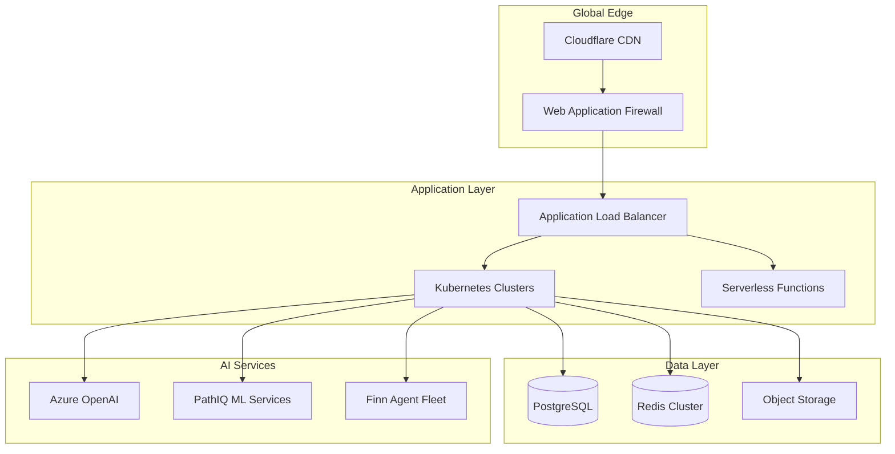

# Deployment Strategy and Operations
## Pathfinity Revolutionary Learning Platform

**Document Version:** 1.0  
**Last Updated:** January 2025  
**Status:** Active Strategy  
**Owner:** DevOps Director  
**Reviewed By:** CTO, Infrastructure Team, Security Team

---

## Executive Summary

This document defines Pathfinity's deployment strategy to deliver our revolutionary Career-First education platform to millions of students with zero downtime, instant rollback capability, and <$0.05 per student per day economics. Our deployment architecture enables continuous delivery while maintaining 99.9% uptime and supporting our sacred value hierarchy (Career-First → PathIQ → Finn).

---

## 1. Deployment Architecture Overview

### 1.1 Multi-Region Global Architecture

```yaml
Global Infrastructure:
  Primary Regions:
    us-east-1:
      role: Primary
      capacity: 40%
      services: All
      dr_priority: 1
      
    us-west-2:
      role: Secondary
      capacity: 30%
      services: All
      dr_priority: 2
      
    eu-west-1:
      role: Regional
      capacity: 20%
      services: All
      dr_priority: 3
      
    ap-southeast-1:
      role: Regional
      capacity: 10%
      services: All
      dr_priority: 4
      
  Edge Locations: 150+ CDN POPs globally
  
  Data Residency:
    US: us-east-1, us-west-2
    EU: eu-west-1 (GDPR compliant)
    APAC: ap-southeast-1
    
  Failover Strategy:
    automatic: true
    health_check_interval: 10s
    failover_threshold: 3_failed_checks
    recovery_time: <60s
```

### 1.2 Infrastructure Stack



---

## 2. Deployment Strategies

### 2.1 Blue-Green Deployment

**Purpose:** Zero-downtime deployments with instant rollback  
**Use Case:** Major releases, database migrations

```typescript
// Blue-Green Deployment Configuration
interface BlueGreenDeployment {
  environments: {
    blue: {
      version: string;
      status: 'active' | 'standby';
      health: HealthStatus;
      traffic: number; // percentage
    };
    green: {
      version: string;
      status: 'active' | 'standby';
      health: HealthStatus;
      traffic: number;
    };
  };
  
  switchover: {
    strategy: 'instant' | 'gradual';
    validation_period: number; // seconds
    rollback_threshold: number; // error percentage
    health_checks: HealthCheck[];
  };
}

// Deployment Process
class BlueGreenDeployer {
  async deploy(newVersion: string): Promise<DeploymentResult> {
    // Step 1: Deploy to green environment
    await this.deployToEnvironment('green', newVersion);
    
    // Step 2: Run smoke tests
    const smokeResults = await this.runSmokeTests('green');
    if (!smokeResults.passed) {
      throw new Error('Smoke tests failed');
    }
    
    // Step 3: Gradual traffic shift
    await this.shiftTraffic([
      { percentage: 10, duration: 300 },  // 10% for 5 minutes
      { percentage: 30, duration: 300 },  // 30% for 5 minutes
      { percentage: 50, duration: 600 },  // 50% for 10 minutes
      { percentage: 100, duration: null }, // 100% permanent
    ]);
    
    // Step 4: Monitor and validate
    const validation = await this.validateDeployment({
      errorRateThreshold: 0.01,
      responseTimeThreshold: 2000,
      validationPeriod: 900, // 15 minutes
    });
    
    if (!validation.passed) {
      await this.rollback();
      throw new Error('Deployment validation failed');
    }
    
    // Step 5: Update blue environment
    await this.syncEnvironments();
    
    return { success: true, version: newVersion };
  }
  
  async rollback(): Promise<void> {
    // Instant traffic switch back to blue
    await this.routeAllTraffic('blue');
    
    // Alert team
    await this.notifyTeam('Deployment rolled back');
    
    // Clean up green environment
    await this.resetEnvironment('green');
  }
}
```

### 2.2 Canary Deployment

**Purpose:** Risk mitigation through gradual rollout  
**Use Case:** New features, algorithm updates

```yaml
# Canary Deployment Configuration
canary_deployment:
  stages:
    - name: "Internal Testing"
      percentage: 0.1
      duration: 1h
      criteria:
        error_rate: <0.1%
        response_time: <2s
        
    - name: "Beta Users"
      percentage: 1
      duration: 4h
      criteria:
        error_rate: <0.5%
        response_time: <2s
        user_feedback: positive
        
    - name: "Early Adopters"
      percentage: 5
      duration: 24h
      criteria:
        error_rate: <1%
        engagement: >baseline
        
    - name: "Gradual Rollout"
      percentage: 25
      duration: 48h
      criteria:
        all_metrics: within_threshold
        
    - name: "Full Deployment"
      percentage: 100
      duration: permanent
      
  rollback_triggers:
    - error_rate > 2%
    - response_time > 5s
    - crash_rate > 0.1%
    - user_reports > 10
```

```typescript
// Canary Analysis Engine
class CanaryAnalyzer {
  async analyzeCanary(
    canaryVersion: string,
    baselineVersion: string,
    metrics: MetricWindow
  ): Promise<CanaryAnalysis> {
    const canaryMetrics = await this.getMetrics(canaryVersion, metrics);
    const baselineMetrics = await this.getMetrics(baselineVersion, metrics);
    
    const analysis = {
      errorRate: {
        canary: canaryMetrics.errorRate,
        baseline: baselineMetrics.errorRate,
        regression: canaryMetrics.errorRate > baselineMetrics.errorRate * 1.1,
      },
      responseTime: {
        canary: canaryMetrics.p95ResponseTime,
        baseline: baselineMetrics.p95ResponseTime,
        regression: canaryMetrics.p95ResponseTime > baselineMetrics.p95ResponseTime * 1.2,
      },
      businessMetrics: {
        careerSelections: this.compareMetric(
          canaryMetrics.careerSelections,
          baselineMetrics.careerSelections
        ),
        flowStateAverage: this.compareMetric(
          canaryMetrics.flowStateAverage,
          baselineMetrics.flowStateAverage
        ),
        engagementRate: this.compareMetric(
          canaryMetrics.engagementRate,
          baselineMetrics.engagementRate
        ),
      },
      recommendation: this.calculateRecommendation(canaryMetrics, baselineMetrics),
    };
    
    return analysis;
  }
  
  private calculateRecommendation(
    canary: Metrics,
    baseline: Metrics
  ): 'promote' | 'hold' | 'rollback' {
    const score = this.calculateScore(canary, baseline);
    
    if (score > 0.9) return 'promote';
    if (score > 0.7) return 'hold';
    return 'rollback';
  }
}
```

### 2.3 Feature Flag Deployment

**Purpose:** Decoupled deployment and release  
**Use Case:** A/B testing, gradual feature rollout

```typescript
// Feature Flag System
interface FeatureFlag {
  name: string;
  description: string;
  enabled: boolean;
  rolloutPercentage: number;
  targetGroups: string[];
  overrides: Map<string, boolean>;
  metrics: string[];
}

class FeatureFlagService {
  private flags: Map<string, FeatureFlag> = new Map();
  
  async evaluateFlag(
    flagName: string,
    context: EvaluationContext
  ): Promise<boolean> {
    const flag = this.flags.get(flagName);
    if (!flag) return false;
    
    // Check overrides
    if (flag.overrides.has(context.userId)) {
      return flag.overrides.get(context.userId)!;
    }
    
    // Check target groups
    if (flag.targetGroups.length > 0) {
      const userGroups = await this.getUserGroups(context.userId);
      if (flag.targetGroups.some(g => userGroups.includes(g))) {
        return true;
      }
    }
    
    // Check rollout percentage
    if (flag.rolloutPercentage < 100) {
      const hash = this.hashUserId(context.userId, flagName);
      return hash < flag.rolloutPercentage;
    }
    
    return flag.enabled;
  }
  
  // Real-time flag updates without deployment
  async updateFlag(flagName: string, updates: Partial<FeatureFlag>): Promise<void> {
    const flag = this.flags.get(flagName);
    if (!flag) throw new Error('Flag not found');
    
    // Update flag
    Object.assign(flag, updates);
    
    // Broadcast update to all instances
    await this.broadcastFlagUpdate(flagName, flag);
    
    // Log change for audit
    await this.auditLog.record({
      action: 'flag_update',
      flag: flagName,
      changes: updates,
      timestamp: new Date(),
    });
  }
}

// Feature flag usage in code
class CareerSelectionService {
  async selectCareer(studentId: string, careerId: string): Promise<CareerSession> {
    // Check if new AI-powered selection is enabled
    const useNewAI = await this.featureFlags.evaluateFlag(
      'career-selection-ai-v2',
      { userId: studentId }
    );
    
    if (useNewAI) {
      return this.selectCareerWithNewAI(studentId, careerId);
    } else {
      return this.selectCareerLegacy(studentId, careerId);
    }
  }
}
```

### 2.4 Rolling Deployment

**Purpose:** Gradual instance updates  
**Use Case:** Kubernetes pod updates, routine deployments

```yaml
# Kubernetes Rolling Update Strategy
apiVersion: apps/v1
kind: Deployment
metadata:
  name: pathfinity-api
spec:
  replicas: 20
  strategy:
    type: RollingUpdate
    rollingUpdate:
      maxSurge: 25%        # 5 new pods at a time
      maxUnavailable: 10%  # 2 pods max unavailable
  template:
    spec:
      containers:
      - name: api
        image: pathfinity/api:v2.1.0
        resources:
          requests:
            memory: "512Mi"
            cpu: "500m"
          limits:
            memory: "1Gi"
            cpu: "1000m"
        readinessProbe:
          httpGet:
            path: /health/ready
            port: 8080
          initialDelaySeconds: 10
          periodSeconds: 5
        livenessProbe:
          httpGet:
            path: /health/live
            port: 8080
          initialDelaySeconds: 30
          periodSeconds: 10
        lifecycle:
          preStop:
            exec:
              command: ["/bin/sh", "-c", "sleep 15"]
```

---

## 3. CI/CD Pipeline

### 3.1 Pipeline Architecture

```yaml
# GitLab CI/CD Pipeline
stages:
  - build
  - test
  - security
  - performance
  - deploy-staging
  - integration-tests
  - deploy-production
  - smoke-tests
  - rollback

variables:
  DOCKER_REGISTRY: registry.pathfinity.com
  K8S_NAMESPACE: pathfinity
  ROLLBACK_TIMEOUT: 900 # 15 minutes

# Build Stage
build:
  stage: build
  script:
    - docker build -t $DOCKER_REGISTRY/api:$CI_COMMIT_SHA .
    - docker push $DOCKER_REGISTRY/api:$CI_COMMIT_SHA
    - npm run build
    - npm run bundle-analyze
  artifacts:
    paths:
      - dist/
      - bundle-report.html
    expire_in: 1 week
  only:
    - main
    - develop

# Test Stage
test:unit:
  stage: test
  script:
    - npm run test:unit
    - npm run test:coverage
  coverage: '/Coverage: \d+\.\d+%/'
  artifacts:
    reports:
      coverage_report:
        coverage_format: cobertura
        path: coverage/cobertura-coverage.xml

test:integration:
  stage: test
  services:
    - postgres:14
    - redis:7
  script:
    - npm run test:integration
  
# Security Scanning
security:sast:
  stage: security
  script:
    - npm audit --audit-level=moderate
    - snyk test --severity-threshold=high
    - trivy image $DOCKER_REGISTRY/api:$CI_COMMIT_SHA

security:secrets:
  stage: security
  script:
    - gitleaks detect --source=. --verbose

# Performance Testing
performance:load:
  stage: performance
  script:
    - k6 run tests/performance/load-test.js
    - k6 run tests/performance/stress-test.js
  artifacts:
    reports:
      performance: performance-report.json
  only:
    - main

# Staging Deployment
deploy:staging:
  stage: deploy-staging
  environment:
    name: staging
    url: https://staging.pathfinity.com
  script:
    - kubectl set image deployment/api api=$DOCKER_REGISTRY/api:$CI_COMMIT_SHA -n staging
    - kubectl rollout status deployment/api -n staging
    - ./scripts/run-smoke-tests.sh staging
  only:
    - main

# Production Deployment (Manual Approval)
deploy:production:
  stage: deploy-production
  environment:
    name: production
    url: https://app.pathfinity.com
  script:
    - ./scripts/blue-green-deploy.sh $CI_COMMIT_SHA
  when: manual
  only:
    - main

# Automated Rollback
rollback:auto:
  stage: rollback
  script:
    - ./scripts/auto-rollback.sh
  when: on_failure
  only:
    - main
```

### 3.2 Deployment Automation

```typescript
// Deployment Orchestrator
class DeploymentOrchestrator {
  private readonly k8sClient: KubernetesClient;
  private readonly monitoring: MonitoringService;
  private readonly notifications: NotificationService;
  
  async deployToProduction(
    version: string,
    strategy: DeploymentStrategy
  ): Promise<DeploymentResult> {
    const deployment = new Deployment({
      version,
      strategy,
      environment: 'production',
      timestamp: new Date(),
    });
    
    try {
      // Pre-deployment checks
      await this.preDeploymentChecks();
      
      // Create deployment record
      await this.recordDeployment(deployment);
      
      // Execute deployment strategy
      let result: DeploymentResult;
      switch (strategy) {
        case 'blue-green':
          result = await this.blueGreenDeploy(version);
          break;
        case 'canary':
          result = await this.canaryDeploy(version);
          break;
        case 'rolling':
          result = await this.rollingDeploy(version);
          break;
        default:
          throw new Error(`Unknown strategy: ${strategy}`);
      }
      
      // Post-deployment validation
      await this.postDeploymentValidation(version);
      
      // Update deployment record
      deployment.status = 'success';
      deployment.completedAt = new Date();
      await this.updateDeployment(deployment);
      
      // Notify stakeholders
      await this.notifySuccess(deployment);
      
      return result;
      
    } catch (error) {
      // Automatic rollback
      await this.rollback(deployment);
      
      // Update deployment record
      deployment.status = 'failed';
      deployment.error = error.message;
      await this.updateDeployment(deployment);
      
      // Alert team
      await this.notifyFailure(deployment, error);
      
      throw error;
    }
  }
  
  private async preDeploymentChecks(): Promise<void> {
    // Check system health
    const health = await this.monitoring.getSystemHealth();
    if (health.status !== 'healthy') {
      throw new Error('System not healthy for deployment');
    }
    
    // Check resource availability
    const resources = await this.k8sClient.getAvailableResources();
    if (resources.cpu < 0.3 || resources.memory < 0.3) {
      throw new Error('Insufficient resources for deployment');
    }
    
    // Check ongoing incidents
    const incidents = await this.monitoring.getActiveIncidents();
    if (incidents.length > 0) {
      throw new Error('Active incidents prevent deployment');
    }
  }
  
  private async postDeploymentValidation(version: string): Promise<void> {
    // Run smoke tests
    const smokeTests = await this.runSmokeTests(version);
    if (!smokeTests.passed) {
      throw new Error('Smoke tests failed');
    }
    
    // Check key metrics
    await this.waitForStableMetrics({
      duration: 300, // 5 minutes
      errorRateThreshold: 0.01,
      responseTimeThreshold: 2000,
    });
    
    // Validate critical features
    const criticalFeatures = [
      'career-selection',
      'content-generation',
      'pathiq-analysis',
      'finn-orchestration',
    ];
    
    for (const feature of criticalFeatures) {
      const working = await this.validateFeature(feature);
      if (!working) {
        throw new Error(`Critical feature failed: ${feature}`);
      }
    }
  }
}
```

---

## 4. Environment Management

### 4.1 Environment Strategy

```yaml
Environments:
  Development:
    purpose: Active development
    data: Synthetic
    refresh: Daily
    access: All developers
    
  Testing:
    purpose: Automated testing
    data: Anonymized production sample
    refresh: On-demand
    access: CI/CD only
    
  Staging:
    purpose: Pre-production validation
    data: Production-like
    refresh: Weekly
    access: Limited
    configuration: Production mirror
    
  Production:
    purpose: Live environment
    data: Real user data
    backup: Continuous
    access: Restricted
    monitoring: 24/7
    
  Disaster Recovery:
    purpose: Failover site
    data: Replicated from production
    sync: Real-time
    access: Emergency only
    activation: <5 minutes
```

### 4.2 Configuration Management

```typescript
// Environment-specific configuration
interface EnvironmentConfig {
  name: string;
  apiUrl: string;
  database: {
    host: string;
    port: number;
    ssl: boolean;
    poolSize: number;
  };
  cache: {
    redis: {
      cluster: string[];
      password?: string;
    };
  };
  features: FeatureFlags;
  monitoring: {
    enabled: boolean;
    level: 'debug' | 'info' | 'warn' | 'error';
  };
  security: {
    encryption: boolean;
    mfa: boolean;
    rateLimit: number;
  };
}

// Configuration loader with validation
class ConfigurationManager {
  private configs: Map<string, EnvironmentConfig> = new Map();
  
  async loadConfig(environment: string): Promise<EnvironmentConfig> {
    // Load from secure store (AWS Secrets Manager, etc.)
    const rawConfig = await this.secretsManager.getSecret(
      `pathfinity/${environment}/config`
    );
    
    // Parse and validate
    const config = this.parseConfig(rawConfig);
    await this.validateConfig(config);
    
    // Cache configuration
    this.configs.set(environment, config);
    
    // Set up hot reload
    this.watchConfigChanges(environment);
    
    return config;
  }
  
  private async validateConfig(config: EnvironmentConfig): Promise<void> {
    // Validate database connection
    await this.testDatabaseConnection(config.database);
    
    // Validate Redis cluster
    await this.testRedisConnection(config.cache.redis);
    
    // Validate API endpoints
    await this.testApiEndpoints(config.apiUrl);
    
    // Validate feature flags
    this.validateFeatureFlags(config.features);
  }
  
  private watchConfigChanges(environment: string): void {
    this.secretsManager.on(`change:pathfinity/${environment}/config`, async () => {
      console.log(`Configuration changed for ${environment}, reloading...`);
      await this.loadConfig(environment);
      await this.notifyConfigChange(environment);
    });
  }
}
```

---

## 5. Infrastructure as Code

### 5.1 Terraform Configuration

```hcl
# Main Infrastructure Definition
terraform {
  required_version = ">= 1.0"
  
  backend "s3" {
    bucket = "pathfinity-terraform-state"
    key    = "production/terraform.tfstate"
    region = "us-east-1"
    encrypt = true
    dynamodb_table = "terraform-state-lock"
  }
  
  required_providers {
    aws = {
      source  = "hashicorp/aws"
      version = "~> 5.0"
    }
    kubernetes = {
      source  = "hashicorp/kubernetes"
      version = "~> 2.23"
    }
  }
}

# EKS Cluster
module "eks" {
  source = "./modules/eks"
  
  cluster_name    = "pathfinity-production"
  cluster_version = "1.28"
  
  vpc_id     = module.vpc.vpc_id
  subnet_ids = module.vpc.private_subnets
  
  node_groups = {
    general = {
      desired_capacity = 10
      max_capacity     = 50
      min_capacity     = 3
      
      instance_types = ["t3.xlarge"]
      
      k8s_labels = {
        Environment = "production"
        Type        = "general"
      }
    }
    
    gpu = {
      desired_capacity = 2
      max_capacity     = 10
      min_capacity     = 0
      
      instance_types = ["g4dn.xlarge"]
      
      k8s_labels = {
        Environment = "production"
        Type        = "gpu"
        Purpose     = "ai-workloads"
      }
      
      taints = [{
        key    = "gpu"
        value  = "true"
        effect = "NO_SCHEDULE"
      }]
    }
  }
  
  enable_irsa = true
  
  cluster_addons = {
    coredns = {
      addon_version = "v1.10.1-eksbuild.1"
    }
    kube-proxy = {
      addon_version = "v1.28.1-eksbuild.1"
    }
    vpc-cni = {
      addon_version = "v1.14.1-eksbuild.1"
    }
    aws-ebs-csi-driver = {
      addon_version = "v1.23.0-eksbuild.1"
    }
  }
}

# RDS Database
module "rds" {
  source = "./modules/rds"
  
  identifier = "pathfinity-production"
  
  engine            = "postgres"
  engine_version    = "15.4"
  instance_class    = "db.r6g.2xlarge"
  allocated_storage = 500
  storage_encrypted = true
  
  database_name = "pathfinity"
  username      = "pathfinity_admin"
  
  vpc_id     = module.vpc.vpc_id
  subnet_ids = module.vpc.database_subnets
  
  backup_retention_period = 30
  backup_window          = "03:00-04:00"
  maintenance_window     = "sun:04:00-sun:05:00"
  
  enabled_cloudwatch_logs_exports = ["postgresql"]
  
  # Read replicas
  read_replica_count = 2
  
  performance_insights_enabled = true
  monitoring_interval         = 60
}

# Redis Cluster
module "elasticache" {
  source = "./modules/elasticache"
  
  cluster_id = "pathfinity-cache"
  
  engine              = "redis"
  engine_version      = "7.0"
  node_type          = "cache.r6g.xlarge"
  num_cache_nodes    = 3
  
  subnet_ids = module.vpc.private_subnets
  
  automatic_failover_enabled = true
  multi_az_enabled          = true
  
  snapshot_retention_limit = 5
  snapshot_window         = "03:00-05:00"
  
  at_rest_encryption_enabled = true
  transit_encryption_enabled = true
}

# CDN Distribution
module "cloudfront" {
  source = "./modules/cloudfront"
  
  aliases = ["app.pathfinity.com"]
  
  origin_domain_name = module.alb.dns_name
  
  default_cache_behavior = {
    allowed_methods = ["GET", "HEAD", "OPTIONS", "PUT", "POST", "PATCH", "DELETE"]
    cached_methods  = ["GET", "HEAD", "OPTIONS"]
    
    target_origin_id = "alb"
    
    viewer_protocol_policy = "redirect-to-https"
    compress              = true
    
    default_ttl = 86400
    max_ttl     = 31536000
  }
  
  price_class = "PriceClass_All"
  
  geo_restriction = {
    restriction_type = "none"
  }
  
  web_acl_id = module.waf.web_acl_id
}
```

### 5.2 Kubernetes Manifests

```yaml
# Namespace and RBAC
apiVersion: v1
kind: Namespace
metadata:
  name: pathfinity-production
  labels:
    environment: production
    istio-injection: enabled

---
apiVersion: v1
kind: ServiceAccount
metadata:
  name: pathfinity-api
  namespace: pathfinity-production
  annotations:
    eks.amazonaws.com/role-arn: arn:aws:iam::123456789012:role/pathfinity-api-role

---
# Main API Deployment
apiVersion: apps/v1
kind: Deployment
metadata:
  name: pathfinity-api
  namespace: pathfinity-production
spec:
  replicas: 10
  selector:
    matchLabels:
      app: pathfinity-api
  template:
    metadata:
      labels:
        app: pathfinity-api
        version: v2.1.0
      annotations:
        prometheus.io/scrape: "true"
        prometheus.io/port: "9090"
    spec:
      serviceAccountName: pathfinity-api
      
      affinity:
        podAntiAffinity:
          preferredDuringSchedulingIgnoredDuringExecution:
          - weight: 100
            podAffinityTerm:
              labelSelector:
                matchLabels:
                  app: pathfinity-api
              topologyKey: kubernetes.io/hostname
      
      containers:
      - name: api
        image: registry.pathfinity.com/api:v2.1.0
        ports:
        - containerPort: 8080
          name: http
        - containerPort: 9090
          name: metrics
          
        env:
        - name: ENVIRONMENT
          value: production
        - name: DATABASE_URL
          valueFrom:
            secretKeyRef:
              name: database-credentials
              key: url
        - name: REDIS_URL
          valueFrom:
            secretKeyRef:
              name: redis-credentials
              key: url
              
        resources:
          requests:
            memory: "1Gi"
            cpu: "500m"
          limits:
            memory: "2Gi"
            cpu: "1000m"
            
        livenessProbe:
          httpGet:
            path: /health/live
            port: 8080
          initialDelaySeconds: 30
          periodSeconds: 10
          
        readinessProbe:
          httpGet:
            path: /health/ready
            port: 8080
          initialDelaySeconds: 10
          periodSeconds: 5
          
        volumeMounts:
        - name: config
          mountPath: /app/config
          readOnly: true
          
      volumes:
      - name: config
        configMap:
          name: pathfinity-config

---
# Horizontal Pod Autoscaler
apiVersion: autoscaling/v2
kind: HorizontalPodAutoscaler
metadata:
  name: pathfinity-api-hpa
  namespace: pathfinity-production
spec:
  scaleTargetRef:
    apiVersion: apps/v1
    kind: Deployment
    name: pathfinity-api
  minReplicas: 10
  maxReplicas: 100
  metrics:
  - type: Resource
    resource:
      name: cpu
      target:
        type: Utilization
        averageUtilization: 70
  - type: Resource
    resource:
      name: memory
      target:
        type: Utilization
        averageUtilization: 80
  - type: Pods
    pods:
      metric:
        name: http_requests_per_second
      target:
        type: AverageValue
        averageValue: "1000"
  behavior:
    scaleDown:
      stabilizationWindowSeconds: 300
      policies:
      - type: Percent
        value: 10
        periodSeconds: 60
    scaleUp:
      stabilizationWindowSeconds: 0
      policies:
      - type: Percent
        value: 100
        periodSeconds: 15
      - type: Pods
        value: 10
        periodSeconds: 15
      selectPolicy: Max
```

---

## 6. Monitoring and Observability

### 6.1 Monitoring Stack

```yaml
Monitoring Architecture:
  Metrics:
    - Prometheus: Time-series metrics
    - Grafana: Visualization
    - AlertManager: Alert routing
    
  Logs:
    - FluentBit: Log collection
    - Elasticsearch: Log storage
    - Kibana: Log analysis
    
  Traces:
    - OpenTelemetry: Trace collection
    - Jaeger: Distributed tracing
    - Tempo: Trace storage
    
  APM:
    - Datadog: Application performance
    - New Relic: User monitoring
    - Sentry: Error tracking
```

### 6.2 Key Metrics and Alerts

```typescript
// Critical Metrics Configuration
const criticalMetrics = {
  // Golden Signals
  latency: {
    metric: 'http_request_duration_seconds',
    threshold: 2.0,
    percentile: 95,
    alert: 'PagerDuty',
  },
  
  traffic: {
    metric: 'http_requests_total',
    threshold: 100000,
    window: '5m',
    alert: 'Slack',
  },
  
  errors: {
    metric: 'http_requests_failed_total',
    threshold: 0.01, // 1%
    window: '5m',
    alert: 'PagerDuty',
  },
  
  saturation: {
    cpu: {
      metric: 'container_cpu_usage_seconds_total',
      threshold: 0.8,
      alert: 'Slack',
    },
    memory: {
      metric: 'container_memory_usage_bytes',
      threshold: 0.85,
      alert: 'Slack',
    },
  },
  
  // Business Metrics
  careerSelections: {
    metric: 'career_selections_per_minute',
    threshold: 10, // minimum
    alert: 'Email',
  },
  
  flowState: {
    metric: 'average_flow_state_percentage',
    threshold: 60, // minimum
    window: '1h',
    alert: 'Dashboard',
  },
  
  costPerStudent: {
    metric: 'infrastructure_cost_per_student',
    threshold: 0.05, // $0.05
    window: '24h',
    alert: 'Email',
  },
};

// Alert Rules
const alertRules = `
groups:
- name: pathfinity_critical
  interval: 30s
  rules:
  - alert: HighErrorRate
    expr: rate(http_requests_failed_total[5m]) > 0.01
    for: 5m
    labels:
      severity: critical
      team: platform
    annotations:
      summary: High error rate detected
      description: "Error rate is {{ $value | humanizePercentage }}"
      
  - alert: SlowResponseTime
    expr: histogram_quantile(0.95, http_request_duration_seconds) > 2
    for: 5m
    labels:
      severity: warning
      team: platform
    annotations:
      summary: Slow response times detected
      description: "P95 response time is {{ $value }}s"
      
  - alert: LowFlowState
    expr: avg(flow_state_percentage) < 60
    for: 15m
    labels:
      severity: warning
      team: education
    annotations:
      summary: Low average flow state
      description: "Flow state average is {{ $value }}%"
`;
```

---

## 7. Disaster Recovery

### 7.1 DR Strategy

```yaml
Disaster Recovery Plan:
  RTO: 1 hour  # Recovery Time Objective
  RPO: 15 minutes  # Recovery Point Objective
  
  Backup Strategy:
    Database:
      - Continuous replication to DR region
      - Point-in-time recovery: 30 days
      - Automated snapshots: Every 6 hours
      
    Application Data:
      - Cross-region S3 replication
      - Version history: 90 days
      
    Configuration:
      - Git repository backup
      - Secrets manager replication
      
  Failover Process:
    1. Detection: Automated health checks
    2. Decision: Automatic for regional, manual for global
    3. Execution: DNS failover + traffic routing
    4. Validation: Smoke tests in DR region
    5. Communication: Automated notifications
```

### 7.2 Backup and Recovery

```typescript
// Automated Backup System
class BackupManager {
  async performBackup(type: BackupType): Promise<BackupResult> {
    const backup = new Backup({
      type,
      timestamp: new Date(),
      source: this.getSourceForType(type),
    });
    
    try {
      // Perform backup based on type
      switch (type) {
        case 'database':
          await this.backupDatabase(backup);
          break;
        case 'files':
          await this.backupFiles(backup);
          break;
        case 'configuration':
          await this.backupConfiguration(backup);
          break;
      }
      
      // Verify backup integrity
      await this.verifyBackup(backup);
      
      // Replicate to DR region
      await this.replicateBackup(backup);
      
      // Update backup catalog
      await this.catalogBackup(backup);
      
      return { success: true, backup };
      
    } catch (error) {
      await this.alertBackupFailure(type, error);
      throw error;
    }
  }
  
  async restore(backupId: string, target: string): Promise<RestoreResult> {
    const backup = await this.getBackup(backupId);
    
    // Validate backup
    if (!await this.validateBackup(backup)) {
      throw new Error('Backup validation failed');
    }
    
    // Perform restore
    const result = await this.executeRestore(backup, target);
    
    // Verify restore
    await this.verifyRestore(result);
    
    return result;
  }
}
```

---

## 8. Security Hardening

### 8.1 Deployment Security

```yaml
Security Measures:
  Network:
    - Private subnets for compute
    - NACLs and security groups
    - WAF rules
    - DDoS protection
    
  Access:
    - RBAC enforcement
    - Service accounts
    - Pod security policies
    - Network policies
    
  Secrets:
    - External secrets operator
    - Encryption at rest
    - Regular rotation
    - Audit logging
    
  Compliance:
    - COPPA compliance
    - FERPA compliance
    - SOC 2 Type II
    - ISO 27001
```

### 8.2 Security Scanning

```typescript
// Security validation in deployment pipeline
class SecurityValidator {
  async validateDeployment(image: string): Promise<ValidationResult> {
    const results = await Promise.all([
      this.scanImage(image),
      this.checkSecrets(image),
      this.validatePolicies(image),
      this.auditDependencies(image),
    ]);
    
    const issues = results.flatMap(r => r.issues);
    const critical = issues.filter(i => i.severity === 'critical');
    
    if (critical.length > 0) {
      throw new Error(`Critical security issues found: ${critical.length}`);
    }
    
    return {
      passed: issues.length === 0,
      issues,
      recommendations: this.generateRecommendations(issues),
    };
  }
}
```

---

## 9. Cost Optimization

### 9.1 Cost Management

```typescript
// Cost optimization strategies
class CostOptimizer {
  async optimizeDeployment(): Promise<CostSavings> {
    const savings = new CostSavings();
    
    // Right-size instances
    const rightsizing = await this.analyzeInstanceUsage();
    for (const recommendation of rightsizing) {
      if (recommendation.savings > 100) {
        await this.resizeInstance(recommendation);
        savings.add(recommendation.savings);
      }
    }
    
    // Spot instances for non-critical workloads
    const spotOpportunities = await this.identifySpotOpportunities();
    for (const opportunity of spotOpportunities) {
      await this.migrateToSpot(opportunity);
      savings.add(opportunity.savings);
    }
    
    // Reserved instances for stable workloads
    const riRecommendations = await this.analyzeRIOpportunities();
    for (const ri of riRecommendations) {
      await this.purchaseRI(ri);
      savings.add(ri.savings);
    }
    
    // Auto-scaling optimization
    await this.optimizeAutoScaling();
    
    // Cache optimization to reduce compute
    await this.optimizeCaching();
    
    return savings;
  }
}
```

---

## Deployment Success Criteria

### Release Gates
1. All tests passing (unit, integration, E2E)
2. Security scans clean
3. Performance benchmarks met
4. Cost per student <$0.05
5. Zero downtime achieved

### Monitoring Requirements
1. All dashboards configured
2. Alerts tested and verified
3. Runbooks documented
4. Team trained on procedures

---

## Appendices

### Appendix A: Deployment Scripts
Location: `/scripts/deployment/`

### Appendix B: Runbooks
- Blue-Green Deployment: `/runbooks/blue-green.md`
- Rollback Procedures: `/runbooks/rollback.md`
- Disaster Recovery: `/runbooks/disaster-recovery.md`

### Appendix C: Environment URLs
- Production: https://app.pathfinity.com
- Staging: https://staging.pathfinity.com
- Development: https://dev.pathfinity.com

---

*End of Deployment Strategy Document*

**Next Document:** Infrastructure as Code

---