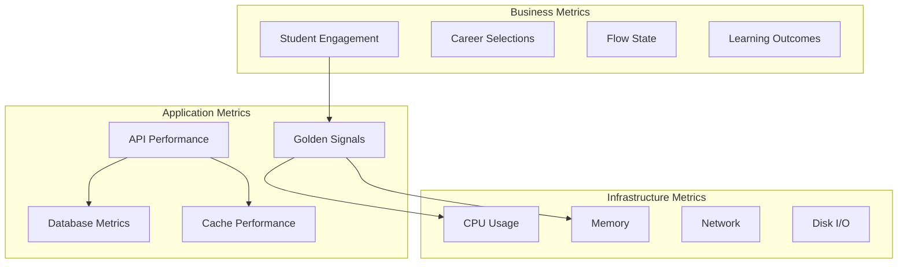

# Monitoring and Observability Strategy
## Pathfinity Revolutionary Learning Platform

**Document Version:** 1.0  
**Last Updated:** January 2025  
**Status:** Active Implementation  
**Owner:** DevOps Director  
**Reviewed By:** CTO, SRE Team, Security Team

---

## Executive Summary

This document defines Pathfinity's comprehensive monitoring and observability strategy to ensure our revolutionary platform maintains 99.9% uptime while serving millions of students. Our observability stack provides real-time insights into system health, student experience, and business metrics, enabling us to maintain <$0.05 per student per day while delivering exceptional Career-First education.

---

## 1. Observability Philosophy

### 1.1 Three Pillars of Observability

```yaml
Observability Pillars:
  Metrics:
    purpose: "What is happening"
    tools: [Prometheus, Grafana, CloudWatch]
    retention: 90 days
    resolution: 10s for critical, 60s for standard
    
  Logs:
    purpose: "Why it happened"
    tools: [FluentBit, Elasticsearch, Kibana]
    retention: 30 days hot, 1 year cold
    structure: JSON structured logging
    
  Traces:
    purpose: "How it happened"
    tools: [OpenTelemetry, Jaeger, Tempo]
    retention: 7 days
    sampling: 10% baseline, 100% errors
```

### 1.2 Monitoring Hierarchy



---

## 2. Metrics Collection and Storage

### 2.1 Prometheus Configuration

```yaml
# prometheus.yml
global:
  scrape_interval: 15s
  evaluation_interval: 15s
  external_labels:
    cluster: 'production'
    region: 'us-east-1'

# Alerting configuration
alerting:
  alertmanagers:
    - static_configs:
        - targets:
          - alertmanager:9093

# Rule files
rule_files:
  - "/etc/prometheus/rules/*.yml"

# Scrape configurations
scrape_configs:
  # Kubernetes pods
  - job_name: 'kubernetes-pods'
    kubernetes_sd_configs:
      - role: pod
    relabel_configs:
      - source_labels: [__meta_kubernetes_pod_annotation_prometheus_io_scrape]
        action: keep
        regex: true
      - source_labels: [__meta_kubernetes_pod_annotation_prometheus_io_path]
        action: replace
        target_label: __metrics_path__
        regex: (.+)
      - source_labels: [__address__, __meta_kubernetes_pod_annotation_prometheus_io_port]
        action: replace
        regex: ([^:]+)(?::\d+)?;(\d+)
        replacement: $1:$2
        target_label: __address__

  # Node exporter
  - job_name: 'node-exporter'
    kubernetes_sd_configs:
      - role: node
    relabel_configs:
      - action: labelmap
        regex: __meta_kubernetes_node_label_(.+)

  # Custom Pathfinity metrics
  - job_name: 'pathfinity-api'
    static_configs:
      - targets: ['api.pathfinity.com:9090']
    metrics_path: '/metrics'
    
  - job_name: 'pathiq-service'
    static_configs:
      - targets: ['pathiq.pathfinity.com:9090']
    metrics_path: '/metrics'
    
  - job_name: 'finn-agents'
    static_configs:
      - targets: ['finn.pathfinity.com:9090']
    metrics_path: '/metrics'

# Remote storage for long-term retention
remote_write:
  - url: "http://cortex:9009/api/prom/push"
    queue_config:
      capacity: 10000
      max_shards: 200
      max_samples_per_send: 5000
```

### 2.2 Custom Metrics Implementation

```typescript
// Application metrics instrumentation
import { Registry, Counter, Histogram, Gauge, Summary } from 'prom-client';

class PathfinityMetrics {
  private registry: Registry;
  
  // Business metrics
  private careerSelections: Counter;
  private flowStateGauge: Gauge;
  private learningOutcomes: Summary;
  private contentGenerations: Counter;
  
  // Performance metrics
  private httpDuration: Histogram;
  private dbQueryDuration: Histogram;
  private cacheHitRate: Gauge;
  
  // PathIQ metrics
  private predictionAccuracy: Gauge;
  private personalizationLatency: Histogram;
  private interventionSuccess: Counter;
  
  // Finn Agent metrics
  private agentResponseTime: Histogram;
  private agentCollaborations: Counter;
  private agentErrors: Counter;
  
  constructor() {
    this.registry = new Registry();
    
    // Initialize business metrics
    this.careerSelections = new Counter({
      name: 'pathfinity_career_selections_total',
      help: 'Total number of career selections',
      labelNames: ['grade_level', 'career_category', 'selection_type'],
      registers: [this.registry],
    });
    
    this.flowStateGauge = new Gauge({
      name: 'pathfinity_flow_state_percentage',
      help: 'Current flow state percentage',
      labelNames: ['student_id', 'subject', 'container_type'],
      registers: [this.registry],
    });
    
    this.learningOutcomes = new Summary({
      name: 'pathfinity_learning_outcomes',
      help: 'Learning outcome scores',
      labelNames: ['grade_level', 'subject', 'assessment_type'],
      percentiles: [0.5, 0.9, 0.95, 0.99],
      registers: [this.registry],
    });
    
    // Initialize performance metrics
    this.httpDuration = new Histogram({
      name: 'http_request_duration_seconds',
      help: 'HTTP request latency',
      labelNames: ['method', 'route', 'status_code'],
      buckets: [0.001, 0.005, 0.01, 0.05, 0.1, 0.5, 1, 2, 5],
      registers: [this.registry],
    });
    
    this.dbQueryDuration = new Histogram({
      name: 'db_query_duration_seconds',
      help: 'Database query execution time',
      labelNames: ['operation', 'table'],
      buckets: [0.001, 0.005, 0.01, 0.05, 0.1, 0.5, 1],
      registers: [this.registry],
    });
    
    this.cacheHitRate = new Gauge({
      name: 'cache_hit_rate',
      help: 'Cache hit rate percentage',
      labelNames: ['cache_type', 'cache_level'],
      registers: [this.registry],
    });
    
    // Initialize PathIQ metrics
    this.predictionAccuracy = new Gauge({
      name: 'pathiq_prediction_accuracy',
      help: 'PathIQ prediction accuracy percentage',
      labelNames: ['prediction_type', 'time_horizon'],
      registers: [this.registry],
    });
    
    this.personalizationLatency = new Histogram({
      name: 'pathiq_personalization_latency_seconds',
      help: 'Time to personalize content',
      labelNames: ['dimension_count', 'content_type'],
      buckets: [0.01, 0.05, 0.1, 0.25, 0.5, 1],
      registers: [this.registry],
    });
    
    // Initialize Finn metrics
    this.agentResponseTime = new Histogram({
      name: 'finn_agent_response_time_seconds',
      help: 'Finn agent response time',
      labelNames: ['agent_type', 'collaboration_mode'],
      buckets: [0.05, 0.1, 0.25, 0.5, 1, 2, 5],
      registers: [this.registry],
    });
  }
  
  // Record career selection
  recordCareerSelection(gradeLevel: number, category: string, type: string): void {
    this.careerSelections.inc({
      grade_level: gradeLevel.toString(),
      career_category: category,
      selection_type: type,
    });
  }
  
  // Update flow state
  updateFlowState(studentId: string, subject: string, container: string, percentage: number): void {
    this.flowStateGauge.set(
      {
        student_id: studentId,
        subject,
        container_type: container,
      },
      percentage
    );
  }
  
  // Record HTTP request
  recordHttpRequest(method: string, route: string, statusCode: number, duration: number): void {
    this.httpDuration.observe(
      {
        method,
        route,
        status_code: statusCode.toString(),
      },
      duration / 1000 // Convert to seconds
    );
  }
  
  // Get metrics for Prometheus
  async getMetrics(): Promise<string> {
    return this.registry.metrics();
  }
}

// Express middleware for metrics collection
export const metricsMiddleware = (metrics: PathfinityMetrics) => {
  return (req: Request, res: Response, next: NextFunction) => {
    const start = Date.now();
    
    res.on('finish', () => {
      const duration = Date.now() - start;
      metrics.recordHttpRequest(
        req.method,
        req.route?.path || req.path,
        res.statusCode,
        duration
      );
    });
    
    next();
  };
};
```

---

## 3. Logging Architecture

### 3.1 Structured Logging

```typescript
// Structured logging implementation
import winston from 'winston';
import { ElasticsearchTransport } from 'winston-elasticsearch';

class PathfinityLogger {
  private logger: winston.Logger;
  
  constructor() {
    const esTransport = new ElasticsearchTransport({
      level: 'info',
      clientOpts: {
        node: process.env.ELASTICSEARCH_URL,
        auth: {
          username: process.env.ES_USERNAME,
          password: process.env.ES_PASSWORD,
        },
      },
      index: 'pathfinity-logs',
      dataStream: true,
    });
    
    this.logger = winston.createLogger({
      format: winston.format.combine(
        winston.format.timestamp(),
        winston.format.errors({ stack: true }),
        winston.format.json()
      ),
      defaultMeta: {
        service: 'pathfinity-api',
        environment: process.env.NODE_ENV,
        version: process.env.APP_VERSION,
      },
      transports: [
        new winston.transports.Console({
          format: winston.format.combine(
            winston.format.colorize(),
            winston.format.simple()
          ),
        }),
        esTransport,
      ],
    });
  }
  
  // Log career selection event
  logCareerSelection(studentId: string, career: Career, context: any): void {
    this.logger.info('Career selected', {
      eventType: 'career_selection',
      studentId,
      careerId: career.id,
      careerName: career.name,
      timestamp: new Date().toISOString(),
      context,
    });
  }
  
  // Log PathIQ analysis
  logPathIQAnalysis(studentId: string, analysis: any): void {
    this.logger.info('PathIQ analysis completed', {
      eventType: 'pathiq_analysis',
      studentId,
      flowState: analysis.flowState,
      predictions: analysis.predictions,
      interventions: analysis.interventions,
      timestamp: new Date().toISOString(),
    });
  }
  
  // Log error with context
  logError(error: Error, context: any): void {
    this.logger.error('Error occurred', {
      eventType: 'error',
      errorMessage: error.message,
      errorStack: error.stack,
      context,
      timestamp: new Date().toISOString(),
    });
  }
  
  // Audit log for compliance
  auditLog(action: string, user: string, details: any): void {
    this.logger.info('Audit event', {
      eventType: 'audit',
      action,
      user,
      details,
      timestamp: new Date().toISOString(),
      compliance: ['FERPA', 'COPPA'],
    });
  }
}

// Log aggregation pipeline
class LogAggregator {
  async aggregateLogs(query: LogQuery): Promise<AggregatedLogs> {
    const client = new Client({
      node: process.env.ELASTICSEARCH_URL,
    });
    
    const result = await client.search({
      index: 'pathfinity-logs-*',
      body: {
        query: {
          bool: {
            must: [
              { range: { timestamp: { gte: query.startTime, lte: query.endTime } } },
              { term: { environment: query.environment } },
            ],
            filter: query.filters,
          },
        },
        aggs: {
          events_over_time: {
            date_histogram: {
              field: 'timestamp',
              interval: query.interval || '1h',
            },
            aggs: {
              by_event_type: {
                terms: {
                  field: 'eventType',
                },
              },
            },
          },
          error_rate: {
            filter: { term: { eventType: 'error' } },
          },
          top_errors: {
            terms: {
              field: 'errorMessage.keyword',
              size: 10,
            },
          },
        },
      },
    });
    
    return this.formatAggregatedLogs(result);
  }
}
```

### 3.2 FluentBit Configuration

```yaml
# fluent-bit.conf
[SERVICE]
    Flush         5
    Daemon        Off
    Log_Level     info
    Parsers_File  parsers.conf

[INPUT]
    Name              tail
    Path              /var/log/containers/*.log
    Parser            docker
    Tag               kube.*
    Refresh_Interval  5
    Mem_Buf_Limit     5MB
    Skip_Long_Lines   On

[FILTER]
    Name                kubernetes
    Match               kube.*
    Kube_URL            https://kubernetes.default.svc:443
    Kube_CA_File        /var/run/secrets/kubernetes.io/serviceaccount/ca.crt
    Kube_Token_File     /var/run/secrets/kubernetes.io/serviceaccount/token
    Merge_Log           On
    K8S-Logging.Parser  On
    K8S-Logging.Exclude On

[FILTER]
    Name    record_modifier
    Match   *
    Record  cluster ${CLUSTER_NAME}
    Record  region ${AWS_REGION}
    Record  environment ${ENVIRONMENT}

[OUTPUT]
    Name            es
    Match           *
    Host            ${ELASTICSEARCH_HOST}
    Port            9200
    Type            _doc
    Logstash_Format On
    Logstash_Prefix pathfinity
    Retry_Limit     False
    tls             On
    tls.verify      On
    HTTP_User       ${ELASTICSEARCH_USER}
    HTTP_Passwd     ${ELASTICSEARCH_PASSWORD}
    Suppress_Type_Name On

[OUTPUT]
    Name   s3
    Match  *
    bucket pathfinity-logs-archive
    region us-east-1
    use_put_object On
    total_file_size 50M
    upload_timeout 10m
```

---

## 4. Distributed Tracing

### 4.1 OpenTelemetry Implementation

```typescript
// OpenTelemetry configuration
import { NodeSDK } from '@opentelemetry/sdk-node';
import { getNodeAutoInstrumentations } from '@opentelemetry/auto-instrumentations-node';
import { JaegerExporter } from '@opentelemetry/exporter-jaeger';
import { Resource } from '@opentelemetry/resources';
import { SemanticResourceAttributes } from '@opentelemetry/semantic-conventions';

class TracingService {
  private sdk: NodeSDK;
  
  constructor() {
    const jaegerExporter = new JaegerExporter({
      endpoint: process.env.JAEGER_ENDPOINT || 'http://localhost:14268/api/traces',
    });
    
    const resource = new Resource({
      [SemanticResourceAttributes.SERVICE_NAME]: 'pathfinity-api',
      [SemanticResourceAttributes.SERVICE_VERSION]: process.env.APP_VERSION,
      [SemanticResourceAttributes.DEPLOYMENT_ENVIRONMENT]: process.env.NODE_ENV,
    });
    
    this.sdk = new NodeSDK({
      resource,
      traceExporter: jaegerExporter,
      instrumentations: [
        getNodeAutoInstrumentations({
          '@opentelemetry/instrumentation-fs': {
            enabled: false,
          },
        }),
      ],
    });
  }
  
  start(): void {
    this.sdk.start();
    console.log('Tracing initialized');
  }
  
  // Custom span for career selection
  async traceCareerSelection(studentId: string, operation: () => Promise<any>): Promise<any> {
    const tracer = trace.getTracer('pathfinity-api');
    
    return tracer.startActiveSpan('career.selection', async (span) => {
      span.setAttributes({
        'student.id': studentId,
        'operation.type': 'career_selection',
      });
      
      try {
        const result = await operation();
        span.setStatus({ code: SpanStatusCode.OK });
        return result;
      } catch (error) {
        span.recordException(error);
        span.setStatus({ code: SpanStatusCode.ERROR, message: error.message });
        throw error;
      } finally {
        span.end();
      }
    });
  }
  
  // Trace PathIQ analysis
  async tracePathIQAnalysis(studentId: string, dimensions: string[]): Promise<any> {
    const tracer = trace.getTracer('pathiq-service');
    
    return tracer.startActiveSpan('pathiq.analysis', async (span) => {
      span.setAttributes({
        'student.id': studentId,
        'dimensions.count': dimensions.length,
        'dimensions': dimensions.join(','),
      });
      
      // Trace each dimension analysis
      for (const dimension of dimensions) {
        await tracer.startActiveSpan(`pathiq.dimension.${dimension}`, async (dimSpan) => {
          // Analyze dimension
          await this.analyzeDimension(studentId, dimension);
          dimSpan.end();
        });
      }
      
      span.end();
    });
  }
  
  // Trace Finn agent collaboration
  async traceFinnCollaboration(agents: string[], task: string): Promise<any> {
    const tracer = trace.getTracer('finn-agents');
    
    return tracer.startActiveSpan('finn.collaboration', async (span) => {
      span.setAttributes({
        'agents.count': agents.length,
        'agents': agents.join(','),
        'task': task,
      });
      
      // Trace each agent's contribution
      const results = await Promise.all(
        agents.map(agent => 
          tracer.startActiveSpan(`finn.agent.${agent}`, async (agentSpan) => {
            const result = await this.executeAgent(agent, task);
            agentSpan.setAttributes({
              'agent.name': agent,
              'result.success': result.success,
            });
            agentSpan.end();
            return result;
          })
        )
      );
      
      span.end();
      return results;
    });
  }
}
```

---

## 5. Dashboards and Visualization

### 5.1 Grafana Dashboard Configuration

```json
{
  "dashboard": {
    "title": "Pathfinity Production Overview",
    "panels": [
      {
        "title": "Career Selections per Minute",
        "type": "graph",
        "targets": [
          {
            "expr": "rate(pathfinity_career_selections_total[1m])",
            "legendFormat": "{{ grade_level }} - {{ career_category }}"
          }
        ]
      },
      {
        "title": "Average Flow State",
        "type": "gauge",
        "targets": [
          {
            "expr": "avg(pathfinity_flow_state_percentage)"
          }
        ],
        "thresholds": {
          "steps": [
            { "value": 0, "color": "red" },
            { "value": 60, "color": "yellow" },
            { "value": 70, "color": "green" }
          ]
        }
      },
      {
        "title": "API Response Time (p95)",
        "type": "graph",
        "targets": [
          {
            "expr": "histogram_quantile(0.95, sum(rate(http_request_duration_seconds_bucket[5m])) by (le, route))",
            "legendFormat": "{{ route }}"
          }
        ]
      },
      {
        "title": "Error Rate",
        "type": "graph",
        "targets": [
          {
            "expr": "sum(rate(http_requests_total{status_code=~\"5..\"}[5m])) / sum(rate(http_requests_total[5m]))",
            "legendFormat": "Error Rate %"
          }
        ],
        "alert": {
          "conditions": [
            {
              "evaluator": { "params": [0.01], "type": "gt" },
              "operator": { "type": "and" },
              "query": { "params": ["A", "5m", "now"] },
              "type": "query"
            }
          ]
        }
      },
      {
        "title": "PathIQ Prediction Accuracy",
        "type": "stat",
        "targets": [
          {
            "expr": "avg(pathiq_prediction_accuracy)"
          }
        ]
      },
      {
        "title": "Cache Hit Rate",
        "type": "graph",
        "targets": [
          {
            "expr": "cache_hit_rate",
            "legendFormat": "{{ cache_type }} - {{ cache_level }}"
          }
        ]
      },
      {
        "title": "Cost per Student",
        "type": "stat",
        "targets": [
          {
            "expr": "sum(infrastructure_cost_total) / count(count by (student_id) (pathfinity_career_selections_total))"
          }
        ],
        "thresholds": {
          "steps": [
            { "value": 0, "color": "green" },
            { "value": 0.05, "color": "yellow" },
            { "value": 0.10, "color": "red" }
          ]
        }
      },
      {
        "title": "Finn Agent Response Times",
        "type": "heatmap",
        "targets": [
          {
            "expr": "sum(rate(finn_agent_response_time_seconds_bucket[5m])) by (le, agent_type)",
            "format": "heatmap"
          }
        ]
      }
    ]
  }
}
```

### 5.2 Custom Dashboards

```typescript
// Dashboard API for custom visualizations
class DashboardService {
  async getStudentEngagementDashboard(timeRange: TimeRange): Promise<Dashboard> {
    const metrics = await Promise.all([
      this.getActiveStudents(timeRange),
      this.getAverageSessionDuration(timeRange),
      this.getCareerExplorationRate(timeRange),
      this.getFlowStateDistribution(timeRange),
      this.getContentCompletionRate(timeRange),
    ]);
    
    return {
      title: 'Student Engagement Dashboard',
      timeRange,
      widgets: [
        {
          type: 'line-chart',
          title: 'Active Students Over Time',
          data: metrics[0],
        },
        {
          type: 'bar-chart',
          title: 'Average Session Duration by Grade',
          data: metrics[1],
        },
        {
          type: 'pie-chart',
          title: 'Career Categories Explored',
          data: metrics[2],
        },
        {
          type: 'heatmap',
          title: 'Flow State by Subject and Time',
          data: metrics[3],
        },
        {
          type: 'gauge',
          title: 'Content Completion Rate',
          data: metrics[4],
          thresholds: [60, 80, 95],
        },
      ],
    };
  }
  
  async getTeacherDashboard(teacherId: string): Promise<Dashboard> {
    const classIds = await this.getTeacherClasses(teacherId);
    const metrics = await Promise.all([
      this.getClassEngagement(classIds),
      this.getStudentProgress(classIds),
      this.getInterventionNeeds(classIds),
      this.getAchievementDistribution(classIds),
    ]);
    
    return {
      title: 'Teacher Dashboard',
      teacherId,
      widgets: [
        {
          type: 'table',
          title: 'Real-Time Student Activity',
          data: metrics[0],
          refresh: 5000, // 5 second refresh
        },
        {
          type: 'progress-bars',
          title: 'Student Progress by Standard',
          data: metrics[1],
        },
        {
          type: 'alert-list',
          title: 'Students Needing Intervention',
          data: metrics[2],
          severity: 'warning',
        },
        {
          type: 'distribution-chart',
          title: 'Achievement Levels',
          data: metrics[3],
        },
      ],
    };
  }
}
```

---

## 6. Alerting and Incident Response

### 6.1 Alert Rules

```yaml
# prometheus-alerts.yml
groups:
  - name: pathfinity_critical
    interval: 30s
    rules:
      # High error rate
      - alert: HighErrorRate
        expr: |
          sum(rate(http_requests_total{status_code=~"5.."}[5m])) 
          / sum(rate(http_requests_total[5m])) > 0.01
        for: 5m
        labels:
          severity: critical
          team: platform
        annotations:
          summary: "High error rate detected"
          description: "Error rate is {{ $value | humanizePercentage }}"
          runbook: "https://runbooks.pathfinity.com/high-error-rate"
      
      # Low flow state
      - alert: LowFlowState
        expr: avg(pathfinity_flow_state_percentage) < 60
        for: 15m
        labels:
          severity: warning
          team: education
        annotations:
          summary: "Average flow state below threshold"
          description: "Flow state is {{ $value }}%"
      
      # High response time
      - alert: HighResponseTime
        expr: |
          histogram_quantile(0.95, 
            sum(rate(http_request_duration_seconds_bucket[5m])) by (le)
          ) > 2
        for: 5m
        labels:
          severity: warning
          team: platform
        annotations:
          summary: "High API response time"
          description: "P95 response time is {{ $value }}s"
      
      # Database connection pool exhaustion
      - alert: DatabaseConnectionPoolExhausted
        expr: pg_stat_database_numbackends / pg_settings_max_connections > 0.9
        for: 5m
        labels:
          severity: critical
          team: database
        annotations:
          summary: "Database connection pool nearly exhausted"
          description: "{{ $value | humanizePercentage }} of connections used"
      
      # Cache hit rate low
      - alert: LowCacheHitRate
        expr: cache_hit_rate < 0.7
        for: 10m
        labels:
          severity: warning
          team: platform
        annotations:
          summary: "Cache hit rate below threshold"
          description: "Cache hit rate is {{ $value | humanizePercentage }}"
      
      # Cost per student high
      - alert: HighCostPerStudent
        expr: |
          sum(infrastructure_cost_total) 
          / count(count by (student_id) (pathfinity_career_selections_total)) > 0.05
        for: 1h
        labels:
          severity: warning
          team: management
        annotations:
          summary: "Cost per student exceeding target"
          description: "Current cost: ${{ $value }}"
      
      # PathIQ prediction accuracy low
      - alert: LowPredictionAccuracy
        expr: avg(pathiq_prediction_accuracy) < 0.8
        for: 30m
        labels:
          severity: warning
          team: data-science
        annotations:
          summary: "PathIQ prediction accuracy below threshold"
          description: "Accuracy is {{ $value | humanizePercentage }}"
      
      # Finn agent errors high
      - alert: HighFinnAgentErrors
        expr: rate(finn_agent_errors_total[5m]) > 10
        for: 5m
        labels:
          severity: critical
          team: ai
        annotations:
          summary: "High Finn agent error rate"
          description: "{{ $value }} errors per second"
```

### 6.2 Incident Response Automation

```typescript
// Automated incident response
class IncidentResponseOrchestrator {
  private readonly pagerDuty: PagerDutyClient;
  private readonly slack: SlackClient;
  private readonly runbooks: RunbookService;
  
  async handleAlert(alert: Alert): Promise<void> {
    // Create incident
    const incident = await this.createIncident(alert);
    
    // Determine severity and response
    const response = this.determineResponse(alert);
    
    // Execute automated response
    if (response.automated) {
      await this.executeAutomatedResponse(response);
    }
    
    // Notify appropriate teams
    await this.notifyTeams(incident, response);
    
    // Start diagnostic collection
    await this.collectDiagnostics(incident);
    
    // Create timeline
    await this.startTimeline(incident);
  }
  
  private async executeAutomatedResponse(response: Response): Promise<void> {
    switch (response.action) {
      case 'scale-up':
        await this.scaleService(response.service, response.scale);
        break;
        
      case 'circuit-breaker':
        await this.enableCircuitBreaker(response.service);
        break;
        
      case 'cache-clear':
        await this.clearCache(response.cacheLevel);
        break;
        
      case 'failover':
        await this.initiateFailover(response.region);
        break;
        
      case 'rate-limit':
        await this.adjustRateLimit(response.limit);
        break;
    }
  }
  
  private async collectDiagnostics(incident: Incident): Promise<void> {
    const diagnostics = await Promise.all([
      this.collectLogs(incident.timeRange),
      this.collectMetrics(incident.timeRange),
      this.collectTraces(incident.timeRange),
      this.captureHeapDump(),
      this.getSystemState(),
    ]);
    
    await this.attachToIncident(incident.id, diagnostics);
  }
}
```

---

## 7. Application Performance Monitoring (APM)

### 7.1 Performance Profiling

```typescript
// Performance profiling implementation
class PerformanceProfiler {
  private profiler: Profiler;
  
  async profileEndpoint(endpoint: string, duration: number): Promise<Profile> {
    // Start CPU profiling
    this.profiler.startProfiling('cpu');
    
    // Start memory profiling
    const memoryBaseline = process.memoryUsage();
    
    // Run load test
    const loadResults = await this.runLoadTest(endpoint, duration);
    
    // Stop profiling
    const cpuProfile = this.profiler.stopProfiling('cpu');
    const memoryProfile = process.memoryUsage();
    
    // Analyze results
    const analysis = {
      cpu: this.analyzeCPUProfile(cpuProfile),
      memory: this.analyzeMemoryUsage(memoryBaseline, memoryProfile),
      performance: this.analyzeLoadResults(loadResults),
      recommendations: [],
    };
    
    // Generate recommendations
    if (analysis.cpu.hotspots.length > 0) {
      analysis.recommendations.push('Optimize CPU hotspots');
    }
    
    if (analysis.memory.leaks.length > 0) {
      analysis.recommendations.push('Fix memory leaks');
    }
    
    if (analysis.performance.p95 > 2000) {
      analysis.recommendations.push('Improve response time');
    }
    
    return analysis;
  }
  
  async detectMemoryLeaks(): Promise<MemoryLeakReport> {
    const snapshots: HeapSnapshot[] = [];
    
    // Take snapshots over time
    for (let i = 0; i < 5; i++) {
      await this.simulateLoad();
      snapshots.push(await this.takeHeapSnapshot());
      await this.wait(60000); // 1 minute
    }
    
    // Analyze growth
    const growth = this.analyzeHeapGrowth(snapshots);
    
    return {
      hasLeak: growth.rate > 0.1, // 10% growth per snapshot
      suspects: growth.suspects,
      recommendations: this.generateMemoryRecommendations(growth),
    };
  }
}
```

### 7.2 Real User Monitoring (RUM)

```typescript
// Frontend RUM implementation
class RealUserMonitoring {
  private readonly endpoint = '/api/rum';
  
  constructor() {
    this.initializeObservers();
    this.trackVitals();
    this.trackErrors();
    this.trackUserJourney();
  }
  
  private initializeObservers(): void {
    // Performance Observer for Core Web Vitals
    const perfObserver = new PerformanceObserver((entryList) => {
      for (const entry of entryList.getEntries()) {
        this.sendMetric({
          name: entry.name,
          value: entry.startTime,
          type: entry.entryType,
        });
      }
    });
    
    perfObserver.observe({ 
      entryTypes: ['navigation', 'resource', 'paint', 'largest-contentful-paint'] 
    });
    
    // Track First Input Delay
    new PerformanceObserver((entryList) => {
      for (const entry of entryList.getEntries()) {
        const fid = entry.processingStart - entry.startTime;
        this.sendMetric({
          name: 'FID',
          value: fid,
          type: 'first-input',
        });
      }
    }).observe({ type: 'first-input', buffered: true });
    
    // Track Cumulative Layout Shift
    let clsValue = 0;
    new PerformanceObserver((entryList) => {
      for (const entry of entryList.getEntries()) {
        if (!entry.hadRecentInput) {
          clsValue += entry.value;
        }
      }
      this.sendMetric({
        name: 'CLS',
        value: clsValue,
        type: 'layout-shift',
      });
    }).observe({ type: 'layout-shift', buffered: true });
  }
  
  private trackUserJourney(): void {
    // Track career selection journey
    document.addEventListener('career-selected', (event: CustomEvent) => {
      this.sendEvent({
        type: 'career_selection',
        career: event.detail.career,
        duration: event.detail.duration,
        timestamp: Date.now(),
      });
    });
    
    // Track learning session
    document.addEventListener('session-progress', (event: CustomEvent) => {
      this.sendEvent({
        type: 'learning_progress',
        container: event.detail.container,
        completion: event.detail.completion,
        flowState: event.detail.flowState,
      });
    });
  }
  
  private sendMetric(metric: Metric): void {
    // Batch metrics for efficiency
    this.metricBuffer.push(metric);
    
    if (this.metricBuffer.length >= 10) {
      this.flush();
    }
  }
  
  private flush(): void {
    if (this.metricBuffer.length === 0) return;
    
    // Use sendBeacon for reliability
    navigator.sendBeacon(this.endpoint, JSON.stringify({
      metrics: this.metricBuffer,
      session: this.sessionId,
      timestamp: Date.now(),
    }));
    
    this.metricBuffer = [];
  }
}
```

---

## 8. SLIs, SLOs, and Error Budgets

### 8.1 Service Level Indicators (SLIs)

```yaml
SLIs:
  availability:
    definition: "Percentage of successful requests"
    measurement: |
      sum(rate(http_requests_total{status_code!~"5.."}[5m]))
      / sum(rate(http_requests_total[5m]))
    
  latency:
    definition: "95th percentile response time"
    measurement: |
      histogram_quantile(0.95,
        sum(rate(http_request_duration_seconds_bucket[5m])) by (le)
      )
    
  career_selection_success:
    definition: "Successful career selections"
    measurement: |
      sum(rate(career_selections_success_total[5m]))
      / sum(rate(career_selections_total[5m]))
    
  flow_state_achievement:
    definition: "Students in flow state"
    measurement: |
      count(pathfinity_flow_state_percentage > 70)
      / count(pathfinity_flow_state_percentage)
    
  content_generation_speed:
    definition: "Content generated within SLA"
    measurement: |
      sum(rate(content_generation_duration_seconds_bucket{le="3"}[5m]))
      / sum(rate(content_generation_duration_seconds_count[5m]))
```

### 8.2 Service Level Objectives (SLOs)

```typescript
// SLO monitoring and tracking
class SLOManager {
  private readonly slos: SLO[] = [
    {
      name: 'API Availability',
      target: 0.999, // 99.9%
      window: '30d',
      sli: 'availability',
    },
    {
      name: 'API Latency',
      target: 0.95, // 95% of requests < 2s
      threshold: 2000,
      window: '30d',
      sli: 'latency',
    },
    {
      name: 'Career Selection Success',
      target: 0.995,
      window: '7d',
      sli: 'career_selection_success',
    },
    {
      name: 'Flow State Achievement',
      target: 0.70,
      window: '7d',
      sli: 'flow_state_achievement',
    },
  ];
  
  async calculateErrorBudget(slo: SLO): Promise<ErrorBudget> {
    const actual = await this.getCurrentSLI(slo.sli, slo.window);
    const budget = 1 - slo.target;
    const consumed = (slo.target - actual) / budget;
    
    return {
      slo: slo.name,
      target: slo.target,
      actual,
      budgetTotal: budget * 100, // percentage
      budgetConsumed: consumed * 100,
      budgetRemaining: (1 - consumed) * 100,
      burnRate: this.calculateBurnRate(slo, actual),
      timeToExhaustion: this.calculateTimeToExhaustion(slo, actual),
    };
  }
  
  async checkSLOAlerts(): Promise<void> {
    for (const slo of this.slos) {
      const budget = await this.calculateErrorBudget(slo);
      
      if (budget.budgetRemaining < 10) {
        await this.alertCritical(`SLO ${slo.name} error budget nearly exhausted`);
      } else if (budget.burnRate > 2) {
        await this.alertWarning(`SLO ${slo.name} burning budget too fast`);
      }
    }
  }
}
```

---

## 9. Monitoring Best Practices

### 9.1 Monitoring Checklist

```yaml
Monitoring Checklist:
  Metrics:
    ✓ All API endpoints instrumented
    ✓ Business metrics tracked
    ✓ Resource utilization monitored
    ✓ Custom metrics for PathIQ and Finn
    ✓ Cost metrics implemented
    
  Logs:
    ✓ Structured logging in JSON
    ✓ Correlation IDs implemented
    ✓ Sensitive data redacted
    ✓ Log levels appropriate
    ✓ Retention policies set
    
  Traces:
    ✓ Critical paths traced
    ✓ Cross-service tracing
    ✓ Sampling strategy defined
    ✓ Performance bottlenecks identified
    
  Alerts:
    ✓ Critical alerts defined
    ✓ Escalation paths clear
    ✓ Runbooks linked
    ✓ False positive rate < 5%
    ✓ Alert fatigue minimized
    
  Dashboards:
    ✓ Executive dashboard
    ✓ Technical dashboards
    ✓ Business dashboards
    ✓ On-call dashboard
    ✓ Cost dashboard
```

### 9.2 Monitoring Automation

```typescript
// Automated monitoring setup
class MonitoringAutomation {
  async setupNewService(service: ServiceDefinition): Promise<void> {
    // Create Prometheus scrape config
    await this.createScrapeConfig(service);
    
    // Generate default alerts
    await this.generateAlerts(service);
    
    // Create Grafana dashboard
    await this.createDashboard(service);
    
    // Setup log aggregation
    await this.configureLogAggregation(service);
    
    // Configure tracing
    await this.setupTracing(service);
    
    // Create SLOs
    await this.defineSLOs(service);
    
    // Generate runbook template
    await this.createRunbook(service);
    
    // Notify team
    await this.notifyTeam(`Monitoring setup complete for ${service.name}`);
  }
}
```

---

## Monitoring Success Metrics

### Key Performance Indicators
1. **Mean Time to Detect (MTTD):** < 2 minutes
2. **Mean Time to Resolve (MTTR):** < 30 minutes
3. **Alert Accuracy:** > 95%
4. **Dashboard Load Time:** < 2 seconds
5. **Log Query Performance:** < 5 seconds

### Monitoring Coverage
- **Service Coverage:** 100% of production services
- **Endpoint Coverage:** 100% of API endpoints
- **Business Metric Coverage:** All critical user journeys
- **Cost Visibility:** Real-time cost per student

---

## Appendices

### Appendix A: Monitoring Tools

```yaml
Monitoring Stack:
  Metrics:
    - Prometheus: v2.45
    - Grafana: v10.0
    - Cortex: v1.15
    
  Logs:
    - FluentBit: v2.1
    - Elasticsearch: v8.9
    - Kibana: v8.9
    
  Traces:
    - OpenTelemetry: v1.20
    - Jaeger: v1.48
    - Tempo: v2.2
    
  APM:
    - Datadog Agent: v7.47
    - New Relic: Latest
    - Sentry: v23.7
```

### Appendix B: Alert Runbooks

All runbooks available at: https://runbooks.pathfinity.com

### Appendix C: Dashboard Gallery

Production dashboards: https://grafana.pathfinity.com

---

*End of Monitoring and Observability Strategy*

**Next Document:** CI/CD Pipeline Documentation

---