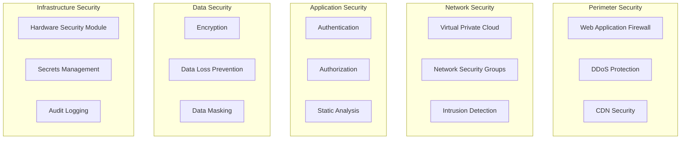

# Security Architecture and Implementation
## Pathfinity Revolutionary Learning Platform

**Document Version:** 1.0  
**Last Updated:** January 2025  
**Status:** Active Security Framework  
**Owner:** Chief Security Officer  
**Reviewed By:** DevOps Director, CTO, Legal Team, Compliance Officer

---

## Executive Summary

This document defines Pathfinity's comprehensive security architecture to protect millions of students' data while delivering Career-First education. Our security framework ensures COPPA and FERPA compliance, maintains SOC 2 Type II certification, and protects our revolutionary intellectual property. Every security measure supports our value hierarchy (Career-First → PathIQ → Finn) while maintaining <$0.05 per student per day economics.

---

## 1. Security Architecture Overview

### 1.1 Defense-in-Depth Strategy



### 1.2 Security Principles

```typescript
interface SecurityPrinciples {
  // Core principles
  zeroTrust: 'Never trust, always verify';
  leastPrivilege: 'Minimum necessary access';
  defenseInDepth: 'Multiple security layers';
  dataMinimization: 'Collect only what is needed';
  privacyByDesign: 'Security built-in, not bolted-on';
  
  // Operational principles
  continuousMonitoring: '24/7 security monitoring';
  incidentResponse: 'Rapid detection and response';
  securityAutomation: 'Automate security controls';
  complianceFirst: 'Exceed regulatory requirements';
  transparentSecurity: 'Clear communication with users';
}

// Security implementation framework
class SecurityFramework {
  private readonly principles: SecurityPrinciples;
  private readonly controls: SecurityControl[];
  private readonly monitoring: SecurityMonitoring;
  
  async enforceSecurityPolicy(request: Request): Promise<SecurityDecision> {
    // Layer 1: Perimeter security
    const perimeterCheck = await this.checkPerimeter(request);
    if (!perimeterCheck.allowed) {
      return { decision: 'DENY', reason: perimeterCheck.reason };
    }
    
    // Layer 2: Authentication
    const authCheck = await this.checkAuthentication(request);
    if (!authCheck.authenticated) {
      return { decision: 'DENY', reason: 'Not authenticated' };
    }
    
    // Layer 3: Authorization
    const authzCheck = await this.checkAuthorization(request);
    if (!authzCheck.authorized) {
      return { decision: 'DENY', reason: 'Not authorized' };
    }
    
    // Layer 4: Data protection
    const dataCheck = await this.checkDataAccess(request);
    if (!dataCheck.allowed) {
      return { decision: 'DENY', reason: 'Data access denied' };
    }
    
    // Layer 5: Audit
    await this.auditAccess(request);
    
    return { decision: 'ALLOW' };
  }
}
```

---

## 2. Identity and Access Management (IAM)

### 2.1 Authentication Architecture

```typescript
// Multi-factor authentication system
class AuthenticationService {
  private readonly providers: Map<string, AuthProvider> = new Map([
    ['local', new LocalAuthProvider()],
    ['google', new GoogleAuthProvider()],
    ['microsoft', new MicrosoftAuthProvider()],
    ['clever', new CleverAuthProvider()],
    ['classlink', new ClassLinkAuthProvider()],
  ]);
  
  async authenticate(credentials: AuthCredentials): Promise<AuthResult> {
    // Step 1: Validate input
    const validation = await this.validateCredentials(credentials);
    if (!validation.valid) {
      await this.logFailedAttempt(credentials);
      return { success: false, reason: validation.error };
    }
    
    // Step 2: Check rate limiting
    const rateLimitCheck = await this.checkRateLimit(credentials.username);
    if (rateLimitCheck.limited) {
      return { success: false, reason: 'Too many attempts' };
    }
    
    // Step 3: Primary authentication
    const provider = this.providers.get(credentials.provider);
    const authResult = await provider.authenticate(credentials);
    
    if (!authResult.success) {
      await this.handleFailedAuth(credentials);
      return authResult;
    }
    
    // Step 4: Check MFA requirement
    const user = authResult.user;
    if (this.requiresMFA(user)) {
      const mfaResult = await this.performMFA(user);
      if (!mfaResult.success) {
        return { success: false, reason: 'MFA failed' };
      }
    }
    
    // Step 5: Create session
    const session = await this.createSession(user);
    
    // Step 6: Audit successful login
    await this.auditLogin(user, session);
    
    return {
      success: true,
      user,
      session,
      token: await this.generateToken(session),
    };
  }
  
  private requiresMFA(user: User): boolean {
    // Teachers and admins always require MFA
    if (user.role === 'teacher' || user.role === 'admin') {
      return true;
    }
    
    // Parents with access to multiple children
    if (user.role === 'parent' && user.children.length > 1) {
      return true;
    }
    
    // Users who opted in
    if (user.mfaEnabled) {
      return true;
    }
    
    return false;
  }
  
  private async performMFA(user: User): Promise<MFAResult> {
    const method = user.mfaMethod || 'totp';
    
    switch (method) {
      case 'totp':
        return this.verifyTOTP(user);
      case 'sms':
        return this.verifySMS(user);
      case 'email':
        return this.verifyEmail(user);
      case 'webauthn':
        return this.verifyWebAuthn(user);
      default:
        throw new Error('Invalid MFA method');
    }
  }
}

// Session management
class SessionManager {
  private readonly redis: RedisClient;
  private readonly sessionConfig = {
    student: { ttl: 4 * 60 * 60, renewable: true },    // 4 hours
    teacher: { ttl: 8 * 60 * 60, renewable: true },    // 8 hours
    parent: { ttl: 1 * 60 * 60, renewable: true },     // 1 hour
    admin: { ttl: 30 * 60, renewable: false },         // 30 minutes
  };
  
  async createSession(user: User): Promise<Session> {
    const session: Session = {
      id: generateSecureId(),
      userId: user.id,
      role: user.role,
      createdAt: new Date(),
      expiresAt: this.calculateExpiry(user.role),
      ipAddress: this.getClientIP(),
      userAgent: this.getUserAgent(),
      permissions: await this.loadPermissions(user),
    };
    
    // Store in Redis with expiry
    await this.redis.setex(
      `session:${session.id}`,
      this.sessionConfig[user.role].ttl,
      JSON.stringify(session)
    );
    
    // Track active sessions
    await this.redis.sadd(`user:${user.id}:sessions`, session.id);
    
    return session;
  }
  
  async validateSession(sessionId: string): Promise<SessionValidation> {
    // Get session from cache
    const sessionData = await this.redis.get(`session:${sessionId}`);
    
    if (!sessionData) {
      return { valid: false, reason: 'Session not found' };
    }
    
    const session = JSON.parse(sessionData);
    
    // Check expiry
    if (new Date(session.expiresAt) < new Date()) {
      await this.terminateSession(sessionId);
      return { valid: false, reason: 'Session expired' };
    }
    
    // Check for suspicious activity
    const suspicious = await this.checkSuspiciousActivity(session);
    if (suspicious) {
      await this.flagSession(session, suspicious);
      return { valid: false, reason: 'Suspicious activity detected' };
    }
    
    // Renew if configured
    if (this.sessionConfig[session.role].renewable) {
      await this.renewSession(session);
    }
    
    return { valid: true, session };
  }
}
```

### 2.2 Authorization Framework

```typescript
// Role-based access control with attribute-based policies
class AuthorizationService {
  private readonly policies: Map<string, Policy> = new Map();
  
  async authorize(
    principal: Principal,
    resource: Resource,
    action: Action
  ): Promise<AuthorizationDecision> {
    // Check RBAC first
    const rbacDecision = await this.checkRBAC(principal, resource, action);
    if (rbacDecision.effect === 'DENY') {
      return rbacDecision;
    }
    
    // Check ABAC policies
    const abacDecision = await this.checkABAC(principal, resource, action);
    if (abacDecision.effect === 'DENY') {
      return abacDecision;
    }
    
    // Check data-level permissions
    const dataDecision = await this.checkDataPermissions(principal, resource);
    if (dataDecision.effect === 'DENY') {
      return dataDecision;
    }
    
    // Audit the decision
    await this.auditDecision(principal, resource, action, 'ALLOW');
    
    return { effect: 'ALLOW' };
  }
  
  private async checkRBAC(
    principal: Principal,
    resource: Resource,
    action: Action
  ): Promise<AuthorizationDecision> {
    const permissions = this.rolePermissions[principal.role];
    
    if (!permissions) {
      return { effect: 'DENY', reason: 'Invalid role' };
    }
    
    const resourcePermissions = permissions[resource.type];
    if (!resourcePermissions || !resourcePermissions.includes(action)) {
      return { effect: 'DENY', reason: 'Role lacks permission' };
    }
    
    return { effect: 'ALLOW' };
  }
  
  private readonly rolePermissions = {
    student: {
      career: ['view', 'select'],
      content: ['view', 'interact'],
      profile: ['view_own', 'edit_own'],
      session: ['create', 'view_own'],
      achievement: ['view_own'],
    },
    teacher: {
      career: ['view', 'suggest', 'override'],
      content: ['view', 'create', 'edit', 'assign'],
      profile: ['view_students', 'edit_class'],
      session: ['view_class', 'end_student'],
      achievement: ['view_class', 'award'],
      analytics: ['view_class', 'export'],
    },
    parent: {
      career: ['view_child', 'suggest'],
      content: ['view_child'],
      profile: ['view_child', 'edit_contact'],
      session: ['view_child'],
      achievement: ['view_child'],
      communication: ['message_teacher'],
    },
    admin: {
      '*': ['*'], // Full access
    },
  };
  
  private async checkDataPermissions(
    principal: Principal,
    resource: Resource
  ): Promise<AuthorizationDecision> {
    // Students can only access their own data
    if (principal.role === 'student') {
      if (resource.ownerId !== principal.id) {
        return { effect: 'DENY', reason: 'Not resource owner' };
      }
    }
    
    // Teachers can only access their students' data
    if (principal.role === 'teacher') {
      const isStudent = await this.isStudentOfTeacher(
        resource.ownerId,
        principal.id
      );
      if (!isStudent) {
        return { effect: 'DENY', reason: 'Not your student' };
      }
    }
    
    // Parents can only access their children's data
    if (principal.role === 'parent') {
      const isChild = await this.isChildOfParent(
        resource.ownerId,
        principal.id
      );
      if (!isChild) {
        return { effect: 'DENY', reason: 'Not your child' };
      }
    }
    
    return { effect: 'ALLOW' };
  }
}
```

---

## 3. Data Security

### 3.1 Encryption Strategy

```typescript
// Comprehensive encryption implementation
class EncryptionService {
  private readonly kms: KeyManagementService;
  
  // Encryption configuration
  private readonly config = {
    atRest: {
      algorithm: 'AES-256-GCM',
      keyRotation: 90, // days
      keyDerivation: 'PBKDF2',
    },
    inTransit: {
      protocol: 'TLS 1.3',
      cipherSuites: [
        'TLS_AES_256_GCM_SHA384',
        'TLS_AES_128_GCM_SHA256',
      ],
      certificateProvider: 'LetsEncrypt',
    },
    fieldLevel: {
      algorithm: 'AES-256-CBC',
      fields: ['ssn', 'email', 'phone', 'address', 'parentEmail'],
    },
  };
  
  async encryptSensitiveData(data: any): Promise<EncryptedData> {
    // Get encryption key from KMS
    const dataKey = await this.kms.generateDataKey();
    
    // Encrypt the data
    const encrypted = await this.encrypt(data, dataKey.plaintext);
    
    // Return encrypted data with encrypted data key
    return {
      data: encrypted,
      encryptedKey: dataKey.encrypted,
      algorithm: this.config.atRest.algorithm,
      timestamp: new Date(),
    };
  }
  
  async encryptPII(record: StudentRecord): Promise<StudentRecord> {
    const encrypted = { ...record };
    
    // Encrypt each PII field
    for (const field of this.config.fieldLevel.fields) {
      if (record[field]) {
        encrypted[field] = await this.encryptField(record[field]);
      }
    }
    
    return encrypted;
  }
  
  private async encryptField(value: string): Promise<string> {
    const key = await this.kms.getFieldEncryptionKey();
    const iv = crypto.randomBytes(16);
    
    const cipher = crypto.createCipheriv(
      this.config.fieldLevel.algorithm,
      key,
      iv
    );
    
    let encrypted = cipher.update(value, 'utf8', 'hex');
    encrypted += cipher.final('hex');
    
    // Return IV + encrypted data
    return iv.toString('hex') + ':' + encrypted;
  }
}

// Database encryption
class DatabaseEncryption {
  async setupTransparentEncryption(): Promise<void> {
    // PostgreSQL TDE setup
    await this.db.query(`
      CREATE EXTENSION IF NOT EXISTS pgcrypto;
      
      -- Create encrypted tablespace
      CREATE TABLESPACE encrypted_space
      LOCATION '/encrypted/data'
      WITH (encryption_key_id = 'pathfinity-master-key');
      
      -- Move sensitive tables to encrypted tablespace
      ALTER TABLE students SET TABLESPACE encrypted_space;
      ALTER TABLE parents SET TABLESPACE encrypted_space;
      ALTER TABLE payment_methods SET TABLESPACE encrypted_space;
    `);
    
    // Column-level encryption for ultra-sensitive data
    await this.db.query(`
      -- Encrypt SSN column
      ALTER TABLE students 
      ALTER COLUMN ssn TYPE bytea 
      USING pgp_sym_encrypt(ssn::text, current_setting('app.encryption_key'));
      
      -- Create decryption view for authorized access
      CREATE VIEW students_decrypted AS
      SELECT 
        id,
        name,
        pgp_sym_decrypt(ssn, current_setting('app.encryption_key'))::text as ssn,
        grade_level
      FROM students
      WHERE has_permission(current_user, 'decrypt_pii');
    `);
  }
}
```

### 3.2 Data Loss Prevention (DLP)

```typescript
// DLP implementation
class DataLossPreventionService {
  private readonly patterns: Map<string, RegExp> = new Map([
    ['ssn', /\d{3}-\d{2}-\d{4}/],
    ['credit_card', /\d{4}[\s-]?\d{4}[\s-]?\d{4}[\s-]?\d{4}/],
    ['email', /[\w._%+-]+@[\w.-]+\.[A-Za-z]{2,}/],
    ['phone', /\d{3}[-.\s]?\d{3}[-.\s]?\d{4}/],
  ]);
  
  async scanForSensitiveData(content: string): Promise<DLPScanResult> {
    const findings: DLPFinding[] = [];
    
    for (const [type, pattern] of this.patterns) {
      const matches = content.match(pattern);
      if (matches) {
        findings.push({
          type,
          count: matches.length,
          severity: this.getSeverity(type),
        });
      }
    }
    
    if (findings.length > 0) {
      await this.handleFindings(findings, content);
    }
    
    return { clean: findings.length === 0, findings };
  }
  
  async preventDataExfiltration(request: Request): Promise<DLPDecision> {
    // Check request size
    if (request.size > 10 * 1024 * 1024) { // 10MB
      return { 
        allow: false, 
        reason: 'Request too large',
        action: 'BLOCK',
      };
    }
    
    // Check destination
    if (!this.isAllowedDestination(request.destination)) {
      return {
        allow: false,
        reason: 'Unauthorized destination',
        action: 'BLOCK',
      };
    }
    
    // Scan content for sensitive data
    const scan = await this.scanForSensitiveData(request.body);
    if (!scan.clean) {
      // Check if user is authorized to export sensitive data
      if (!await this.canExportSensitiveData(request.user)) {
        return {
          allow: false,
          reason: 'Sensitive data detected',
          action: 'BLOCK',
          findings: scan.findings,
        };
      }
      
      // Log the export
      await this.auditSensitiveExport(request, scan.findings);
    }
    
    return { allow: true };
  }
}
```

### 3.3 Data Masking and Anonymization

```typescript
// Data masking for non-production environments
class DataMaskingService {
  async maskDatabase(environment: string): Promise<void> {
    if (environment === 'production') {
      throw new Error('Cannot mask production database');
    }
    
    // Mask student PII
    await this.db.query(`
      UPDATE students SET
        name = 'Student_' || id,
        email = 'student_' || id || '@test.pathfinity.com',
        ssn = LPAD(CAST((RANDOM() * 999999999)::INT AS TEXT), 9, '0'),
        phone = '555-' || LPAD(CAST((RANDOM() * 9999)::INT AS TEXT), 4, '0'),
        address = CAST(id AS TEXT) || ' Test Street'
      WHERE environment = $1
    `, [environment]);
    
    // Mask parent information
    await this.db.query(`
      UPDATE parents SET
        name = 'Parent_' || id,
        email = 'parent_' || id || '@test.pathfinity.com',
        phone = '555-' || LPAD(CAST((RANDOM() * 9999)::INT AS TEXT), 4, '0')
      WHERE environment = $1
    `, [environment]);
    
    // Anonymize learning data while preserving patterns
    await this.anonymizeLearningData(environment);
  }
  
  private async anonymizeLearningData(environment: string): Promise<void> {
    // Preserve statistical properties while anonymizing
    await this.db.query(`
      WITH stats AS (
        SELECT 
          AVG(flow_state) as avg_flow,
          STDDEV(flow_state) as stddev_flow
        FROM pathiq_metrics
      )
      UPDATE pathiq_metrics
      SET flow_state = GREATEST(0, LEAST(100, 
        (SELECT avg_flow FROM stats) + 
        (RANDOM() - 0.5) * 2 * (SELECT stddev_flow FROM stats)
      ))
      WHERE environment = $1
    `, [environment]);
  }
}
```

---

## 4. Application Security

### 4.1 Secure Development Lifecycle

```typescript
// Security in CI/CD pipeline
class SecureSDLC {
  async performSecurityChecks(code: CodeBase): Promise<SecurityCheckResult> {
    const results = new SecurityCheckResult();
    
    // Static Application Security Testing (SAST)
    const sastResults = await this.runSAST(code);
    results.add('SAST', sastResults);
    
    // Software Composition Analysis (SCA)
    const scaResults = await this.runSCA(code);
    results.add('SCA', scaResults);
    
    // Secret scanning
    const secretResults = await this.scanForSecrets(code);
    results.add('Secrets', secretResults);
    
    // Infrastructure as Code scanning
    const iacResults = await this.scanIaC(code);
    results.add('IaC', iacResults);
    
    // Container scanning
    const containerResults = await this.scanContainers(code);
    results.add('Containers', containerResults);
    
    // Evaluate results
    if (results.hasCriticalIssues()) {
      throw new SecurityException('Critical security issues found', results);
    }
    
    return results;
  }
  
  private async runSAST(code: CodeBase): Promise<SASTResults> {
    // Run multiple SAST tools
    const [
      semgrep,
      sonarqube,
      codeql,
    ] = await Promise.all([
      this.runSemgrep(code),
      this.runSonarQube(code),
      this.runCodeQL(code),
    ]);
    
    // Aggregate and deduplicate findings
    const findings = this.aggregateFindings([semgrep, sonarqube, codeql]);
    
    return {
      critical: findings.filter(f => f.severity === 'critical'),
      high: findings.filter(f => f.severity === 'high'),
      medium: findings.filter(f => f.severity === 'medium'),
      low: findings.filter(f => f.severity === 'low'),
    };
  }
  
  private async scanForSecrets(code: CodeBase): Promise<SecretScanResults> {
    const secrets = [];
    
    // Scan for hardcoded secrets
    const patterns = [
      /api[_-]?key[\s]*=[\s]*['"][^'"]+['"]/gi,
      /secret[\s]*=[\s]*['"][^'"]+['"]/gi,
      /password[\s]*=[\s]*['"][^'"]+['"]/gi,
      /token[\s]*=[\s]*['"][^'"]+['"]/gi,
      /aws[_-]?access[_-]?key[_-]?id[\s]*=[\s]*['"][^'"]+['"]/gi,
    ];
    
    for (const file of code.files) {
      for (const pattern of patterns) {
        const matches = file.content.match(pattern);
        if (matches) {
          secrets.push({
            file: file.path,
            line: this.getLineNumber(file.content, matches[0]),
            type: 'hardcoded_secret',
            severity: 'critical',
          });
        }
      }
    }
    
    return { secrets };
  }
}
```

### 4.2 Input Validation and Sanitization

```typescript
// Comprehensive input validation
class InputValidationService {
  private readonly validators = new Map<string, Validator>();
  
  constructor() {
    // Register validators for different input types
    this.validators.set('email', new EmailValidator());
    this.validators.set('phone', new PhoneValidator());
    this.validators.set('ssn', new SSNValidator());
    this.validators.set('career_id', new UUIDValidator());
    this.validators.set('student_name', new NameValidator());
  }
  
  async validateInput(input: any, schema: ValidationSchema): Promise<ValidationResult> {
    const errors: ValidationError[] = [];
    
    for (const field of schema.fields) {
      const value = input[field.name];
      
      // Check required fields
      if (field.required && !value) {
        errors.push({
          field: field.name,
          error: 'Required field missing',
        });
        continue;
      }
      
      // Skip optional empty fields
      if (!value) continue;
      
      // Validate field type
      const validator = this.validators.get(field.type);
      if (!validator) {
        throw new Error(`No validator for type: ${field.type}`);
      }
      
      const result = await validator.validate(value);
      if (!result.valid) {
        errors.push({
          field: field.name,
          error: result.error,
        });
      }
    }
    
    // Check for unexpected fields (potential injection)
    const allowedFields = new Set(schema.fields.map(f => f.name));
    for (const key of Object.keys(input)) {
      if (!allowedFields.has(key)) {
        errors.push({
          field: key,
          error: 'Unexpected field',
        });
      }
    }
    
    return {
      valid: errors.length === 0,
      errors,
      sanitized: this.sanitizeInput(input, schema),
    };
  }
  
  private sanitizeInput(input: any, schema: ValidationSchema): any {
    const sanitized = {};
    
    for (const field of schema.fields) {
      const value = input[field.name];
      if (value === undefined) continue;
      
      // Apply sanitization based on field type
      switch (field.type) {
        case 'html':
          sanitized[field.name] = this.sanitizeHTML(value);
          break;
        case 'sql':
          sanitized[field.name] = this.escapeSQLString(value);
          break;
        case 'javascript':
          sanitized[field.name] = this.escapeJavaScript(value);
          break;
        default:
          sanitized[field.name] = this.escapeString(value);
      }
    }
    
    return sanitized;
  }
  
  private sanitizeHTML(html: string): string {
    // Use DOMPurify for HTML sanitization
    return DOMPurify.sanitize(html, {
      ALLOWED_TAGS: ['p', 'br', 'strong', 'em', 'u'],
      ALLOWED_ATTR: [],
    });
  }
}

// SQL injection prevention
class SQLInjectionPrevention {
  async executeQuery(query: string, params: any[]): Promise<QueryResult> {
    // Always use parameterized queries
    if (query.includes('$') || query.includes('?')) {
      // Parameterized query - safe
      return this.db.query(query, params);
    }
    
    // Check for potential injection
    const suspicious = [
      /(\b(DELETE|DROP|EXEC(UTE)?|INSERT|SELECT|UNION|UPDATE)\b)/gi,
      /(--|\||;|\/\*|\*\/)/g,
      /(\bOR\b\s*\d+\s*=\s*\d+)/gi,
    ];
    
    for (const pattern of suspicious) {
      if (pattern.test(query)) {
        throw new SecurityException('Potential SQL injection detected');
      }
    }
    
    // Use prepared statement
    const prepared = await this.db.prepare(query);
    return prepared.execute(params);
  }
}
```

### 4.3 API Security

```typescript
// API security implementation
class APISecurityService {
  async secureEndpoint(
    handler: RequestHandler
  ): Promise<SecureRequestHandler> {
    return async (req: Request, res: Response) => {
      try {
        // Rate limiting
        const rateLimitCheck = await this.checkRateLimit(req);
        if (!rateLimitCheck.allowed) {
          return res.status(429).json({
            error: 'Too many requests',
            retryAfter: rateLimitCheck.retryAfter,
          });
        }
        
        // API key validation for external APIs
        if (req.path.startsWith('/api/external')) {
          const apiKeyValid = await this.validateAPIKey(req);
          if (!apiKeyValid) {
            return res.status(401).json({ error: 'Invalid API key' });
          }
        }
        
        // CORS validation
        const corsValid = this.validateCORS(req);
        if (!corsValid) {
          return res.status(403).json({ error: 'CORS policy violation' });
        }
        
        // Input validation
        const validation = await this.validateRequest(req);
        if (!validation.valid) {
          return res.status(400).json({
            error: 'Invalid request',
            details: validation.errors,
          });
        }
        
        // Execute handler with sanitized input
        req.body = validation.sanitized;
        const result = await handler(req, res);
        
        // Output filtering
        const filtered = await this.filterOutput(result);
        
        // Security headers
        this.setSecurityHeaders(res);
        
        return res.json(filtered);
        
      } catch (error) {
        // Error handling without information leakage
        const sanitizedError = this.sanitizeError(error);
        return res.status(sanitizedError.status).json({
          error: sanitizedError.message,
          id: sanitizedError.id,
        });
      }
    };
  }
  
  private setSecurityHeaders(res: Response): void {
    res.setHeader('X-Content-Type-Options', 'nosniff');
    res.setHeader('X-Frame-Options', 'DENY');
    res.setHeader('X-XSS-Protection', '1; mode=block');
    res.setHeader('Strict-Transport-Security', 'max-age=31536000; includeSubDomains');
    res.setHeader('Content-Security-Policy', this.getCSPPolicy());
    res.setHeader('Referrer-Policy', 'strict-origin-when-cross-origin');
    res.setHeader('Permissions-Policy', 'geolocation=(), microphone=(), camera=()');
  }
  
  private getCSPPolicy(): string {
    return [
      "default-src 'self'",
      "script-src 'self' 'unsafe-inline' https://cdn.pathfinity.com",
      "style-src 'self' 'unsafe-inline'",
      "img-src 'self' data: https:",
      "font-src 'self' data:",
      "connect-src 'self' https://api.pathfinity.com wss://realtime.pathfinity.com",
      "frame-ancestors 'none'",
      "base-uri 'self'",
      "form-action 'self'",
    ].join('; ');
  }
}
```

---

## 5. Network Security

### 5.1 Network Architecture

```yaml
# Network segmentation
Network_Architecture:
  DMZ:
    - WAF
    - Load Balancers
    - API Gateway
    
  Application_Tier:
    - Web Servers
    - Application Servers
    - Container Clusters
    
  Data_Tier:
    - Database Servers
    - Cache Servers
    - Message Queues
    
  Management_Tier:
    - Monitoring Systems
    - Log Aggregation
    - Security Tools
    
  Security_Zones:
    Public:
      - CDN endpoints
      - Static assets
      
    Restricted:
      - Student data
      - PII storage
      
    Classified:
      - PathIQ algorithms
      - Proprietary IP
      - Financial data
```

```typescript
// Network security implementation
class NetworkSecurityService {
  async configureFirewall(): Promise<void> {
    // Ingress rules
    const ingressRules = [
      {
        priority: 100,
        source: '0.0.0.0/0',
        destination: 'load-balancer',
        ports: [443],
        protocol: 'tcp',
        action: 'allow',
      },
      {
        priority: 200,
        source: 'load-balancer',
        destination: 'app-tier',
        ports: [8080],
        protocol: 'tcp',
        action: 'allow',
      },
      {
        priority: 300,
        source: 'app-tier',
        destination: 'data-tier',
        ports: [5432, 6379],
        protocol: 'tcp',
        action: 'allow',
      },
      {
        priority: 1000,
        source: 'any',
        destination: 'any',
        action: 'deny', // Default deny
      },
    ];
    
    // Egress rules
    const egressRules = [
      {
        priority: 100,
        source: 'app-tier',
        destination: 'api.openai.com',
        ports: [443],
        protocol: 'tcp',
        action: 'allow',
      },
      {
        priority: 200,
        source: 'data-tier',
        destination: 's3.amazonaws.com',
        ports: [443],
        protocol: 'tcp',
        action: 'allow',
      },
      {
        priority: 1000,
        source: 'any',
        destination: 'any',
        action: 'deny', // Default deny
      },
    ];
    
    await this.applyFirewallRules(ingressRules, egressRules);
  }
  
  async detectIntrusion(packet: NetworkPacket): Promise<IntrusionDetection> {
    // Check for known attack patterns
    const signatures = await this.loadAttackSignatures();
    
    for (const signature of signatures) {
      if (this.matchesSignature(packet, signature)) {
        await this.handleIntrusion(packet, signature);
        return {
          detected: true,
          type: signature.type,
          severity: signature.severity,
          action: 'BLOCK',
        };
      }
    }
    
    // Anomaly detection
    const anomaly = await this.detectAnomaly(packet);
    if (anomaly.score > 0.8) {
      await this.investigateAnomaly(packet, anomaly);
      return {
        detected: true,
        type: 'anomaly',
        severity: 'medium',
        action: 'MONITOR',
      };
    }
    
    return { detected: false };
  }
}
```

### 5.2 DDoS Protection

```typescript
// DDoS mitigation
class DDoSProtection {
  private readonly thresholds = {
    requestsPerSecond: 1000,
    requestsPerIP: 100,
    connectionRate: 500,
    packetSize: 10000,
  };
  
  async mitigateDDoS(traffic: TrafficPattern): Promise<MitigationAction> {
    // Layer 3/4 protection
    if (traffic.packetsPerSecond > this.thresholds.connectionRate) {
      await this.enableSynCookies();
      await this.rateLimit(traffic.source);
    }
    
    // Layer 7 protection
    if (traffic.httpRequestsPerSecond > this.thresholds.requestsPerSecond) {
      await this.enableChallengeResponse();
      await this.activateCDNShield();
    }
    
    // Behavioral analysis
    const behavioral = await this.analyzeBehavior(traffic);
    if (behavioral.isBot) {
      await this.blockBot(traffic.source);
    }
    
    // Geographic filtering
    if (this.isSuspiciousGeo(traffic.geoLocation)) {
      await this.geoBlock(traffic.geoLocation);
    }
    
    return {
      mitigated: true,
      actions: ['rate_limit', 'challenge', 'cdn_shield'],
    };
  }
  
  private async enableChallengeResponse(): Promise<void> {
    // JavaScript challenge for browsers
    await this.cdn.enableJSChallenge({
      threshold: 100,
      duration: 3600,
      difficulty: 'medium',
    });
    
    // CAPTCHA for suspicious traffic
    await this.cdn.enableCAPTCHA({
      threshold: 500,
      type: 'invisible',
    });
  }
}
```

---

## 6. Security Monitoring and Incident Response

### 6.1 Security Information and Event Management (SIEM)

```typescript
// SIEM implementation
class SIEMService {
  async processSecurityEvent(event: SecurityEvent): Promise<void> {
    // Normalize event
    const normalized = this.normalizeEvent(event);
    
    // Enrich with context
    const enriched = await this.enrichEvent(normalized);
    
    // Correlate with other events
    const correlated = await this.correlateEvents(enriched);
    
    // Analyze for threats
    const threat = await this.analyzeThreat(correlated);
    
    if (threat.detected) {
      await this.handleThreat(threat);
    }
    
    // Store for analysis
    await this.storeEvent(enriched);
  }
  
  private async correlateEvents(event: EnrichedEvent): Promise<CorrelatedEvent> {
    // Time-based correlation
    const timeWindow = 5 * 60 * 1000; // 5 minutes
    const relatedEvents = await this.getEventsInWindow(
      event.timestamp - timeWindow,
      event.timestamp + timeWindow
    );
    
    // Pattern matching
    const patterns = [
      {
        name: 'Brute Force Attack',
        events: ['failed_login', 'failed_login', 'failed_login'],
        timeframe: 60000,
      },
      {
        name: 'Account Takeover',
        events: ['password_reset', 'login', 'data_export'],
        timeframe: 300000,
      },
      {
        name: 'Data Exfiltration',
        events: ['bulk_query', 'large_download', 'external_transfer'],
        timeframe: 600000,
      },
    ];
    
    for (const pattern of patterns) {
      if (this.matchesPattern(relatedEvents, pattern)) {
        return {
          ...event,
          pattern: pattern.name,
          relatedEvents,
          confidence: 0.9,
        };
      }
    }
    
    return { ...event, relatedEvents };
  }
}
```

### 6.2 Incident Response Plan

```typescript
// Automated incident response
class IncidentResponseService {
  async respondToIncident(incident: SecurityIncident): Promise<IncidentResponse> {
    const response = new IncidentResponse(incident);
    
    // Step 1: Containment
    await this.containIncident(incident);
    response.addAction('Incident contained');
    
    // Step 2: Eradication
    await this.eradicateThre at(incident);
    response.addAction('Threat eradicated');
    
    // Step 3: Recovery
    await this.recoverSystems(incident);
    response.addAction('Systems recovered');
    
    // Step 4: Lessons learned
    const lessons = await this.analyzeLessonsLearned(incident);
    response.addLessons(lessons);
    
    // Step 5: Report
    await this.generateIncidentReport(response);
    
    return response;
  }
  
  private async containIncident(incident: SecurityIncident): Promise<void> {
    switch (incident.type) {
      case 'account_compromise':
        await this.lockAccount(incident.affectedUser);
        await this.terminateAllSessions(incident.affectedUser);
        await this.forcePasswordReset(incident.affectedUser);
        break;
        
      case 'data_breach':
        await this.isolateAffectedSystems(incident.systems);
        await this.blockDataExfiltration();
        await this.enableForensicLogging();
        break;
        
      case 'malware':
        await this.quarantineInfectedSystems(incident.systems);
        await this.blockMaliciousIPs(incident.iocs);
        await this.updateSecurityPolicies();
        break;
    }
  }
}
```

---

## 7. Compliance and Privacy

### 7.1 COPPA Compliance

```typescript
// COPPA compliance implementation
class COPPACompliance {
  async enforceCompliance(user: User, action: UserAction): Promise<ComplianceDecision> {
    // Check if user is under 13
    if (this.isUnder13(user.birthDate)) {
      // Require parental consent
      if (!await this.hasParentalConsent(user.id)) {
        return {
          allowed: false,
          reason: 'Parental consent required',
          requirement: 'COPPA',
        };
      }
      
      // Limit data collection
      if (this.isProhibitedDataCollection(action)) {
        return {
          allowed: false,
          reason: 'Data collection prohibited for minors',
          requirement: 'COPPA',
        };
      }
      
      // Disable social features
      if (this.isSocialFeature(action)) {
        return {
          allowed: false,
          reason: 'Social features disabled for minors',
          requirement: 'COPPA',
        };
      }
    }
    
    return { allowed: true };
  }
  
  async obtainParentalConsent(student: Student): Promise<ConsentResult> {
    // Generate consent request
    const consentRequest = {
      id: generateId(),
      studentId: student.id,
      parentEmail: student.parentEmail,
      timestamp: new Date(),
      expiresAt: new Date(Date.now() + 7 * 24 * 60 * 60 * 1000), // 7 days
    };
    
    // Send consent email
    await this.sendConsentEmail(consentRequest);
    
    // Store pending consent
    await this.storePendingConsent(consentRequest);
    
    // Wait for consent (async)
    return { pending: true, requestId: consentRequest.id };
  }
  
  private isProhibitedDataCollection(action: UserAction): boolean {
    const prohibited = [
      'location_tracking',
      'voice_recording',
      'video_recording',
      'behavioral_advertising',
      'third_party_sharing',
    ];
    
    return prohibited.includes(action.type);
  }
}
```

### 7.2 FERPA Compliance

```typescript
// FERPA compliance for educational records
class FERPACompliance {
  async enforceEducationalPrivacy(
    request: DataAccessRequest
  ): Promise<FERPADecision> {
    // Verify requester identity
    const identity = await this.verifyIdentity(request.requester);
    if (!identity.verified) {
      return {
        allowed: false,
        reason: 'Identity verification failed',
      };
    }
    
    // Check access rights
    const accessRight = await this.checkAccessRights(
      request.requester,
      request.student,
      request.records
    );
    
    if (!accessRight.allowed) {
      return {
        allowed: false,
        reason: accessRight.reason,
      };
    }
    
    // Audit access
    await this.auditEducationalRecordAccess(request);
    
    // Filter records based on permissions
    const filtered = await this.filterRecords(request.records, accessRight.level);
    
    return {
      allowed: true,
      records: filtered,
    };
  }
  
  private async checkAccessRights(
    requester: User,
    student: Student,
    records: EducationalRecord[]
  ): Promise<AccessRight> {
    // Students can access their own records
    if (requester.id === student.id && student.age >= 18) {
      return { allowed: true, level: 'full' };
    }
    
    // Parents can access minor's records
    if (await this.isParentOf(requester, student) && student.age < 18) {
      return { allowed: true, level: 'parent' };
    }
    
    // School officials with legitimate educational interest
    if (await this.isSchoolOfficial(requester)) {
      const hasInterest = await this.hasLegitimateInterest(requester, student);
      if (hasInterest) {
        return { allowed: true, level: 'official' };
      }
    }
    
    // Directory information only for others
    if (await this.hasDirectoryConsent(student)) {
      return { allowed: true, level: 'directory' };
    }
    
    return { allowed: false, reason: 'No access rights' };
  }
}
```

---

## 8. Security Hardening

### 8.1 Infrastructure Hardening

```bash
#!/bin/bash
# Server hardening script

# Disable unnecessary services
systemctl disable bluetooth
systemctl disable cups
systemctl disable avahi-daemon

# Kernel hardening
cat >> /etc/sysctl.conf << EOF
# IP Forwarding
net.ipv4.ip_forward = 0
net.ipv6.conf.all.forwarding = 0

# Send redirects
net.ipv4.conf.all.send_redirects = 0
net.ipv4.conf.default.send_redirects = 0

# Source packet verification
net.ipv4.conf.all.rp_filter = 1
net.ipv4.conf.default.rp_filter = 1

# Accept ICMP redirects
net.ipv4.conf.all.accept_redirects = 0
net.ipv6.conf.all.accept_redirects = 0

# Accept source route
net.ipv4.conf.all.accept_source_route = 0
net.ipv6.conf.all.accept_source_route = 0

# Log Martians
net.ipv4.conf.all.log_martians = 1

# SYN flood protection
net.ipv4.tcp_syncookies = 1
net.ipv4.tcp_syn_retries = 2
net.ipv4.tcp_synack_retries = 2
net.ipv4.tcp_max_syn_backlog = 4096

# Ignore ICMP ping
net.ipv4.icmp_echo_ignore_all = 1
EOF

# File permissions
chmod 700 /root
chmod 644 /etc/passwd
chmod 640 /etc/shadow
chmod 644 /etc/group
chmod 640 /etc/gshadow

# Secure shared memory
echo "tmpfs /run/shm tmpfs defaults,noexec,nosuid 0 0" >> /etc/fstab

# Install security tools
apt-get update
apt-get install -y fail2ban auditd aide rkhunter

# Configure fail2ban
cat > /etc/fail2ban/jail.local << EOF
[DEFAULT]
bantime = 3600
findtime = 600
maxretry = 3

[sshd]
enabled = true
port = 22
logpath = /var/log/auth.log
EOF

# Enable audit logging
auditctl -e 1
```

### 8.2 Container Security

```dockerfile
# Secure container image
FROM node:18-alpine AS builder

# Non-root user
RUN addgroup -g 1001 -S nodejs && \
    adduser -S nodejs -u 1001

# Security updates
RUN apk update && \
    apk upgrade && \
    apk add --no-cache dumb-init

# Copy and build
WORKDIR /app
COPY --chown=nodejs:nodejs package*.json ./
RUN npm ci --only=production && \
    npm audit fix

COPY --chown=nodejs:nodejs . .

# Runtime stage
FROM gcr.io/distroless/nodejs18-debian11

# Copy from builder
COPY --from=builder --chown=1001:1001 /app /app

# Non-root user
USER 1001

# Read-only root filesystem
RUN chmod -R a-w /app

# Health check
HEALTHCHECK --interval=30s --timeout=3s --start-period=5s --retries=3 \
  CMD node healthcheck.js

# Security labels
LABEL security.scan="true" \
      security.non-root="true" \
      security.read-only="true"

EXPOSE 8080
ENTRYPOINT ["dumb-init", "--"]
CMD ["node", "server.js"]
```

---

## 9. Security Testing

### 9.1 Penetration Testing

```typescript
// Automated security testing
class SecurityTestingService {
  async runSecurityTests(): Promise<SecurityTestReport> {
    const report = new SecurityTestReport();
    
    // Vulnerability scanning
    const vulnScan = await this.runVulnerabilityScans();
    report.addVulnerabilities(vulnScan);
    
    // Penetration testing
    const penTest = await this.runPenetrationTests();
    report.addPenTestResults(penTest);
    
    // Security headers check
    const headers = await this.checkSecurityHeaders();
    report.addHeaderResults(headers);
    
    // SSL/TLS configuration
    const ssl = await this.checkSSLConfiguration();
    report.addSSLResults(ssl);
    
    // OWASP Top 10 testing
    const owasp = await this.testOWASPTop10();
    report.addOWASPResults(owasp);
    
    return report;
  }
  
  private async testOWASPTop10(): Promise<OWASPResults> {
    const tests = [
      this.testInjection(),
      this.testBrokenAuthentication(),
      this.testSensitiveDataExposure(),
      this.testXXE(),
      this.testBrokenAccessControl(),
      this.testSecurityMisconfiguration(),
      this.testXSS(),
      this.testInsecureDeserialization(),
      this.testVulnerableComponents(),
      this.testInsufficientLogging(),
    ];
    
    const results = await Promise.all(tests);
    
    return {
      passed: results.every(r => r.passed),
      details: results,
    };
  }
}
```

---

## 10. Security Metrics and Reporting

### 10.1 Security KPIs

```typescript
interface SecurityMetrics {
  // Vulnerability metrics
  vulnerabilities: {
    critical: number;
    high: number;
    medium: number;
    low: number;
    mttr: number; // mean time to remediate
  };
  
  // Incident metrics
  incidents: {
    total: number;
    severity: Map<string, number>;
    mttr: number; // mean time to respond
    mttd: number; // mean time to detect
  };
  
  // Compliance metrics
  compliance: {
    coppa: number; // percentage compliant
    ferpa: number;
    soc2: number;
    pci: number;
  };
  
  // Access metrics
  access: {
    failedLogins: number;
    suspiciousActivity: number;
    privilegedAccess: number;
  };
}

// Security dashboard
class SecurityDashboard {
  async generateReport(): Promise<SecurityReport> {
    const metrics = await this.collectMetrics();
    
    return {
      executive: this.generateExecutiveSummary(metrics),
      technical: this.generateTechnicalReport(metrics),
      compliance: this.generateComplianceReport(metrics),
      recommendations: this.generateRecommendations(metrics),
    };
  }
}
```

---

## Security Implementation Success Criteria

### Key Security Indicators
1. **Zero security breaches** in production
2. **100% COPPA/FERPA compliance**
3. **<1 hour MTTD** for security incidents
4. **<4 hour MTTR** for critical vulnerabilities
5. **SOC 2 Type II certification** maintained

### Security Standards
- All code passes security scanning
- All data encrypted at rest and in transit
- All access logged and audited
- All changes require security review
- Incident response plan tested quarterly

---

## Appendices

### Appendix A: Security Tools

```yaml
Security Stack:
  SAST: [SonarQube, Semgrep, CodeQL]
  DAST: [OWASP ZAP, Burp Suite]
  SCA: [Snyk, WhiteSource]
  Secrets: [GitLeaks, TruffleHog]
  WAF: [Cloudflare, AWS WAF]
  SIEM: [Splunk, ELK Stack]
  Vulnerability: [Nessus, Qualys]
```

### Appendix B: Incident Response Contacts

- Security Team: security@pathfinity.com
- On-Call: +1-555-SEC-RITY
- Legal: legal@pathfinity.com
- PR: communications@pathfinity.com

### Appendix C: Compliance Documentation

All compliance documents available at: https://compliance.pathfinity.com

---

*End of Security Architecture Document*

**Next Document:** Compliance Documentation

---