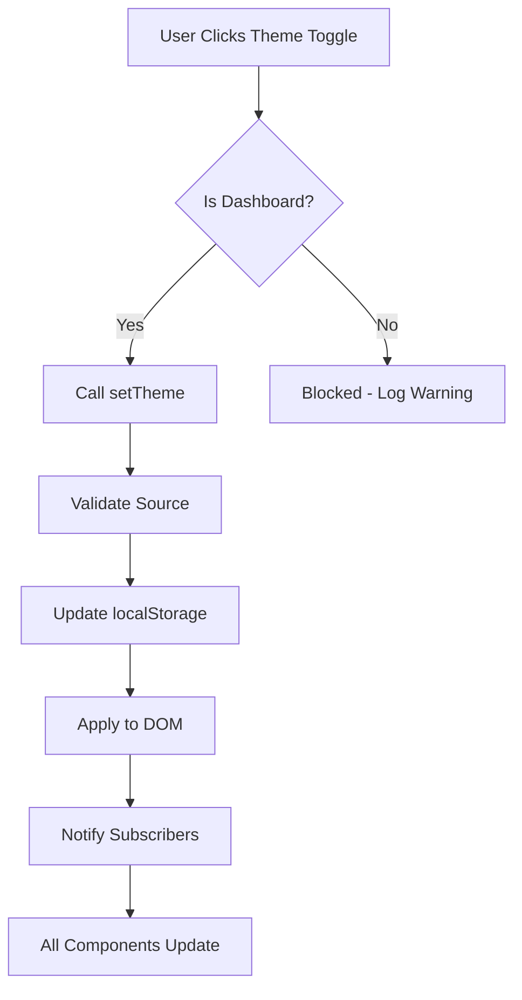

# Theme Management System Documentation
**Date:** January 31, 2025  
**Status:** ✅ Implemented

## 🎯 Overview
Centralized theme management system that ensures theme control is restricted to the Dashboard only, with persistence across all pages, sessions, and logins.

## 🔒 Key Principles

### 1. **Single Point of Control**
- Theme can ONLY be changed from the Dashboard (`DashboardModal`)
- All other components have read-only access to the theme
- Unauthorized theme change attempts are blocked and logged

### 2. **Persistence**
- Theme is stored in `localStorage` with key: `pathfinity-theme`
- Persists across:
  - Page navigations
  - Browser sessions
  - User logins
  - Application restarts

### 3. **Global Application**
- Theme applies to ALL components automatically
- No component can override the global theme
- Consistent experience throughout the application

## 🏗️ Architecture

### Core Components

#### 1. **Theme Service** (`src/services/themeService.ts`)
```typescript
class ThemeService {
  // Singleton instance manages all theme operations
  - getTheme(): Theme
  - setTheme(theme: Theme, source: string): void
  - initialize(): Theme
  - subscribe(listener: (theme: Theme) => void): () => void
}
```

**Authorized Sources:**
- `DashboardModal`
- `StudentDashboard`
- `system`

#### 2. **Theme Hooks** (`src/hooks/useTheme.ts`)

**Read-Only Hook (for all components):**
```typescript
export const useTheme = (): Theme
```

**Control Hook (Dashboard only):**
```typescript
export const useThemeControl = () => {
  theme: Theme;
  setTheme: (theme: Theme, source: string) => void;
}
```

## 📋 Implementation Guide

### For Regular Components (Read-Only)
```typescript
import { useTheme } from '../../hooks/useTheme';

const MyComponent = () => {
  const theme = useTheme(); // Read-only access
  
  return (
    <div className={`theme-${theme}`}>
      {/* Component content */}
    </div>
  );
};
```

### For Dashboard (With Control)
```typescript
import { useThemeControl } from '../../hooks/useTheme';

const DashboardModal = () => {
  const { theme, setTheme } = useThemeControl();
  
  const toggleTheme = () => {
    const newTheme = theme === 'light' ? 'dark' : 'light';
    setTheme(newTheme, 'DashboardModal'); // Must provide source
  };
  
  return (
    <button onClick={toggleTheme}>
      {theme === 'light' ? '🌙' : '☀️'}
    </button>
  );
};
```

## 🎨 Theme Application

### CSS Classes
```css
/* Applied to document root */
[data-theme="light"] { /* light theme styles */ }
[data-theme="dark"] { /* dark theme styles */ }

/* Also available as classes */
.theme-light { /* light theme styles */ }
.theme-dark { /* dark theme styles */ }
```

### DOM Attributes
- `document.documentElement` - `data-theme` attribute
- `document.body` - `data-theme` attribute
- Component roots - `theme-${theme}` class

## 🔄 Theme Flow



## 🚫 Removed Theme Controls

The following components NO LONGER have theme controls:
- ❌ `AILearnContainer`
- ❌ `AIExperienceContainer`
- ❌ `AIDiscoverContainer`
- ❌ `IntroductionModal`
- ❌ `CareerIncLobbyModal`
- ❌ Any floating dock icons

## ✅ Components Updated

### Dashboard (Control Enabled)
- `DashboardModal` - Has theme toggle button
- `StudentDashboard` - Alternative dashboard with control

### Containers (Read-Only)
- `AILearnContainer` - Uses `useTheme()` hook
- `AIExperienceContainer` - Uses `useTheme()` hook
- `AIDiscoverContainer` - Uses `useTheme()` hook
- `IntroductionModal` - Uses `useTheme()` hook
- `CareerIncLobbyModal` - Receives theme as prop
- `FloatingLearningDock` - Receives theme as prop
- `ContainerNavigationHeader` - Receives theme as prop

## 🔧 Troubleshooting

### Theme Not Persisting
1. Check localStorage: `localStorage.getItem('pathfinity-theme')`
2. Verify theme service initialization in App.tsx
3. Check browser console for warnings

### Component Not Updating
1. Ensure component uses `useTheme()` hook
2. Check if component is subscribed to theme changes
3. Verify DOM attributes are applied

### Unauthorized Theme Change
- Check console for warning: "Theme change attempted from unauthorized source"
- Only Dashboard components can change theme

## 🎯 Benefits

1. **Consistent UX** - Users can't accidentally change theme
2. **Simplified State** - Single source of truth
3. **Better Performance** - No redundant theme checks
4. **Maintainability** - Easy to add/remove theme controls
5. **Security** - Controlled access to theme changes

## 📊 Theme Storage

```javascript
// Structure in localStorage
{
  key: 'pathfinity-theme',
  value: 'light' | 'dark'
}

// Default theme
DEFAULT_THEME = 'dark'
```

## 🚀 Future Enhancements

1. **Additional Themes** - Easy to add more themes (e.g., 'high-contrast')
2. **System Preference** - Detect OS dark/light mode preference
3. **Scheduled Themes** - Auto-switch based on time of day
4. **Per-User Themes** - Store theme preference per user account

## 📝 Migration Notes

For components still using local theme state:
1. Remove local `theme` state
2. Remove `setTheme` calls
3. Import `useTheme` hook
4. Replace `theme` variable with hook result

---

**Implementation Complete:** ✅  
**Testing Status:** Ready for QA  
**Documentation:** Complete